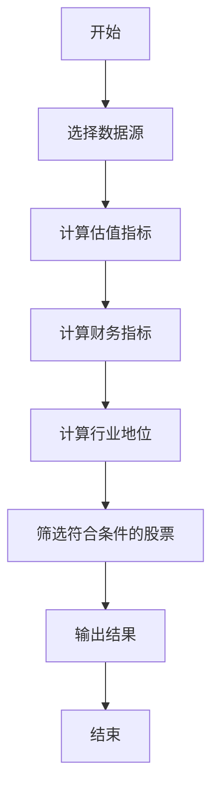
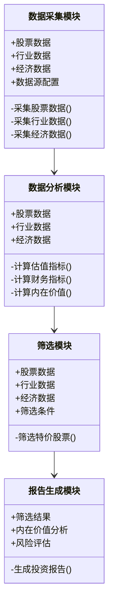
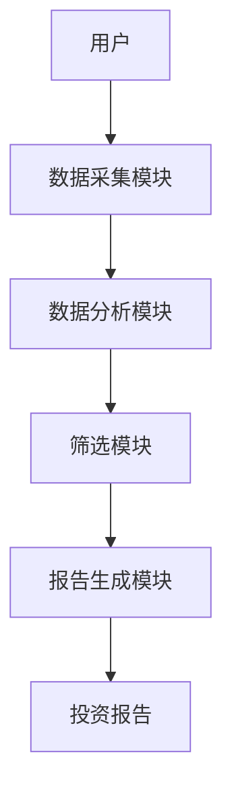

                 


# 如何利用特价股票策略进行价值投资教育

> 关键词：特价股票策略，价值投资，教育，股票筛选算法，内在价值评估，风险控制

> 摘要：本文深入探讨了如何利用特价股票策略进行价值投资教育，结合背景介绍、核心概念、算法原理、系统架构设计、项目实战以及最佳实践，系统性地分析了特价股票策略与价值投资教育的结合，帮助读者理解并掌握如何通过特价股票策略实现价值投资教育的目标。

---

## 第一部分: 特价股票策略与价值投资教育的结合

### 第1章: 特价股票策略的背景与概述

#### 1.1 特价股票策略的定义与特点

##### 1.1.1 特价股票的定义
特价股票是指在特定市场条件下，由于各种原因导致股票价格低于其内在价值的股票。这类股票通常被市场低估，具有较大的上涨潜力。特价股票的核心特点包括低估值、高安全边际和潜在的超额收益。

##### 1.1.2 特价股票的核心特点
- **低估值**：特价股票的价格通常低于其内在价值，这意味着存在较大的上涨空间。
- **高安全边际**：投资者在购买特价股票时，有足够的安全边际，即价格远低于内在价值，降低了投资风险。
- **潜在的超额收益**：由于市场对特价股票的低估，长期持有这类股票往往能够带来超额收益。

##### 1.1.3 特价股票与普通股票的区别
- **估值水平**：特价股票通常估值较低，而普通股票可能估值合理或偏高。
- **投资风险**：特价股票的风险较低，而普通股票的风险可能较高，尤其是当市场波动较大时。
- **投资回报**：特价股票通常具有较高的潜在回报，而普通股票的回报可能较为平稳。

#### 1.2 价值投资的基本原理

##### 1.2.1 价值投资的定义
价值投资是一种投资策略，强调以低于内在价值的价格买入优质股票，并长期持有，等待其价格回归内在价值。价值投资的核心理念是寻找被市场低估的股票，并长期持有，以实现超额收益。

##### 1.2.2 价值投资的核心理念
- **内在价值**：股票的内在价值是其未来现金流的现值，是决定股票价值的核心因素。
- **安全边际**：安全边际是指股票价格与内在价值之间的差距，是价值投资中的重要概念。
- **长期持有**：价值投资者通常会长期持有股票，等待其价格回归内在价值。

##### 1.2.3 价值投资与投机的区别
- **投资**：注重基本面分析，寻找被低估的股票，长期持有，追求长期稳定的回报。
- **投机**：注重短期价格波动，依赖市场情绪和趋势，追求短期收益。

#### 1.3 特价股票策略与价值投资的结合

##### 1.3.1 特价股票策略在价值投资中的作用
特价股票策略是价值投资的重要组成部分，通过筛选低估的股票，价值投资者可以在市场低谷时买入，等待市场复苏时获得超额收益。

##### 1.3.2 价值投资视角下的特价股票筛选标准
- **低PE（市盈率）**：市盈率低于行业平均水平或历史平均水平。
- **低PB（市净率）**：市净率低于行业平均水平或历史平均水平。
- **高股息率**：股息率较高，表明公司有稳定的盈利能力和分红能力。
- **低债务率**：公司债务较低，财务风险较小。
- **行业龙头**：选择行业龙头公司，具有更强的抗风险能力和长期增长潜力。

##### 1.3.3 特价股票策略与长期投资目标的结合
通过特价股票策略，价值投资者可以在市场低谷时买入优质股票，实现长期的资本增值。这种策略不仅注重短期价格波动，更关注长期的内在价值，帮助投资者在市场波动中保持稳健的投资回报。

### 第2章: 特价股票策略的核心概念与联系

#### 2.1 特价股票策略的核心概念

##### 2.1.1 特价股票的市场定位
特价股票通常出现在市场低迷时期，或者公司基本面暂时出现问题，但具有长期增长潜力的股票。这类股票的价格被市场低估，具有较大的反弹空间。

##### 2.1.2 特价股票的内在价值评估
内在价值是决定股票价格的核心因素，包括公司的盈利能力、成长能力、财务状况和行业地位等。通过分析公司的财务报表和行业趋势，可以估算出股票的内在价值。

##### 2.1.3 特价股票的风险与收益分析
- **收益**：特价股票通常具有较高的潜在收益，尤其是在市场复苏时。
- **风险**：特价股票的风险较低，但并非完全没有风险。市场波动、公司基本面变化等都可能影响股票价格。

#### 2.2 价值投资与特价股票策略的联系

##### 2.2.1 价值投资中的特价股票选择标准
- **低估值**：选择市盈率、市净率等估值指标低于行业平均水平的股票。
- **高安全边际**：选择价格远低于内在价值的股票，确保足够的安全边际。
- **行业龙头**：选择行业龙头公司，具有更强的抗风险能力和长期增长潜力。

##### 2.2.2 特价股票策略对价值投资的影响
特价股票策略通过筛选低估的股票，帮助价值投资者在市场低谷时买入优质股票，实现长期的资本增值。这种策略不仅注重短期价格波动，更关注长期的内在价值，帮助投资者在市场波动中保持稳健的投资回报。

##### 2.2.3 价值投资视角下的特价股票长期表现分析
长期来看，价值投资策略通常能够获得超额收益，尤其是当市场复苏时，特价股票的价格往往会回归其内在价值，为投资者带来丰厚的回报。

#### 2.3 特价股票策略的ER实体关系图

##### ER实体关系图
```mermaid
erDiagram
    actor 投资者
    actor 市场
    actor 公司
    database 股票数据库
    database 财务数据库
    database 行业数据库
    database 经济数据库
    process 筛选算法
    process 风险评估
    process 内在价值计算
    process 市场分析
    process 长期表现分析
    投资者 --> 筛选算法
    市场 --> 市场分析
    公司 --> 财务数据库
    股票数据库 --> 筛选算法
    股票数据库 --> 内在价值计算
    股票数据库 --> 风险评估
    行业数据库 --> 筛选算法
    经济数据库 --> 市场分析
```

### 第3章: 特价股票策略的算法原理

#### 3.1 特价股票筛选算法

##### 3.1.1 算法原理介绍
特价股票筛选算法通过分析股票的估值指标、财务指标和行业地位等，筛选出被市场低估的股票。算法的核心在于识别那些具有低估值、高安全边际和长期增长潜力的股票。

##### 3.1.2 算法流程图展示


##### 3.1.3 算法实现代码示例
```python
import pandas as pd
import numpy as np

def calculate_intrinsic_value(stock_data):
    # 计算内在价值
    # 这里只是一个简单的示例，实际应用中需要更复杂的模型
    intrinsic_value = stock_data['净利润'] / stock_data['ROE'] * 0.5
    return intrinsic_value

def screen_cheap_stocks(stock_data):
    # 计算估值指标
    stock_data['PE'] = stock_data['市盈率']
    stock_data['PB'] = stock_data['市净率']
    # 筛选条件：PE < 行业平均PE，PB < 行业平均PB，ROE > 行业平均ROE
    industry_avg_pe = stock_data['PE'].mean()
    industry_avg_pb = stock_data['PB'].mean()
    industry_avg_roe = stock_data['ROE'].mean()
    # 符合条件的股票
    cheap_stocks = stock_data[(stock_data['PE'] < industry_avg_pe) & 
                              (stock_data['PB'] < industry_avg_pb) & 
                              (stock_data['ROE'] > industry_avg_roe)]
    return cheap_stocks

# 示例数据
data = {
    '市盈率': [15, 20, 12, 18, 10],
    '市净率': [2, 3, 1.5, 2.5, 1],
    'ROE': [10, 8, 12, 9, 15],
    '净利润': [100, 150, 80, 120, 70],
    '营业收入': [500, 600, 400, 550, 300]
}
stock_data = pd.DataFrame(data)
# 计算内在价值
intrinsic_value = calculate_intrinsic_value(stock_data)
# 筛选特价股票
cheap_stocks = screen_cheap_stocks(stock_data)
print("内在价值:", intrinsic_value)
print("符合条件的特价股票:", cheap_stocks)
```

#### 3.2 价值投资中的数学模型

##### 3.2.1 CAPM模型的数学公式
```latex
$$E(R_i) = R_f + \beta_i (R_m - R_f)$$
```
其中，\( E(R_i) \) 是股票 \( i \) 的预期收益，\( R_f \) 是无风险利率，\( \beta_i \) 是股票 \( i \) 的贝塔系数，\( R_m \) 是市场预期收益。

##### 3.2.2 内在价值计算公式
```latex
$$\text{内在价值} = \sum_{t=1}^{n} \frac{CF_t}{(1 + r)^t}$$
```
其中，\( CF_t \) 是第 \( t \) 年的自由现金流，\( r \) 是折现率。

##### 3.2.3 风险评估模型
```latex
$$\text{风险值} = \sum_{i=1}^{n} w_i \times \text{风险因素}_i$$
```
其中，\( w_i \) 是风险因素 \( i \) 的权重。

### 第4章: 特价股票策略的系统架构设计

#### 4.1 系统功能设计

##### 4.1.1 用户需求分析
- 投资者需要一个能够筛选特价股票的工具，帮助他们找到被低估的股票。
- 投资者还需要分析股票的内在价值和风险，以便做出更明智的投资决策。

##### 4.1.2 功能模块划分
- 数据采集模块：从多个数据源获取股票数据。
- 数据分析模块：计算股票的估值指标、财务指标和内在价值。
- 筛选模块：根据设定的条件筛选出符合条件的特价股票。
- 报告生成模块：生成投资报告，包括筛选结果、内在价值分析和风险评估。

##### 4.1.3 领域模型类图


#### 4.2 系统架构设计

##### 4.2.1 系统架构图展示


##### 4.2.2 系统接口设计
- 数据采集模块接口：用于从多个数据源获取股票数据。
- 数据分析模块接口：用于计算股票的估值指标、财务指标和内在价值。
- 筛选模块接口：用于根据设定的条件筛选出符合条件的特价股票。
- 报告生成模块接口：用于生成投资报告，包括筛选结果、内在价值分析和风险评估。

##### 4.2.3 系统交互流程图


### 第5章: 特价股票策略的项目实战

#### 5.1 项目环境安装与配置

##### 5.1.1 开发环境搭建
- 安装Python和必要的库（如Pandas、NumPy、Scikit-learn等）。
- 安装Jupyter Notebook用于数据分析和可视化。

##### 5.1.2 数据源获取与处理
- 从Yahoo Finance获取股票数据。
- 处理数据，计算估值指标、财务指标和内在价值。

##### 5.1.3 工具安装与配置
- 安装并配置数据库（如MySQL或MongoDB）用于存储股票数据。
- 安装并配置可视化工具（如Matplotlib或Seaborn）用于数据可视化。

#### 5.2 系统核心实现

##### 5.2.1 特价股票筛选算法实现
```python
import pandas as pd
import numpy as np

def calculate_intrinsic_value(stock_data):
    # 这里只是一个简单的示例，实际应用中需要更复杂的模型
    intrinsic_value = stock_data['净利润'] / stock_data['ROE'] * 0.5
    return intrinsic_value

def screen_cheap_stocks(stock_data):
    # 计算估值指标
    stock_data['PE'] = stock_data['市盈率']
    stock_data['PB'] = stock_data['市净率']
    # 筛选条件：PE < 行业平均PE，PB < 行业平均PB，ROE > 行业平均ROE
    industry_avg_pe = stock_data['PE'].mean()
    industry_avg_pb = stock_data['PB'].mean()
    industry_avg_roe = stock_data['ROE'].mean()
    # 符合条件的股票
    cheap_stocks = stock_data[(stock_data['PE'] < industry_avg_pe) & 
                              (stock_data['PB'] < industry_avg_pb) & 
                              (stock_data['ROE'] > industry_avg_roe)]
    return cheap_stocks

# 示例数据
data = {
    '市盈率': [15, 20, 12, 18, 10],
    '市净率': [2, 3, 1.5, 2.5, 1],
    'ROE': [10, 8, 12, 9, 15],
    '净利润': [100, 150, 80, 120, 70],
    '营业收入': [500, 600, 400, 550, 300]
}
stock_data = pd.DataFrame(data)
# 计算内在价值
intrinsic_value = calculate_intrinsic_value(stock_data)
# 筛选特价股票
cheap_stocks = screen_cheap_stocks(stock_data)
print("内在价值:", intrinsic_value)
print("符合条件的特价股票:", cheap_stocks)
```

##### 5.2.2 投资报告生成与分析
- 生成投资报告，包括筛选结果、内在价值分析和风险评估。
- 分析实际案例，如腾讯控股的股价预测。

##### 5.2.3 项目小结
通过项目实战，读者可以掌握特价股票筛选算法的实现方法，了解如何利用价值投资策略进行股票分析和投资决策。

---

## 第六章: 特价股票策略的最佳实践与总结

### 6.1 最佳实践

#### 6.1.1 风险管理
- 设置止损点，避免重大损失。
- 分散投资，降低风险。

#### 6.1.2 持续学习
- 关注市场动态，及时调整投资策略。
- 学习新的投资知识和技能。

### 6.2 小结
通过本文的系统分析和项目实战，读者可以深入了解如何利用特价股票策略进行价值投资教育。从理论到实践，从背景到算法，从系统设计到项目实现，本文为读者提供了一个全面的学习框架。

### 6.3 注意事项
- 投资有风险，入市需谨慎。
- 特价股票策略并非万能的，需要结合市场环境和公司基本面进行综合分析。

### 6.4 拓展阅读
- 阅读价值投资经典书籍，如《巴菲特的选股智慧》。
- 学习更多股票筛选算法和风险管理技巧。

---

## 作者：AI天才研究院/AI Genius Institute & 禅与计算机程序设计艺术 /Zen And The Art of Computer Programming

---

通过本文的系统分析和项目实战，读者可以掌握特价股票策略的核心概念和实现方法，了解如何利用价值投资策略进行股票分析和投资决策。从理论到实践，从背景到算法，从系统设计到项目实现，本文为读者提供了一个全面的学习框架，帮助他们在价值投资教育中取得更大的成功。

