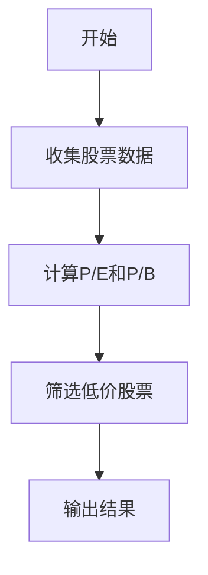
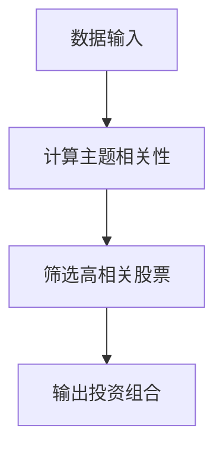
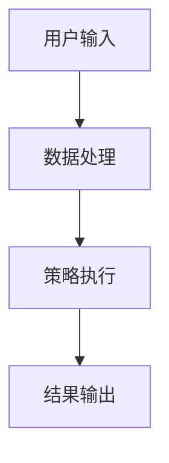

                 


# 如何利用特价股票策略进行全球主题性投资

## 关键词：特价股票，主题性投资，量化分析，投资策略，股票筛选

## 摘要：  
本文详细探讨如何利用特价股票策略在全球范围内进行主题性投资。通过分析特价股票的定义、筛选方法以及主题性投资的核心概念，结合数学模型和算法原理，提供一个系统化的投资策略框架。文章从背景介绍、核心概念、算法实现、系统架构到实际案例分析，层层深入，为读者提供从理论到实践的全面指导。

---

## 第1章：特价股票策略概述

### 1.1 特价股票的定义与特点  
特价股票是指市场价格显著低于其内在价值的股票，通常用于描述低估值的股票。其特点包括：  
- 低市盈率（P/E）或低市净率（P/B）。  
- 公司基本面良好，但市场情绪或外部环境导致股价被低估。  
- 存在较大的增值空间，适合长期投资。  

### 1.2 全球主题性投资的背景  
主题性投资是指根据特定主题（如科技、医疗、能源等）进行投资，关注与主题相关的行业或公司。全球市场的多样化为投资者提供了丰富的主题性投资机会。  

### 1.3 特价股票与主题性投资的结合  
将特价股票策略应用于主题性投资，能够在特定主题中筛选出具有潜在增值空间的低估值股票，同时分散投资风险。  

---

## 第2章：特价股票策略的核心概念  

### 2.1 特价股票的筛选标准  
#### 2.1.1 市盈率（P/E）分析  
市盈率 = 股票价格 / 每股净利润。  
例如，若股票价格为10元，每股净利润为2元，则P/E = 5。  

#### 2.1.2 市净率（P/B）分析  
市净率 = 股票价格 / 每股净资产。  
例如，若股票价格为10元，每股净资产为5元，则P/B = 2。  

#### 2.1.3 股价与价值的偏离度  
通过比较股票的内在价值和市场价格，判断是否存在低估。  

### 2.2 主题性投资的分类  
#### 2.2.1 行业主题投资  
如科技行业、医疗行业等。  
#### 2.2.2 地区主题投资  
如新兴市场、发达市场等。  
#### 2.2.3 概念主题投资  
如人工智能、区块链等。  

---

## 第3章：特价股票策略与主题性投资的结合  

### 3.1 特价股票在主题性投资中的优势  
#### 3.1.1 低估值带来的潜在收益  
特价股票通常具有较高的增值空间。  
#### 3.1.2 主题性机会的挖掘  
通过主题性投资，聚焦特定行业的低估值股票。  
#### 3.1.3 风险分散的优势  
将投资分散到不同主题中，降低整体风险。  

### 3.2 特价股票策略在不同主题中的应用  
#### 3.2.1 科技主题投资中的特价股票策略  
选择科技行业中的低估值公司，如某科技股的P/E比行业平均水平低。  
#### 3.2.2 周期性行业中的特价股票策略  
在周期性低谷时买入低估值股票，等待周期回升。  
#### 3.2.3 新兴市场的特价股票机会  
新兴市场中可能存在大量低估值但具有成长性的公司。  

---

## 第4章：特价股票筛选的数学模型  

### 4.1 市盈率与市净率的计算公式  
- 市盈率公式：  
  $$ P/E = \frac{Price}{Earnings} $$  
- 市净率公式：  
  $$ P/B = \frac{Price}{Book\ Value} $$  

### 4.2 特价股票筛选的算法流程  


---

## 第5章：主题性投资的量化分析  

### 5.1 主题性投资的量化指标  
- 行业指数分析：通过行业指数判断整体市场趋势。  
- 主题基金跟踪：选择与主题相关的基金进行投资。  
- 股票池构建：根据量化指标筛选出符合条件的股票。  

### 5.2 量化分析的算法实现  


---

## 第6章：系统架构与实现  

### 6.1 问题场景介绍  
设计一个基于特价股票策略的主题性投资系统，帮助投资者在全球范围内进行量化分析和投资决策。  

### 6.2 系统功能设计  
#### 6.2.1 数据收集模块  
- 采集全球市场股票数据。  
- 包括实时价格、财务指标等。  

#### 6.2.2 策略制定模块  
- 根据主题筛选股票池。  
- 应用量化模型进行评估。  

#### 6.2.3 风险评估模块  
- 计算投资组合的风险和收益。  
- 提供风险调整后的投资建议。  

### 6.3 系统架构设计  


---

## 第7章：项目实战与案例分析  

### 7.1 环境安装  
- 数据来源：Yahoo Finance API。  
- 工具：Python、Pandas、Matplotlib。  

### 7.2 核心实现代码  
```python
import pandas as pd
import requests

def get_stock_data(ticker):
    url = f"https://query1.finance.yahoo.com/v8/finance/chart/{ticker}"
    data = requests.get(url).json()
    df = pd.DataFrame(data['chart']['result'][0]['prices'])
    df['Date'] = pd.to_datetime(df[0])
    df = df[['Date', 1]]
    df.columns = ['Date', 'Price']
    return df

def calculate_pe(ticker):
    df = get_stock_data(ticker)
    pe = df['Price'] / df['Price'].rolling(5).mean()
    return pe.mean()

# 示例：计算苹果公司的市盈率
print(calculate_pe('AAPL'))
```

### 7.3 案例分析  
以科技行业为例，筛选市盈率低于行业平均水平的公司，构建投资组合。  

---

## 第8章：最佳实践与总结  

### 8.1 风险管理  
- 分散投资：避免过度集中。  
- 定期复盘：评估投资组合的表现。  

### 8.2 投资组合优化  
- 根据市场变化调整策略。  
- 结合技术指标进行辅助决策。  

### 8.3 注意事项  
- 了解相关法律法规。  
- 注意税务影响。  

### 8.4 拓展阅读  
- 《投资学》  
- 《量化投资实战》  

---

## 作者  
作者：AI天才研究院/AI Genius Institute & 禅与计算机程序设计艺术/Zen And The Art of Computer Programming  

---

通过以上步骤，您可以系统地利用特价股票策略在全球范围内进行主题性投资。这种方法结合了量化分析和主题性投资的优势，帮助投资者在复杂的市场环境中找到潜在的高回报机会。

