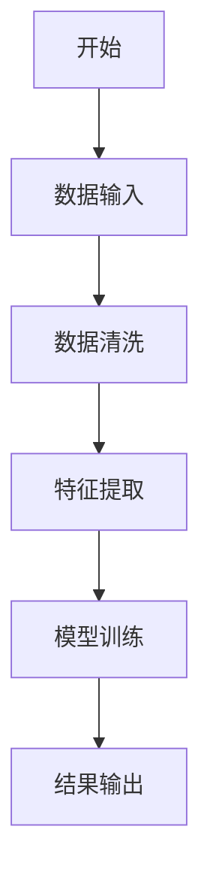
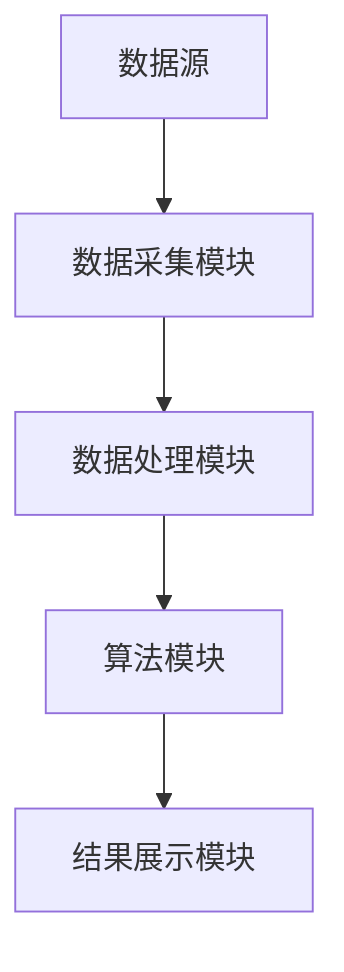

                 


# 如何利用特价股票策略进行全球产业链重构投资

> 关键词：特价股票策略、全球产业链重构、投资策略、数学模型、系统设计、Python代码

> 摘要：本文详细探讨了如何利用特价股票策略在全球产业链重构中进行投资。通过分析特价股票策略的核心概念、算法原理、系统设计以及实际案例，本文为投资者提供了从理论到实践的全面指导。文章还涵盖了风险管理、最佳实践以及未来研究方向等内容，帮助投资者在全球化背景下制定有效的投资策略。

---

## 引言

在全球化不断深化的今天，产业链重构已成为投资领域的重要议题。特价股票策略作为一种高效的投资方式，如何在全球产业链重构中发挥作用，是投资者关注的焦点。本文将从背景、理论、实践等多个角度，详细探讨如何利用特价股票策略进行全球产业链重构投资。

---

## 第一部分：背景介绍

### 第1章：特价股票策略的定义与特点

#### 1.1 特价股票的定义
- 特价股票是指价格低于其内在价值的股票，通常具有较高的投资潜力。
- 价格低估的原因可能包括市场波动、行业周期性或公司短期问题。

#### 1.2 特价股票策略的特点
- **低风险**：由于价格低于内在价值，风险相对较低。
- **高回报潜力**：随着股价回归合理水平，投资者可能获得超额收益。
- **长期视角**：特价股票策略通常需要较长的持有时间，以等待价值实现。

#### 1.3 特价股票策略与传统投资策略的区别
| 策略类型 | 投资目标 | 风险水平 | 持股时间 |
|----------|----------|----------|----------|
| 短期交易 | 赚取价差 | 高       | 短期      |
| 长期投资 | 赚取股息收益 | 中等     | 长期      |
| 特价股票策略 | 赚取价值回归 | 低       | 中长期    |

---

### 第2章：全球产业链重构的背景

#### 2.1 全球化背景下的产业链重构
- 全球化促进了产业链的分工合作，但也带来了区域化和本地化的趋势。
- 技术进步、政策变化和市场波动等因素推动了产业链的重构。

#### 2.2 产业链重构对投资策略的影响
- 行业集中度提高，优质企业更具竞争力。
- 产业链上下游整合的机会增多。
- 区域经济差异为投资者提供了差异化投资机会。

---

## 第二部分：特价股票策略的核心概念

### 第3章：特价股票策略的核心要素

#### 3.1 特价股票的筛选标准
- **市盈率（P/E）**：低于行业平均水平。
- **市净率（P/B）**：低于行业平均水平。
- **股息率**：高股息率股票具有较高的吸引力。

#### 3.2 产业链重构中的关键因素
- **行业周期**：选择处于复苏期的行业。
- **公司基本面**：关注盈利能力、资产负债率等财务指标。
- **市场情绪**：避免市场过度悲观或乐观的情况。

#### 3.3 投资组合优化的数学模型
- **CAPM模型**：用于评估资产的预期收益。
- **APT模型**：用于评估资产的风险溢价。
- **夏普比率**：衡量投资组合的风险调整后收益。

---

### 第4章：特价股票策略的属性对比

#### 4.1 风险与收益的对比分析
| 策略类型 | 风险水平 | 收益潜力 |
|----------|----------|----------|
| 特价股票策略 | 中低     | 高       |
| 短期交易 | 高       | 中       |
| 债券投资 | 低       | 低       |

#### 4.2 不同投资策略的优劣势对比
- **优势**：风险低、回报潜力高。
- **劣势**：需要较长的持有时间，且需要对市场有一定的判断能力。

#### 4.3 特价股票策略与其他策略的结合
- 结合长期投资策略，分散风险。
- 结合短期交易策略，捕捉市场波动机会。

---

## 第三部分：特价股票策略的算法原理

### 第5章：特价股票筛选算法

#### 5.1 算法原理概述
- 算法目标：筛选出具有投资潜力的特价股票。
- 算法输入：股票价格、财务数据、市场数据。
- 算法输出：符合条件的股票列表。

#### 5.2 算法流程图


#### 5.3 算法实现
```python
import pandas as pd
import numpy as np

def screen_stocks(prices, financials):
    # 数据清洗
    cleaned_data = pd.merge(prices, financials, on='stock_id')
    cleaned_data = cleaned_data.dropna()
    
    # 特征提取
    cleaned_data['pe'] = cleaned_data['price'] / cleaned_data['eps']
    cleaned_data['pb'] = cleaned_data['price'] / cleaned_data['book_value']
    
    # 筛选条件
    selected = cleaned_data[(cleaned_data['pe'] < cleaned_data['pe'].median()) & 
                            (cleaned_data['pb'] < cleaned_data['pb'].median())]
    
    return selected
```

---

## 第四部分：系统分析与架构设计

### 第6章：系统功能设计

#### 6.1 系统功能模块
- 数据采集模块：从市场获取股票数据。
- 数据处理模块：清洗和预处理数据。
- 算法模块：执行特价股票筛选算法。
- 结果展示模块：显示筛选结果。

#### 6.2 系统架构图


---

## 第五部分：项目实战

### 第7章：环境安装与代码实现

#### 7.1 环境安装
- 安装Python和必要的库：`pandas`, `numpy`, `scipy`.

#### 7.2 核心代码实现
```python
import pandas as pd
import numpy as np

def calculate_return(prices, n=20):
    # 计算n天后的收益率
    return (prices.shift(-n) / prices - 1).dropna()

def evaluate_strategy(prices, n=20):
    # 计算策略收益
    returns = calculate_return(prices)
    strategy_returns = returns[returns > 0].mean()
    return strategy_returns

# 示例数据
data = pd.read_csv('stock_prices.csv')
print(evaluate_strategy(data))
```

---

## 第六部分：风险管理与最佳实践

### 第8章：风险管理

#### 8.1 风险来源
- 市场风险：市场波动可能导致股价下跌。
- 个股风险：个别公司业绩不佳影响股价。
- 操作风险：交易错误或系统故障。

#### 8.2 风险管理策略
- 分散投资：避免过度集中。
- 定期复盘：及时调整投资组合。
- 设置止损：控制最大损失。

---

## 第七部分：结论与展望

### 第9章：总结

#### 9.1 核心观点总结
- 特价股票策略在全球产业链重构中具有重要作用。
- 投资者应结合市场趋势和公司基本面进行投资决策。

#### 9.2 未来研究方向
- 研究更多因素对股价的影响。
- 探讨算法在不同市场环境下的表现。

---

## 作者：AI天才研究院/AI Genius Institute & 禅与计算机程序设计艺术 /Zen And The Art of Computer Programming

---

**感谢您的阅读！希望本文能为您提供有价值的投资策略和系统设计思路。**

