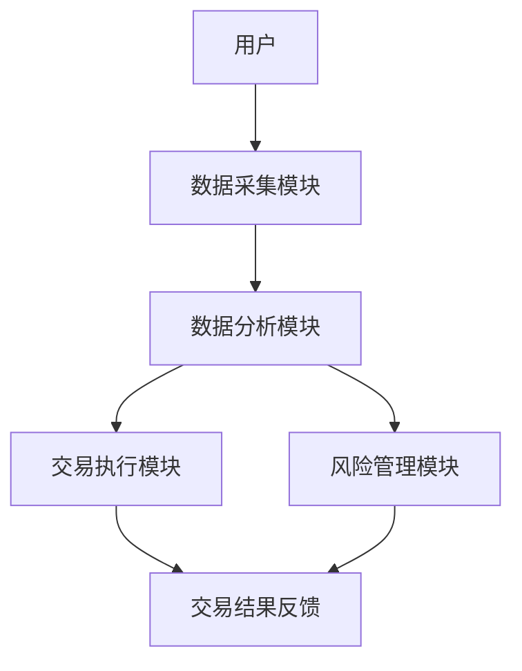
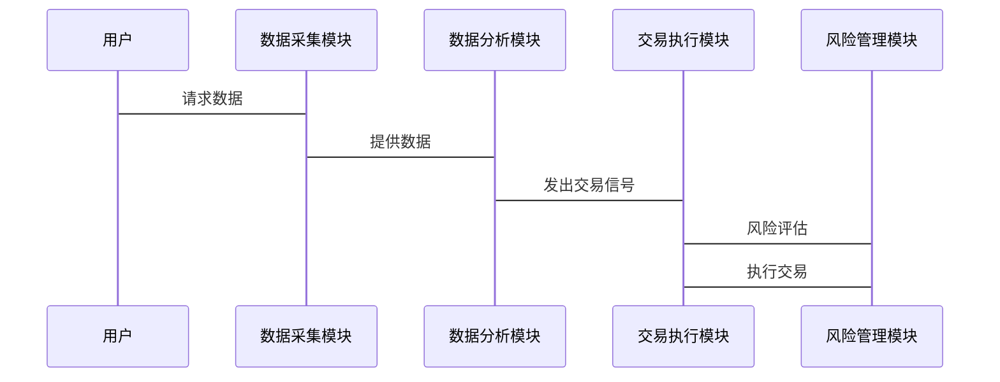

                 

<think>
好，我需要完成用户要求的《如何利用特价股票策略进行全球宏观对冲》的技术博客文章。首先，用户希望文章结构清晰，逻辑严密，使用专业的技术语言，涵盖从背景到系统设计、实战案例等多个方面。

首先，我会从“文章标题”开始，然后列出关键词和摘要，确保摘要准确反映文章核心内容。接下来，按照目录大纲的结构，逐步展开每个章节的内容。

在“第一部分：特价股票策略与全球宏观对冲概述”中，我需要详细解释这两个概念的定义、特点以及它们之间的关联。这里可能需要使用一些表格或图表来帮助读者理解，比如比较全球宏观对冲与其他投资策略的差异，或者特价股票策略的不同分类。

接下来，在“第二部分：全球宏观经济因素对股票市场的影响”中，我需要分析各种宏观经济指标如利率、汇率等如何影响股票市场。这部分可能需要引用一些经济理论，并结合实际案例来说明这些因素的作用机制。

第三部分涉及数学模型与算法原理，这部分是文章的核心技术部分。我需要详细讲解特价股票策略的数学模型，如市场价与内在价值的计算，使用公式和图表来辅助说明。此外，还需要介绍算法的实现步骤，并通过代码示例来展示如何应用这些模型进行交易决策。

在“第四部分：系统分析与架构设计”中，我需要设计一个完整的系统架构，包括数据采集、分析、交易执行和风险管理模块。使用系统架构图和序列图来展示各模块之间的交互关系，确保系统的高效运行和风险控制。

最后，在“第五部分：项目实战”中，我会提供具体的实战案例，从环境配置到代码实现，再到案例分析，帮助读者理解如何在实际操作中应用这些策略。同时，加入总结与展望，讨论策略的有效性、优缺点及未来改进方向。

在写作过程中，我需要确保每个部分都详细展开，使用专业的术语和清晰的逻辑，同时加入足够的图表和代码示例，使文章内容丰富且易于理解。最后，记得在文章末尾署名，并附上参考文献和相关链接，以增加文章的权威性和可读性。
</think>

# 如何利用特价股票策略进行全球宏观对冲

## 关键词：特价股票策略、全球宏观对冲、宏观经济分析、股票交易、对冲投资

## 摘要：  
本文详细探讨了如何利用特价股票策略在全球范围内进行宏观对冲。通过分析宏观经济因素对股票市场的影响，构建特价股票策略的数学模型，并设计相应的系统架构，本文为投资者提供了从理论到实践的全面指导。文章还通过实际案例分析，展示了如何在复杂多变的全球经济环境中利用特价股票策略进行有效投资。

---

## 第一部分：特价股票策略与全球宏观对冲概述

### 第1章：特价股票策略与全球宏观对冲的背景

#### 1.1 全球宏观对冲的定义与特点
全球宏观对冲是一种基于对全球经济趋势和市场周期的分析，通过在不同市场和资产类别之间进行对冲投资，以实现稳健收益的投资策略。其特点包括：
- **全球化视角**：关注全球经济、地缘政治和宏观经济指标。
- **对冲性**：通过多空头寸对冲市场风险。
- **灵活性**：能够快速调整投资组合以应对市场变化。

#### 1.2 特价股票策略的定义与分类
特价股票策略是指通过识别市场中价格被低估的股票，进行买入并长期持有的投资策略。其主要分类包括：
- **价值型投资**：寻找市场价格低于内在价值的股票。
- **成长型投资**：投资于具有高增长潜力的股票。
- **事件驱动型投资**：利用公司特定事件（如并购、重组）带来的价格波动进行投资。

#### 1.3 特价股票策略与全球宏观对冲的关联
- **宏观经济驱动**：全球经济趋势直接影响股票价格，特价股票策略需要结合宏观经济分析。
- **风险对冲**：通过全球市场配置和多空头寸对冲，降低单一市场的风险。
- **市场周期性**：在全球经济周期的不同阶段，特价股票策略的表现和适用性有所不同。

---

## 第二部分：全球宏观经济因素对股票市场的影响

### 第2章：全球宏观经济环境与股票市场

#### 2.1 主要宏观经济指标对股票市场的影响
- **利率**：利率上升可能导致股票价格下跌，反之亦然。
- **汇率**：汇率波动影响出口企业盈利能力和跨国公司股价。
- **通货膨胀**：适度通胀有利于企业盈利，但过高的通胀会侵蚀利润。
- **失业率**：低失业率通常意味着经济繁荣，推动股价上涨。

#### 2.2 全球经济周期对股票市场的影响
- **经济周期的定义与阶段**：包括衰退、复苏、增长和顶峰四个阶段。
- **不同阶段的股票市场表现**：衰退期股价下跌，复苏期逐步回升，增长期股价稳步上涨，顶峰期可能出现回调。

#### 2.3 地缘政治与全球经济事件对股票市场的影响
- **地缘政治事件**：如战争、贸易摩擦等可能引发市场恐慌，导致股价波动。
- **全球经济事件**：如金融危机、经济政策变化等对市场的影响。

---

## 第三部分：特价股票策略的数学模型与算法原理

### 第3章：特价股票策略的数学模型

#### 3.1 市场价与内在价值的计算公式
内在价值公式：
$$
\text{内在价值} = \sum_{t=1}^{\infty} \frac{\text{现金流}_t}{(1 + r)^t}
$$

其中，\( r \) 为折现率，\( \text{现金流}_t \) 为第 \( t \) 年的现金流。

#### 3.2 市场情绪对股票价格的影响模型
市场情绪可以通过投资者情绪指数（例如，恐慌指数VIX）来衡量。情绪对股价的影响可以用以下公式表示：
$$
\text{股价} = \text{内在价值} \times (1 + \beta \times \text{市场情绪})
$$
其中，\( \beta \) 是情绪影响因子，\( \beta > 0 \) 表示市场情绪对股价的正向影响。

---

## 第四部分：系统分析与架构设计

### 第4章：系统分析与架构设计

#### 4.1 系统功能设计
- **数据采集模块**：采集全球宏观经济指标和股票市场数据。
- **数据分析模块**：分析宏观经济指标对股票市场的影响，识别低估股票。
- **交易执行模块**：根据分析结果执行买卖指令。
- **风险管理模块**：监控市场风险，调整投资组合。

#### 4.2 系统架构设计
系统架构图如下：



#### 4.3 系统接口设计
- 数据接口：与金融数据供应商API对接。
- 交易接口：与券商交易系统对接。

#### 4.4 系统交互流程
交易流程如下：



---

## 第五部分：项目实战

### 第5章：项目实战

#### 5.1 环境配置
- **编程语言**：Python
- **库依赖**：pandas、numpy、matplotlib、yfinance

#### 5.2 核心代码实现
```python
import pandas as pd
import numpy as np
import yfinance as yf

def calculate_intrinsic_value(enterprise_value, cash_flow):
    return enterprise_value + cash_flow

def calculate_market_sentiment(vix):
    return 1 if vix < 20 else -1

# 示例代码
tickers = ['AAPL', 'MSFT', 'GOOGL']
data = yf.download(tickers, start='2023-01-01', end='2023-12-31')
```

#### 5.3 案例分析
案例分析如下：
- 选择低估股票：分析股票的市盈率和市净率，选择低于行业平均水平的股票。
- 执行交易：根据模型信号买入低估股票，卖出高估股票。
- 风险管理：设定止损点，控制仓位比例。

---

## 总结与展望

### 第6章：总结与展望

- **总结**：本文详细介绍了如何利用特价股票策略进行全球宏观对冲，从理论到实践提供了全面指导。
- **展望**：未来可以通过引入机器学习和大数据分析技术，进一步优化策略模型，提高投资收益。

---

## 注意事项

- **风险提示**：投资有风险，本文内容仅为参考，具体操作需谨慎。
- **合规性提示**：投资需遵守相关法律法规，建议在专业顾问指导下进行。

---

## 参考文献与拓展阅读

- 市场分析经典书籍：《股票作手回忆录》
- 宏观经济分析书籍：《经济学原理》
- 系统设计参考文献：《系统设计精要》

---

## 作者

**作者：AI天才研究院/AI Genius Institute & 禅与计算机程序设计艺术 /Zen And The Art of Computer Programming**

---

感谢您的阅读！如果文章对您有所帮助，请分享给更多对投资感兴趣的朋友。

