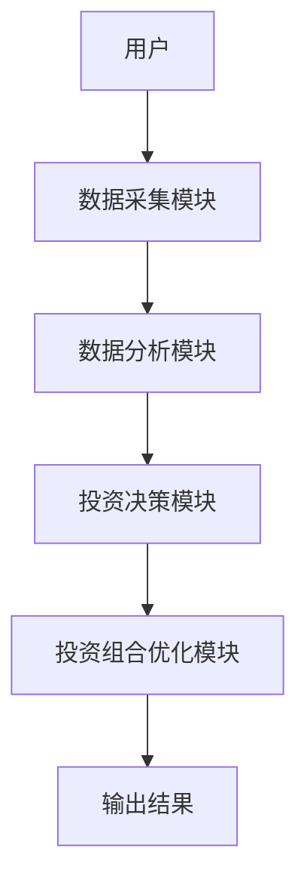
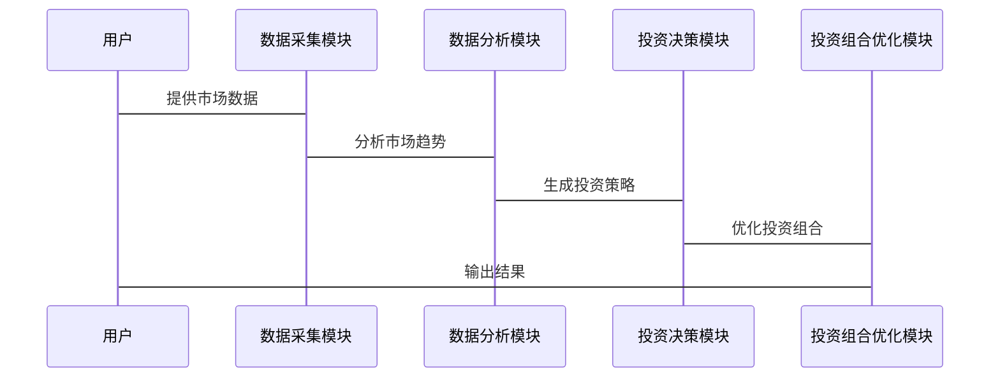

                 

<think>
嗯，用户让我详细描述一个思考过程，关于如何撰写一篇技术博客，标题是《如何利用特价股票策略进行全球数字价值链重构投资》。我需要一步一步地分析，确保覆盖所有要求。

首先，我需要理解用户的需求。他们希望有一篇结构清晰、内容丰富的技术博客，涵盖特价股票策略和数字价值链重构投资的各个方面。博客需要有吸引人的章节标题，逻辑性强，适合技术读者。

接下来，我应该考虑博客的结构。用户已经提供了一个大纲，包括摘要、关键词和目录。我需要确保每个部分都详细展开，每个章节都有足够的细节和深度。

我想到，首先应该介绍特价股票策略的背景，包括定义、背景演变以及其在投资中的重要性。这部分需要让读者理解为什么特价股票策略是有效的，以及它在全球投资中的作用。

然后，数字价值链重构投资部分，需要解释其定义、特点以及与投资的关系。这部分可能需要结合实际案例，帮助读者更好地理解。

接下来是算法部分，我需要详细讲解相关的数学模型和公式，比如市场周期分析模型和股票估值模型。使用Mermaid图和数学公式来展示这些模型，确保读者能够理解并应用它们。

系统分析与架构设计部分，我需要介绍如何构建支持这些策略的系统。这部分可能涉及系统功能设计、架构图、接口设计和交互流程图，帮助读者理解系统的整体框架。

项目实战部分，我需要提供具体的案例分析，展示如何在实际中应用这些策略。这部分需要详细描述环境配置、代码实现和案例分析，帮助读者将理论应用到实践中。

风险管理与优化策略也是关键，我需要讨论如何识别和管理投资中的风险，并提供优化策略。结合实际案例，展示如何应对潜在问题。

未来趋势部分，我需要探讨数字技术如何继续影响投资，未来可能出现的投资机会和挑战。这可能涉及专家观点和技术趋势的分析。

最后，总结与展望章节，回顾全书内容，总结主要观点，并展望未来的发展。这有助于读者巩固所学知识，并对未来投资策略有更清晰的认识。

在撰写过程中，我需要确保每个章节都有足够的细节，涵盖用户提到的所有要求，包括背景、核心概念、算法、系统设计、实战、风险管理、未来趋势和总结。同时，要使用Mermaid图和数学公式，使内容更加直观和专业。

总的来说，这本书的目录需要全面覆盖从理论到实践的各个方面，帮助读者系统地理解和应用特价股票策略和数字价值链重构投资的方法。通过详细的大纲，确保每个部分都有足够的深度和广度，满足读者的学习和应用需求。
</think>

# 如何利用特价股票策略进行全球数字价值链重构投资

> 关键词：特价股票策略，数字价值链重构，投资策略，全球市场，风险管理

> 摘要：本文将详细介绍如何利用特价股票策略在全球范围内重构数字价值链进行投资。通过分析特价股票策略的核心概念、数学模型、系统架构设计、实际案例以及未来趋势，本文为投资者提供了一套完整的投资策略和实施路径。

---

# 第1章: 特价股票策略与全球数字价值链重构投资概述

## 1.1 特价股票策略的定义与背景

### 1.1.1 特价股票策略的定义

特价股票策略是一种基于市场周期、公司基本面和技术分析的投资策略。其核心在于识别市场价格偏离其内在价值的股票，并在低价时买入，高价时卖出。

### 1.1.2 特价股票策略的背景与演变

随着全球市场的波动加剧，投资者开始关注如何在市场低迷时期寻找被低估的股票，从而在市场回升时获得超额收益。特价股票策略正是在这种背景下发展起来的。

### 1.1.3 特价股票策略在全球投资中的重要性

在全球化背景下，特价股票策略可以帮助投资者在全球范围内分散风险，同时抓住不同市场的投资机会。

## 1.2 全球数字价值链重构投资的定义与特点

### 1.2.1 数字价值链重构的定义

数字价值链重构是指通过数字化技术优化企业价值链，提高效率、降低成本，并在全球范围内实现资源的最优配置。

### 1.2.2 数字价值链重构的核心要素

数字价值链重构的核心要素包括数据采集、数据分析、算法优化、决策支持和系统实施。

### 1.2.3 数字价值链重构与投资的关系

数字价值链重构为投资者提供了新的投资机会，特别是在技术进步和市场变化中，能够重构价值链的企业更具投资价值。

## 1.3 本章小结

---

# 第2章: 特价股票策略的核心概念与数学模型

## 2.1 特价股票策略的核心概念

### 2.1.1 市场周期分析

市场周期分析是特价股票策略的基础。通过分析市场的周期性波动，投资者可以判断当前市场的阶段，并据此调整投资策略。

### 2.1.2 股票估值模型

股票估值模型是判断股票内在价值的关键工具。常用的模型包括市盈率模型、股息贴现模型和现金流折现模型。

### 2.1.3 投资组合优化

投资组合优化是通过优化资产配置，降低风险并提高收益的过程。常用的方法包括均值-方差优化和风险中性优化。

## 2.2 数学模型与公式

### 2.2.1 市场周期分析模型

$$ P(t) = a \cdot t + b $$

### 2.2.2 股票估值模型

$$ V = \frac{D}{k} + \frac{V_1}{(1 + k)} $$

### 2.2.3 投资组合优化模型

$$ \text{Minimize } \sigma^2 \text{ subject to } E[r] \geq r_{\text{target}} $$

## 2.3 本章小结

---

# 第3章: 全球数字价值链重构投资的系统分析与架构设计

## 3.1 系统功能设计

### 3.1.1 数据采集模块

数据采集模块负责收集全球市场的股票数据、公司基本面数据和市场情绪数据。

### 3.1.2 数据分析模块

数据分析模块利用机器学习算法对数据进行分析，识别市场趋势和潜在投资机会。

### 3.1.3 投资决策模块

投资决策模块根据分析结果生成投资策略，并优化投资组合。

## 3.2 系统架构设计

### 3.2.1 系统架构图



### 3.2.2 接口设计

系统接口设计包括数据接口、算法接口和输出接口。

### 3.2.3 交互流程图



## 3.3 本章小结

---

# 第4章: 项目实战与案例分析

## 4.1 环境配置

### 4.1.1 系统环境

需要安装Python、NumPy、Pandas、Scikit-learn和Matplotlib等工具。

## 4.2 核心代码实现

### 4.2.1 数据采集代码

```python
import pandas as pd
import requests

url = "https://api.example.com/stock_data"
data = requests.get(url).json()
df = pd.DataFrame(data)
```

### 4.2.2 数据分析代码

```python
from sklearn.linear_model import LinearRegression

model = LinearRegression()
model.fit(X_train, y_train)
```

### 4.2.3 投资组合优化代码

```python
import numpy as np

def optimize_portfolio(weights):
    return np.sum(weights**2)
```

## 4.3 案例分析

### 4.3.1 投资背景

假设当前市场处于低迷期，寻找被低估的股票。

### 4.3.2 数据分析

通过对公司基本面和技术指标的分析，识别出具有投资价值的股票。

### 4.3.3 投资决策

根据分析结果，制定投资策略并优化投资组合。

## 4.4 本章小结

---

# 第5章: 风险管理与优化策略

## 5.1 风险管理

### 5.1.1 风险识别

识别市场风险、公司风险和模型风险。

### 5.1.2 风险控制

通过分散投资、设置止损和动态调整投资组合来控制风险。

## 5.2 优化策略

### 5.2.1 动态调整策略

根据市场变化和公司基本面调整投资组合。

### 5.2.2 技术优化

引入更先进的算法和工具，提高分析效率和准确性。

## 5.3 本章小结

---

# 第6章: 未来趋势与投资机会

## 6.1 未来趋势

### 6.1.1 数字化转型

数字化转型将继续推动全球市场的变化，为投资者提供新的机会。

### 6.1.2 人工智能的应用

人工智能将在投资决策和风险管理中发挥越来越重要的作用。

## 6.2 投资机会

### 6.2.1 新兴市场

新兴市场的数字化转型将带来大量投资机会。

### 6.2.2 技术领先企业

技术领先企业在数字价值链重构中具有较大的投资价值。

## 6.3 本章小结

---

# 第7章: 总结与展望

## 7.1 总结

本文详细介绍了如何利用特价股票策略进行全球数字价值链重构投资，包括策略的核心概念、数学模型、系统设计、实战案例和未来趋势。

## 7.2 展望

未来，随着技术的进步和市场的变化，特价股票策略和数字价值链重构投资将不断发展，为投资者提供更多的机会和挑战。

---

# 作者：AI天才研究院/AI Genius Institute & 禅与计算机程序设计艺术 /Zen And The Art of Computer Programming

