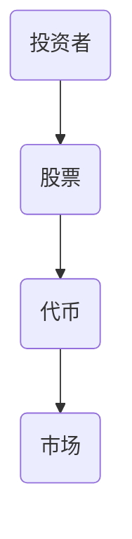
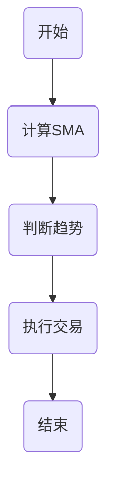
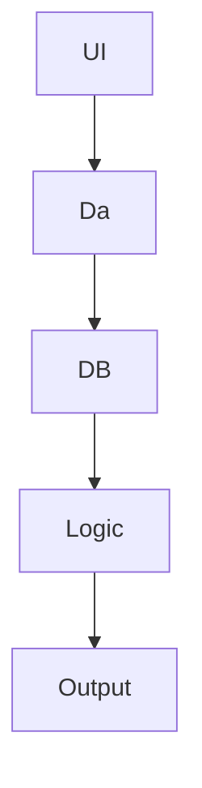

                 


# 如何利用特价股票策略进行全球数字公共产品代币化投资

## 关键词：特价股票、代币化投资、量化交易、数字公共产品、区块链

## 摘要

在全球数字化转型的浪潮下，数字公共产品代币化投资正逐渐成为一种新兴的金融工具。本文将深入探讨如何利用特价股票策略进行全球数字公共产品代币化投资，从背景概念、核心原理、算法设计、系统架构到实际案例，逐步解析这一投资模式的潜力与挑战。

---

## 第一部分：背景与概念

### 第1章：特价股票策略与数字代币化投资概述

#### 1.1 特价股票策略的背景与概念

##### 1.1.1 特价股票的定义与特点
特价股票是指价格相对市场平均价格具有显著优势的股票，通常用于吸引投资者。其特点包括：
- 价格优势：通常低于市场平均水平。
- 投机性：投资者期望通过低价买入高价卖出获利。
- 风险较高：价格波动较大，需谨慎评估。

##### 1.1.2 特价股票策略的应用场景
- 初期投资：适合资金有限的投资者。
- 短期获利：通过快速买卖差价获利。
- 市场波动：在市场波动时，特价股票策略可有效利用价格波动。

##### 1.1.3 数字化投资的趋势与机会
数字化投资正在改变传统金融市场的运作方式，通过技术创新和数据分析，投资者可以更高效地进行决策。特价股票策略在数字化转型中具有巨大潜力，特别是在全球范围内。

#### 1.2 数字公共产品代币化的概念

##### 1.2.1 数字公共产品的定义
数字公共产品是指通过区块链等技术实现的数字化资产，具有去中心化、透明性和可分割性的特点。

##### 1.2.2 代币化投资的核心原理
代币化投资将传统资产转化为数字代币，通过区块链技术实现资产的分割、转让和价值传递。其核心在于将实物资产转化为数字形式，提升流动性和透明度。

##### 1.2.3 全球化视角下的代币化趋势
全球化使得数字公共产品的代币化成为可能，投资者可以跨越地理限制，进行全球范围内的投资。

---

## 第二部分：核心概念与原理

### 第2章：代币化投资的核心概念

#### 2.1 代币化投资的数学模型

##### 2.1.1 投资回报率的计算公式
$$ ROI = \frac{最终价值 - 初始价值}{初始价值} \times 100\% $$

##### 2.1.2 风险评估模型
$$ 风险 = 标准差 \times 时间因子 $$

#### 2.2 实体关系图（ER图）



### 第3章：量化交易算法与策略

#### 3.1 量化交易算法

##### 3.1.1 简单移动平均线（SMA）策略



##### 3.1.2 算法实现代码
```python
def calculate_sma(prices, window):
    return prices.rolling(window).mean()
```

---

## 第三部分：系统架构与设计

### 第4章：系统架构设计

#### 4.1 系统功能模块

- 4.1.1 数据采集模块：负责收集股票价格和市场数据。
- 4.1.2 算法执行模块：执行量化交易策略。
- 4.1.3 交易执行模块：根据策略结果执行交易。

#### 4.2 系统架构图



---

## 第四部分：项目实战

### 第5章：项目实战与案例分析

#### 5.1 环境安装

```bash
pip install pandas numpy matplotlib
```

#### 5.2 核心实现代码

```python
import pandas as pd
import numpy as np

def calculate_sma(prices, window):
    return prices.rolling(window).mean()

# 示例数据
prices = pd.DataFrame({
    'price': [100, 90, 85, 95, 105, 120]
})

sma = calculate_sma(prices['price'], 3)
print(sma)
```

#### 5.3 案例分析

假设我们选择一只特价股票，利用SMA策略进行投资：

1. 计算3日均线：85, 90, 100。
2. 判断价格趋势，执行买入或卖出。

---

## 第五部分：未来趋势与最佳实践

### 第6章：未来趋势与投资机会

#### 6.1 未来趋势

- 区块链技术的进一步发展。
- 人工智能在量化交易中的应用。

#### 6.2 投资机会

- 全球数字公共产品的代币化投资。
- 利用人工智能优化交易策略。

#### 6.3 注意事项

- 风险管理：控制投资风险。
- 技术风险：关注技术实现的稳定性。

---

## 作者：AI天才研究院/AI Genius Institute & 禅与计算机程序设计艺术 /Zen And The Art of Computer Programming

---

以上是文章的完整内容，每个部分都详细解析了如何利用特价股票策略进行全球数字公共产品代币化投资，从理论到实践，结合了数学模型、算法设计和系统架构，为读者提供了全面的视角和深入的分析。

