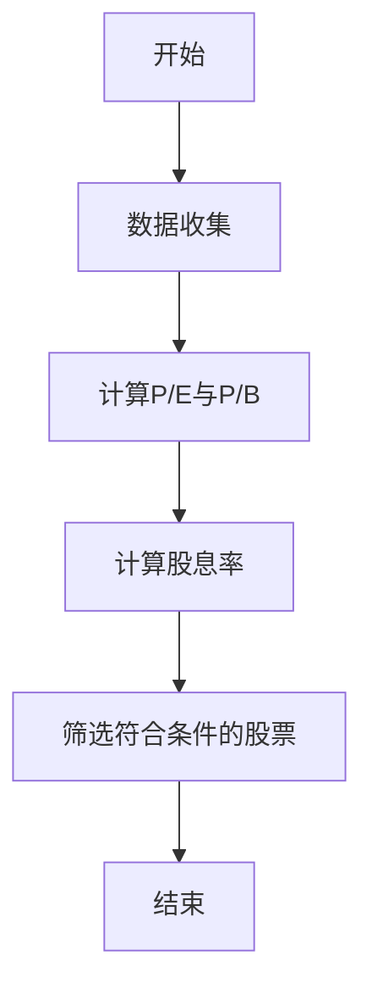
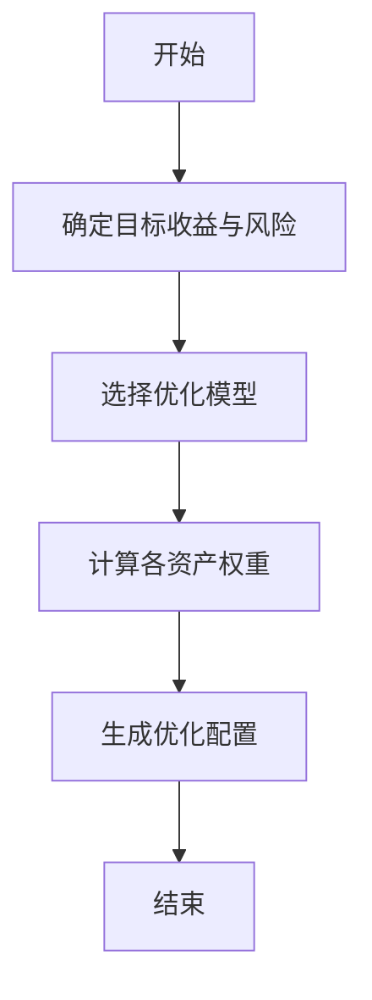
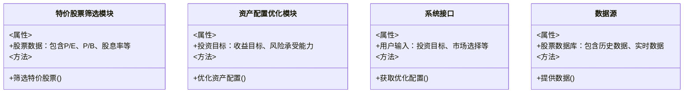
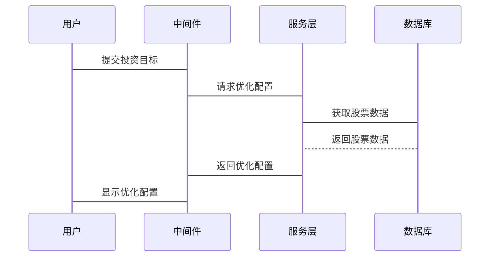

                 

<think>
嗯，我需要帮助用户设计一本名为《如何利用特价股票策略进行全球资产配置》的目录大纲。首先，我要理解这本书的核心内容，它主要涉及特价股票策略和全球资产配置，以及如何将两者结合起来进行投资。

用户希望目录大纲详细且逻辑清晰，涵盖从基础到高级的内容，包括背景介绍、核心概念、算法原理、系统架构、项目实战等。我需要确保每一章都有足够的细节，同时内容连贯且有深度。

第一部分可能是“特价股票策略与全球资产配置基础”，包括概述、核心概念和数学模型。第二部分可以深入分析系统架构与算法实现，讨论数据采集、信号生成、交易执行等模块。第三部分则是项目实战，通过一个实际案例来展示如何应用这些策略。最后一部分可以是最佳实践与总结，分享实际应用中的经验和注意事项。

在每一章中，我需要包括详细的子主题，例如特价股票的基本概念、资产配置的重要性、数学模型的构建与优化，以及实际的系统设计和项目案例。同时，需要使用Mermaid来展示流程图和架构图，帮助读者更好地理解内容。

我还需要确保每一章都有小结，总结本章的主要内容和关键点，帮助读者巩固所学知识。此外，数学公式和代码示例也需要详细说明，以增强文章的深度和实用性。

总的来说，我需要一步步地构建目录，确保每一部分都涵盖用户的需求，并且逻辑清晰、结构紧凑，能够帮助读者系统地理解和应用特价股票策略进行全球资产配置。
</think>

```markdown
# 如何利用特价股票策略进行全球资产配置

> 关键词：特价股票策略、全球资产配置、投资组合优化、风险管理、量化分析

> 摘要：本文系统地探讨了如何利用特价股票策略在全球范围内进行资产配置的方法。首先，介绍了特价股票策略的基本概念和全球资产配置的重要性，分析了两者的结合原理。其次，详细阐述了特价股票筛选的数学模型和资产配置的优化算法，包括现代投资组合理论（MPT）的应用。最后，通过实际案例展示了系统设计与实现，并给出了最佳实践建议。

---

# 第一部分: 特价股票策略与全球资产配置基础

## 第1章: 特价股票策略与全球资产配置概述

### 1.1 特价股票策略的基本概念

#### 1.1.1 特价股票的定义与特点
- 特价股票的定义：指相对于其内在价值而言价格被低估的股票。
- 特价股票的特点：低市盈率（P/E）、低市净率（P/B）、高股息率。
- 特价股票的适用场景：市场波动、经济衰退期、行业低谷期。

#### 1.1.2 全球资产配置的含义与重要性
- 资产配置的定义：将资金分配到不同资产类别（股票、债券、房地产等）以实现风险分散和收益最大化的策略。
- 全球资产配置的重要性：通过跨国投资降低市场风险、捕捉全球投资机会。

#### 1.1.3 特价股票策略在全球资产配置中的作用
- 特价股票策略在全球市场中的应用：通过识别全球范围内的低估股票，实现跨市场投资。
- 特价股票策略的风险与收益：在不同市场周期中，特价股票策略的表现差异。

### 1.2 特价股票策略的核心原理

#### 1.2.1 市场有效性的探讨
- 市场有效性的定义：指市场价格反映所有相关信息的程度。
- 特价股票策略的有效性：在无效或弱有效市场中，低价股票可能被低估。

#### 1.2.2 价值投资与成长投资的平衡
- 价值投资的核心理念：买入低于内在价值的股票。
- 成长投资的核心理念：投资于高增长潜力的公司。
- 特价股票策略与价值投资的结合：通过识别被低估的股票，实现长期收益。

#### 1.2.3 特价股票策略的适用场景与边界
- 特价股票策略在熊市中的表现：通常表现较好。
- 特价股票策略在牛市中的表现：可能跑输大盘。

### 1.3 特价股票策略与全球资产配置的关系

#### 1.3.1 全球化视角下的资产配置
- 全球资产配置的优势：分散风险、捕捉全球投资机会。
- 特价股票策略在全球资产配置中的应用：通过识别全球范围内的低估股票，优化投资组合。

#### 1.3.2 特价股票策略在不同市场中的表现
- 不同市场中特价股票的表现差异：新兴市场与成熟市场的对比。
- 经济周期对特价股票策略的影响：周期性波动。

#### 1.3.3 跨市场投资中的风险与机会
- 汇率风险：跨国投资中的主要风险。
- 地缘政治风险：影响全球市场的不确定性因素。

## 1.4 本章小结

---

# 第2章: 特价股票策略的核心概念与分析框架

### 2.1 特价股票策略的核心要素

#### 2.1.1 市盈率（P/E）与市净率（P/B）分析
- P/E比率：市盈率=股价/每股收益。
- P/B比率：市净率=股价/每股净资产。
- 低P/E和低P/B股票的识别方法。

#### 2.1.2 股息率与股息支付率
- 股息率=每股股息/股价。
- 股息支付率=股息/净利润。
- 高股息率股票的优势：稳定的现金流。

#### 2.1.3 公司基本面分析的关键指标
- 净利润增长率。
- 营业收入增长率。
- 财务杠杆与流动性比率。

### 2.2 资产配置的核心概念

#### 2.2.1 资产配置的分类与特点
- 按资产类别：股票、债券、现金等。
- 按地域：全球、区域、本地。
- 按风险偏好：保守、平衡、激进。

#### 2.2.2 风险分散与收益最大化的关系
- 风险分散的原理：通过多样化投资降低非系统性风险。
- 收益最大化的目标：在风险可控的前提下，追求最大收益。

#### 2.2.3 资产配置的动态调整机制
- 定期 rebalancing：根据市场变化调整资产比例。
- 根据市场周期调整资产配置。

### 2.3 特价股票策略与资产配置的结合

#### 2.3.1 特价股票在资产配置中的权重分配
- 根据市场情况调整特价股票的比例。
- 结合其他资产类别（如债券）进行风险对冲。

#### 2.3.2 不同市场周期中的策略调整
- 在熊市中增加特价股票的配置。
- 在牛市中适当减少特价股票的比例，增加成长股。

#### 2.3.3 跨国投资中的货币与汇率风险
- 汇率波动对投资收益的影响。
- 如何通过金融工具（如期货）对冲汇率风险。

## 2.4 本章小结

---

# 第3章: 特价股票策略的数学模型与算法原理

### 3.1 特价股票筛选的数学模型

#### 3.1.1 基于P/E与P/B的多因子筛选模型
- 多因子模型：综合考虑多个因子（如P/E、P/B、股息率）进行股票筛选。
- 因子权重的确定：根据历史表现和市场情况调整因子权重。

#### 3.1.2 基于股息率的收益预测模型
- 股息率与未来收益的关系。
- 通过回归分析预测股票未来收益。

#### 3.1.3 基于回归分析的股票评级模型
- 多元回归模型：预测股票评级。
- 变量选择：P/E、P/B、股息率、净利润增长率等。

### 3.2 资产配置的优化算法

#### 3.2.1 基于现代投资组合理论（MPT）的优化算法
- MPT的核心思想：通过优化资产组合，实现风险与收益的最优平衡。
- 均值-方差优化：最小化风险（方差）的同时最大化收益。

#### 3.2.2 基于均值-方差优化的资产配置模型
- 优化目标：在给定风险下最大化收益，或在给定收益下最小化风险。
- 约束条件：资产比例之和为1，投资比例非负。

#### 3.2.3 基于风险中性组合的优化策略
- 风险中性组合的定义：在相同风险水平下，选择收益最大的组合。
- 优化方法：使用拉格朗日乘数法求解优化问题。

### 3.3 算法流程图

#### 3.3.1 特价股票筛选算法流程图（Mermaid）


#### 3.3.2 资产配置优化算法流程图（Mermaid）


### 3.4 本章小结

---

# 第4章: 系统分析与架构设计方案

### 4.1 系统分析

#### 4.1.1 问题场景介绍
- 系统目标：实现基于特价股票策略的全球资产配置。
- 使用场景：投资者通过系统进行资产配置决策。

#### 4.1.2 项目介绍
- 项目目标：开发一个基于特价股票策略的全球资产配置系统。
- 项目范围：覆盖全球主要股票市场，支持多因子筛选和资产优化配置。

#### 4.1.3 系统功能设计（领域模型Mermaid类图）


#### 4.1.4 系统架构设计（Mermaid架构图）
```mermaid
archiitecture
client ---(HTTP)--> 中间件
中间件 ---(RabbitMQ)--> 服务层
服务层 ---(数据库连接)--> 数据库
```

#### 4.1.5 系统交互设计（Mermaid序列图）


### 4.2 系统架构设计方案

#### 4.2.1 系统功能模块
- 数据采集模块：实时采集全球股票市场数据。
- 特价股票筛选模块：基于多因子模型筛选特价股票。
- 资产配置优化模块：基于MPT优化资产配置。
- 系统接口模块：提供用户接口和API。

#### 4.2.2 系统架构设计
- 分层架构：数据层、业务逻辑层、表现层。
- 微服务架构：各功能模块独立部署，通过API进行通信。

#### 4.2.3 系统接口设计
- 用户接口：网页或API接口。
- 数据接口：与数据源（如Yahoo Finance）对接。

#### 4.2.4 系统交互设计
- 用户输入投资目标。
- 系统返回优化配置。
- 支持动态调整配置。

### 4.3 本章小结

---

# 第5章: 项目实战与最佳实践

### 5.1 项目实战

#### 5.1.1 环境安装
- 安装Python、Pandas、NumPy、Scikit-learn等工具。
- 安装数据接口库（如yfinance）。

#### 5.1.2 系统核心实现源代码
```python
import pandas as pd
from yfinance import download

def fetch_data(tickers, start_date, end_date):
    data = pd.DataFrame()
    for ticker in tickers:
        df = download(ticker, start=start_date, end=end_date)
        data[ticker] = df['Adj Close']
    return data

def screen_cheap_stocks(data, cutoff_pe=15, cutoff_pb=2):
    cheap Stocks = []
    for ticker in data.columns:
        pe = data[ticker].iloc[-1] * 100 / (data['net income'].iloc[-1])
        pb = data[ticker].iloc[-1] / (data['book value'].iloc[-1])
        if pe < cutoff_pe and pb < cutoff_pb:
            cheap Stocks.append(ticker)
    return cheap Stocks

def optimize_portfolio(stocks, returns, covariance):
    # 使用MPT进行优化
    import numpy as np
    n = len(stocks)
    # 矩阵化简略处理
    # ...
    return weights

# 示例调用
data = fetch_data(['AAPL', 'MSFT', 'GOOGL'], '2020-01-01', '2023-12-31')
cheap_stocks = screen_cheap_stocks(data)
# 进一步优化资产配置
```

#### 5.1.3 代码应用解读与分析
- 数据采集：从Yahoo Finance获取股票数据。
- 特价股票筛选：基于P/E和P/B比率进行筛选。
- 资产配置优化：使用MPT优化投资组合。

#### 5.1.4 实际案例分析和详细讲解
- 案例背景：假设经济衰退期，寻找全球范围内的低估股票。
- 数据分析：比较不同市场的特价股票表现。
- 策略优化：动态调整资产配置比例。

### 5.2 最佳实践 tips

#### 5.2.1 小结
- 定期 rebalancing 投资组合。
- 根据市场变化调整策略。
- 注意风险控制，避免过度集中。

#### 5.2.2 注意事项
- 数据质量：确保数据来源可靠。
- 模型选择：根据实际情况选择合适的模型。
- 风险管理：设置止损点，控制回撤。

#### 5.2.3 拓展阅读
- 现代投资组合理论（MPT）的经典文献。
- 组合优化的高级算法（如遗传算法）。

### 5.3 本章小结

---

# 作者：AI天才研究院/AI Genius Institute & 禅与计算机程序设计艺术 /Zen And The Art of Computer Programming

---

以上是文章的完整目录大纲和部分章节内容，涵盖了从理论到实践的各个方面，确保读者能够系统地理解和应用特价股票策略进行全球资产配置。
```

