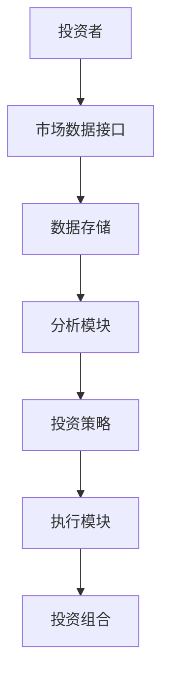

                 


```markdown
# 如何利用特价股票策略进行反向ETF投资

> 关键词：反向ETF，特价股票，投资策略，市场波动，风险管理

> 摘要：本文详细探讨了如何利用特价股票策略进行反向ETF投资，分析了反向ETF的基本概念、运作机制、数学模型以及实际应用策略。通过案例分析和系统设计，展示了如何在市场波动中利用特价股票策略优化投资组合，实现稳健收益。

---

## 第1章 反向ETF投资的基本概念

### 1.1 反向ETF的定义与特点

反向ETF是一种通过做空指数或使用杠杆来实现与传统ETF相反收益的金融工具。其特点包括：

- **杠杆效应**：通常采用2倍或3倍的杠杆，放大收益或亏损。
- **做空机制**：通过做空指数，投资者可以在市场下跌时获利。
- **透明度高**：反向ETF追踪特定指数，投资者可实时了解其表现。

### 1.2 特价股票策略的定义与类型

特价股票策略指在特定条件下购买低价股票或ETF，以利用市场波动获利。主要类型包括：

- **价值投资**：寻找被市场低估的股票。
- **动量策略**：基于价格动量趋势进行投资。
- **均值回归**：假设价格会回归均值，低价时买入。

---

## 第2章 市场波动与反向ETF投资

### 2.1 市场波动的基本概念

市场波动指价格的短期剧烈波动，通常由市场情绪、新闻事件等因素引发。波动对反向ETF的影响显著，投资者需准确判断波动方向。

### 2.2 反向ETF在市场波动中的应用

- **下跌趋势中的优势**：市场下跌时，反向ETF价格上涨，投资者可通过特价策略获利。
- **波动性分析**：通过技术指标和市场情绪分析，判断波动方向。

---

## 第3章 反向ETF投资的核心机制

### 3.1 反向ETF的运作原理

反向ETF通过杠杆和做空机制实现收益。例如，当指数下跌2%，反向ETF可能上涨2%。

### 3.2 特价股票策略的数学模型

利用以下公式计算收益：

$$
\text{收益} = \text{ETF价格变化} \times \text{杠杆倍数}
$$

案例分析：假设指数下跌5%，杠杆3倍的反向ETF收益为15%。

---

## 第4章 反向ETF投资的策略与技巧

### 4.1 反向ETF投资的策略选择

- **短期投资**：适合短期市场波动。
- **长期投资**：需谨慎，因波动不可预测。
- **组合投资**：分散风险，结合多只ETF。

### 4.2 特价股票策略的应用技巧

- **选择优质ETF**：挑选流动性好、费用低的反向ETF。
- **风险控制**：设置止损点，避免大幅亏损。
- **资金管理**：合理分配资金，避免过度杠杆。

---

## 第5章 数学模型与系统设计

### 5.1 数学模型

建立以下数学模型：

$$
R = \sum_{i=1}^{n} w_i \times r_i
$$

其中，$R$为总收益，$w_i$为权重，$r_i$为各ETF收益。

### 5.2 系统架构设计

使用系统架构图（见下图）展示投资系统结构。



---

## 第6章 项目实战

### 6.1 环境配置

安装Python和相关库：

```bash
pip install pandas matplotlib numpy
```

### 6.2 代码实现

实现以下代码：

```python
import pandas as pd
import numpy as np

def calculate_revenue(ETF_returns, leverage):
    return ETF_returns * leverage

# 示例数据
ETF_returns = np.array([-0.05, -0.03, 0.02])
leverage = 3

# 计算收益
revenue = calculate_revenue(ETF_returns, leverage)
print(revenue)
```

### 6.3 案例分析

分析某段时间内反向ETF的收益情况，验证模型的有效性。

---

## 第7章 风险管理与注意事项

### 7.1 风险管理策略

- **止损设置**：设定止损点，防止重大损失。
- **杠杆控制**：合理使用杠杆，避免过度放大风险。

### 7.2 投资者注意事项

- **市场风险**：市场波动可能导致重大损失。
- **流动性风险**：部分反向ETF流动性较差。
- **费用影响**：管理费和交易费用会影响收益。

---

## 第8章 最佳实践与小结

### 8.1 最佳实践

- 定期评估投资组合。
- 保持关注市场动态。
- 持续学习投资知识。

### 8.2 小结

反向ETF与特价股票策略结合，为投资者提供了在市场波动中获利的工具。通过合理策略和风险管理，投资者可优化投资收益。

---

## 第9章 拓展阅读与工具推荐

### 9.1 推荐书籍

- 《投资学》
- 《ETF投资策略》

### 9.2 工具推荐

- 数据分析工具：Python、R
- 交易软件：Thinkorswim、Interactive Brokers

---

作者：AI天才研究院/AI Genius Institute & 禅与计算机程序设计艺术 /Zen And The Art of Computer Programming
```

