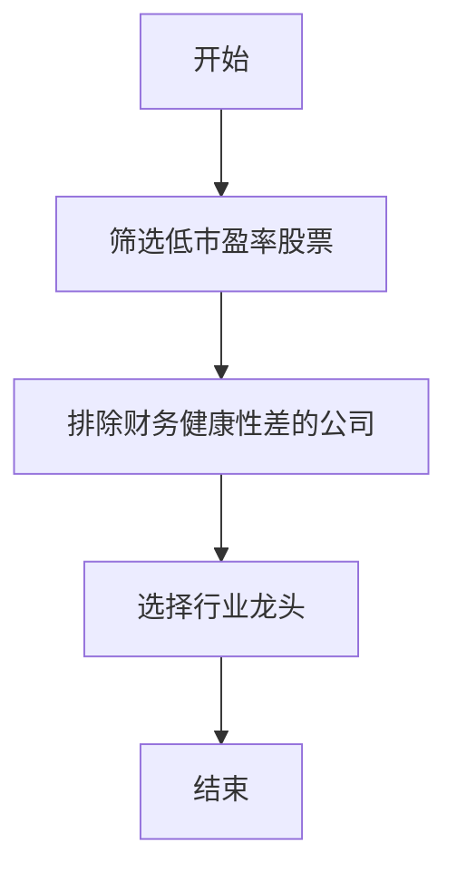

                 


# 如何利用特价股票策略进行反周期投资

## 关键词：特价股票策略、反周期投资、价值陷阱识别、周期性股票分析、市场波动风险管理、数学模型、系统架构设计

## 摘要：  
本文将深入探讨如何利用特价股票策略进行反周期投资。通过分析特价股票策略的核心概念、数学模型、算法原理、系统架构设计以及实战案例，本文将帮助投资者理解如何在市场周期波动中识别和利用特价股票，实现稳健的投资收益。文章还将讨论反周期投资中的风险管理与优化策略，并总结反周期投资的最佳实践和注意事项。

---

## 第一部分：特价股票策略与反周期投资基础

### 第1章：特价股票策略与反周期投资概述

#### 1.1 特价股票策略的定义与背景

##### 1.1.1 什么是特价股票策略
特价股票策略是一种基于市场周期波动的投资策略，旨在在市场低谷期或行业低迷期，以低于其内在价值的价格买入优质股票。这种策略的核心在于识别市场低估的股票，并在市场复苏时实现超额收益。

##### 1.1.2 反周期投资的基本概念
反周期投资是指在经济周期的低谷期或衰退期进行投资，以规避周期性波动风险，并在市场复苏时获得更高收益的投资策略。反周期投资的核心在于选择那些在市场低迷期表现相对稳定的行业和公司。

##### 1.1.3 特价股票策略与反周期投资的关系
特价股票策略是反周期投资的重要组成部分。通过识别市场低估的股票，投资者可以在市场低谷期布局，利用市场周期性波动实现超额收益。反周期投资通过选择具有抗周期性的行业和公司，降低投资组合的波动性。

#### 1.2 特价股票策略的核心要素

##### 1.2.1 特价股票的识别标准
- **低市盈率（P/E）**：市盈率低于行业平均水平，表明股票价格可能被低估。
- **低市净率（P/B）**：市净率低于行业平均水平，表明股票价格相对于账面价值可能被低估。
- **高股息率**：股息率高于行业平均水平，表明公司愿意将利润返还给股东，且股息支付能力较强。
- **行业龙头地位**：选择行业内具有领先地位的公司，这些公司在周期性低谷期更具抗风险能力。

##### 1.2.2 反周期行业的特征分析
- **防御性行业**：如公用事业、医疗保健、消费品等，这些行业的需求相对稳定，受经济周期波动影响较小。
- **周期性行业**：如能源、材料、工业等，这些行业的表现与经济周期密切相关，但在低谷期可能被市场低估。

##### 1.2.3 投资者心理与市场周期的关系
投资者心理在市场周期波动中起着重要作用。在市场低谷期，投资者的恐慌情绪可能导致股票价格被低估，为特价股票策略提供机会。而在市场高峰期，投资者的贪婪情绪可能导致股票价格被高估，增加投资风险。

#### 1.3 特价股票策略的优缺点

##### 1.3.1 优点：低成本获取优质资产
- 投资者可以在市场低谷期以较低的价格买入优质股票，降低投资成本，提高投资收益。
- 特价股票策略通常选择具有强大基本面和良好前景的公司，能够在市场复苏时实现超额收益。

##### 1.3.2 缺点：市场波动风险与信息不对称
- 市场波动可能导致特价股票的价格进一步下跌，增加投资风险。
- 信息不对称可能导致投资者难以准确识别真正被低估的股票，增加投资失败的可能性。

##### 1.3.3 适用场景与限制条件
- **适用场景**：市场周期性低谷期、行业低迷期、经济衰退期等。
- **限制条件**：投资者需要具备较强的研究能力和市场分析能力，才能有效识别和利用特价股票机会。

---

## 第二部分：特价股票策略的核心概念与原理

### 第2章：特价股票策略的核心概念与原理

#### 2.1 特价股票策略的数学模型

##### 2.1.1 市盈率（P/E）计算公式
$$ P/E = \frac{\text{股价}}{\text{每股净利润}} $$

##### 2.1.2 市净率（P/B）计算公式
$$ P/B = \frac{\text{股价}}{\text{每股净资产}} $$

##### 2.1.3 市净率与市盈率的对比分析
通过对比市盈率和市净率，可以帮助投资者更全面地评估股票的内在价值。市盈率适用于盈利稳定的公司，而市净率适用于资产密集型行业。

#### 2.2 特价股票策略的算法原理

##### 2.2.1 筛选算法


##### 2.2.2 实战代码示例
```python
import pandas as pd

# 假设df为股票数据，包含'PE'、'PB'、'ROE'等字段
# 筛选低市盈率、低市净率、ROE较高的股票
low_pe_stocks = df[df['PE'] < df['PE'].mean()]
low_pb_stocks = low_pe_stocks[low_pe_stocks['PB'] < low_pe_stocks['PB'].mean()]
selected_stocks = low_pb_stocks[low_pb_stocks['ROE'] > low_pb_stocks['ROE'].mean()]
```

##### 2.2.3 算法步骤解读
1. 筛选低市盈率股票：通过计算股票的平均市盈率，筛选出市盈率低于平均值的股票。
2. 筛选低市净率股票：在低市盈率股票中，进一步筛选出市净率低于平均值的股票。
3. 筛选ROE较高的股票：在低市净率股票中，筛选出ROE（净资产收益率）高于平均值的股票，确保公司盈利能力较强。

#### 2.3 特价股票策略的系统架构

##### 2.3.1 系统功能模块
- **数据采集模块**：获取实时股价数据、财务报表数据、行业分类数据等。
- **数据分析模块**：计算市盈率、市净率、ROE等指标，筛选出符合条件的特价股票。
- **投资组合管理模块**：根据投资者的风险偏好和投资目标，构建投资组合。
- **风险管理模块**：监控市场波动，动态调整投资组合，规避市场风险。

##### 2.3.2 系统架构图


---

## 第三部分：反周期投资中的风险管理与优化

### 第3章：反周期投资中的风险管理与优化

#### 3.1 价值陷阱识别

##### 3.1.1 价值陷阱的定义与特征
- **定义**：价值陷阱是指股票价格虽然低于其内在价值，但由于公司基本面恶化或行业环境变化，股票价格难以回升，甚至进一步下跌。
- **特征**：公司财务状况恶化、行业前景黯淡、市场竞争加剧等。

##### 3.1.2 价值陷阱识别方法
1. **财务指标分析**：通过分析公司的财务报表，识别公司盈利能力下降、资产负债率上升、现金流恶化等风险。
2. **行业环境分析**：评估行业前景和竞争格局，选择具有较强竞争优势的公司。
3. **市场情绪分析**：通过分析市场情绪，识别市场恐慌导致的非理性下跌。

#### 3.2 反周期投资中的风险管理

##### 3.2.1 风险评估与量化
- **风险评估矩阵**：通过评估市场风险、行业风险、公司风险等因素，构建风险评估矩阵。
- **风险量化方法**：使用VaR（在险值）等风险量化方法，评估投资组合的风险敞口。

##### 3.2.2 动态调整策略
1. **定期再平衡**：根据市场变化和公司基本面，定期调整投资组合。
2. **止损策略**：设定止损点，当股票价格下跌至一定水平时，及时卖出，避免进一步损失。
3. **分散投资**：通过分散投资降低投资组合的整体风险。

#### 3.3 投资组合优化

##### 3.3.1 投资组合优化方法
1. **现代投资组合理论（MPT）**：通过优化投资组合的风险和收益，构建最优投资组合。
2. **因子模型**：基于因子模型，选择具有较高收益和较低风险的股票。

##### 3.3.2 实战案例分析
- **案例1**：2020年新冠疫情爆发期间，医疗保健行业表现相对稳定，投资者可以选择具有较高ROE和较低市盈率的医疗保健公司。
- **案例2**：2022年能源危机期间，能源行业股票价格被低估，投资者可以选择具有较强竞争优势的能源公司。

---

## 第四部分：总结与建议

### 第4章：总结与建议

#### 4.1 总结
通过本文的分析，我们可以得出以下结论：
1. 特价股票策略是一种有效的反周期投资策略，能够在市场低谷期以较低的价格买入优质股票，实现超额收益。
2. 投资者在利用特价股票策略时，需要综合考虑市盈率、市净率、ROE等指标，选择具有较强基本面和良好前景的公司。
3. 反周期投资中的风险管理至关重要，投资者需要通过价值陷阱识别、风险评估与量化、动态调整策略等方法，降低投资风险。

#### 4.2 建议
1. **持续学习与研究**：投资者需要持续关注市场变化和公司基本面，提升自己的研究能力。
2. **分散投资**：通过分散投资降低投资组合的整体风险。
3. **长期投资**：反周期投资需要耐心和信心，长期持有优质股票，等待市场复苏。

---

## 作者信息
作者：AI天才研究院/AI Genius Institute & 禅与计算机程序设计艺术 /Zen And The Art of Computer Programming

---

通过本文的详细分析，读者可以全面了解如何利用特价股票策略进行反周期投资，掌握核心概念、数学模型、算法原理、系统架构设计以及实战案例，为实现稳健的投资收益提供有力支持。

