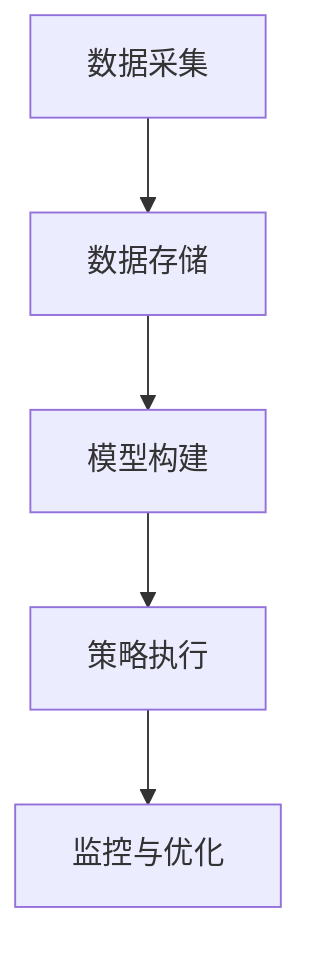
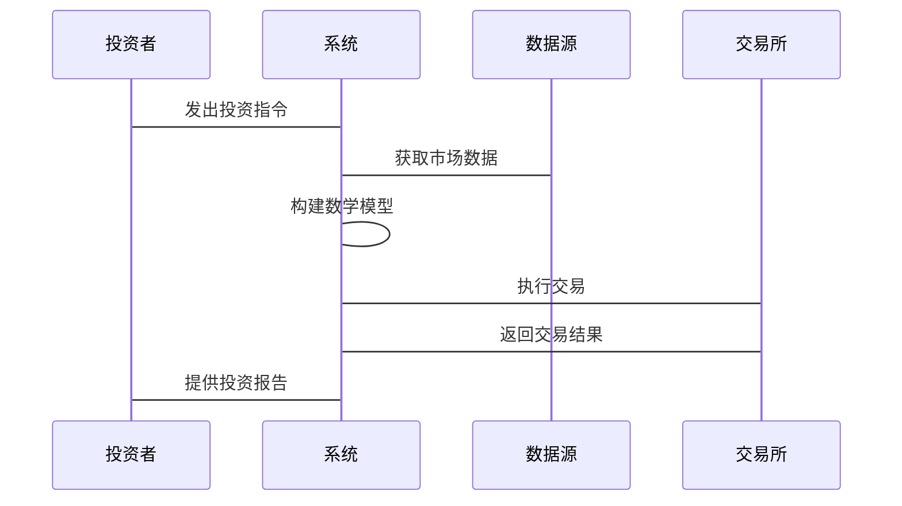

                 


```markdown
# 如何利用特价股票策略进行数字合成衍生品投资

> 关键词：特价股票策略、数字合成衍生品、投资策略、数学模型、系统架构

> 摘要：本文将详细介绍如何利用特价股票策略进行数字合成衍生品投资。通过分析特价股票策略的核心概念、数学模型和系统架构，结合实际案例，帮助读者掌握如何在数字合成衍生品投资中应用特价股票策略，优化投资组合并降低风险。

---

# 第1章: 特价股票策略与数字合成衍生品投资概述

## 1.1 特价股票策略的基本概念
### 1.1.1 什么是特价股票
特价股票是指在特定市场条件下，价格低于其内在价值的股票。这些股票通常被市场低估，具有较高的增长潜力。特价股票的识别需要结合市场分析、公司基本面分析和估值模型。

### 1.1.2 特价股票的分类与特点
- **分类**：
  - 周期性特价股票：受经济周期影响较大的股票，如周期性行业。
  - 非周期性特价股票：不受经济周期影响较大的股票，如公用事业。
  - 小盘特价股票：市值较小的公司股票，风险较高，回报潜力大。
  - 大盘特价股票：市值较大的公司股票，风险较低，回报稳定。

- **特点**：
  - 价格被低估。
  - 市场流动性较好。
  - 具有较高的内在价值。

### 1.1.3 特价股票在投资中的作用
- 通过识别特价股票，投资者可以在市场低谷时介入，获得较高的收益。
- 特价股票通常具有较高的安全边际，降低投资风险。
- 在市场波动时，特价股票可以为投资组合提供稳定性。

## 1.2 数字合成衍生品的基本概念
### 1.2.1 什么是数字合成衍生品
数字合成衍生品是指通过算法和数据分析，将多个金融资产或指标合成的一种衍生品。与传统衍生品不同，数字合成衍生品具有高度的定制化和自动化特点。

### 1.2.2 数字合成衍生品的类型
- **指数合成衍生品**：基于指数的合成，如标普500指数。
- **股票组合合成衍生品**：基于特定股票组合的合成。
- **跨资产合成衍生品**：结合股票、债券、商品等多种资产的合成。

### 1.2.3 数字合成衍生品与传统衍生品的区别
| 特性                | 数字合成衍生品         | 传统衍生品         |
|---------------------|-----------------------|---------------------|
| 合成方式            | 算法和数据分析驱动     | 传统金融工具驱动   |
| 定制化程度          | 高度定制化             | 较低定制化           |
| 交易频率            | 高频交易               | 低频交易             |
| 风险管理能力        | 强大的风险对冲能力      | 较弱的风险对冲能力    |

## 1.3 特价股票策略与数字合成衍生品的关系
### 1.3.1 特价股票策略在数字合成衍生品中的应用
- 通过识别特价股票，构建高收益的数字合成衍生品组合。
- 利用数字合成衍生品的定制化特性，优化特价股票组合的风险和收益。

### 1.3.2 数字合成衍生品如何增强特价股票策略的效果
- 通过合成多个特价股票，分散风险，提高收益稳定性。
- 利用算法和数据分析，快速识别市场机会，优化投资组合。

### 1.3.3 两者的结合对投资的影响
- 提高投资组合的收益潜力。
- 降低投资风险，通过数字合成衍生品进行风险对冲。
- 提高投资效率，通过算法自动执行投资策略。

## 1.4 本章小结
本章介绍了特价股票策略和数字合成衍生品的基本概念，分析了两者的关系，并探讨了它们结合对投资的影响。

---

# 第2章: 特价股票策略的核心概念与数学模型

## 2.1 特价股票策略的核心要素
### 2.1.1 市场分析
- 技术分析：通过K线图、均线、成交量等指标判断市场趋势。
- 基本面分析：分析公司的财务状况、行业地位、盈利能力等。

### 2.1.2 风险评估
- 通过VaR（风险价值）模型评估投资组合的风险。
- 通过波动率指标（如标准差）衡量市场波动风险。

### 2.1.3 投资组合优化
- 利用现代投资组合理论（MPT）优化投资组合。
- 通过资产配置分散风险，提高收益。

## 2.2 数字合成衍生品的数学模型
### 2.2.1 基本数学模型
- **线性回归模型**：用于预测股票价格趋势。
  $$ y = \beta x + \epsilon $$
  其中，$y$ 是股票价格，$\beta$ 是回归系数，$x$ 是自变量，$\epsilon$ 是误差项。

- **时间序列分析模型**：用于分析股票价格的时间依赖性。
  $$ ARIMA(p, d, q) $$
  其中，$p$ 是自回归阶数，$d$ 是差分阶数，$q$ 是移动平均阶数。

### 2.2.2 数学模型的优缺点对比
| 模型类型       | 优点                          | 缺点                          |
|----------------|----------------------------|----------------------------|
| 线性回归模型    | 简单易懂，计算速度快          | 无法捕捉非线性关系              |
| 时间序列模型    | 能捕捉时间依赖性              | 对异常值敏感，计算复杂          |

### 2.2.3 实际案例分析
假设我们有一个由3只特价股票组成的数字合成衍生品组合，我们需要通过线性回归模型预测每只股票的价格趋势，并结合时间序列模型分析整体组合的风险和收益。

---

# 第3章: 特价股票策略的数学模型与公式

## 3.1 特价股票策略的数学模型
### 3.1.1 线性回归模型
$$ y = \beta_0 + \beta_1 x + \epsilon $$
其中，$y$ 是股票价格，$x$ 是自变量（如市盈率），$\beta_0$ 和 $\beta_1$ 是回归系数，$\epsilon$ 是误差项。

### 3.1.2 时间序列分析模型
$$ ARIMA(p, d, q) $$
其中，$p$ 是自回归阶数，$d$ 是差分阶数，$q$ 是移动平均阶数。

### 3.1.3 风险价值模型
$$ VaR = \mu + z \cdot \sigma $$
其中，$\mu$ 是平均回报，$z$ 是标准正态分布的分位数，$\sigma$ 是标准差。

## 3.2 数字合成衍生品的数学公式
### 3.2.1 期权定价公式
$$ C = S_0 + \frac{Ke^{-rT}}{d_1} - S_0 N(d_1) $$
其中，$C$ 是期权价格，$S_0$ 是标的资产价格，$K$ 是行权价，$r$ 是无风险利率，$T$ 是到期时间，$d_1$ 是标准正态分布的分位数，$N(d_1)$ 是累积分布函数。

### 3.2.2 股票价格波动公式
$$ \sigma = \sqrt{\frac{\sum (x_i - \mu)^2}{N}} $$
其中，$\sigma$ 是标准差，$x_i$ 是股票价格，$\mu$ 是平均价格，$N$ 是数据点数量。

### 3.2.3 投资组合收益计算公式
$$ R_p = \sum w_i R_i $$
其中，$R_p$ 是投资组合收益，$w_i$ 是权重，$R_i$ 是每只股票的收益。

## 3.3 数学模型的实际应用
### 3.3.1 简单案例分析
假设我们有两只特价股票A和B，分别的价格为$S_A$和$S_B$，我们可以通过线性回归模型预测它们的价格趋势，并通过时间序列模型分析整体组合的风险和收益。

### 3.3.2 复杂案例分析
假设我们构建了一个包含多只特价股票的数字合成衍生品组合，我们需要通过期权定价公式计算每只股票的期权价格，并通过投资组合收益公式优化整体组合的收益。

### 3.3.3 模型的优缺点分析
- **优点**：
  - 线性回归模型简单易懂，计算速度快。
  - 时间序列模型能够捕捉时间依赖性。
- **缺点**：
  - 线性回归模型无法捕捉非线性关系。
  - 时间序列模型对异常值敏感，计算复杂。

---

# 第4章: 数字合成衍生品的投资策略与系统架构

## 4.1 投资策略的制定
### 4.1.1 确定投资目标
- 确定投资期限、风险承受能力和收益目标。

### 4.1.2 制定投资计划
- 根据市场分析和风险评估，制定详细的投资计划。

### 4.1.3 监控投资过程
- 定期监控投资组合的收益和风险，及时调整投资策略。

## 4.2 数字合成衍生品的系统架构
### 4.2.1 系统功能设计
- **数据采集**：采集市场数据、公司基本面数据等。
- **模型构建**：构建数学模型，进行市场分析和风险评估。
- **策略执行**：根据模型结果，执行投资策略。
- **监控与优化**：监控投资组合的表现，优化投资策略。

### 4.2.2 系统架构图


## 4.3 系统接口设计
### 4.3.1 数据接口
- 数据接口用于连接数据源和数据存储模块。
- 接口设计需要考虑数据格式、数据频率和数据安全。

### 4.3.2 模型接口
- 模型接口用于连接模型构建模块和策略执行模块。
- 接口设计需要考虑模型输入和输出的格式。

## 4.4 系统交互流程图


---

# 第5章: 项目实战

## 5.1 环境安装
- 安装Python编程环境，包括Jupyter Notebook、Pandas、NumPy、Matplotlib等库。
- 安装交易API，如Interactive Brokers、QuantLib等。

## 5.2 系统核心实现源代码
### 5.2.1 数据采集代码
```python
import pandas as pd
import numpy as np

# 从数据源获取股票数据
def get_stock_data(ticker):
    data = pd.read_csv(f'data/{ticker}.csv')
    return data
```

### 5.2.2 模型构建代码
```python
from sklearn.linear_model import LinearRegression

# 构建线性回归模型
def build_linear_regression_model(X, y):
    model = LinearRegression()
    model.fit(X, y)
    return model
```

### 5.2.3 策略执行代码
```python
import pandas as pd
import numpy as np
from sklearn.linear_model import LinearRegression

# 示例策略：利用线性回归模型预测股票价格
def execute_strategy(ticker):
    data = get_stock_data(ticker)
    X = data[['市盈率', '市净率']]
    y = data['股价']
    model = build_linear_regression_model(X, y)
    predicted_price = model.predict(X)
    return predicted_price
```

## 5.3 代码应用解读与分析
- **数据采集代码**：从数据源获取股票数据，存储在CSV文件中。
- **模型构建代码**：使用线性回归模型进行市场分析，预测股票价格趋势。
- **策略执行代码**：根据模型结果，执行投资策略，预测股票价格。

## 5.4 实际案例分析
- **案例背景**：假设我们有两只特价股票A和B，我们需要通过线性回归模型预测它们的价格趋势，并通过时间序列模型分析整体组合的风险和收益。

## 5.5 项目小结
本章通过实际案例分析，展示了如何利用特价股票策略进行数字合成衍生品投资。通过代码实现，帮助读者理解理论知识，并能够实际操作。

---

# 第6章: 最佳实践与注意事项

## 6.1 最佳实践
### 6.1.1 风险管理
- 设置止损和止盈点，控制投资风险。
- 定期评估投资组合的风险和收益。

### 6.1.2 系统优化
- 定期优化投资策略，适应市场变化。
- 提高系统的稳定性和效率，确保交易顺利进行。

## 6.2 小结
通过本文的介绍，读者可以全面掌握如何利用特价股票策略进行数字合成衍生品投资。从理论到实践，从系统架构到项目实战，帮助读者优化投资组合并降低风险。

## 6.3 注意事项
- 投资有风险，入市需谨慎。
- 本文内容仅为参考，实际投资需根据市场情况调整策略。

---

# 附录

## 附录A: 术语表
- **术语1**：定义。
- **术语2**：定义。

## 附录B: 参考文献
- 文献1：作者，标题，出版社，年份。
- 文献2：作者，标题，出版社，年份。

---

# 索引

---

作者：AI天才研究院/AI Genius Institute & 禅与计算机程序设计艺术 /Zen And The Art of Computer Programming
```

