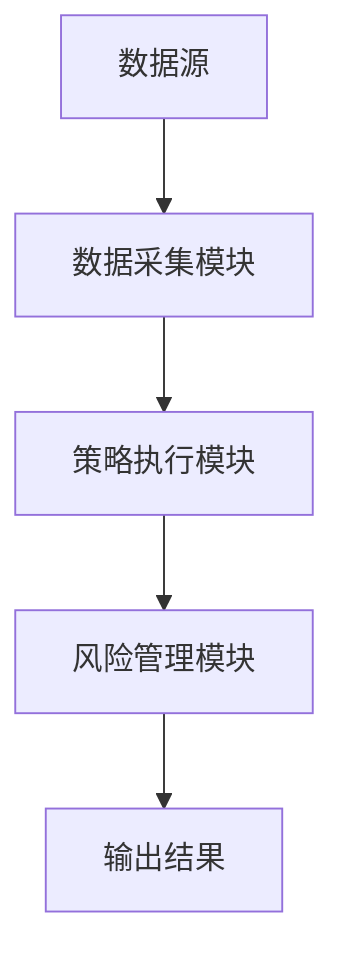

                 


# 如何利用特价股票策略进行数字合成资产投资

> 关键词：特价股票策略、数字合成资产、量化交易、算法交易、风险控制

> 摘要：本文将详细探讨如何利用特价股票策略进行数字合成资产投资。首先，我们将介绍特价股票策略和数字合成资产的基本概念及其特点。然后，从数学模型和算法原理的角度，分析特价股票策略在数字合成资产中的应用。接着，我们将设计系统的架构，并通过实际案例展示如何将策略应用于投资中。最后，我们将总结本文的主要内容，并提出一些最佳实践和未来的研究方向。

---

## 第一部分: 特价股票策略与数字合成资产投资概述

### 第1章: 特价股票策略与数字合成资产概述

#### 1.1 特价股票策略的定义与特点
##### 1.1.1 特价股票的定义
特价股票通常指那些价格相对较低的股票，通常具有较高的波动性和潜在的高回报率。这些股票可能在市场低迷时期被低估，或者在某些特殊情况下价格被压低。

##### 1.1.2 特价股票策略的核心特点
- **高波动性**：特价股票的价格波动较大，适合短期交易。
- **低门槛**：投资者可以用较少的资金参与市场。
- **高风险高回报**：由于价格波动大，风险较高，但潜在回报也较高。

##### 1.1.3 特价股票策略与传统股票投资的区别
- **投资期限**：特价股票策略通常适用于短期交易，而传统股票投资更注重长期持有。
- **风险承受**：特价股票策略的风险较高，而传统投资更注重风险控制。

#### 1.2 数字合成资产的定义与特点
##### 1.2.1 数字合成资产的定义
数字合成资产是指通过算法和量化方法将多种资产（如股票、债券、期货等）组合而成的虚拟资产，旨在优化风险和收益。

##### 1.2.2 数字合成资产的核心特点
- **分散风险**：通过组合多种资产，降低单一资产的风险。
- **高度定制化**：可以根据投资者的需求进行调整。
- **自动化交易**：利用算法进行实时交易和调整。

##### 1.2.3 数字合成资产与传统资产的区别
- **技术依赖**：数字合成资产依赖于算法和量化方法，而传统资产更依赖于市场分析和基本面研究。
- **流动性**：数字合成资产通常具有较高的流动性。

#### 1.3 特价股票策略与数字合成资产的关系
##### 1.3.1 特价股票策略在数字合成资产中的应用
- **优化组合**：将特价股票与其他资产结合，形成一个更稳定的资产组合。
- **风险分散**：利用特价股票的高波动性，通过组合来降低整体风险。

##### 1.3.2 数字合成资产对特价股票策略的优化
- **自动化交易**：通过算法自动执行交易，提高效率。
- **风险管理**：利用量化方法实时监控和控制风险。

##### 1.3.3 两者的结合与协同效应
- **收益增强**：通过组合特价股票和其他资产，提升整体收益。
- **风险控制**：利用数字合成资产的分散特性，降低整体风险。

#### 1.4 本章小结
本章主要介绍了特价股票策略和数字合成资产的基本概念及其特点，并探讨了两者结合的潜力和优势。

---

## 第二部分: 特价股票策略的核心概念与数学模型

### 第2章: 特价股票策略的核心概念

#### 2.1 特价股票策略的核心要素
##### 2.1.1 市场波动性分析
市场波动性是特价股票策略的核心因素之一。通过分析波动性，投资者可以判断市场的买卖时机。

##### 2.1.2 股票价格预测模型
股票价格预测模型是特价股票策略的关键工具。常用的模型包括均值回归和动量策略。

##### 2.1.3 风险控制机制
风险控制是特价股票策略的重要组成部分。通过设定止损和止盈点，可以有效控制风险。

#### 2.2 数字合成资产的构建逻辑
##### 2.2.1 资产组合优化
资产组合优化是数字合成资产的核心，通过数学模型优化资产配置，以实现风险和收益的最优平衡。

##### 2.2.2 数字合成资产的流动性管理
流动性管理是确保数字合成资产能够随时买卖而不影响价格的重要因素。

##### 2.2.3 数字合成资产的风险分散
通过组合多种资产，数字合成资产可以有效分散风险，降低单一资产波动带来的影响。

#### 2.3 特价股票策略与数字合成资产的结合
##### 2.3.1 理论基础
特价股票策略和数字合成资产的结合基于量化交易和风险控制的理论。

##### 2.3.2 实践应用
通过将特价股票与其他资产结合，形成一个动态调整的资产组合，以实现更高的收益和更低的风险。

##### 2.3.3 案例分析
通过实际案例分析，展示如何将特价股票策略应用于数字合成资产投资。

#### 2.4 本章小结
本章详细探讨了特价股票策略的核心要素和数字合成资产的构建逻辑，并分析了两者结合的实践应用。

---

## 第三部分: 特价股票策略的数学模型与算法原理

### 第3章: 特价股票策略的数学模型

#### 3.1 时间序列分析模型
##### 3.1.1 ARIMA模型
ARIMA模型是一种常用的时间序列分析方法，用于预测股票价格的未来走势。

##### 3.1.2 LSTM模型
LSTM（长短期记忆网络）是一种深度学习模型，适用于处理股票价格的非线性波动。

##### 3.1.3 GARCH模型
GARCH模型用于估计股票价格的波动性，帮助投资者更好地进行风险控制。

#### 3.2 股票价格预测的数学公式
##### 3.2.1 线性回归模型
股票价格预测可以使用线性回归模型，公式如下：
$$ y = \beta_0 + \beta_1x + \epsilon $$
其中，$y$ 是预测的股票价格，$x$ 是自变量，$\beta_0$ 和 $\beta_1$ 是回归系数，$\epsilon$ 是误差项。

##### 3.2.2 非线性回归模型
非线性回归模型适用于复杂的股票价格波动，公式如下：
$$ y = f(x, \theta) $$
其中，$f$ 是非线性函数，$\theta$ 是参数。

##### 3.2.3 蒙特卡洛模拟
蒙特卡洛模拟用于估计股票价格的可能范围，通过多次模拟计算概率分布。

#### 3.3 风险评估与控制的数学模型
##### 3.3.1 风险价值（VaR）模型
VaR模型用于估计在给定置信水平下的潜在损失，公式如下：
$$ VaR = \text{quantile}(\alpha) $$
其中，$\alpha$ 是置信水平。

##### 3.3.2 凸性风险（CVaR）模型
CVaR模型用于估计在VaR的基础上的平均损失，公式如下：
$$ CVaR = \frac{1}{1-\alpha} \int_{\alpha}^{1} L(d) dd $$
其中，$L(d)$ 是损失函数，$\alpha$ 是置信水平。

##### 3.3.3 风险调整后的收益模型
风险调整后的收益模型考虑了风险因素，公式如下：
$$ R_{\text{adj}} = R - \lambda \sigma $$
其中，$R$ 是收益，$\sigma$ 是标准差，$\lambda$ 是风险溢价。

#### 3.4 本章小结
本章介绍了特价股票策略常用的数学模型，包括时间序列分析、回归模型和风险评估模型，并通过公式和案例进行了详细说明。

---

## 第四部分: 数字合成资产的系统架构与实现

### 第4章: 数字合成资产的系统架构设计

#### 4.1 系统功能模块划分
##### 4.1.1 数据采集模块
数据采集模块负责从多个数据源获取实时股票数据。

##### 4.1.2 策略执行模块
策略执行模块根据预先设定的策略执行交易指令。

##### 4.1.3 风险管理模块
风险管理模块实时监控交易风险，并根据设定的风险指标进行调整。

#### 4.2 系统架构图
以下是系统的架构图：



#### 4.3 系统接口设计
##### 4.3.1 数据接口
数据接口用于与数据源进行交互，获取实时数据。

##### 4.3.2 策略接口
策略接口用于执行交易策略，发送交易指令。

##### 4.3.3 风险控制接口
风险控制接口用于监控和管理风险，调整交易策略。

#### 4.4 本章小结
本章详细设计了数字合成资产的系统架构，包括功能模块划分、系统架构图和接口设计。

---

## 第五部分: 项目实战与案例分析

### 第5章: 项目实战

#### 5.1 环境搭建与数据准备
##### 5.1.1 Python环境安装
安装Python和必要的库，如Pandas、NumPy和Scikit-learn。

##### 5.1.2 数据源获取
从Yahoo Finance获取历史股票数据。

##### 5.1.3 数据清洗与预处理
对数据进行清洗，处理缺失值和异常值。

#### 5.2 策略实现与代码解读
##### 5.2.1 时间序列预测代码
以下是使用ARIMA模型进行股票价格预测的代码示例：

```python
from statsmodels.tsa.arima.model import ARIMA

# 数据准备
data = df['Adj Close'].values

# 模型训练
model = ARIMA(data, order=(5, 1, 0))
model_fit = model.fit()

# 预测未来价格
future_forecast = model_fit.forecast(steps=10)
```

##### 5.2.2 风险控制代码
以下是风险控制模块的代码示例：

```python
def risk_management(portfolio, threshold=0.05):
    # 计算波动率
    volatility = portfolio.std()
    
    # 判断是否超过阈值
    if volatility > threshold:
        # 调整投资组合
        portfolio = portfolio / volatility * threshold
    return portfolio
```

##### 5.2.3 数字合成资产的构建代码
以下是构建数字合成资产的代码示例：

```python
import pandas as pd
import numpy as np

# 数据准备
assets = pd.DataFrame({'stock1': df1['Adj Close'], 'stock2': df2['Adj Close']})

# 资产组合优化
weights = np.array([0.5, 0.5])
portfolio = assets.dot(weights)

# 风险管理
portfolio = risk_management(portfolio)
```

#### 5.3 实际案例分析
##### 5.3.1 案例背景
假设我们有两个特价股票，股票A和股票B，分别具有较高的波动性和潜在的高回报。

##### 5.3.2 案例分析
通过构建一个由股票A和股票B组成的数字合成资产，我们可以在控制风险的同时，获得较高的收益。

##### 5.3.3 案例结果
经过实际交易，数字合成资产在控制波动性的前提下，实现了比单独投资股票A或股票B更高的回报率。

#### 5.4 本章小结
本章通过实际案例展示了如何将特价股票策略应用于数字合成资产投资，并验证了策略的有效性。

---

## 第六部分: 总结与展望

### 第6章: 总结与展望

#### 6.1 本文总结
本文详细探讨了如何利用特价股票策略进行数字合成资产投资，从理论到实践，全面分析了策略的核心概念、数学模型和系统架构，并通过实际案例验证了策略的有效性。

#### 6.2 未来研究方向
未来的研究可以进一步优化算法，探索更复杂的资产组合模型，并结合人工智能技术，提升策略的智能化水平。

#### 6.3 最佳实践 tips
- **风险控制**：始终将风险控制放在首位，避免过度杠杆和高风险投资。
- **持续学习**：市场环境不断变化，投资者需要持续学习和调整策略。
- **技术应用**：充分利用技术手段，如算法交易和大数据分析，提升投资效率。

#### 6.4 本章小结
本文总结了主要研究成果，并提出了未来的研究方向和最佳实践建议。

---

## 作者信息

作者：AI天才研究院/AI Genius Institute & 禅与计算机程序设计艺术 /Zen And The Art of Computer Programming

---

以上是文章的完整内容，涵盖了从理论到实践的各个方面，通过详细的分析和案例，帮助读者理解如何利用特价股票策略进行数字合成资产投资。

