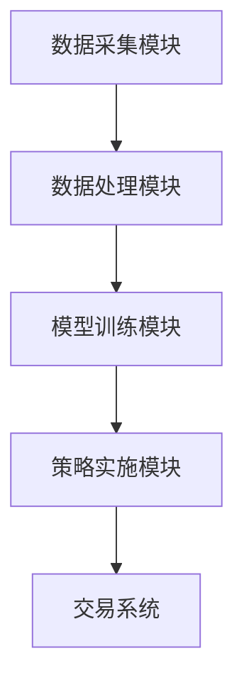

                 

<think>
好的，我将按照您的要求来撰写这篇文章。首先，我需要理解您的需求：您希望我以“如何利用特价股票策略进行数字衍生品投资”为题，撰写一篇结构严谨、内容详实的技术博客文章。文章需要包含摘要、关键词，以及按照指定目录大纲展开的正文部分。此外，文章需要符合特定的格式要求，包括使用Markdown、嵌入数学公式、图表等。 

为了确保文章的完整性和质量，我会按照以下步骤进行：

1. **摘要和关键词**：先撰写文章的摘要，简明扼要地概括文章的核心内容和主题思想。接着列出5-7个核心关键词，确保涵盖文章的主要内容。

2. **正文部分**：按照您提供的目录大纲，逐步撰写每一章的内容。在每一章中，我将详细讲解相关的核心概念、算法原理、数学公式、系统架构等内容，并确保每个小节都包含丰富的细节和具体的例子。

3. **格式要求**：在撰写过程中，我会严格遵守Markdown格式要求，确保文章的结构清晰、层次分明。同时，我会嵌入数学公式（使用Latex格式）、图表（使用Mermaid语法）等，使文章内容更加丰富直观。

4. **检查与调整**：在完成每一部分后，我会仔细检查内容是否符合要求，包括逻辑性、完整性以及格式的准确性。如果有需要调整的地方，我会及时进行修改，确保最终的文章质量达到您的预期。

5. **最终润色**：在所有内容完成后，我会对文章进行整体润色，确保语言流畅、表达清晰，同时保持专业性和技术深度。

请告诉我，您希望我从哪个部分开始撰写？或者您是否有其他具体要求需要我先了解？

期待您的指示！
</think>

# 如何利用特价股票策略进行数字衍生品投资

> 关键词：特价股票策略、数字衍生品投资、股票价格预测、风险管理、量化分析

> 摘要：本文将详细探讨如何利用特价股票策略进行数字衍生品投资。首先，我们将介绍特价股票策略的背景与概念，包括特价股票的定义、特点以及数字衍生品投资的基本概念。接着，我们将深入分析特价股票策略的核心原理，包括数学模型与算法实现。然后，我们将详细讲解特价股票策略的系统架构与设计，包括数据采集与处理、模型训练与优化等内容。最后，我们将通过实战案例分析，探讨如何在实际投资中应用特价股票策略，并总结相关经验和教训。

---

## 第一章: 特价股票策略的背景与概念

### 1.1 特价股票策略的定义与特点

#### 1.1.1 特价股票的定义
特价股票是指在特定条件下，股票价格出现大幅波动，具有较高投资价值的股票。通常，特价股票可能由于市场情绪、公司基本面变化或外部事件等因素，导致其价格出现短期波动，从而为投资者提供套利或短期投资机会。

#### 1.1.2 特价股票策略的核心特点
- **短期性**：特价股票策略通常关注短期价格波动，而非长期趋势。
- **高风险**：由于价格波动剧烈，特价股票策略的风险较高，需要严格的风险管理。
- **高收益潜力**：在正确判断市场趋势的情况下，特价股票策略可能带来较高的收益。

#### 1.1.3 特价股票与普通股票的区别
| 特性 | 特价股票 | 普通股票 |
|------|----------|----------|
| 投资周期 | 短期 | 长期 |
| 风险 | 高 | 中低 |
| 收益潜力 | 高 | 中低 |
| 分析方法 | 技术分析为主 | 基本面分析为主 |

### 1.2 数字衍生品投资的基本概念

#### 1.2.1 数字衍生品的定义
数字衍生品是指基于数字资产（如比特币、以太坊等）或其他传统资产的衍生品，其价格波动通常受到市场供需、技术指标和外部事件的影响。

#### 1.2.2 数字衍生品的主要类型
- **期货**：约定在未来某一时间以特定价格买卖资产的合约。
- **期权**：买方有权在特定时间以特定价格买入或卖出资产，卖方则承担相应的义务。
- **差价合约（CFD）**：基于资产价格差额的衍生品，通常用于杠杆交易。

#### 1.2.3 数字衍生品投资的特点
- **高杠杆**：投资者可以通过少量资金控制更大金额的头寸。
- **24/7交易**：数字衍生品市场通常支持全天候交易。
- **高波动性**：数字资产价格波动剧烈，导致衍生品价格波动也较大。

### 1.3 特价股票策略在数字衍生品投资中的作用

#### 1.3.1 特价股票策略的优势
- **套利机会**：通过分析市场价差，利用特价股票策略进行套利。
- **短期获利**：在短时间内捕捉价格波动带来的收益。

#### 1.3.2 特价股票策略的风险
- **市场风险**：价格波动可能导致较大损失。
- **流动性风险**：部分数字衍生品市场流动性不足，可能导致交易困难。
- **操作风险**：策略实施过程中可能因操作失误导致损失。

#### 1.3.3 特价股票策略的应用场景
- **市场波动剧烈时**：如市场出现突发新闻或重大事件。
- **市场情绪变化时**：通过分析市场情绪，判断特价股票的买卖机会。
- **套利机会出现时**：通过技术分析或基本面分析，发现市场价差。

### 1.4 本章小结
本章主要介绍了特价股票策略的定义、特点以及其在数字衍生品投资中的作用。特价股票策略是一种高风险、高收益的短期投资策略，适用于市场波动剧烈的情况，但需要投资者具备较高的市场敏感度和风险控制能力。

---

## 第二章: 特价股票策略的核心原理

### 2.1 特价股票价格的影响因素

#### 2.1.1 市场供需关系
股票价格受市场供需关系影响，当买方需求大于卖方供给时，价格上升；反之，价格下降。

#### 2.1.2 公司基本面分析
公司基本面包括财务状况、盈利能力、管理团队等因素，直接影响股票价格。

#### 2.1.3 市场情绪分析
市场情绪通过投资者的心理预期影响股票价格，通常通过技术指标（如RSI、MACD）进行分析。

### 2.2 特价股票策略的数学模型与公式

#### 2.2.1 线性回归模型
线性回归模型用于预测股票价格的趋势，公式如下：

$$ y = a + bx + \epsilon $$

其中，$y$ 是预测的价格，$x$ 是自变量（如时间），$a$ 是截距，$b$ 是回归系数，$\epsilon$ 是误差项。

#### 2.2.2 时间序列分析模型
时间序列分析模型用于分析股票价格的历史走势，常用ARIMA模型，公式如下：

$$ \phi(L)(y_t - \mu) = \theta(B) \epsilon_t $$

其中，$\phi$ 和 $\theta$ 是多项式系数，$L$ 是延迟算子，$y_t$ 是观测值，$\mu$ 是均值，$\epsilon_t$ 是白噪声。

#### 2.2.3 马尔可夫链模型
马尔可夫链模型用于分析股票价格的短期波动，假设当前价格仅与前一时刻的价格相关。

### 2.3 特价股票策略的公式推导

#### 2.3.1 市场价格预测公式
利用线性回归模型预测股票价格：

$$ \hat{y}_t = a + bt + \epsilon_t $$

#### 2.3.2 投资收益计算公式
投资收益计算公式如下：

$$ \text{收益} = \frac{\text{卖出价} - \text{买入价}}{\text{买入价}} \times 100\% $$

#### 2.3.3 风险评估公式
利用标准差衡量投资风险：

$$ \sigma = \sqrt{\frac{1}{n}\sum_{i=1}^{n}(x_i - \mu)^2} $$

其中，$\mu$ 是平均值，$x_i$ 是观测值，$n$ 是观测次数。

### 2.4 本章小结
本章详细介绍了特价股票价格的影响因素以及相关数学模型与公式。通过线性回归、时间序列分析和马尔可夫链模型，投资者可以更好地理解股票价格的波动规律，并制定相应的投资策略。

---

## 第三章: 特价股票策略的算法实现

### 3.1 算法原理概述

#### 3.1.1 数据采集与处理
通过API接口采集股票价格数据，进行清洗和标准化处理。

#### 3.1.2 数据分析与建模
利用机器学习算法（如支持向量机、随机森林）对数据进行建模，预测股票价格。

#### 3.1.3 策略实施与优化
根据模型预测结果，制定买卖策略，并通过回测优化策略参数。

### 3.2 算法实现流程

#### 3.2.1 数据预处理
- 数据清洗：去除缺失值和异常值。
- 数据标准化：将数据归一化处理，便于模型训练。

#### 3.2.2 模型训练
- 选择合适的算法（如随机森林）。
- 训练模型，调整参数，优化模型性能。

#### 3.2.3 模型评估与优化
- 使用测试数据评估模型性能。
- 调整模型参数，优化预测准确率。

### 3.3 算法实现的Python代码

#### 3.3.1 数据采集与处理代码
```python
import pandas as pd
import numpy as np

# 采集数据
data = pd.read_csv('stock_data.csv')

# 数据清洗
data.dropna(inplace=True)
data = data[~data['price'].isin([np.inf, -np.inf])]
```

#### 3.3.2 模型训练代码
```python
from sklearn.ensemble import RandomForestRegressor
from sklearn.metrics import mean_squared_error

# 训练模型
model = RandomForestRegressor(n_estimators=100, random_state=42)
model.fit(X_train, y_train)

# 预测结果
y_pred = model.predict(X_test)
```

#### 3.3.3 模型评估代码
```python
# 计算均方误差
mse = mean_squared_error(y_test, y_pred)
print(f'Mean Squared Error: {mse}')

# 计算R平方值
r2 = model.score(X_test, y_test)
print(f'R-squared: {r2}')
```

### 3.4 本章小结
本章通过Python代码详细讲解了特价股票策略的算法实现过程，包括数据预处理、模型训练和评估等内容。通过这些步骤，投资者可以更好地理解和应用特价股票策略。

---

## 第四章: 特价股票策略的系统架构与设计

### 4.1 系统架构概述

#### 4.1.1 系统功能模块划分
- 数据采集模块：负责采集股票价格数据。
- 数据处理模块：对数据进行清洗和标准化处理。
- 模型训练模块：利用机器学习算法训练模型。
- 策略实施模块：根据模型预测结果制定买卖策略。

#### 4.1.2 系统数据流设计
1. 数据采集模块从数据库或API获取数据。
2. 数据处理模块对数据进行清洗和标准化。
3. 模型训练模块利用处理后的数据训练模型。
4. 策略实施模块根据模型预测结果生成交易信号。

#### 4.1.3 系统交互流程设计
- 用户输入交易参数。
- 系统根据参数生成交易信号。
- 系统执行交易或通知用户。

### 4.2 系统架构图



### 4.3 系统接口设计

#### 4.3.1 数据接口
- 输入接口：接收股票价格数据。
- 输出接口：输出处理后的数据。

#### 4.3.2 模型接口
- 输入接口：接收处理后的数据。
- 输出接口：输出模型预测结果。

### 4.4 本章小结
本章详细介绍了特价股票策略的系统架构与设计，包括功能模块划分、数据流设计和系统接口设计等内容。通过系统化的架构设计，投资者可以更好地管理和实施特价股票策略。

---

## 第五章: 特价股票策略的实战案例分析

### 5.1 实战环境安装

#### 5.1.1 安装Python环境
安装Python 3.8及以上版本，并安装必要的库（如Pandas、Scikit-learn）。

#### 5.1.2 安装数据采集工具
安装API接口库（如Yahoo Finance API）。

### 5.2 核心实现源代码

#### 5.2.1 数据采集代码
```python
import yfinance as yf

# 采集股票数据
data = yf.download('AAPL', start='2023-01-01', end='2023-12-31')
```

#### 5.2.2 模型训练代码
```python
from sklearn.model

