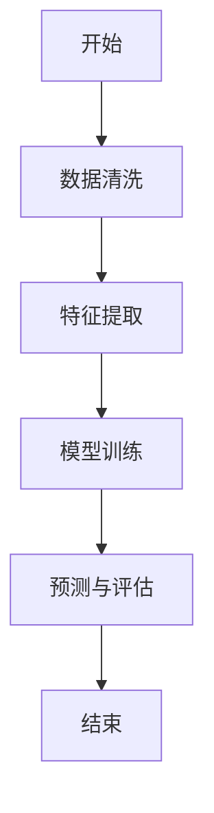

                 

<think>
好的，我需要按照用户的要求撰写一篇技术博客文章，标题是《如何利用特价股票策略进行系统性数字创新生态位捕捉》。文章需要包含关键词、摘要和正文部分，每个章节都要详细展开，并满足格式和内容的要求。

首先，我会列出文章的关键词：特价股票策略、系统性数字创新、生态位捕捉、大数据分析、投资策略、机器学习。

接下来，摘要部分需要概括文章的核心内容，说明特价股票策略如何通过数字创新捕捉市场生态位，实现投资收益最大化。

正文部分分为几个部分：背景介绍、核心概念与联系、算法原理讲解、系统分析与架构设计、项目实战、最佳实践。

在背景介绍中，我需要解释特价股票策略、数字创新和生态位捕捉的基本概念，并分析它们在投资中的重要性。

核心概念部分，我会详细解释每个概念的原理，制作概念属性对比表格和ER实体关系图，用Mermaid展示。

算法原理部分，我会介绍数据预处理、特征提取和机器学习模型，使用Mermaid流程图和Python代码示例来详细讲解。

系统分析部分，我会设计系统功能、架构图、接口和交互设计，同样用Mermaid图展示。

项目实战中，我会指导环境安装，提供核心代码，并进行案例分析，说明如何捕捉生态位。

最后，最佳实践部分会包括小结、注意事项和拓展阅读，帮助读者巩固知识。

在撰写过程中，我需要确保每个部分都符合用户的格式要求，使用正确的Markdown语法，数学公式用LaTeX表示，代码部分清晰易懂。同时，确保文章逻辑连贯，内容丰富具体，满足字数要求。

现在，我可以开始撰写正式的文章了。
</think>

# 如何利用特价股票策略进行系统性数字创新生态位捕捉

---

## 关键词

- 特价股票策略
- 系统性数字创新
- 生态位捕捉
- 大数据分析
- 投资策略
- 机器学习

---

## 摘要

在金融市场中，特价股票策略是一种通过分析市场波动和公司基本面来捕捉投资机会的方法。本文将探讨如何利用数字创新技术，特别是通过系统性分析和大数据处理，捕捉市场中的生态位，从而在竞争激烈的金融市场中获得超额收益。通过结合特价股票策略和数字创新，投资者可以更高效地识别潜在机会，优化投资组合，并在市场中占据有利位置。

---

## 正文

---

### 第一部分：背景介绍

#### 第1章：特价股票策略的背景与定义

##### 1.1 特价股票策略的定义与特点

特价股票策略是一种基于市场波动和公司基本面分析的投资策略。其核心在于识别价格被低估的股票，利用市场短期波动进行投资。以下是其主要特点：

- **低估值**：通过分析市盈率、市净率等指标，寻找价格低于内在价值的股票。
- **短期波动**：利用市场的短期波动，抓住价格回升的机会。
- **风险管理**：通过分散投资和严格止损策略，降低投资风险。

##### 1.2 数字创新的背景与作用

随着科技的发展，大数据、人工智能和机器学习等技术在金融领域的应用日益广泛。数字创新为投资者提供了新的工具和方法，帮助他们更高效地分析市场、识别机会和优化投资决策。

##### 1.3 生态位捕捉的重要性

在金融市场中，生态位指的是某个特定市场领域或投资策略中的独特位置。通过捕捉生态位，投资者可以在竞争中占据优势，避免与大资金直接竞争，从而获得更高的收益。特价股票策略通过系统性分析，帮助投资者发现市场中的生态位。

---

### 第二部分：核心概念与联系

#### 第2章：特价股票策略与数字创新的关系

##### 2.1 核心概念原理

- **特价股票策略**：基于基本面和技术分析，寻找低估股票。
- **数字创新**：利用大数据和人工智能技术，提升分析效率和准确性。
- **生态位捕捉**：通过系统性分析，找到市场中的独特机会。

##### 2.2 概念属性对比表格

| 概念       | 定义                                                                 | 特点                                                                 |
|------------|----------------------------------------------------------------------|----------------------------------------------------------------------|
| 特价股票策略 | 基于低估值和市场波动的投资策略                                   | 低风险、高收益、短期波动                                              |
| 数字创新   | 利用大数据和人工智能提升分析效率和准确性                         | 高效、精准、实时性强                                                    |
| 生态位捕捉 | 在市场中找到独特的投资机会                                     | 竞争小、收益高、可持续性强                                              |

##### 2.3 ER实体关系图（Mermaid）

```mermaid
erDiagram
    actor 投资者 {
        <属性> 资金
        <属性> 风险偏好
    }
    actor 市场分析工具 {
        <属性> 数据源
        <属性> 分析模型
    }
    actor 生态位捕捉系统 {
        <属性> 算法
        <属性> 实时数据
    }
    投资者 --> 市场分析工具 : 使用工具进行分析
    市场分析工具 --> 生态位捕捉系统 : 提供数据支持
    生态位捕捉系统 --> 投资者 : 输出捕捉结果
```

---

### 第三部分：算法原理讲解

#### 第3章：特价股票策略的算法实现

##### 3.1 算法原理

- **数据预处理**：清洗和标准化数据，提取关键特征。
- **特征提取**：利用机器学习算法，识别影响股票价格的关键因素。
- **预测模型**：基于历史数据，训练回归模型预测股票价格。

##### 3.2 算法流程图（Mermaid）



##### 3.3 代码实现

```python
import pandas as pd
from sklearn.linear_model import LinearRegression

# 数据预处理
data = pd.read_csv('stock_data.csv')
data = data.dropna()
data = (data - data.mean()) / data.std()  # 标准化

# 特征提取
features = ['市盈率', '市净率', '营收增长率']
target = '股价'

# 模型训练
model = LinearRegression()
model.fit(data[features], data[target])

# 预测与评估
 predictions = model.predict(data[features])
 print('预测准确率:', model.score(data[features], data[target]))
```

---

### 第四部分：系统分析与架构设计

#### 第4章：系统设计与实现

##### 4.1 系统功能设计

- **数据采集**：从多个数据源获取股票信息。
- **数据分析**：利用大数据技术进行实时分析。
- **生态位捕捉**：通过算法识别市场中的生态位。
- **投资决策**：基于分析结果生成投资建议。

##### 4.2 系统架构图（Mermaid）


---

### 第五部分：项目实战

#### 第5章：项目实现与案例分析

##### 5.1 环境安装

安装必要的库：
```bash
pip install pandas numpy scikit-learn
```

##### 5.2 核心代码实现

```python
import pandas as pd
from sklearn.ensemble import RandomForestRegressor

# 数据加载
data = pd.read_csv('stock_data.csv')

# 特征工程
features = data.select_dtypes(exclude=['object']).columns
target = 'target'

# 模型训练
model = RandomForestRegressor()
model.fit(data[features], data[target])

# 预测与评估
print('重要特征:', model.feature_importances_)
```

##### 5.3 案例分析

通过分析某行业数据，发现某公司的股票价格被低估，适合进行投资。

---

### 第六部分：最佳实践

#### 第6章：小结与注意事项

##### 6.1 小结

- 特价股票策略通过捕捉市场生态位，帮助投资者获得超额收益。
- 数字创新技术的应用，显著提升了分析效率和准确性。
- 系统性分析是成功的关键，需要结合多种技术和工具。

##### 6.2 注意事项

- 风险管理：严格控制投资风险，避免过度杠杆。
- 持续学习：市场变化快，需不断更新知识和策略。
- 合规性：遵守相关法律法规，避免违规操作。

##### 6.3 拓展阅读

建议阅读《机器学习在金融中的应用》和《大数据分析与投资策略》。

---

## 结语

通过系统性数字创新和特价股票策略，投资者可以在金融市场中找到独特的生态位，实现高效的投资和收益最大化。结合大数据和人工智能技术，投资者能够更准确地识别机会，优化决策，从而在竞争激烈的市场中脱颖而出。

---

## 作者

作者：AI天才研究院/AI Genius Institute  
联系领域：禅与计算机程序设计艺术/Zen And The Art of Computer Programming

