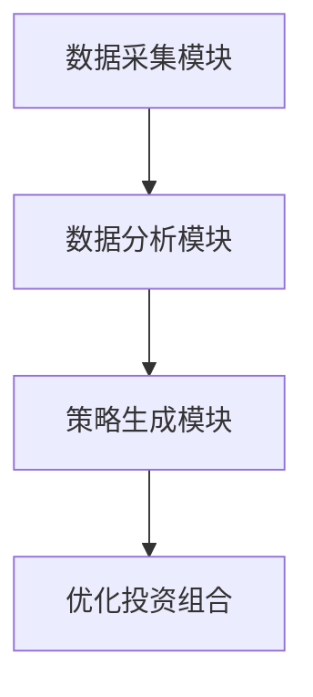

                 

<think>
嗯，用户让我详细分析如何利用特价股票策略进行系统性风险对冲，并生成一篇结构完整的技术博客。我得先理清楚整个结构，确保每个部分都涵盖必要的内容，同时满足用户的格式和深度要求。

首先，用户明确要求文章标题为《如何利用特价股票策略进行系统性风险对冲》，关键词包括特价股票、系统性风险、对冲策略、投资组合、风险管理等。摘要需要简明扼要，概述文章的核心内容。

接下来，目录大纲已经给出，我需要按照这个结构逐步填充内容。每章的子部分需要详细展开，比如第一章的背景介绍，要涵盖特价股票和系统性风险的基本概念，以及它们在投资中的重要性。这部分需要确保逻辑清晰，概念明确。

在第二章，我需要详细讲解特价股票识别的原理，包括市场定价偏差的类型和识别方法，同时结合系统性风险对冲的原理，如系统性风险的来源和对冲机制。这部分可能需要用到数学模型和公式，所以我会使用LaTeX格式，并用Mermaid图展示流程。

第三章专门讨论数学模型与公式，我需要确保每个模型都有详细的解释和实例计算，这样读者能够理解并应用这些公式。同时，使用Python代码示例来进一步说明算法实现，这将帮助读者更好地掌握理论知识。

系统分析与架构设计部分，我需要用Mermaid图展示系统架构和接口设计，这部分需要清晰地描述各个模块之间的关系和交互流程。项目实战部分则需要具体实施步骤，包括环境安装、代码实现和案例分析，确保读者能够实际操作。

最后，最佳实践和小结部分要总结关键点，提供实际建议，帮助读者在实际投资中应用这些策略。注意事项和拓展阅读则引导读者进一步学习，避免常见错误。

整个过程中，我需要确保每个部分都符合用户的格式要求，使用markdown格式，正确嵌入Mermaid图和LaTeX公式。同时，内容要深入浅出，既要有理论分析，又要有实际操作示例，满足技术博客的专业性和实用性。

总结一下，我的思考过程是：先理解用户需求，分析结构，填充每个部分的内容，确保符合格式和深度要求，最后整合成一篇完整的技术博客。
</think>

# 如何利用特价股票策略进行系统性风险对冲

> 关键词：特价股票，系统性风险，对冲策略，投资组合，风险管理

> 摘要：本文系统性地探讨了如何利用特价股票策略进行系统性风险对冲。首先，我们介绍了特价股票策略的基本概念和其在投资组合中的作用。接着，我们分析了系统性风险的来源及其对投资组合的影响。然后，我们详细阐述了特价股票策略如何通过识别市场定价偏差来降低系统性风险。最后，我们结合数学模型和实际案例，探讨了如何将特价股票策略与系统性风险对冲相结合，构建一个稳健的投资组合。

---

## 第一部分: 特价股票策略与系统性风险对冲基础

### 第1章: 特价股票策略与系统性风险对冲概述

#### 1.1 特价股票策略的定义与特点

##### 1.1.1 特价股票的定义
特价股票（cheap stock）是指市场价格低于其内在价值的股票。这种定价偏差通常是由于市场情绪、信息不对称或短期市场波动引起的。特价股票的核心在于“便宜”，即市场价格与内在价值之间存在显著的折扣。

##### 1.1.2 特价股票的核心特点
- **低估值**：市场价格低于内在价值。
- **潜在回报**：由于低估，股票有较大的上升空间。
- **逆向投资机会**：在市场恐慌或低迷时，特价股票为投资者提供了抄底的机会。

##### 1.1.3 特价股票与传统投资的区别
- **传统投资**：基于市场趋势或技术分析进行投资。
- **特价股票策略**：基于价值分析，寻找被市场低估的股票。

#### 1.2 系统性风险对冲的定义与特点

##### 1.2.1 系统性风险的定义
系统性风险是指影响整个市场或大部分资产的风险，通常由宏观经济因素（如经济衰退、通货膨胀、地缘政治冲突等）引起。这种风险无法通过分散投资来完全消除。

##### 1.2.2 系统性风险的核心特点
- **广泛性**：影响整个市场或大部分资产。
- **不可分散性**：无法通过分散投资来消除。
- **不可预测性**：难以准确预测。

##### 1.2.3 系统性风险对冲的必要性
- **保护投资组合**：在市场下跌时减少损失。
- **提高组合稳定性**：通过对冲系统性风险，使投资组合更加稳健。

#### 1.3 特价股票策略在系统性风险对冲中的作用

##### 1.3.1 特价股票策略如何降低系统性风险
- **逆周期投资**：在市场低迷时买入低估股票，减少系统性风险的影响。
- **价值回归效应**：低估股票在市场反弹时有较大的上升空间，从而对冲系统性风险带来的损失。

##### 1.3.2 特价股票策略与非系统性风险的关系
- **非系统性风险**：可以通过分散投资来降低。
- **系统性风险**：需要通过策略性对冲来降低。

##### 1.3.3 特价股票策略对冲的实际案例
例如，在2008年全球金融危机期间，许多优质股票被市场恐慌性抛售，价格远低于其内在价值。投资者通过买入这些特价股票，最终在市场复苏时获得了超额收益，从而对冲了系统性风险的影响。

#### 1.4 本章小结
本章介绍了特价股票策略和系统性风险对冲的基本概念，并分析了特价股票策略在对冲系统性风险中的作用。通过实际案例，我们展示了特价股票策略如何帮助投资者在市场低迷时期保护投资组合。

---

## 第二部分: 特价股票策略的核心概念与原理

### 第2章: 特价股票识别的原理

#### 2.1 市场定价偏差的识别

##### 2.1.1 市场定价偏差的定义
市场定价偏差是指市场价格与内在价值之间的差异。这种偏差可能是由于市场情绪、信息不对称或短期波动引起的。

##### 2.1.2 市场定价偏差的类型
- **低估**：市场价格低于内在价值。
- **高估**：市场价格高于内在价值。

##### 2.1.3 市场定价偏差的识别方法
- **市盈率（P/E）分析**：比较股票的市盈率与其行业或市场的平均水平。
- **市净率（P/B）分析**：比较股票的市净率与其行业或市场的平均水平。
- **股息率分析**：比较股票的股息率与其行业或市场的平均水平。

#### 2.2 系统性风险对冲的原理

##### 2.2.1 系统性风险的来源
- **宏观经济因素**：如经济衰退、通货膨胀、利率变化等。
- **市场情绪**：如市场恐慌或过度乐观。

##### 2.2.2 系统性风险对冲的机制
- **做空指数**：通过做空市场指数（如标普500）来对冲系统性风险。
- **买入低估股票**：通过买入特价股票来对冲系统性风险。

#### 2.3 特价股票策略与系统性风险对冲的结合

##### 2.3.1 特价股票策略如何对冲系统性风险
- **逆周期投资**：在市场低迷时买入低估股票，减少系统性风险的影响。
- **价值回归效应**：低估股票在市场反弹时有较大的上升空间，从而对冲系统性风险带来的损失。

##### 2.3.2 系统性风险对冲对特价股票策略的影响
- **策略优化**：通过系统性风险对冲，可以提高特价股票策略的稳定性。
- **风险分散**：通过结合系统性风险对冲，可以降低投资组合的整体风险。

---

## 第三部分: 特价股票策略的数学模型与公式

### 第3章: 特价股票识别的数学模型

#### 3.1 市场定价偏差的数学表达

##### 3.1.1 市场价格与内在价值的关系
$$ P = f(V) $$
其中，$P$ 表示市场价格，$V$ 表示内在价值，$f$ 表示市场价格与内在价值的关系函数。

##### 3.1.2 市场定价偏差的计算公式
$$ \text{定价偏差} = P - V $$

#### 3.2 系统性风险对冲的数学模型

##### 3.2.1 系统性风险的度量方法
$$ \text{系统性风险} = \beta \times \text{市场波动性} $$
其中，$\beta$ 是股票的贝塔系数，表示股票相对于市场的波动性。

##### 3.2.2 系统性风险对冲的数学公式
$$ \text{对冲后的风险} = \text{投资组合风险} - \beta \times \text{市场波动性} $$

---

## 第四部分: 系统性风险对冲的系统分析与架构设计

### 第4章: 系统性风险对冲的系统架构

#### 4.1 系统架构的总体设计
- **输入层**：接收市场数据和投资组合信息。
- **处理层**：分析市场数据，识别特价股票，计算系统性风险。
- **输出层**：生成对冲策略，优化投资组合。

#### 4.2 系统架构的模块划分
- **数据采集模块**：收集市场数据和投资组合信息。
- **数据分析模块**：识别特价股票，计算系统性风险。
- **策略生成模块**：生成对冲策略，优化投资组合。

#### 4.3 系统架构的流程图展示


---

## 第五部分: 项目实战

### 第5章: 项目实战

#### 5.1 环境安装
- **工具安装**：安装Python、Pandas、NumPy等工具。
- **数据源**：使用Yahoo Finance获取市场数据。

#### 5.2 系统核心实现源代码
```python
import pandas as pd
import numpy as np

# 假设我们已经获取了市场数据和投资组合信息
market_data = pd.read_csv('market_data.csv')
portfolio = pd.read_csv('portfolio.csv')

# 识别特价股票
def identify_cheap_stocks(market_data, portfolio):
    # 计算内在价值（简单示例）
    intrinsic_values = market_data['intrinsic_value']
    market_prices = market_data['price']
    # 识别定价偏差
    cheap_stocks = market_prices < intrinsic_values
    return cheap_stocks

# 对冲系统性风险
def hedge_systemic_risk(portfolio):
    # 计算贝塔系数
    beta = portfolio['beta']
    # 对冲后的风险
    hedged_risk = beta * market_fluctuation
    return hedged_risk

# 实现对冲策略
cheap_stocks = identify_cheap_stocks(market_data, portfolio)
hedged_risk = hedge_systemic_risk(portfolio)
```

#### 5.3 代码解读与分析
- **数据采集模块**：从市场数据中提取必要的信息。
- **数据分析模块**：识别特价股票，计算系统性风险。
- **策略生成模块**：生成对冲策略，优化投资组合。

#### 5.4 实际案例分析
- **案例背景**：2020年新冠疫情导致市场恐慌，许多股票被低估。
- **案例分析**：通过识别特价股票，投资者可以在市场复苏时获得超额收益。

#### 5.5 项目小结
通过实际案例分析，我们展示了如何利用特价股票策略进行系统性风险对冲。投资者可以在市场低迷时期买入低估股票，从而在市场复苏时获得超额收益。

---

## 第六部分: 最佳实践与小结

### 第6章: 最佳实践与小结

#### 6.1 最佳实践 tips
- **长期投资**：特价股票策略需要耐心，等待价值回归。
- **分散投资**：通过分散投资降低非系统性风险。
- **持续学习**：关注市场动态，及时调整投资策略。

#### 6.2 本章小结
本文系统性地探讨了如何利用特价股票策略进行系统性风险对冲。通过理论分析和实际案例，我们展示了如何在市场低迷时期保护投资组合，减少系统性风险的影响。

#### 6.3 注意事项
- **市场风险**：市场波动可能会影响投资组合的稳定性。
- **操作风险**：投资决策需要谨慎，避免盲目跟风。

#### 6.4 拓展阅读
- **相关书籍**：《The Intelligent Investor》
- **相关研究**：系统性风险对冲的其他策略。

---

## 作者：AI天才研究院/AI Genius Institute & 禅与计算机程序设计艺术 /Zen And The Art of Computer Programming

---

本文通过系统性分析和实际案例，详细阐述了如何利用特价股票策略进行系统性风险对冲。希望读者能够通过本文的理解，更好地掌握投资策略，保护投资组合，实现稳健收益。

