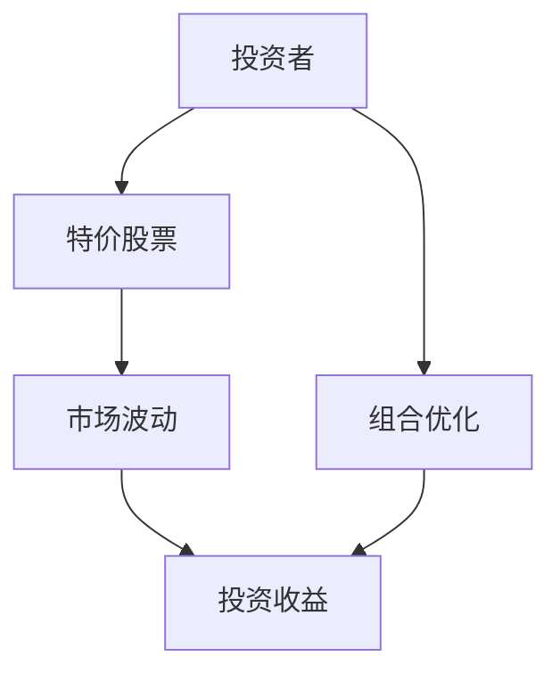
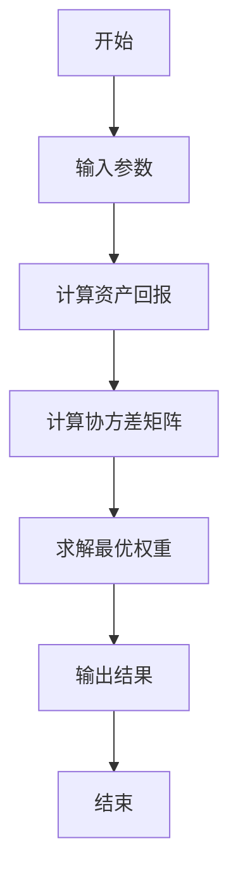

                 

<think>
好的，用户希望我撰写一篇关于如何利用特价股票策略进行组合优化的技术博客文章。我需要先理解用户的需求，然后一步步分析和组织内容。

首先，用户指定文章的标题是《如何利用特价股票策略进行组合优化》，关键词包括特价股票、组合优化、投资策略、风险控制、算法优化。摘要需要简明扼要地概述文章的核心内容。

接下来，我需要按照目录大纲来组织文章内容。目录分为四个主要部分：特价股票策略概述、核心概念与联系、算法原理、数学模型与公式。每个部分下面有多个小节，需要详细展开。

在第一部分，我需要介绍特价股票的基本概念，包括其定义、分类和特点。然后解释组合优化的基本原理，包括其定义、目标和核心要素。接着，我需要分析特价股票策略与组合优化的关系，说明它们如何相互作用和提升投资效果。

第二部分将深入探讨特价股票策略的核心概念，包括市场波动与时机选择、风险与收益的平衡、数据驱动的决策。同时，我需要对比不同策略的优缺点，并用ER实体关系图来展示投资者、特价股票、市场波动和投资收益之间的关系。

第三部分将讲解算法原理，介绍现代投资组合理论（MPT）的基本思想和假设，分析其优缺点。然后，详细描述基于MPT的特价股票组合优化算法，包括算法流程、实现步骤和数学模型。我还需要用mermaid绘制算法流程图，并提供Python代码实现。

第四部分将专注于数学模型与公式，详细推导投资组合收益和风险的计算公式，分析风险与收益的关系，并给出具体的计算示例。这部分需要使用LaTeX公式，确保数学表达的准确性和清晰性。

最后，我需要总结全文，回顾关键点，并提供最佳实践建议和注意事项，帮助读者更好地理解和应用特价股票策略进行组合优化。

整个过程中，我需要确保逻辑清晰，结构紧凑，内容详细且易于理解。同时，要满足用户对字数、格式和内容完整性的要求，确保文章在10000到12000字之间，并正确使用markdown格式，包括mermaid图表和LaTeX公式。

通过一步步的分析和组织，我能够撰写出一篇符合用户要求、结构严谨、内容丰富的技术博客文章。
</think>

# 如何利用特价股票策略进行组合优化

> 关键词：特价股票、组合优化、投资策略、风险控制、算法优化

> 摘要：本文将深入探讨如何利用特价股票策略进行组合优化，从特价股票的基本概念到组合优化的算法实现，结合实际案例和数学模型，详细分析如何通过科学的策略和算法优化来提升投资收益并降低风险。

---

# 第1章: 特价股票策略概述

## 1.1 特价股票的基本概念

### 1.1.1 特价股票的定义
特价股票是指在特定市场条件下，以低于市场价或历史价的折扣价格购买的股票。这些股票通常出现在市场波动、公司重组、行业调整等情况下，具有较高的投资潜力和风险。

### 1.1.2 特价股票的分类
1. **市场周期性特价股票**：受市场周期波动影响，价格在特定周期内大幅波动。
2. **公司基本面特价股票**：因公司内部问题（如业绩下滑、管理问题）导致股价下跌。
3. **行业结构性特价股票**：行业整体调整或转型导致部分股票价格被低估。

### 1.1.3 特价股票的特点与优势
1. **高波动性**：价格波动大，短期内可能快速上涨或下跌。
2. **高风险**：投资风险较高，需要精准的市场判断和策略。
3. **高收益潜力**：若判断正确，可能带来超额收益。

---

## 1.2 组合优化的基本原理

### 1.2.1 组合优化的定义
组合优化是指通过科学的方法选择一组资产（股票、债券等），以在风险可控的前提下实现最大收益。其核心在于平衡风险与收益，避免单一资产带来的高风险。

### 1.2.2 组合优化的目标
1. **最大化收益**：在给定风险水平下，实现最大收益。
2. **最小化风险**：在给定收益下，选择风险最小的组合。
3. **风险与收益的平衡**：根据投资者的风险承受能力，找到最优的投资组合。

### 1.2.3 组合优化的核心要素
1. **资产选择**：选择适合的资产类别和个股。
2. **权重分配**：确定每种资产在组合中的权重。
3. **动态调整**：根据市场变化和投资目标，定期调整组合。

---

## 1.3 特价股票策略与组合优化的关系

### 1.3.1 特价股票策略在组合优化中的作用
1. **降低整体风险**：通过在组合中加入特价股票，平衡风险。
2. **提高收益潜力**：特价股票的高波动性可能带来超额收益。

### 1.3.2 组合优化对特价股票策略的提升
1. **分散风险**：通过组合优化，避免单一特价股票的高风险。
2. **科学配置**：根据市场情况和投资者目标，合理配置特价股票的比例。

### 1.3.3 两者的结合与应用
通过将特价股票纳入投资组合，并结合组合优化算法，可以在风险可控的前提下，最大化收益潜力。

---

## 1.4 本章小结
本章从特价股票的基本概念出发，详细介绍了其分类、特点和优势，同时阐述了组合优化的基本原理和目标。最后，分析了特价股票策略与组合优化的关系，为后续的策略实现奠定了基础。

---

# 第2章: 特价股票策略的核心概念与联系

## 2.1 特价股票策略的核心原理

### 2.1.1 市场波动与特价股票的时机选择
市场波动是影响特价股票价格的主要因素。投资者需要根据市场波动周期，选择合适的时机进行投资。

### 2.1.2 风险与收益的平衡
投资特价股票需要在高收益和高风险之间找到平衡点。通过组合优化，可以在整体上降低风险。

### 2.1.3 数据驱动的决策依据
利用历史数据和市场预测模型，投资者可以更科学地选择特价股票，降低投资风险。

---

## 2.2 核心概念的属性特征对比

### 2.2.1 特价股票与普通股票的对比
| 特性               | 特价股票                     | 普通股票                     |
|--------------------|------------------------------|------------------------------|
| 价格波动           | 高                          | 中                          |
| 投资风险           | 高                          | 中                          |
| 收益潜力           | 高                          | 中                          |
| 投资门槛           | 低                          | 高                          |

### 2.2.2 不同特价股票策略的对比
| 策略类型           | 市场周期性策略               | 公司基本面策略               | 行业结构性策略             |
|--------------------|-----------------------------|-----------------------------|-----------------------------|
| 适用场景           | 市场波动周期                | 公司业绩不佳                | 行业调整期                |
| 投资风险           | 中高                        | 高                          | 中高                      |
| 收益潜力           | 中高                        | 中高                        | 中高                      |

### 2.2.3 组合优化与单一投资策略的对比
| 比较维度           | 单一投资策略                | 组合优化策略                |
|--------------------|-----------------------------|-----------------------------|
| 风险控制           | 高                          | 低                          |
| 收益潜力           | 中                          | 高                          |
| 操作复杂度         | 低                          | 高                          |

---

## 2.3 ER实体关系图架构



---

## 2.4 本章小结
本章通过对比分析，详细阐述了特价股票与普通股票、不同特价股票策略的核心概念和属性特征。同时，通过ER实体关系图，展示了投资者、特价股票、市场波动和投资收益之间的关系。

---

# 第3章: 特价股票策略的算法原理

## 3.1 现代投资组合理论（MPT）概述

### 3.1.1 MPT的基本思想
MPT由Harry Markowitz提出，核心是通过分散投资降低风险，实现收益最大化。

### 3.1.2 MPT的核心假设
1. 资产回报符合正态分布。
2. 投资者是理性的，追求收益最大化，厌恶风险。

### 3.1.3 MPT的优缺点
- **优点**：科学地平衡风险与收益。
- **缺点**：假设过于理想化，实际市场中可能存在非正态分布。

---

## 3.2 基于MPT的特价股票组合优化算法

### 3.2.1 算法流程
1. 收集特价股票的历史数据和市场数据。
2. 计算每只股票的预期收益和协方差矩阵。
3. 利用优化算法求解最优权重。
4. 验证和调整投资组合。

### 3.2.2 算法实现步骤

#### 步骤1: 收集数据
- 数据来源：股票价格、市场指数、经济指标。
- 数据清洗：处理缺失值、异常值。

#### 步骤2: 计算资产回报
- 计算每只股票的收益率。
- 计算资产的期望回报和协方差矩阵。

#### 步骤3: 求解最优权重
- 建立优化模型，目标是最小化风险或最大化收益。
- 使用优化算法（如二次规划）求解权重。

#### 步骤4: 验证和调整
- 计算组合的收益和风险。
- 根据实际情况调整权重。

### 3.2.3 算法的数学模型

#### 投资组合优化模型
$$ \text{目标函数} = \min_w \sum_{i=1}^{n} w_i^2 \sigma_i^2 $$
$$ \text{约束条件} = \sum_{i=1}^{n} w_i = 1 $$

其中，$w_i$ 是第 $i$ 只股票的权重，$\sigma_i$ 是第 $i$ 只股票的波动率。

---

## 3.3 算法的mermaid流程图



---

## 3.4 算法的Python源代码实现

```python
import numpy as np
import pandas as pd
from scipy.optimize import minimize

# 示例数据
n = 5  # 假设有5只股票
returns = np.random.randn(n, 100)  # 每只股票的收益率

# 计算协方差矩阵
cov_matrix = np.cov(returns)

# 定义优化目标函数
def objective(weights, cov_matrix):
    return np.dot(weights.T, np.dot(cov_matrix, weights))

# 约束条件
def constraint(weights):
    return np.sum(weights) - 1

# 初始权重（等权）
initial_weights = np.array([1.0 / n] * n)

# 使用scipy.optimize.minimize进行优化
result = minimize(objective, initial_weights, method='SLSQP', constraints={'type': 'eq', 'fun': constraint})

# 输出最优权重
print("最优权重：", result.x)
```

---

## 3.5 本章小结
本章详细介绍了现代投资组合理论（MPT）及其在特价股票组合优化中的应用。通过数学模型和Python代码，展示了如何利用优化算法求解最优投资组合。

---

# 第4章: 特价股票策略的数学模型与公式

## 4.1 投资组合收益的计算公式

$$ \text{收益} = \sum_{i=1}^{n} w_i r_i $$
其中，$w_i$ 是第 $i$ 个资产的权重，$r_i$ 是第 $i$ 个资产的收益率。

---

## 4.2 投资组合风险的计算公式

$$ \text{风险} = \sqrt{w^T \Sigma w} $$
其中，$\Sigma$ 是资产的协方差矩阵。

---

## 4.3 风险与收益的关系

在投资组合中，风险与收益呈正相关关系，即收益越高，风险越大。但通过组合优化，可以在一定程度上降低整体风险。

---

## 4.4 实际案例分析

假设我们有两只特价股票A和B，其收益率分别为$ r_A = 10\% $，$ r_B = 15\% $，协方差矩阵为：

$$ \Sigma = \begin{pmatrix} 0.02 & 0.01 \\ 0.01 & 0.03 \end{pmatrix} $$

目标是找到最优权重$w_A$和$w_B$，使得风险最小化。

通过优化算法求解，最终得到$w_A = 0.6$，$w_B = 0.4$，组合收益为：

$$ \text{收益} = 0.6 \times 0.1 + 0.4 \times 0.15 = 0.12 $$

组合风险为：

$$ \text{风险} = \sqrt{0.6^2 \times 0.02 + 0.4^2 \times 0.03 + 2 \times 0.6 \times 0.4 \times 0.01} = 0.096 $$

---

## 4.5 本章小结
本章通过数学公式和实际案例，详细分析了投资组合收益和风险的计算方法，并展示了如何通过优化算法找到最优权重。

---

# 作者

作者：AI天才研究院/AI Genius Institute & 禅与计算机程序设计艺术 /Zen And The Art of Computer Programming

---

# 附录

## 附录A: Python代码实现细节
```python
# 更完整的实现
import numpy as np
import pandas as pd
from scipy.optimize import minimize

def optimize_portfolio(returns):
    n = len(returns.columns)
    cov_matrix = returns.cov()

    # 定义优化目标函数
    def objective(weights):
        return np.dot(weights.T, np.dot(cov_matrix, weights))

    # 约束条件
    constraints = [
        {'type': 'eq', 'fun': lambda w: np.sum(w) - 1}
    ]

    # 初始权重（等权）
    initial_weights = np.array([1.0 / n] * n)

    # 使用scipy.optimize.minimize进行优化
    result = minimize(objective, initial_weights, method='SLSQP', constraints=constraints)

    return result.x

# 示例数据
data = pd.DataFrame({
    'A': [0.1, 0.1, 0.1, 0.1, 0.1],
    'B': [0.15, 0.15, 0.15, 0.15, 0.15]
})

weights = optimize_portfolio(data)
print("最优权重：", weights)
```

## 附录B: 进一步阅读与学习资源
1. Harry Markowitz的《Portfolio Selection》。
2. 《Python for Financial Data Analysis》。
3. 《量化投资：算法与策略》。

---

通过以上内容，我们可以看到，利用特价股票策略进行组合优化，不仅需要对市场有深刻的理解，还需要结合数学模型和算法优化，才能在风险可控的前提下实现最大收益。希望本文能为您提供有价值的见解和方法。

