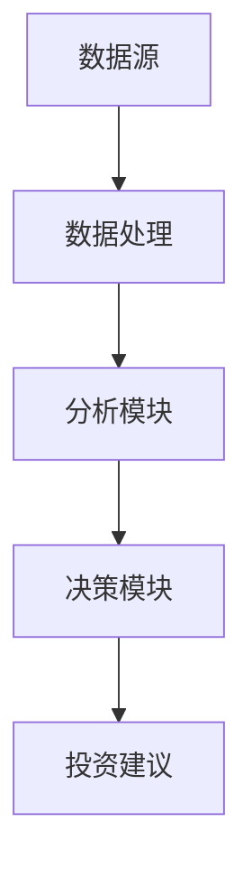

                 

# 如何利用特价股票策略进行结构性产品投资

## 关键词：
- 特价股票策略
- 结构性产品
- 期权
- 认股证
- 投资策略

## 摘要：
本文深入探讨了如何利用特价股票策略进行结构性产品投资。通过分析特价股票的定义、结构性产品的类型，以及它们在投资中的应用，本文为读者提供了从理论到实践的全面指导。结合技术分析和基本面分析，本文详细阐述了如何选择合适的结构性产品，制定投资策略，并有效管理风险，帮助投资者在复杂金融市场中实现收益最大化。

---

# 第一部分：特价股票策略的背景与基础

## 第1章：特价股票策略概述

### 1.1 特价股票的定义与特点

#### 1.1.1 什么是特价股票
特价股票是指在特定市场条件下，价格低于正常价值的股票。这些股票可能因市场波动、公司业绩不佳或市场情绪影响而被低估。投资者认为这些股票具有潜在的上涨空间，因此选择在低价时买入。

#### 1.1.2 特价股票的分类
- **周期性股票**：受经济周期影响较大的股票，如工业和材料类股票。
- **价值型股票**：市盈率或市净率低于行业平均水平的股票。
- **成长型股票**：尽管当前价格较高，但未来增长潜力大的股票。

#### 1.1.3 特价股票的优势与风险
- **优势**：潜在高回报，价值被低估。
- **风险**：流动性风险，公司基本面可能持续恶化。

### 1.2 结构性产品的基本概念

#### 1.2.1 结构性产品的定义
结构性产品是将传统金融工具（如债券、期权）与衍生品相结合的复杂金融工具。它们通常具有特定的结构，如嵌入期权或其他金融资产。

#### 1.2.2 结构性产品的类型
- **期权**：赋予买方在特定时间以特定价格买入或卖出资产的权利。
- **认股证**：与股票相关的期权，通常具有杠杆效应。
- **可转换债券**：可以在特定条件下转换为公司股票的债券。

#### 1.2.3 特价股票策略与结构性产品的结合
- **理论基础**：结构性产品可以为特价股票提供杠杆效应或对冲工具。
- **应用场景**：在特价股票上涨时获利，或在股价下跌时对冲风险。

---

## 第2章：市场分析与技术指标

### 2.1 市场分析基础

#### 2.1.1 市场周期分析
市场周期分为牛市、熊市、震荡市。投资者需根据市场周期选择合适的投资策略。

#### 2.1.2 市场情绪分析
利用情绪指标（如恐慌指数VIX）判断市场情绪，指导投资决策。

### 2.2 技术分析工具

#### 2.2.1 移动平均线（MA）
- **定义**：一段时间内股价的平均值，用于判断趋势。
- **应用**：MA作为支撑或阻力位，帮助确定买卖时机。

#### 2.2.2 相对强弱指数（RSI）
- **定义**：衡量股票在短期内的超买或超卖状态。
- **应用**：RSI高于70为超买，低于30为超卖。

#### 2.2.3 布林带（Bollinger Bands）
- **定义**：由标准差计算出的 volatility bands，用于判断价格波动范围。
- **应用**：价格接近上限可能回调，接近下限可能反弹。

---

## 第3章：基本面分析与财务指标

### 3.1 公司基本面分析

#### 3.1.1 财务报表分析
- **利润表**：评估公司盈利能力。
- **资产负债表**：评估资产和负债状况。
- **现金流量表**：评估现金流健康状况。

#### 3.1.2 市盈率（P/E）与市净率（P/B）
- **市盈率**：股价与每股收益的比率，评估股价是否合理。
- **市净率**：股价与每股净资产的比率，评估股价与资产的关系。

### 3.2 行业分析与宏观经济因素

#### 3.2.1 行业趋势分析
- 行业增长潜力、竞争格局和政策影响。

#### 3.2.2 宏观经济对股价的影响
- 利率、通货膨胀、货币政策等宏观经济因素对股市的影响。

---

# 第二部分：结构性产品与特价股票策略的应用

## 第4章：结构性产品的类型与风险

### 4.1 期权与认股证

#### 4.1.1 期权的基本类型
- **认购期权**：买入标的资产的权利。
- **认沽期权**：卖出标的资产的权利。

#### 4.1.2 认股证的结构与风险
- **认购证**：附带认购期权的债券，具有杠杆效应。
- **认沽证**：附带认沽期权的债券，用于对冲风险。

### 4.2 可转换债券（Convertible Bonds）

#### 4.2.1 转换条款分析
- **转换价格**：将债券转换为股票的价格。
- **转换溢价**：债券价格与转换价格的差异。

#### 4.2.2 债券与股票的双重特性
- 债券部分提供固定收益，股票部分提供潜在收益。

---

## 第5章：策略制定与执行

### 5.1 确定投资目标与风险承受能力

#### 5.1.1 投资目标设定
- 短期收益、长期收益或资本保值。

#### 5.1.2 风险承受
- 风险厌恶型、中性或风险寻求型投资者的选择。

### 5.2 制定结构性产品投资策略

#### 5.2.1 选择合适的结构性产品
- 根据投资目标和风险偏好选择期权、认股证或可转换债券。

#### 5.2.2 结构性产品与特价股票的结合
- 使用期权对冲风险，或利用杠杆效应放大收益。

---

# 第三部分：风险管理与实战指南

## 第6章：风险管理策略

### 6.1 风险评估与管理

#### 6.1.1 市场风险
- 价格波动对结构性产品的影响。

#### 6.1.2 流动性风险
- 结构性产品的流动性可能较差，影响变现能力。

#### 6.1.3 信用风险
- 对手方或发行方的信用风险。

### 6.2 心理风险管理

#### 6.2.1 避免情绪化决策
- 避免贪婪和恐惧影响投资决策。

#### 6.2.2 保持纪律
- 遵循既定策略，严格执行止盈和止损。

---

## 第7章：实战指南

### 7.1 交易策略

#### 7.1.1 如何选择结构性产品
- 分析市场趋势，评估结构性产品的潜在回报和风险。

#### 7.1.2 资金管理
- 合理分配资金，避免过度杠杆。

### 7.2 案例分析

#### 7.2.1 特价股票与认购期权的结合
- 案例：购买某公司认购期权，预期股价上涨。

#### 7.2.2 利用认沽期权对冲风险
- 案例：持有股票的同时购买认沽期权，对冲股价下跌风险。

---

## 第8章：系统架构与工具推荐

### 8.1 系统架构设计

#### 8.1.1 系统功能模块
- 数据收集模块：收集市场数据。
- 分析模块：技术分析和基本面分析。
- 决策模块：制定投资策略。

#### 8.1.2 系统架构图

### 8.2 工具推荐

#### 8.2.1 数据分析工具
- Python的Pandas和NumPy库。
- 数据可视化工具Matplotlib。

#### 8.2.2 交易执行工具
- Interactive Brokers、MetaTrader等。

---

## 第9章：数学模型与算法

### 9.1 期权定价模型

#### 9.1.1 Black-Scholes模型
$$ C = S_0 N(d_1) - K e^{-rT} N(d_2) $$
其中：
- \( C \) 为认购期权价格。
- \( S_0 \) 为当前股价。
- \( K \) 为行权价。
- \( r \) 为无风险利率。
- \( T \) 为到期时间。
- \( N(d) \) 为标准正态分布的累积分布函数。

### 9.2 结构性产品收益计算

#### 9.2.1 认股证收益计算
$$ \text{收益} = \max(0, S_T - K) $$
其中：
- \( S_T \) 为到期时股价。
- \( K \) 为行权价。

---

## 第10章：附录

### 10.1 术语表

| 术语 | 定义 |
|------|------|
| 特价股票 | 价格低于正常水平的股票 |
| 结构性产品 | 结合传统金融工具和衍生品的复杂金融工具 |
| 期权 | 在特定时间以特定价格买入或卖出资产的权利 |

### 10.2 工具推荐

#### 数据分析工具
- Python: `pandas`, `numpy`, `matplotlib`
- R语言

#### 交易工具
- Interactive Brokers
- MetaTrader

### 10.3 相关法规与伦理

- 需遵守当地的金融法规，如美国的SEC规定。
- 遵守职业道德，避免内幕交易。

---

## 作者：AI天才研究院/AI Genius Institute & 禅与计算机程序设计艺术 /Zen And The Art of Computer Programming

---

通过以上结构，本文系统地介绍了如何利用特价股票策略进行结构性产品投资，从理论到实践，结合分析工具和风险管理策略，为投资者提供了全面的指导。

