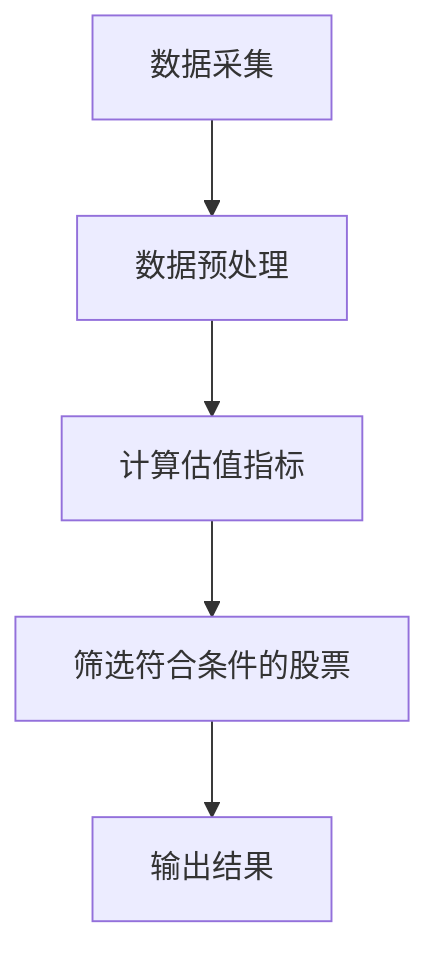
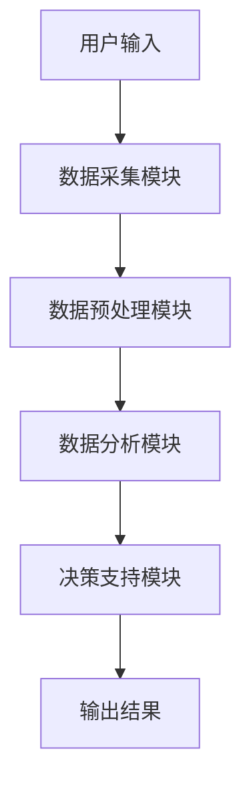

                 


# 如何利用特价股票策略进行逆向思维投资

> 关键词：特价股票策略、逆向思维投资、股票投资、市场分析、投资策略

> 摘要：本文详细探讨了如何利用特价股票策略进行逆向思维投资，从背景介绍到数学模型，从系统架构到项目实战，为读者提供全面的指导。通过分析特价股票的定义、逆向思维投资的核心原理，结合实际案例和系统设计，帮助读者掌握在股票市场中进行逆向思维投资的策略和方法。

---

# 第一部分: 特价股票策略与逆向思维投资背景

## 第1章: 特价股票策略与逆向思维投资概述

### 1.1 特价股票策略的定义与特点

#### 1.1.1 什么是特价股票策略
特价股票策略是一种在股票市场中寻找被低估的股票进行投资的策略。其核心思想是通过分析市场中的低价股票，捕捉那些暂时被市场忽视或低估的优质股票，以期在市场回升时获得超额收益。

#### 1.1.2 特价股票策略的核心特点
- **低估性**：通过市盈率、市净率等指标筛选出低于市场平均水平的股票。
- **逆周期性**：在市场低迷时买入，市场繁荣时卖出。
- **长期性**：注重长期价值，而非短期波动。

#### 1.1.3 特价股票策略的优势与局限性
- **优势**：
  - 风险较低，适合保守型投资者。
  - 长期收益稳定，适合长期投资。
- **局限性**：
  - 短期可能面临较大的波动风险。
  - 需要较高的市场分析能力，避免买入真正表现不佳的股票。

### 1.2 逆向思维投资的背景与意义

#### 1.2.1 逆向思维投资的定义
逆向思维投资是一种与市场情绪相反的投资策略。在市场恐慌时买入，市场乐观时卖出，通过逆市场趋势操作来获得超额收益。

#### 1.2.2 逆向思维投资的核心理念
- **市场情绪分析**：通过分析市场情绪，判断市场的非理性波动。
- **逆周期操作**：在市场低点买入，高点卖出，避免跟随市场的盲目行为。

#### 1.2.3 逆向思维投资在股票市场中的应用
逆向思维投资在股票市场中广泛应用，尤其是在市场恐慌和市场泡沫时期，通过逆向操作捕捉市场错估的机会。

### 1.3 特价股票策略与逆向思维投资的结合

#### 1.3.1 特价股票策略与逆向思维投资的关联
- 两者都强调市场低估和非理性波动。
- 逆向思维为特价股票策略提供了时机选择的依据。

#### 1.3.2 逆向思维在特价股票策略中的应用
- 在市场恐慌时，利用特价股票策略筛选出被低估的股票进行投资。
- 在市场乐观时，及时卖出，锁定收益。

#### 1.3.3 逆向思维投资在股票市场中的成功案例
- 2008年金融危机期间，通过逆向思维投资，买入被低估的股票，随后市场回升，获得超额收益。

---

# 第二部分: 特价股票策略的核心概念与分析

## 第2章: 特价股票策略的核心概念

### 2.1 特价股票的定义与分类

#### 2.1.1 什么是特价股票
特价股票是指在市场中价格低于其内在价值的股票。通常表现为市盈率、市净率等估值指标低于行业平均水平。

#### 2.1.2 特价股票的分类
- **周期性特价股票**：受经济周期影响较大的股票，如制造业、建筑业等。
- **成长性特价股票**：具有较高成长潜力，但当前估值被低估的股票。

### 2.2 逆向思维投资的核心原理

#### 2.2.1 逆向思维的核心思想
逆向思维的核心思想是反向思考，寻找市场中的非理性行为，利用市场的短期波动获取长期收益。

#### 2.2.2 逆向思维在股票投资中的应用
- 在市场恐慌时，买入被低估的股票。
- 在市场乐观时，卖出高估的股票。

### 2.3 特价股票策略的数学模型与公式

#### 2.3.1 特价股票的估值公式
$$ \text{内在价值} = \frac{\text{净利润} \times (1 + g)}{r - g} $$
其中，$g$为净利润增长率，$r$为折现率。

#### 2.3.2 市盈率与市净率的计算
- 市盈率（P/E）= 股价 / 每股净利润
- 市净率（P/B）= 股价 / 每股净资产

#### 2.3.3 特价股票的筛选标准
- 市盈率低于行业平均水平。
- 市净率低于行业平均水平。
- 净利润增长率为正。

### 2.4 本章小结

---

# 第三部分: 特价股票策略的算法原理

## 第3章: 特价股票策略的算法原理

### 3.1 特价股票筛选的算法流程

#### 3.1.1 数据采集
- 采集股票的历史价格、财务数据等。

#### 3.1.2 数据预处理
- 清洗数据，去除缺失值。
- 标准化处理，计算市盈率、市净率等指标。

#### 3.1.3 筛选算法
- 基于市盈率和市净率的双重筛选，排除高估股票。

### 3.2 算法实现的数学模型

#### 3.2.1 估值模型
$$ \text{内在价值} = \frac{\text{净利润} \times (1 + g)}{r - g} $$

#### 3.2.2 筛选标准
- 市盈率 < 行业平均市盈率。
- 市净率 < 行业平均市净率。

### 3.3 算法流程图



---

# 第四部分: 系统分析与架构设计

## 第4章: 投资决策支持系统的架构设计

### 4.1 问题场景介绍
设计一个基于特价股票策略的逆向思维投资系统，帮助投资者实现自动化投资决策。

### 4.2 系统功能设计

#### 4.2.1 数据采集模块
- 实时采集股票数据，包括价格、财务指标等。

#### 4.2.2 数据分析模块
- 计算市盈率、市净率等指标。
- 筛选符合条件的股票。

#### 4.2.3 决策支持模块
- 提供投资建议，包括买入、卖出时机等。

### 4.3 系统架构设计



---

# 第五部分: 项目实战

## 第5章: 项目实战

### 5.1 环境安装
- 安装Python、Pandas、NumPy等工具。

### 5.2 核心代码实现

```python
import pandas as pd
import numpy as np

# 数据采集模块
def fetch_data(ticker):
    # 实现数据采集逻辑
    pass

# 数据预处理模块
def preprocess(data):
    # 实现数据清洗和标准化
    pass

# 数据分析模块
def calculate_valuation(data):
    data['PE'] = data['股价'] / data['每股净利润']
    data['PB'] = data['股价'] / data['每股净资产']
    return data

# 筛选模块
def select_stocks(data, industry_avg_pe, industry_avg_pb):
    selected = data[(data['PE'] < industry_avg_pe) & (data['PB'] < industry_avg_pb)]
    return selected

# 决策支持模块
def investment_decision(selected, portfolio):
    # 实现投资决策逻辑
    pass
```

### 5.3 实际案例分析

#### 5.3.1 案例背景
2008年金融危机期间，市场恐慌，许多优质股票被低估。

#### 5.3.2 数据分析
计算市盈率和市净率，筛选出符合条件的股票。

#### 5.3.3 策略实施
在市场低点买入，市场回升时卖出，获得超额收益。

### 5.4 结果评估
通过回测分析，验证策略的有效性，评估收益与风险。

---

# 第六部分: 最佳实践与小结

## 第6章: 最佳实践

### 6.1 小结
- 特价股票策略与逆向思维投资结合，能够在市场波动中获取超额收益。
- 通过数学模型和系统设计，提高投资决策的科学性和准确性。

### 6.2 注意事项
- 风险提示：市场波动可能导致策略失效。
- 操作建议：结合市场环境，灵活调整策略。
- 拓展阅读：推荐阅读相关书籍和文献，深入学习投资策略。

---

# 结语

通过本文的详细讲解，读者可以掌握如何利用特价股票策略进行逆向思维投资，从理论到实践，从策略到系统设计，全面了解这一投资方法的精髓。希望本文能够为投资者提供有价值的指导，帮助他们在股票市场中取得更好的投资效果。

---

# 作者

**作者：AI天才研究院/AI Genius Institute & 禅与计算机程序设计艺术 /Zen And The Art of Computer Programming**

