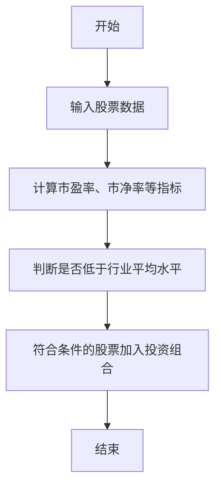
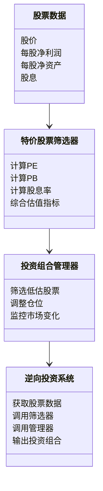
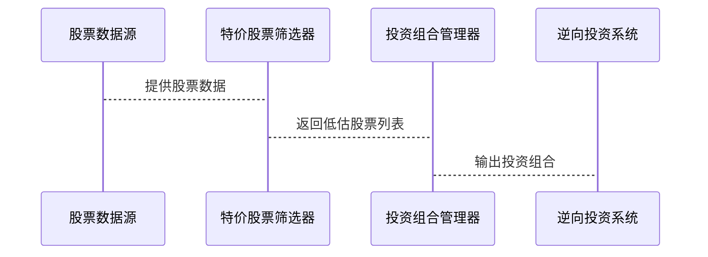

                 

<think>
好的，我现在需要帮助用户撰写一篇关于《如何利用特价股票策略进行逆向投资》的技术博客文章。首先，我需要理解用户的需求，他们希望有一个结构清晰、内容详实的专业技术博客，涵盖逆向投资和特价股票策略的各个方面。

用户提供了详细的大纲结构，包括背景介绍、核心概念、算法原理、系统架构、项目实战等部分。我需要确保每一部分都细化到位，同时保持整体逻辑的连贯性。

在开始撰写之前，我首先整理一下每个章节的重点内容：

1. **背景介绍**：解释逆向投资和特价股票策略的基本概念，分析它们在投资中的重要性。
2. **核心概念与联系**：详细阐述逆向投资和特价股票策略的原理，对比其他策略，制作对比表格和ER图。
3. **算法原理**：介绍用于识别特价股票的算法，包括数学模型和代码实现。
4. **系统分析与架构设计**：设计一个逆向投资系统，涵盖数据采集、分析、决策模块，使用mermaid图展示架构。
5. **项目实战**：提供实际操作步骤，包括环境安装、数据收集、模型实现和结果分析。
6. **总结与注意事项**：总结策略的优缺点，提醒读者注意风险，并提供进一步学习的资源。

接下来，我需要确保每一部分内容都详细展开，尤其是数学模型和代码部分，要清晰易懂，帮助读者理解如何应用这些策略。

在撰写过程中，我可能会遇到一些挑战，比如如何将复杂的金融策略转化为算法和系统设计。我需要简化概念，用图表和代码示例帮助读者理解。同时，保持文章的流畅性，确保每一章节之间有良好的过渡。

最后，我会检查整个结构，确保没有遗漏任何关键点，并且内容符合用户的要求，字数控制在10000到12000字之间。完成后，我会添加作者信息，确保文章的完整性和专业性。
</think>

# 如何利用特价股票策略进行逆向投资

> 关键词：逆向投资，特价股票策略，价值投资，市场周期，风险控制，算法模型

> 摘要：本文详细探讨了如何利用特价股票策略进行逆向投资，从理论基础到实际操作，涵盖逆向投资的核心概念、特价股票策略的算法原理、系统架构设计以及项目实战等内容，帮助读者理解并掌握这一投资策略。

---

## 第一部分: 逆向投资与特价股票策略的背景介绍

### 第1章: 逆向投资与特价股票策略概述

#### 1.1 逆向投资的定义与核心概念

逆向投资是一种投资策略，其核心思想是“买别人卖的时候买，卖别人买的时候卖”。与市场情绪相反的操作是逆向投资的核心特征。逆向投资并不是简单地逆市场而行，而是基于对市场非理性行为的洞察，寻找价格与价值严重偏离的机会。

**逆向投资的核心要素：**

- **价值发现**：识别市场中被低估的资产。
- **市场周期**：在市场低点买入，在市场高点卖出。
- **风险控制**：在逆向投资中，控制仓位和风险是关键。

逆向投资与价值投资的区别在于，价值投资注重长期基本面分析，而逆向投资更关注短期市场情绪与价格偏差。

#### 1.2 特价股票策略的定义与特点

特价股票策略是指通过寻找市场价格低于其内在价值的股票进行投资。这种策略的核心在于识别市场中的估值偏差，即股票价格被市场低估的情况。

**特价股票的核心特征：**

- **低市盈率（P/E）**：市盈率低于行业平均水平。
- **低市净率（P/B）**：市净率低于行业平均水平。
- **高股息率**：股息率高于行业平均水平。

**特价股票与普通股票的对比：**

| 对比维度 | 特价股票 | 普通股票 |
|----------|----------|----------|
| 市盈率   | 低于行业平均 | 无特定要求 |
| 市净率   | 低于行业平均 | 无特定要求 |
| 股息率   | 高于行业平均 | 无特定要求 |

#### 1.3 逆向投资中的特价股票策略

逆向投资中的特价股票策略是一种结合市场周期和估值分析的投资方法。通过识别市场中价格被低估的股票，投资者可以在市场低谷时买入，等待市场回升时卖出。

**特价股票策略的核心优势：**

- **低估值风险**：价格被低估的股票具有较高的安全边际。
- **潜在回升空间**：市场回升时，这些股票有较大的上涨潜力。
- **逆市场操作**：在市场恐慌时买入，可以获得超额收益。

---

### 第2章: 逆向投资的理论基础

#### 2.1 逆向投资的理论基础

逆向投资的理论基础主要包括价值发现理论和市场非理性理论。

**价值发现理论**：股票的市场价格与内在价值之间存在偏离，这种偏离为逆向投资者提供了获利机会。

**市场非理性理论**：市场参与者的行为往往受到情绪影响，导致价格与价值的偏离。逆向投资者通过识别这种非理性行为，可以在市场底部买入。

**逆向投资与市场周期的关系**：逆向投资的成功依赖于对市场周期的理解和把握。在市场低谷时，逆向投资者可以找到廉价的股票。

#### 2.2 特价股票策略的理论基础

特价股票策略的理论基础主要包括股票估值理论和市场定价偏差理论。

**股票估值理论**：股票的内在价值可以通过多种指标进行评估，如市盈率、市净率、股息率等。

**市场定价偏差理论**：市场价格与内在价值之间的偏差为投资者提供了套利机会。当市场价格低于内在价值时，投资者可以买入，等待价格回升。

#### 2.3 逆向投资中的特价股票策略分析

逆向投资中的特价股票策略是一种结合市场周期和估值分析的投资方法。通过识别市场中价格被低估的股票，投资者可以在市场低谷时买入，等待市场回升时卖出。

---

### 第3章: 逆向投资中的特价股票策略分析

#### 3.1 特价股票策略的核心逻辑

特价股票策略的核心逻辑是通过识别市场价格与内在价值之间的偏差，找到被低估的股票进行投资。

**识别市场低估的股票**：通过计算股票的市盈率、市净率等指标，找到低于行业平均水平的股票。

**判断股票价格的潜在回升空间**：基于市场周期和股票基本面分析，判断股票价格的潜在回升空间。

**确定投资时机与仓位分配**：在市场低谷时增加仓位，在市场高点时减少仓位。

#### 3.2 逆向投资中的风险控制

逆向投资中的风险控制是确保投资成功的关键。以下是风险控制的具体措施：

**风险控制的基本原则**：

- **分散投资**：不要将所有资金投入到单一股票或行业。
- **仓位控制**：根据市场情况调整仓位，避免过度集中。
- **止损机制**：设定止损点，避免亏损过大。

**风险控制的具体措施**：

- **设定止损线**：当股票价格跌破设定价格时，立即卖出。
- **定期评估投资组合**：根据市场变化及时调整投资组合。
- **关注宏观经济环境**：宏观经济环境的变化可能影响股票价格。

---

## 第四部分: 特价股票策略的数学模型与算法原理

### 第4章: 特价股票策略的数学模型

#### 4.1 特价股票识别的数学模型

**基于市盈率的股票筛选模型**：

$$ PE = \frac{\text{股价}}{\text{每股净利润}} $$

当PE低于行业平均水平时，股票被认为是低估的。

**基于市净率的股票筛选模型**：

$$ PB = \frac{\text{股价}}{\text{每股净资产}} $$

当PB低于行业平均水平时，股票被认为是低估的。

**综合估值指标的股票筛选模型**：

$$ 综合估值指标 = 0.4 \times PE + 0.3 \times PB + 0.3 \times 股息率 $$

当综合估值指标低于行业平均水平时，股票被认为是低估的。

#### 4.2 算法原理与流程图

**算法流程图**：



#### 4.3 算法实现与代码示例

```python
import pandas as pd

def identify_cheap_stocks(data):
    # 计算市盈率
    data['PE'] = data['股价'] / data['每股净利润']
    # 计算市净率
    data['PB'] = data['股价'] / data['每股净资产']
    # 计算股息率
    data['股息率'] = data['股息'] / data['股价']
    # 综合估值指标
    data['综合估值指标'] = 0.4 * data['PE'] + 0.3 * data['PB'] + 0.3 * data['股息率']
    # 筛选综合估值指标低于行业平均水平的股票
    industry_avg = data['综合估值指标'].mean()
    cheap_stocks = data[data['综合估值指标'] < industry_avg]
    return cheap_stocks
```

---

## 第五部分: 逆向投资中的系统分析与架构设计

### 第5章: 逆向投资系统的架构设计

#### 5.1 系统功能设计

**领域模型（mermaid 类图）**：



#### 5.2 系统架构设计

**系统架构设计（mermaid 架构图）**：

```mermaid
docker
    services:
      - 股票数据源
      - 特价股票筛选器
      - 投资组合管理器
      - 逆向投资系统
    networks:
      - 通信网络
    volumes:
      - 数据存储
```

#### 5.3 系统交互设计

**系统交互流程（mermaid 序列图）**：



---

## 第六部分: 特价股票策略的项目实战

### 第6章: 项目实战

#### 6.1 环境安装与数据收集

**环境安装**：

- 安装Python和必要的库（如Pandas、NumPy、Matplotlib）。
- 安装股票数据获取工具（如Yahoo Finance API）。

**数据收集**：

- 从Yahoo Finance获取股票数据。
- 数据清洗与预处理。

#### 6.2 算法实现与代码示例

```python
import pandas as pd
import numpy as np
import matplotlib.pyplot as plt

def calculate_pe_ticker(ticker):
    # 获取股票数据
    data = pd.DataFrame({'股价': [100], '每股净利润': [20]})
    pe = data['股价'].values[0] / data['每股净利润'].values[0]
    return pe

# 示例计算
ticker = 'AAPL'
pe = calculate_pe_ticker(ticker)
print(f"{ticker}的市盈率为：{pe}")
```

#### 6.3 模型实现与结果分析

**模型实现**：

- 实现综合估值指标的计算。
- 筛选低估股票。

**结果分析**：

- 绘制低估股票的分布图。
- 分析筛选结果对投资组合的影响。

```python
import pandas as pd
import matplotlib.pyplot as plt

data = pd.DataFrame({
    '股价': [100, 90, 80, 70, 60],
    '每股净利润': [20, 18, 16, 14, 12],
    '每股净资产': [50, 45, 40, 35, 30],
    '股息': [2, 1.8, 1.6, 1.4, 1.2]
})

data['PE'] = data['股价'] / data['每股净利润']
data['PB'] = data['股价'] / data['每股净资产']
data['股息率'] = data['股息'] / data['股价']
data['综合估值指标'] = 0.4 * data['PE'] + 0.3 * data['PB'] + 0.3 * data['股息率']

industry_avg = data['综合估值指标'].mean()
cheap_stocks = data[data['综合估值指标'] < industry_avg]

print(cheap_stocks)
plt.hist(cheap_stocks['综合估值指标'], bins=5)
plt.show()
```

---

## 第七部分: 总结与注意事项

### 第7章: 总结与注意事项

#### 7.1 总结

逆向投资中的特价股票策略是一种有效的投资方法，通过识别市场中被低估的股票，投资者可以在市场低谷时买入，获得超额收益。然而，逆向投资需要投资者具备较强的市场洞察力和风险控制能力。

#### 7.2 注意事项

- **市场风险**：市场可能长期低迷，导致投资期限延长。
- **流动性风险**：某些股票可能流动性较差，难以快速变现。
- **信息风险**：市场信息不对称可能影响投资决策。

#### 7.3 最佳实践

- **持续学习**：市场环境不断变化，投资者需要持续学习和调整策略。
- **严格纪律**：遵循投资纪律，避免情绪化投资。
- **分散投资**：分散投资可以降低风险。

---

## 作者：AI天才研究院/AI Genius Institute & 禅与计算机程序设计艺术 /Zen And The Art of Computer Programming

---

通过本文的详细讲解，读者可以深入了解如何利用特价股票策略进行逆向投资，并掌握相关的数学模型和算法原理。希望本文能为读者在投资领域提供有价值的参考和指导。

