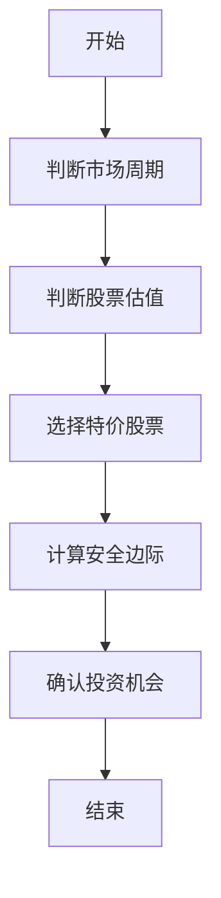
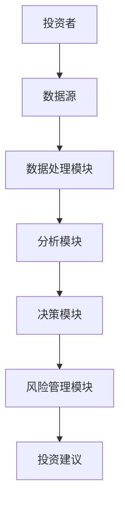

                 

<think>
嗯，用户希望我以《如何利用特价股票策略进行逆周期资产配置》为标题，撰写一篇技术博客文章。我需要先理解用户的需求，然后按照他们的要求组织内容。

首先，用户提到他们是一位世界级的人工智能专家、程序员、软件架构师、CTO，还是一位畅销书作家，计算机图灵奖获得者。所以，文章需要专业且有深度，同时语言要清晰、逻辑严密。

接下来，用户要求文章结构紧凑，使用吸引人的章节标题，逐步分析，技术语言专业但易懂。目录大纲已经给出，我需要按照这个结构来展开每个部分。

首先，摘要部分要简明扼要，概述文章的核心内容，强调特价股票策略和逆周期配置的重要性，以及它们如何帮助投资者在市场低迷期获利。

在正文部分，第一部分是背景介绍，需要详细解释特价股票策略和逆周期资产配置的定义、特点及其关系。这部分要确保读者理解这些概念的基本原理。

第二部分是核心概念与联系，我需要用表格和Mermaid图来展示策略的原理和特征对比。这可能涉及市场周期分析、选股标准等，帮助读者清晰地理解这些策略之间的关系。

第三部分是算法原理讲解，我需要用Mermaid流程图展示策略执行的步骤，并提供数学模型，如价值评估模型，用公式解释如何计算内在价值和安全边际。

接下来是系统分析与架构设计，这部分需要描述投资决策系统的各个模块，包括数据源、分析模块、执行模块等，并用Mermaid图展示系统架构。

项目实战部分，我需要提供具体的代码示例，比如环境安装、核心代码实现和案例分析，让读者能够实际操作，理解策略的应用。

最后，总结与展望部分要回顾整个策略，并给出投资中的注意事项和未来的研究方向，帮助读者更好地应用这些策略。

在写作过程中，我需要确保每个章节内容详实，结构清晰，同时使用专业但易懂的语言。数学公式和图表要准确无误，帮助读者理解复杂的策略。

此外，文章末尾需要注明作者信息，符合用户的要求。总体来说，这篇文章需要兼顾深度和可读性，确保读者能够从基础到实践，全面掌握特价股票策略和逆周期资产配置的方法。

现在，我需要将这些思考转化为具体的章节内容，确保每个部分都符合用户的要求，同时保持逻辑连贯，结构紧凑。这将帮助读者系统地理解如何在实际投资中应用这些策略，提升他们的投资收益。
</think>

# 如何利用特价股票策略进行逆周期资产配置

## 关键词：特价股票策略、逆周期资产配置、价值投资、市场周期、风险管理

## 摘要：本文详细探讨了如何利用特价股票策略进行逆周期资产配置，从理论基础到实际操作，系统地分析了特价股票的识别方法、市场周期分析、投资策略制定以及风险管理等关键环节。通过结合实际案例和数学模型，本文为投资者提供了一套科学的逆周期投资方法，帮助他们在市场低迷时期实现资产保值与增值。

---

## 第一部分: 特价股票策略与逆周期资产配置基础

### 第1章: 特价股票策略概述

#### 1.1 特价股票策略的定义与特点
- **1.1.1 特价股票的定义**
  特价股票指的是在市场低迷或股票价格被低估时，投资者可以以低于其内在价值的价格买入的股票。这种股票通常具有较高的安全边际，能够在市场回升时带来超额收益。
  
- **1.1.2 特价股票的核心特点**
  - **低估值**：市场价格低于内在价值，通常表现为市盈率、市净率等指标显著低于行业平均水平。
  - **周期性**：往往出现在市场周期的底部阶段，具有较高的周期性特征。
  - **风险较低**：由于价格被低估，投资者在市场回升时能够获得较高的安全边际。

- **1.1.3 特价股票与普通股票的区别**
  特价股票与普通股票的主要区别在于其价格与价值的偏离程度。普通股票的价格可能与价值相符，而特价股票则存在较大的价格折扣。

#### 1.2 逆周期资产配置的定义与特点
- **1.2.1 逆周期资产配置的定义**
  逆周期资产配置是一种投资策略，旨在通过在经济周期的不同阶段调整资产组合，以规避系统性风险并抓住周期性机会。其核心在于在市场低迷时增加配置，而在市场繁荣时减少配置。
  
- **1.2.2 逆周期资产配置的核心特点**
  - **逆向思维**：在市场恐慌时买入，在市场狂热时卖出。
  - **周期性调整**：根据宏观经济指标和市场趋势动态调整资产配置。
  - **风险控制**：通过逆周期配置降低组合的整体波动性和风险。

- **1.2.3 逆周期资产配置与周期性资产的区别**
  逆周期资产配置是一种主动的投资策略，而周期性资产则指那些价格受经济周期影响较大的资产类别。逆周期资产配置通过精选周期性资产中的特价股票，能够在市场底部获得更高的收益。

#### 1.3 特价股票策略与逆周期资产配置的关系
- **1.3.1 特价股票策略在逆周期中的作用**
  在经济周期的底部阶段，特价股票策略能够帮助投资者以较低的价格买入优质资产，从而在市场回升时获得超额收益。
  
- **1.3.2 逆周期资产配置中特价股票策略的优势**
  - **安全性**：通过选择低估值的特价股票，投资者能够在市场低迷时降低组合的风险。
  - **收益性**：在市场回升时，特价股票的价格回升通常快于市场平均水平，能够为投资者带来较高的收益。

- **1.3.3 两者结合的必要性**
  将特价股票策略与逆周期资产配置相结合，能够在市场周期的底部阶段抓住投资机会，同时通过动态调整资产组合降低风险，实现长期稳定的收益。

### 第2章: 特价股票策略的核心概念与联系

#### 2.1 特价股票策略的核心原理
- **市场周期分析**
  特价股票的出现通常与市场周期密切相关。在市场低迷时，许多优质股票的价格被低估，为投资者提供了买入的机会。通过分析市场周期，投资者可以更好地识别特价股票的投资机会。
  
- **特价股票的识别方法**
  识别特价股票的关键在于分析股票的估值指标，如市盈率、市净率等。同时，还需要结合公司的基本面分析，选择具有强大竞争优势和良好发展前景的公司。

- **投资时机的选择**
  特价股票的投资时机通常出现在市场周期的底部阶段。通过分析宏观经济指标和市场情绪，投资者可以更好地把握投资时机。

#### 2.2 核心概念与联系
- **2.2.1 核心原理**
  特价股票策略的核心在于通过低估值和安全边际，捕捉市场周期中的底部机会。其成功的关键在于对市场周期的准确判断和对股票价值的准确评估。

- **2.2.2 概念属性特征对比表格**
  下表对比了特价股票与其他类型股票的核心特征：

  | 特性          | 特价股票       | 普通股票       | 高估值股票     |
  |---------------|----------------|----------------|----------------|
  | 市盈率        | 低于行业均值   | 接近行业均值    | 高于行业均值    |
  | 市净率        | 低于行业均值   | 接近行业均值    | 高于行业均值    |
  | 投资时机      | 市场底部       | 市场正常阶段    | 市场顶部       |
  | 风险水平      | 较低           | 中等           | 较高           |

- **2.2.3 ER实体关系图**
  以下是特价股票策略的ER实体关系图：

  ```mermaid
  entity 投资者 {
    id 投资者ID
    属性 风险承受能力
    属性 投资目标
  }
  
  entity 特价股票 {
    id 股票ID
    属性 市盈率
    属性 市净率
    属性 内在价值
  }
  
  entity 市场周期 {
    id 周期ID
    属性 当前阶段
    属性 经济指标
  }
  
  投资者 --> 特价股票: 选择特价股票
  特价股票 --> 市场周期: 适应市场周期
  ```

---

## 第三部分: 算法原理讲解

### 第3章: 特价股票策略的数学模型与算法

#### 3.1 算法原理
- **价值评估模型**
  以下是价值评估模型的数学公式：
  $$\text{内在价值} = \frac{\text{净利润}}{\text{资本成本}}$$
  该公式用于评估股票的内在价值，帮助投资者判断股票是否被低估。

- **安全边际计算**
  安全边际是内在价值与市场价格之间的差额，公式如下：
  $$\text{安全边际} = \text{内在价值} - \text{市场价格}$$
  安全边际越大，投资风险越小。

- **市场周期判断**
  通过宏观经济指标（如GDP增长率、 unemployment rate等）和市场指标（如市盈率、市净率）来判断市场周期，确定是否处于底部阶段。

#### 3.2 算法流程
以下是特价股票策略的算法流程图：



---

## 第四部分: 系统分析与架构设计方案

### 第4章: 投资决策系统的设计与实现

#### 4.1 系统功能设计
- **数据采集模块**
  - 采集宏观经济指标和市场指标数据。
- **分析模块**
  - 计算股票的市盈率、市净率等估值指标。
  - 判断市场周期阶段。
- **决策模块**
  - 根据分析结果，筛选出符合条件的特价股票。
- **风险管理模块**
  - 计算安全边际，评估投资风险。

#### 4.2 系统架构设计
以下是投资决策系统的架构图：



---

## 第五部分: 项目实战

### 第5章: 特价股票策略的实战应用

#### 5.1 项目环境安装
- **工具安装**
  - 安装Python编程环境（如Anaconda）。
  - 安装数据采集工具（如 requests、BeautifulSoup）。
- **数据源获取**
  - 从金融数据平台获取历史数据（如 Yahoo Finance）。

#### 5.2 核心代码实现
以下是价值评估模型的Python代码：

```python
import pandas as pd
import requests
from bs4 import BeautifulSoup

def get_intrinsic_value(stock_price, net_profit, cost_of_capital):
    return net_profit / cost_of_capital

# 示例数据
stock_price = 50
net_profit = 10
cost_of_capital = 0.1

intrinsic_value = get_intrinsic_value(stock_price, net_profit, cost_of_capital)
print(f"内在价值为：{intrinsic_value}")
```

#### 5.3 案例分析
- **案例背景**
  某股票当前价格为50元，净利润为10元，资本成本为10%。计算其内在价值和安全边际。
- **计算结果**
  内在价值 = 10 / 0.1 = 100元
  安全边际 = 100 - 50 = 50元
- **结论**
  该股票具有较高的安全边际，适合在市场底部阶段买入。

---

## 第六部分: 总结与展望

### 第6章: 总结与投资建议

#### 6.1 总结
- 特价股票策略是一种有效的逆周期投资方法，通过在市场底部阶段买入低估股票，能够在市场回升时获得超额收益。
- 逆周期资产配置的核心在于对市场周期的准确判断和对股票价值的准确评估。

#### 6.2 投资建议
- **长期视角**：投资者应以长期视角看待市场波动，避免短期市场的干扰。
- **风险管理**：通过分散投资和严格的风险管理，降低投资组合的整体风险。
- **持续学习**：市场环境不断变化，投资者需要持续学习和调整策略，以应对新的挑战。

#### 6.3 注意事项
- **市场周期判断**：市场周期的判断是特价股票策略的核心，投资者需要结合宏观经济指标和市场指标进行综合分析。
- **个股分析**：选择特价股票时，除了估值指标，还需要结合公司基本面进行综合分析。

#### 6.4 拓展阅读
- 建议阅读价值投资经典书籍，如《巴菲特选股术》和《投资学原理》。

---

## 作者：AI天才研究院/AI Genius Institute & 禅与计算机程序设计艺术 /Zen And The Art of Computer Programming

---

通过以上详细的内容，投资者可以系统地了解如何利用特价股票策略进行逆周期资产配置，并在实际操作中应用这些策略，实现资产的长期稳定增长。

