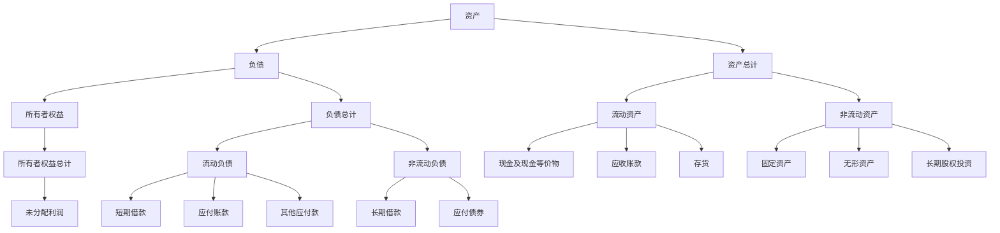
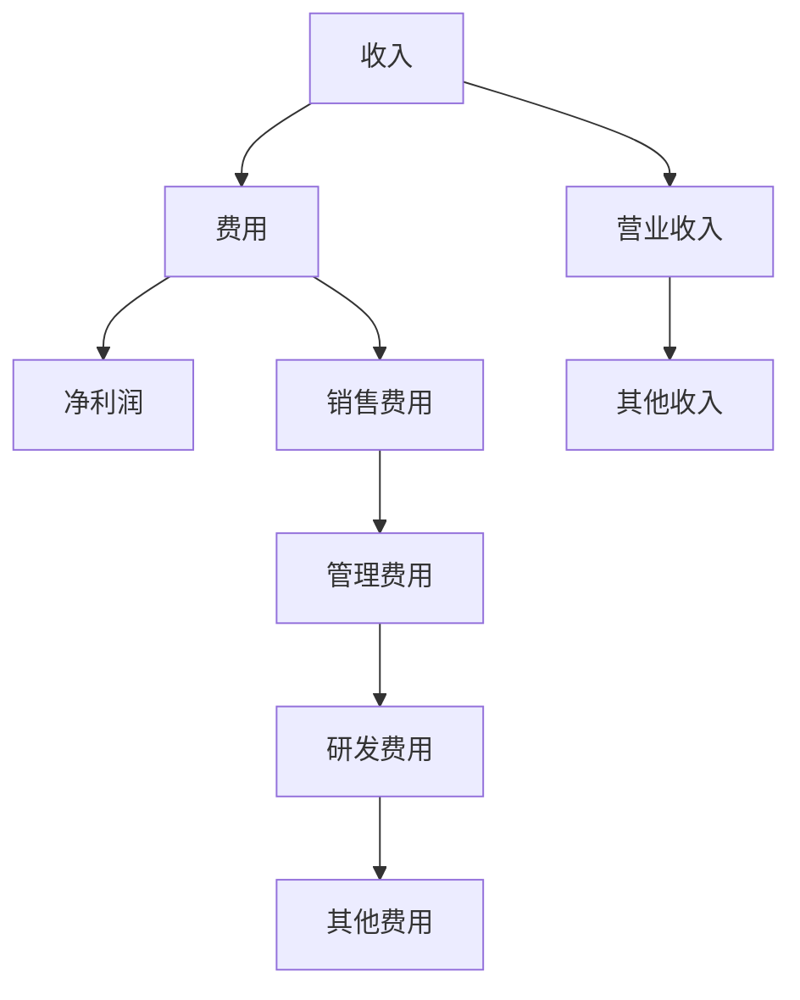
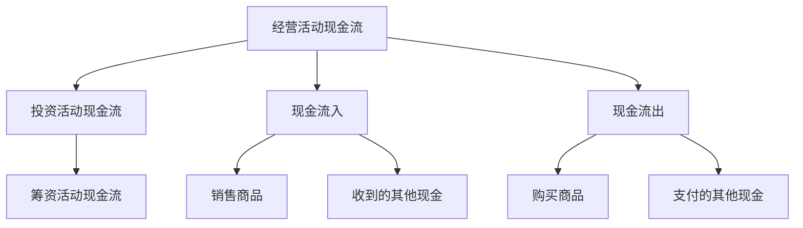

                 


# 如何利用财务报表挖掘潜在的特价股票

> 关键词：财务报表分析，股票估值，特价股票，投资策略，财务指标，价值投资

> 摘要：本文将详细探讨如何利用财务报表分析来挖掘潜在的特价股票。通过对财务报表的深入分析，结合关键财务指标和估值模型，我们可以识别出那些被市场低估的股票，从而制定有效的投资策略。本文将从财务报表基础、财务指标分析、特价股票筛选策略、股票估值方法以及风险管理等方面展开详细讨论，帮助读者掌握利用财务报表挖掘特价股票的核心方法。

---

# 第一部分：财务报表与特价股票挖掘基础

## 第1章：财务报表基础

### 1.1 财务报表的基本概念

#### 1.1.1 财务报表的定义与作用

财务报表是企业在一定会计期间内，对财务状况、经营成果和现金流量进行总结和反映的重要工具。它是投资者、分析师和管理层了解企业财务状况、评估企业价值和制定投资决策的重要依据。

**财务报表的作用：**

- **反映企业财务状况：** 包括资产、负债和所有者权益的构成。
- **评估企业经营成果：** 包括收入、成本和利润的计算。
- **分析企业现金流量：** 包括企业现金流入和流出的来源和用途。

#### 1.1.2 三大财务报表概述

##### 1. 资产负债表（Balance Sheet）

资产负债表反映了企业在某一特定时点的资产、负债和所有者权益的状况。

- **资产（Assets）：**企业拥有的资源，包括流动资产（如现金、应收账款）和非流动资产（如固定资产、无形资产）。
- **负债（Liabilities）：**企业需要偿还的债务，包括流动负债（如应付账款、短期借款）和非流动负债（如长期借款）。
- **所有者权益（Equity）：**企业资产减去负债后，归所有者所有的部分。

##### 2. 利润表（Income Statement）

利润表反映了企业在一定会计期间内的收入和费用情况，以及最终的净利润。

- **收入（Revenue）：**企业在一定会计期间内通过销售商品或提供服务所获得的收入。
- **费用（Expenses）：**企业在经营过程中发生的各项支出，包括销售费用、管理费用、研发费用等。
- **净利润（Net Income）：**收入减去费用后的净收益。

##### 3. 现金流量表（Cash Flow Statement）

现金流量表反映了企业在一定会计期间内现金的流入和流出情况。

- **经营活动现金流（Operating Cash Flow）：**企业通过日常经营活动中产生的现金流入和流出。
- **投资活动现金流（Investing Cash Flow）：**企业投资于长期资产或出售长期资产所产生的现金流入和流出。
- **筹资活动现金流（Financing Cash Flow）：**企业通过发行股票、债券或偿还债务等方式筹集资金所产生的现金流入和流出。

### 1.2 资产负债表

#### 1.2.1 资产负债表的结构与内容

资产负债表通常分为资产、负债和所有者权益三个部分，具体结构如下：



#### 1.2.2 资产负债表的关键指标

- **流动比率（Current Ratio）：** 流动资产除以流动负债，衡量企业短期偿债能力。
- **速动比率（Quick Ratio）：** (流动资产 - 存货) 除以流动负债，衡量企业快速变现能力。
- **资产负债率（Debt-to-Asset Ratio）：** 负债总额除以资产总额，衡量企业负债程度。

#### 1.2.3 资产负债表实例分析

假设某公司资产负债表如下：

| 项目             | 金额（万元） |
|------------------|--------------|
| 现金及现金等价物   | 50           |
| 应收账款         | 100          |
| 存货             | 80           |
| 固定资产         | 200          |
| 负债合计         | 150          |
| 未分配利润       | 70           |

根据上述数据，我们可以计算：

- 流动比率 = (50 + 100 + 80) / 150 = 230 / 150 ≈ 1.53
- 速动比率 = (50 + 100) / 150 = 150 / 150 = 1
- 资产负债率 = 150 / (50 + 100 + 80 + 200) = 150 / 430 ≈ 0.3488 或 34.88%

---

### 1.3 利润表

#### 1.3.1 利润表的结构与内容

利润表通常包括收入、费用和净利润三个部分，具体结构如下：



#### 1.3.2 利润表的关键指标

- **净利润率（Net Profit Margin）：** 净利润 / 收入，衡量企业盈利能力。
- **毛利率（Gross Profit Margin）：** (营业收入 - 营业成本) / 营业收入，衡量企业核心业务的盈利能力。

#### 1.3.3 利润表实例分析

假设某公司利润表如下：

| 项目             | 金额（万元） |
|------------------|--------------|
| 营业收入         | 500          |
| 营业成本         | 300          |
| 销售费用         | 50           |
| 管理费用         | 30           |
| 研发费用         | 20           |
| 净利润           | 100          |

根据上述数据，我们可以计算：

- 毛利率 = (500 - 300) / 500 = 200 / 500 = 0.4 或 40%
- 净利润 = 100 万元
- 净利润率 = 100 / 500 = 0.2 或 20%

---

### 1.4 现金流量表

#### 1.4.1 现金流量表的结构与内容

现金流量表分为经营活动、投资活动和筹资活动三个部分，具体结构如下：



#### 1.4.2 现金流量表的关键指标

- **经营活动现金流净额（Operating Cash Flow）：** 经营活动的现金流入减去现金流出，衡量企业核心业务的现金创造能力。
- **自由现金流（Free Cash Flow）：** 经营活动现金流净额减去资本支出，衡量企业可分配给股东的现金流。

#### 1.4.3 现金流量表实例分析

假设某公司现金流量表如下：

| 项目             | 金额（万元） |
|------------------|--------------|
| 经营活动现金流净额   | 150          |
| 投资活动现金流净额   | -100         |
| 筹资活动现金流净额   | 50           |
| 现金及现金等价物净增加额 | 100          |

根据上述数据，我们可以计算：

- 自由现金流 = 经营活动现金流净额 - 资本支出 = 150 - 100 = 50 万元

---

### 1.5 本章小结

本章介绍了财务报表的基本概念和三大财务报表（资产负债表、利润表和现金流量表）的结构与内容。通过实例分析，我们学会了如何从财务报表中提取关键指标，为后续的财务分析和股票估值打下基础。

---

## 第2章：财务指标分析

### 2.1 财务指标的基本概念

#### 2.1.1 财务指标的分类

财务指标可以分为以下几类：

- **盈利能力指标：** 如净利润率、毛利率等。
- **偿债能力指标：** 如流动比率、速动比率等。
- **营运能力指标：** 如存货周转率、应收账款周转率等。
- **成长能力指标：** 如收入增长率、净利润增长率等。

#### 2.1.2 财务指标的计算方法

财务指标的计算方法通常基于财务报表数据，例如：

- **市盈率（P/E） = 每股股价 / 每股净利润**
- **市净率（P/B） = 每股股价 / 每股净资产**

#### 2.1.3 财务指标的评价标准

不同财务指标有不同的评价标准，例如：

- **市盈率：** 通常来说，市盈率低于行业平均水平可能意味着股票被低估。
- **市净率：** 市净率低于1可能意味着股票被低估。

---

### 2.2 常见财务指标详解

#### 2.2.1 市盈率（P/E）

市盈率是衡量股票价值的重要指标之一，计算公式为：

$$ P/E = \frac{\text{股票价格}}{\text{每股净利润}} $$

市盈率越低，可能意味着股票被低估的风险越大。

#### 2.2.2 市净率（P/B）

市净率是另一个常用的估值指标，计算公式为：

$$ P/B = \frac{\text{股票价格}}{\text{每股净资产}} $$

市净率低于1通常被视为股票被低估的信号。

#### 2.2.3 净资产收益率（ROE）

净资产收益率是衡量企业盈利能力的重要指标，计算公式为：

$$ ROE = \frac{\text{净利润}}{\text{净资产}} $$

ROE 高且稳定的公司通常具有较高的投资价值。

#### 2.2.4 每股收益（EPS）

每股收益是衡量企业盈利能力的另一个重要指标，计算公式为：

$$ EPS = \frac{\text{净利润}}{\text{普通股股数}} $$

---

### 2.3 财务指标与股票估值的关系

#### 2.3.1 财务指标在估值中的作用

财务指标可以帮助投资者评估企业的财务健康状况和投资价值。例如，通过市盈率和市净率可以判断股票是否被低估，通过ROE和EPS可以评估企业的盈利能力。

#### 2.3.2 财务指标的综合运用

在实际投资中，通常需要综合运用多个财务指标来评估股票的投资价值。例如，可以通过比较市盈率和ROE来判断股票的估值是否合理。

---

### 2.4 本章小结

本章详细介绍了常见财务指标的定义、计算方法和评价标准，并探讨了财务指标在股票估值中的作用。通过综合运用这些指标，我们可以更准确地评估股票的投资价值。

---

## 第3章：特价股票挖掘的基本方法

### 3.1 什么是特价股票

#### 3.1.1 特价股票的定义

特价股票通常指那些市场价格低于其内在价值的股票。这类股票可能因为市场短期波动或投资者情绪影响而被低估。

#### 3.1.2 特价股票的特点

- **价格低估：** 市盈率、市净率等指标低于行业平均水平。
- **盈利能力稳定：** 净利润稳定增长，ROE较高。
- **风险较低：** 债务负担轻，流动性较好。

#### 3.1.3 特价股票的分类

- **周期性低估：** 由于行业周期性导致的暂时性低估。
- **市场情绪导致的低估：** 由于投资者情绪波动导致的短期低估。
- **基本面改善：** 由于企业基本面改善导致的估值修复。

---

### 3.2 特价股票的筛选标准

#### 3.2.1 市盈率筛选

市盈率低于行业平均水平的股票可能被视为低估股票。例如，假设行业平均市盈率为20，那么市盈率低于15的股票可能被视为低估。

#### 3.2.2 市净率筛选

市净率低于1的股票通常被视为低估股票。例如，假设某股票的市净率为0.8，而行业平均水平为1.2，那么该股票可能被视为低估。

#### 3.2.3 净资产收益率筛选

ROE 高且稳定的公司通常具有较高的投资价值。例如，假设行业平均ROE为10%，那么ROE超过15%的公司可能被视为高盈利公司。

---

### 3.3 特价股票的挖掘策略

#### 3.3.1 价值投资策略

价值投资策略强调长期投资，寻找那些市场价格低于内在价值的股票。投资者需要关注企业的基本面，如盈利能力、财务状况和成长能力。

#### 3.3.2 技术分析与财务分析结合

通过技术分析（如K线图、均线分析等）和财务分析的结合，可以更准确地判断股票的买入和卖出时机。

#### 3.3.3 风险控制策略

在投资过程中，风险控制是至关重要的。投资者可以通过分散投资、设置止损位等方法来控制风险。

---

### 3.4 本章小结

本章介绍了特价股票的定义、特点和分类，并提出了几种有效的筛选标准和挖掘策略。通过综合运用价值投资、技术分析和风险控制等方法，投资者可以更有效地挖掘潜在的特价股票。

---

## 第4章：财务报表分析与股票估值

### 4.1 财务报表分析在股票估值中的作用

#### 4.1.1 财务报表分析的基本原则

财务报表分析需要基于企业的财务报表数据，结合行业背景和市场环境进行综合分析。投资者需要关注企业的盈利能力、财务健康状况和成长能力。

#### 4.1.2 财务报表分析的步骤

1. **收集数据：** 获取企业的财务报表数据。
2. **计算财务指标：** 计算市盈率、市净率、ROE等关键指标。
3. **行业比较：** 将企业的财务指标与行业平均水平进行比较。
4. **评估价值：** 判断股票是否被低估。

---

### 4.2 股票估值模型

#### 4.2.1 市盈率模型

市盈率模型是一种常用的股票估值方法，计算公式为：

$$ 股票价值 = 市盈率 \times 每股净利润 $$

#### 4.2.2 现金流折现模型

现金流折现模型（DCF模型）是另一种常用的股票估值方法，计算公式为：

$$ 股票价值 = \sum_{t=1}^{n} \frac{\text{自由现金流}}{(1 + r)^t} + \text{终值} $$

其中，r 是折现率，n 是估计的年数，终值是第n年后的终值。

---

### 4.3 财务报表分析与估值实例

#### 4.3.1 某公司财务报表分析

假设某公司财务报表数据如下：

- 营业收入：500万元
- 净利润：100万元
- 普通股股数：100万股
- 净资产：300万元

#### 4.3.2 基于财务报表的估值

1. **计算市盈率：**

$$ P/E = \frac{\text{股票价格}}{\text{EPS}} = \frac{\text{股票价格}}{1} $$

假设股票价格为5元，则市盈率为5。

2. **计算市净率：**

$$ P/B = \frac{\text{股票价格}}{\text{每股净资产}} = \frac{5}{3} \approx 1.67 $$

3. **判断估值：**

- 行业平均市盈率为20，市盈率5低于行业平均水平。
- 行业平均市净率为2，市净率1.67低于行业平均水平。

因此，该股票可能被低估，具有投资价值。

---

### 4.4 本章小结

本章介绍了财务报表分析在股票估值中的作用，并详细讲解了市盈率模型和现金流折现模型。通过实例分析，我们学会了如何基于财务报表数据进行股票估值，从而识别潜在的特价股票。

---

## 第5章：利用财务指标筛选特价股票

### 5.1 财务指标筛选策略

#### 5.1.1 市盈率筛选

通过筛选市盈率低于行业平均水平的股票，可以找到潜在的低估股票。

#### 5.1.2 市净率筛选

通过筛选市净率低于1的股票，可以找到潜在的低估股票。

#### 5.1.3 净资产收益率筛选

通过筛选ROE高且稳定的公司，可以找到具有较高投资价值的股票。

---

### 5.2 财务指标与股票筛选实例

#### 5.2.1 实例分析

假设我们有以下两只股票的财务指标：

| 股票 | 市盈率 | 市净率 | ROE |
|------|--------|--------|-----|
| A    | 15     | 1.5    | 18% |
| B    | 25     | 2.0    | 12% |

假设行业平均市盈率为20，行业平均市净率为1.8，行业平均ROE为15%。

根据上述数据，我们可以判断：

- 股票A的市盈率低于行业平均水平，市净率低于行业平均水平，ROE高于行业平均水平，因此股票A可能被低估。
- 股票B的市盈率高于行业平均水平，市净率高于行业平均水平，ROE低于行业平均水平，因此股票B可能被高估。

因此，股票A更有可能是一只特价股票。

---

### 5.3 本章小结

本章通过实例分析，展示了如何利用财务指标筛选潜在的特价股票。通过综合运用市盈率、市净率和ROE等指标，我们可以更准确地识别出那些被低估的股票。

---

## 第6章：利用Python工具自动化分析财务报表

### 6.1 Python工具的安装与配置

为了进行财务报表分析，我们需要安装以下Python库：

- **Pandas：** 用于数据处理和分析。
- **NumPy：** 用于数值计算。
- **Matplotlib：** 用于数据可视化。
- **Scrapy：** 用于爬取财务报表数据。

#### 6.1.1 安装Python环境

我们需要安装Python 3.8或更高版本，并安装上述库：

```bash
pip install pandas numpy matplotlib scrapy
```

---

### 6.2 财务报表数据的获取与处理

#### 6.2.1 爬取财务报表数据

我们可以使用Scrapy编写爬虫，从金融网站（如Yahoo Finance、Google Finance）获取财务报表数据。

#### 6.2.2 数据清洗与预处理

获取数据后，需要进行数据清洗和预处理，例如：

- 处理缺失值。
- 标准化数据格式。
- 删除异常值。

---

### 6.3 财务指标的计算与分析

#### 6.3.1 市盈率与市净率的计算

假设我们已经获取了某公司的财务数据，我们可以计算市盈率和市净率：

```python
import pandas as pd

# 假设df是包含财务数据的DataFrame
# df.columns = ['公司名称', '股价', '净利润', '净资产']

# 计算市盈率
df['市盈率'] = df['股价'] / df['净利润']

# 计算市净率
df['市净率'] = df['股价'] / df['净资产']

# 输出结果
print(df[['公司名称', '市盈率', '市净率']])
```

#### 6.3.2 财务指标的可视化

我们可以使用Matplotlib对财务指标进行可视化分析，例如：

```python
import matplotlib.pyplot as plt

# 绘制市盈率分布图
plt.hist(df['市盈率'], bins=10, alpha=0.5)
plt.xlabel('市盈率')
plt.ylabel('频率')
plt.title('市盈率分布图')
plt.show()

# 绘制市净率分布图
plt.hist(df['市净率'], bins=10, alpha=0.5)
plt.xlabel('市净率')
plt.ylabel('频率')
plt.title('市净率分布图')
plt.show()
```

---

### 6.4 股票估值与投资策略的自动化

#### 6.4.1 自动化估值模型

我们可以编写Python代码，根据市盈率和市净率自动筛选出潜在的特价股票：

```python
# 筛选市盈率低于行业平均水平且市净率低于1的股票
industry_pe = 20  # 假设行业平均市盈率为20
industry_pb = 1.8  # 假设行业平均市净率为1.8

# 筛选条件
condition = (df['市盈率'] < industry_pe) & (df['市净率'] < industry_pb)

# 输出符合条件的股票
cheap_stocks = df[condition]

print(cheap_stocks)
```

#### 6.4.2 可视化结果

我们可以将筛选出的股票进行可视化展示，例如：

```python
import matplotlib.pyplot as plt

# 绘制市盈率与市净率的散点图
plt.scatter(df['市盈率'], df['市净率'], c='blue', alpha=0.5, label='正常股票')
plt.scatter(cheap_stocks['市盈率'], cheap_stocks['市净率'], c='red', alpha=0.5, label='特价股票')
plt.xlabel('市盈率')
plt.ylabel('市净率')
plt.title('市盈率与市净率散点图')
plt.legend()
plt.show()
```

---

### 6.5 本章小结

本章介绍了如何利用Python工具自动化分析财务报表数据，并通过编写代码筛选出潜在的特价股票。通过自动化分析，我们可以更高效地进行股票估值和投资决策。

---

## 第7章：风险管理与投资策略

### 7.1 风险管理的重要性

在投资过程中，风险管理是至关重要的。投资者需要关注市场风险、流动性风险和信用风险等。

#### 7.1.1 市场风险

市场风险是指由于市场波动导致的资产价格波动风险。

#### 7.1.2 流动性风险

流动性风险是指资产难以快速变现的风险。

#### 7.1.3 信用风险

信用风险是指债券发行人违约的风险。

---

### 7.2 投资策略的制定

#### 7.2.1 长期投资策略

长期投资策略强调持有优质股票，关注企业的长期成长和价值提升。

#### 7.2.2 短期投资策略

短期投资策略强调根据市场波动进行短期买卖，追求短期收益。

#### 7.2.3 组合投资策略

组合投资策略强调分散投资，降低投资风险。

---

### 7.3 风险控制的技巧

#### 7.3.1 设置止损位

在投资过程中，设置止损位可以有效控制风险。

#### 7.3.2 分散投资

通过分散投资，可以降低投资风险。

#### 7.3.3 定期调整投资组合

定期审视和调整投资组合，确保投资策略符合市场环境。

---

### 7.4 本章小结

本章介绍了风险管理的重要性，并提出了几种有效的投资策略和风险控制技巧。投资者在进行股票投资时，需要注重风险管理，制定合理的投资策略，以实现长期稳定的收益。

---

## 第8章：总结与展望

### 8.1 本篇总结

通过本篇博客，我们系统地探讨了如何利用财务报表挖掘潜在的特价股票。从财务报表基础到财务指标分析，再到股票估值和投资策略，我们详细介绍了每一步的分析方法和操作技巧。

### 8.2 未来展望

随着人工智能和大数据技术的发展，财务报表分析将更加智能化和自动化。未来，投资者可以通过更先进的工具和技术，更精准地挖掘潜在的特价股票，实现更高的投资收益。

---

## 作者信息

作者：AI天才研究院/AI Genius Institute & 禅与计算机程序设计艺术 /Zen And The Art of Computer Programming

