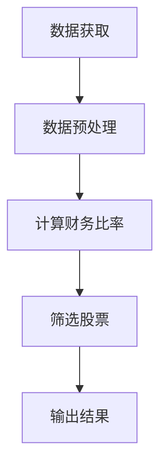
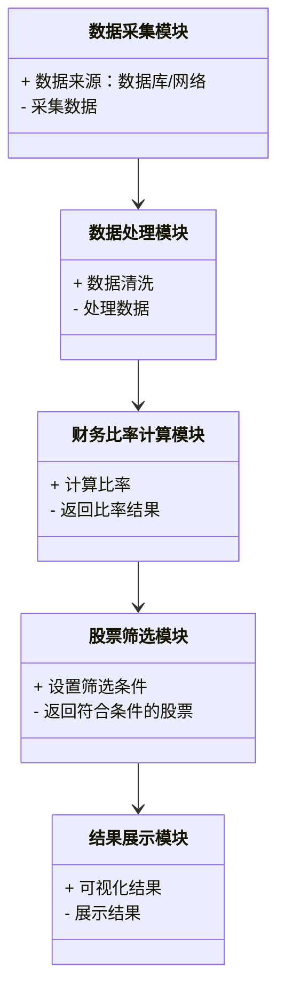
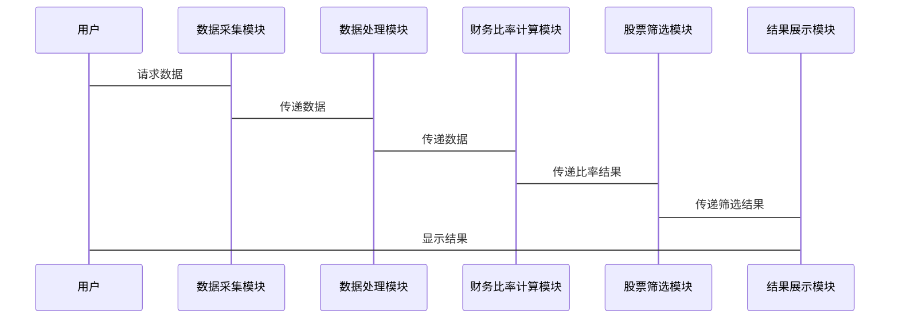

                 

<think>
好的，我需要帮助用户设计一本关于如何利用财务比率筛选潜在特价股票的书籍目录大纲。用户已经提供了一个详细的结构，包括背景、核心概念、算法原理、数学模型、系统架构、项目实战和最佳实践。我的任务是逐步思考如何构建这个目录，并确保它符合用户的具体要求。

首先，我需要理解用户的需求。用户希望这本书能够帮助读者系统地学习如何使用财务比率来筛选股票。这意味着书的内容需要从基础概念开始，逐步深入到实际应用，包括算法、数学模型和系统设计。

接下来，我需要考虑目录的结构。通常，技术书籍分为几个部分：基础、核心概念、算法、数学模型、系统架构、项目实战和总结。用户已经提供了一个初步的结构，我需要确保每个部分都有足够的细节，并且逻辑连贯。

首先，我会考虑第一章“财务比率与股票投资概述”。这里需要介绍财务比率的基本概念和股票投资的基础知识。我需要确保涵盖财务比率的定义、作用，以及它们在股票投资中的重要性。此外，还需要简要介绍财务报表的基础知识，如资产负债表、利润表和现金流量表，因为这些是计算财务比率的基础。

然后，我会思考第二章“财务比率的核心概念”。这里需要详细讲解各种财务比率的分类和特点，例如流动性比率、偿债能力比率、营运效率比率和盈利能力比率。还需要解释这些比率之间的关系，以及它们如何共同影响公司的财务健康状况。

接下来是第三章“财务比率的算法原理”。这部分需要解释如何将财务比率应用到股票筛选中。我需要包括算法的输入和输出、核心步骤，以及如何进行数据预处理和计算财务比率。可能还需要用Mermaid绘制算法流程图，帮助读者理解筛选过程。

第四章将专注于“财务比率的数学模型”。这里需要详细推导各种财务比率的公式，并用Latex格式展示。例如，流动比率和速动比率的公式，以及它们如何用于评估公司的短期偿债能力。同时，需要解释这些公式在股票筛选中的应用。

第五章是“系统分析与架构设计”。这里需要描述如何构建一个股票筛选系统，包括系统功能设计、架构图和接口设计。使用Mermaid绘制类图和序列图，展示系统的组成部分及其交互。

第六章是“项目实战”。这里需要提供一个实际案例，从环境安装到代码实现，再到结果分析，让读者能够实际操作并理解整个流程。同时，还需要解释代码的功能和如何根据筛选结果做出投资决策。

最后是第七章“总结与最佳实践”。这里需要总结前面的内容，并提供一些实用的建议，如如何避免常见错误、持续学习的重要性以及进一步阅读的资源。

在思考过程中，我需要确保每个章节都包含足够的细节，同时保持逻辑清晰。例如，在算法部分，不仅要解释步骤，还要提供Python代码示例，以便读者能够实际应用。此外，数学模型部分需要用准确的公式，并解释每个公式的含义和应用场景。

我还需要考虑读者的背景。这本书的目标读者可能是对股票投资感兴趣的人，他们可能有一定的财务知识，但可能不熟悉编程或系统设计。因此，内容需要通俗易懂，避免过于专业的术语，或者在必要时进行解释。

最后，我需要确保目录结构符合用户的格式要求，使用markdown格式，并在适当的地方插入图表和代码示例。这样，读者不仅能够理解理论知识，还能通过实际操作来应用所学内容。

综上所述，我需要逐步构建每个章节的内容，确保覆盖所有关键点，并且逻辑连贯，帮助读者从基础到高级逐步掌握如何利用财务比率筛选潜在特价股票。
</think>

# 如何利用财务比率筛选潜在特价股票

> 关键词：财务比率，股票筛选，投资策略，算法原理，数学模型

> 摘要：本文系统地介绍如何利用财务比率筛选潜在特价股票。从基础概念到高级算法，结合实际案例和系统设计，详细讲解财务比率的计算、分析方法及其在股票投资中的应用。

---

# 第一部分: 财务比率与股票投资概述

## 第1章: 财务比率与股票投资概述

### 1.1 财务比率的基本概念

#### 1.1.1 财务比率的定义与作用

财务比率是衡量企业财务健康状况的重要指标，通过比较企业的财务数据，评估其偿债能力、营运效率、盈利能力等。这些比率帮助投资者做出更明智的投资决策。

#### 1.1.2 股票投资的基本原理

股票投资是通过购买公司股份，期望其价值增长或分红收益。投资者需要综合考虑公司的财务状况、行业地位、市场趋势等因素。

#### 1.1.3 财务比率在股票投资中的重要性

财务比率能够揭示公司的财务状况，帮助投资者评估其投资价值和风险。例如，流动比率高的公司具有较强的短期偿债能力，可能更适合作为投资对象。

### 1.2 财务报表基础

#### 1.2.1 资产负债表概述

资产负债表展示公司在特定时间点的资产、负债和所有者权益。通过分析这些数据，可以评估公司的财务结构和偿债能力。

#### 1.2.2 利润表概述

利润表反映公司在一定时期内的收入、成本和利润情况，帮助评估公司的盈利能力。

#### 1.2.3 现金流量表概述

现金流量表记录公司现金的流入和流出情况，评估公司的现金流动性。

### 1.3 股票市场与投资者分类

#### 1.3.1 股票市场的基本运作机制

股票市场是公司股份交易的场所，投资者通过买卖股票实现收益或损失。市场波动受多种因素影响，包括经济指标、公司业绩、政策变化等。

#### 1.3.2 投资者的类型与投资策略

投资者可分为散户和机构投资者。散户通常基于个人判断进行投资，而机构投资者则采用系统化的方法，利用财务比率等工具进行分析。

#### 1.3.3 机构投资者与散户投资者的区别

机构投资者通常拥有更多的资源和专业团队，能够进行深入的财务分析，而散户投资者则更多依赖市场情绪和短期趋势。

### 1.4 本章小结

本章介绍了财务比率的基本概念、财务报表的基础知识，以及股票市场的运作机制。理解这些内容是后续分析的基础。

---

## 第2章: 财务比率的核心概念

### 2.1 财务比率的分类与特点

#### 2.1.1 流动性比率

流动性比率衡量公司偿还短期债务的能力，包括流动比率、速动比率等。

#### 2.1.2 偿债能力比率

偿债能力比率评估公司整体的偿债能力，包括资产负债率、利息保障倍数等。

#### 2.1.3 营运效率比率

营运效率比率衡量公司使用资产的效率，如存货周转率、应收账款周转率等。

#### 2.1.4 盈利能力比率

盈利能力比率评估公司创造利润的能力，包括净利润率、ROE（净资产收益率）等。

### 2.2 财务比率的核心要素

#### 2.2.1 资产负债表的核心要素

包括流动资产、非流动资产、流动负债、非流动负债、所有者权益等。

#### 2.2.2 利润表的核心要素

包括收入、成本、净利润等。

#### 2.2.3 现金流量表的核心要素

包括经营活动、投资活动和筹资活动的现金流。

### 2.3 财务比率之间的关系

#### 2.3.1 财务比率的相互影响

例如，流动比率高可能意味着存货周转率较低，反之亦然。

#### 2.3.2 财务比率的综合分析

通过综合分析多个比率，可以全面评估公司的财务状况。

### 2.4 本章小结

本章详细讲解了财务比率的分类和核心要素，强调了综合分析的重要性。

---

## 第3章: 财务比率的算法原理

### 3.1 财务比率筛选算法的基本原理

#### 3.1.1 算法输入与输出

输入：公司财务数据；输出：筛选出符合条件的股票。

#### 3.1.2 算法的核心步骤

1. 数据获取与预处理：收集并清洗财务数据。
2. 计算财务比率：根据公式计算各项比率。
3. 股票筛选：基于预设条件筛选股票。

### 3.2 财务比率筛选算法的实现

#### 3.2.1 数据获取与预处理

使用Python的pandas库进行数据清洗和处理。

#### 3.2.2 财务比率计算

根据公式计算各项比率，并存储在数据框中。

#### 3.2.3 股票筛选

根据设定的条件筛选出符合条件的股票，并输出结果。

### 3.3 算法流程图



### 3.4 本章小结

本章通过流程图和代码示例，详细讲解了财务比率筛选算法的实现过程。

---

## 第4章: 财务比率的数学模型与公式

### 4.1 财务比率的数学公式

#### 4.1.1 流动比率（Current Ratio）

$$ \text{流动比率} = \frac{\text{流动资产}}{\text{流动负债}} $$

#### 4.1.2 速动比率（Quick Ratio）

$$ \text{速动比率} = \frac{\text{速动资产}}{\text{流动负债}} $$

#### 4.1.3 存货周转率（Inventory Turnover）

$$ \text{存货周转率} = \frac{\text{营业成本}}{\text{平均存货}} $$

#### 4.1.4 净利润率（Net Profit Margin）

$$ \text{净利润率} = \frac{\text{净利润}}{\text{营业收入}} \times 100\% $$

### 4.2 本章小结

本章通过数学公式详细讲解了财务比率的计算方法。

---

## 第5章: 系统分析与架构设计

### 5.1 问题场景介绍

投资者需要一个系统来自动筛选潜在特价股票，提高投资效率。

### 5.2 系统功能设计

#### 5.2.1 系统功能模块

1. 数据采集模块：从数据库或网络获取公司财务数据。
2. 数据处理模块：清洗和预处理数据。
3. 财务比率计算模块：计算各项财务比率。
4. 股票筛选模块：根据设定条件筛选股票。
5. 结果展示模块：以可视化方式展示筛选结果。

#### 5.2.2 系统功能设计图（Mermaid类图）



### 5.3 系统架构设计

#### 5.3.1 系统架构图（Mermaid架构图）

```mermaid
container 股票筛选系统 {
    class 数据采集模块
    class 数据处理模块
    class 财务比率计算模块
    class 股票筛选模块
    class 结果展示模块
}
```

### 5.4 系统接口设计

#### 5.4.1 接口描述

1. 数据采集模块接口：接收财务数据。
2. 数据处理模块接口：接收处理后的数据。
3. 财务比率计算模块接口：接收财务数据，返回比率结果。
4. 股票筛选模块接口：接收比率结果，返回筛选结果。
5. 结果展示模块接口：接收筛选结果，展示给用户。

#### 5.4.2 系统交互图（Mermaid序列图）



### 5.5 本章小结

本章通过系统设计和架构图，详细讲解了股票筛选系统的实现方案。

---

## 第6章: 项目实战

### 6.1 环境安装

#### 6.1.1 安装Python

使用Anaconda安装Python环境。

#### 6.1.2 安装所需库

安装pandas、numpy、matplotlib等库。

### 6.2 系统核心实现源代码

#### 6.2.1 数据采集模块

```python
import pandas as pd

def get_financial_data(ticker):
    # 模拟从数据库获取数据
    data = pd.read_csv(f'{ticker}.csv')
    return data
```

#### 6.2.2 数据处理模块

```python
def preprocess_data(data):
    # 模拟数据清洗
    data.dropna(inplace=True)
    return data
```

#### 6.2.3 财务比率计算模块

```python
def calculate_ratios(data):
    # 计算流动比率
    current_ratio = data['流动资产'] / data['流动负债']
    # 计算速动比率
    quick_ratio = data['速动资产'] / data['流动负债']
    return current_ratio, quick_ratio
```

#### 6.2.4 股票筛选模块

```python
def screen_stocks(current_ratio, quick_ratio, threshold=2):
    selected = (current_ratio > threshold) & (quick_ratio > 1.5)
    return selected
```

#### 6.2.5 结果展示模块

```python
import matplotlib.pyplot as plt

def display_results(selected_stocks):
    plt.figure(figsize=(10,6))
    plt.bar(selected_stocks.index, selected_stocks['公司名称'], color='blue')
    plt.title('符合条件的股票')
    plt.show()
```

### 6.3 代码应用解读与分析

#### 6.3.1 代码功能说明

上述代码展示了如何从数据采集到结果展示的整个流程。每个模块负责特定的任务，最终筛选出符合条件的股票。

#### 6.3.2 代码实现细节

通过Python代码实现数据处理和财务比率计算，确保数据准确性和计算效率。

### 6.4 实际案例分析和详细讲解剖析

#### 6.4.1 案例背景

假设我们有多个公司的财务数据，目标是筛选出流动比率大于2且速动比率大于1.5的公司。

#### 6.4.2 数据来源

从CSV文件中获取各公司的财务数据。

#### 6.4.3 筛选过程

1. 获取数据：从文件中读取数据。
2. 数据清洗：删除缺失值。
3. 计算比率：计算流动比率和速动比率。
4. 筛选股票：根据设定条件筛选出符合条件的股票。
5. 展示结果：以图表形式展示筛选结果。

### 6.5 本章小结

本章通过实际案例展示了如何使用Python代码实现财务比率筛选，帮助读者理解理论知识的实际应用。

---

## 第7章: 总结与最佳实践

### 7.1 本章总结

本文详细讲解了如何利用财务比率筛选潜在特价股票，从基础概念到系统设计，再到实际应用，为读者提供了全面的知识体系。

### 7.2 最佳实践 tips

1. 在进行财务比率分析时，应结合其他因素，如行业特点和市场趋势，综合评估股票的投资价值。
2. 定期更新财务数据，确保分析结果的准确性。
3. 保持对市场动态的敏感性，及时调整投资策略。

### 7.3 注意事项

- 确保数据来源的可靠性和准确性。
- 在使用财务比率筛选股票时，避免单一指标决策，应综合考虑多个指标。
- 定期回顾和评估筛选结果，及时优化筛选条件。

### 7.4 拓展阅读

- 《投资学基础》
- 《财务报表分析》
- 《Python金融数据分析》

### 7.5 本章小结

本章总结了全文内容，并提供了实用的建议，帮助读者更好地应用所学知识。

---

# 作者：AI天才研究院/AI Genius Institute & 禅与计算机程序设计艺术 /Zen And The Art of Computer Programming

---

# 结语

通过系统地学习和实践，读者可以掌握如何利用财务比率筛选潜在特价股票，提升投资决策的科学性和准确性。

