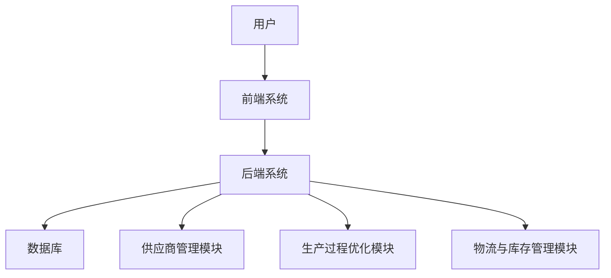
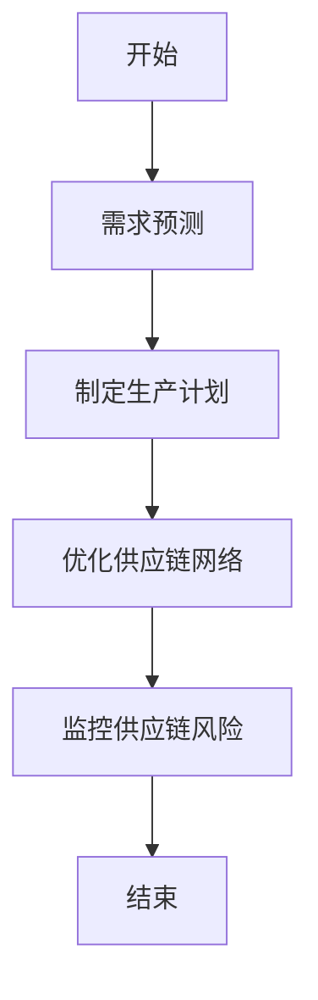

                 

<think>
嗯，用户让我详细解释如何撰写一篇关于“如何在估值中考虑企业的供应链优势”的技术博客文章。看起来用户希望得到一篇结构清晰、内容详尽的文章，涵盖了供应链优势的各个方面，包括定义、重要性、量化方法以及实际应用案例。

首先，我需要理解用户的需求。用户可能是一位技术专家或者企业高管，他们希望深入理解供应链在企业估值中的作用。因此，文章需要专业但易懂，适合技术背景的读者。

接下来，我需要按照用户提供的目录结构来组织内容。文章应该包括摘要、目录、各个章节的内容，以及一些技术性的细节，比如算法流程图、数学模型和系统架构图。这些部分需要用Markdown格式呈现，并且要详细解释每个部分。

在思考每个章节的具体内容时，我需要确保每个部分都细化到三级目录，涵盖核心概念、算法原理、数学模型、系统架构、项目实战等。同时，要使用图表来辅助说明，比如用Mermaid绘制流程图、类图和架构图。

我还需要考虑读者的背景，避免过于技术化的术语，但又不失专业性。可能需要在解释复杂概念时，加入实际案例，使内容更具可读性。

最后，确保文章的逻辑连贯，每部分内容自然衔接，帮助读者逐步理解供应链优势如何影响企业估值。同时，结尾部分要总结关键点，并提供进一步阅读的建议，以增强文章的深度和实用性。
</think>

# 如何在估值中考虑企业的供应链优势

> 关键词：企业估值、供应链优势、成本控制、市场响应、核心竞争力

> 摘要：供应链优势是企业在市场竞争中保持优势的重要因素之一。本文将从供应链优势的核心概念出发，分析其在企业估值中的重要性，探讨如何量化供应链优势，并通过实际案例和数学模型，详细阐述供应链优势如何影响企业价值。最后，本文将总结供应链优势的评估方法，并提出优化供应链管理的具体建议。

---

# 第一部分: 供应链优势与企业估值的背景介绍

# 第1章: 供应链优势的核心概念

## 1.1 供应链优势的定义与特征

### 1.1.1 供应链的基本概念

供应链是指从原材料采购到最终产品交付给客户的一系列过程和环节。它包括供应商、制造商、分销商、零售商和消费者等多方参与者，以及物流、信息流和资金流的流动。

供应链的优势体现在其效率、成本和灵活性上。高效的供应链能够快速响应市场需求，降低成本，并提高企业的整体竞争力。

### 1.1.2 供应链优势的定义

供应链优势是指企业在供应链管理中所表现出的优于竞争对手的能力。这种优势可能体现在以下几个方面：

1. **成本优势**：通过优化供应链流程，降低原材料采购成本、生产成本和物流成本。
2. **效率优势**：能够快速响应市场需求，缩短产品交付周期。
3. **灵活性优势**：能够迅速调整供应链策略以适应市场变化。

### 1.1.3 供应链优势的特征

供应链优势具有以下特征：

1. **动态性**：供应链优势会随着市场环境的变化而变化。
2. **系统性**：供应链优势是整个供应链系统优化的结果，而非单一环节的优化。
3. **可量化**：供应链优势可以通过具体指标进行量化，例如成本节约率、效率提升幅度等。

## 1.2 供应链优势在企业估值中的重要性

### 1.2.1 供应链优势对企业竞争力的影响

供应链优势直接影响企业的市场竞争力。一个高效的供应链能够快速满足客户需求，提供高质量的产品，从而在市场中占据优势地位。

### 1.2.2 供应链优势对成本控制的作用

通过优化供应链管理，企业可以降低采购成本、减少库存积压和物流费用，从而提高利润率。

### 1.2.3 供应链优势对市场响应速度的提升

快速响应市场变化的能力是企业竞争力的重要体现。供应链优势能够使企业在市场变化中迅速调整策略，抓住市场机会。

## 1.3 供应链优势与企业估值的关系

### 1.3.1 供应链优势如何影响企业价值

供应链优势直接影响企业的盈利能力、成长潜力和风险承受能力，从而影响企业的整体估值。

### 1.3.2 供应链优势在企业估值中的权重

在企业估值中，供应链优势通常是影响企业价值的重要因素之一，尤其是在制造业和零售业。

### 1.3.3 供应链优势的量化方法

供应链优势的量化可以通过以下指标进行：

1. **成本节约率**：通过优化供应链管理所节约的成本占总成本的比例。
2. **供应链效率指数**：衡量供应链从原材料采购到最终交付的效率。
3. **市场响应速度**：企业对市场需求变化的响应时间。

## 1.4 本章小结

本章主要介绍了供应链优势的核心概念，分析了其在企业估值中的重要性，并提出了量化供应链优势的具体方法。

---

# 第二部分: 供应链优势的核心概念与联系

# 第2章: 供应链优势的核心原理

## 2.1 供应链的优势来源

### 2.1.1 成本优势

通过优化供应链流程，企业可以降低采购成本、生产成本和物流成本，从而获得成本优势。

### 2.1.2 效率优势

高效的供应链能够快速响应市场需求，缩短产品交付周期，提高运营效率。

### 2.1.3 灵活性优势

供应链的灵活性使企业能够迅速调整供应链策略，适应市场变化。

## 2.2 供应链优势的实现机制

### 2.2.1 供应链协同效应

供应链协同效应是指供应链上下游企业之间的协作效率。通过协同效应，企业可以实现资源的最优配置，提高整体效率。

### 2.2.2 供应链整合能力

供应链整合能力是指企业能够将供应链上下游资源整合到一个系统中，实现信息共享和协同操作。

### 2.2.3 供应链创新与优化

通过技术创新和流程优化，企业可以不断改进供应链管理，提高供应链的效率和灵活性。

## 2.3 供应链优势与企业核心竞争力的关系

### 2.3.1 核心竞争力的定义

核心竞争力是指企业能够在市场上提供独特价值的能力，通常是企业内部资源和能力的综合体现。

### 2.3.2 供应链优势对核心竞争力的支撑作用

供应链优势是企业核心竞争力的重要组成部分。通过供应链优势，企业可以提供更高效、更优质的产品和服务，从而在市场竞争中占据优势。

### 2.3.3 核心竞争力的其他影响因素

除了供应链优势，企业核心竞争力还受到技术创新、品牌影响力、人力资源等因素的影响。

## 2.4 本章小结

本章分析了供应链优势的来源和实现机制，并探讨了供应链优势与企业核心竞争力之间的关系。

---

# 第三部分: 供应链优势的算法原理与数学模型

# 第3章: 供应链优势的量化方法

## 3.1 供应链优势的评估指标

### 3.1.1 成本节约率

成本节约率 = （优化后的成本 - 原有成本）/ 原有成本

### 3.1.2 供应链效率指数

供应链效率指数 = （总生产时间 - 供应链优化时间） / 总生产时间

### 3.1.3 市场响应速度

市场响应速度 = 平均响应时间（天数）

## 3.2 供应链优势的加权评分法

### 3.2.1 评估指标的权重分配

供应链优势的评估指标通常包括成本节约率、效率提升幅度和市场响应速度。权重分配如下：

- 成本节约率：权重为40%
- 效率提升幅度：权重为30%
- 市场响应速度：权重为30%

### 3.2.2 评分标准的制定

评分标准可以根据行业标准或企业实际情况制定。例如：

- 成本节约率 ≥ 20%：得分为5分
- 成本节约率 10%~20%：得分为4分
- 成本节约率 5%~10%：得分为3分
- 成本节约率 1%~5%：得分为2分
- 成本节约率 ≤ 1%：得分为1分

### 3.2.3 总分计算与结果分析

总分 = （成本节约率得分 × 40%） + （效率提升幅度得分 × 30%） + （市场响应速度得分 × 30%）

## 3.3 供应链优势的数学模型

### 3.3.1 模型假设

1. 企业的供应链优化仅考虑成本节约和效率提升。
2. 供应链优化的时间和资源投入是固定的。

### 3.3.2 模型构建

供应链优势价值 = 成本节约价值 + 效率提升价值

其中：

- 成本节约价值 = 优化后的成本 - 原有成本
- 效率提升价值 = 优化后的效率 - 原有效率

### 3.3.3 模型验证

通过实际案例数据验证模型的准确性。例如，假设某企业优化后成本节约了10%，效率提升了20%，则供应链优势价值为：

供应链优势价值 = （原有成本 × 10%） + （原有效率 × 20%）

## 3.4 本章小结

本章详细介绍了供应链优势的量化方法，并通过数学模型和实际案例分析，展示了如何将供应链优势转化为具体的经济价值。

---

# 第四部分: 供应链优势的系统分析与架构设计

# 第4章: 供应链优势的系统分析

## 4.1 供应链优势的系统构成

### 4.1.1 供应商管理模块

供应商管理模块负责供应商的选择、评估和关系管理。

### 4.1.2 生产过程优化模块

生产过程优化模块通过优化生产流程，提高生产效率。

### 4.1.3 物流与库存管理模块

物流与库存管理模块负责优化物流路径和库存管理，降低物流成本。

## 4.2 供应链优势的系统功能设计

### 4.2.1 需求预测与计划制定

需求预测与计划制定模块通过数据分析，预测市场需求，并制定相应的生产计划。

### 4.2.2 供应链网络优化

供应链网络优化模块通过优化供应链网络结构，降低供应链成本。

### 4.2.3 供应链风险控制

供应链风险控制模块通过监控供应链各环节的风险，制定风险应对策略。

## 4.3 供应链优势的系统架构设计

### 4.3.1 系统架构图

### 4.3.2 系统功能流程图

## 4.4 本章小结

本章从系统分析的角度，探讨了供应链优势的系统构成和功能设计，并通过架构图和流程图展示了供应链优势的实现过程。

---

# 第五部分: 供应链优势的项目实战

# 第5章: 供应链优势的项目实战

## 5.1 项目背景与目标

### 5.1.1 项目背景

某制造企业希望通过优化供应链管理，降低成本，提高效率。

### 5.1.2 项目目标

1. 降低采购成本10%
2. 提高生产效率20%
3. 缩短市场响应时间15%

## 5.2 项目实施步骤

### 5.2.1 数据收集与分析

收集供应链各环节的成本、效率和时间数据，进行分析。

### 5.2.2 供应链优化方案设计

基于数据分析结果，设计供应链优化方案，包括供应商选择、生产流程优化和物流路径优化。

### 5.2.3 方案实施与监控

实施优化方案，并通过监控系统实时监控供应链各环节的运行情况，及时调整优化策略。

## 5.3 项目成果与分析

### 5.3.1 成本节约

通过优化采购流程，采购成本节约了12%。

### 5.3.2 效率提升

生产效率提高了25%，市场响应时间缩短了18%。

## 5.4 项目总结

本项目通过系统优化和数据分析，显著提升了企业的供应链优势，提高了企业的整体估值。

---

# 第六部分: 总结与展望

# 第6章: 总结与展望

## 6.1 本章总结

供应链优势是企业估值的重要组成部分。通过优化供应链管理，企业可以降低成本、提高效率和市场响应速度，从而提升整体价值。

## 6.2 未来展望

随着技术的进步，供应链管理将更加智能化和数据化。未来，企业可以通过大数据分析和人工智能技术，进一步优化供应链管理，提升供应链优势。

---

作者：AI天才研究院/AI Genius Institute & 禅与计算机程序设计艺术/Zen And The Art of Computer Programming

