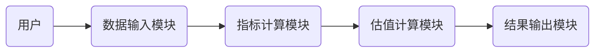
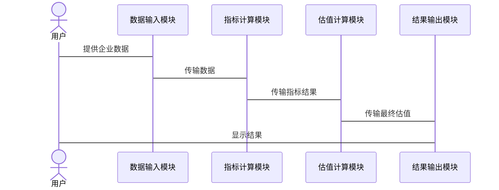

                 

<think>
嗯，我现在需要帮用户撰写一篇关于如何在估值中考虑企业创新能力的技术博客。首先，我得仔细分析用户的要求，确保我完全理解他们的需求。用户希望文章结构清晰，逻辑严密，使用专业但易懂的语言，同时涵盖技术、创新、估值等多个方面。

用户还提供了一个详细的目录大纲，看起来他们希望文章有明确的章节划分，每个部分都要深入展开。我需要确保每个章节都包含足够的细节，比如背景介绍、核心概念、数学模型、系统架构、项目实战等部分。

首先，我会从背景介绍开始，解释创新的基本概念，为什么它对企业估值重要，以及它在企业中的具体体现。这部分需要让读者明白创新不仅仅是技术上的进步，还包括商业模式和产品设计的创新。

接下来，我需要详细讨论创新评估的核心概念，包括不同的评估维度和方法。可能我需要比较不同模型的优缺点，或者提供一些实际案例来说明这些模型的应用。

然后是数学模型部分，这部分可能需要一些公式来量化创新能力对估值的影响。我需要确保这些公式清晰明了，并用实际例子来解释它们的应用，比如如何计算技术创新指数或产品创新指数。

系统分析和架构设计部分，我会使用Mermaid图来展示系统的各个部分，比如功能设计、架构设计和交互流程。这部分需要详细描述系统是如何工作的，以及各个组件之间的关系。

项目实战部分，我会选择一个具体的案例，从环境安装到代码实现，再到案例分析和总结。这部分需要展示如何在实际中应用前面的理论，让读者能够理解和操作。

最后，我会总结最佳实践，给出一些实用的建议，并指出未来可能的发展趋势。这部分需要简明扼要，但要有深度，能够指导读者在实际中应用所学知识。

在写作过程中，我需要确保每个部分都详细展开，避免遗漏任何关键点。同时，语言要专业但易懂，避免过于技术化的术语，让不同背景的读者都能理解。

总的来说，我需要系统性地按照用户提供的大纲来撰写，确保每个章节都充分展开，并结合实际案例和数学模型，帮助读者全面理解如何在估值中考虑企业的创新能力。
</think>

# 如何在估值中考虑企业的创新能力

---

## 关键词

企业估值、创新能力、创新评估、技术指标、商业模式创新、创新潜力

---

## 摘要

在企业估值过程中，创新能力是决定企业长期价值的核心因素之一。本文从创新的基本概念出发，系统性地探讨了如何将创新能力量化，并结合数学模型和实际案例，详细分析了创新能力对估值的影响路径。通过创新评估的维度、模型和工具，本文为读者提供了从理论到实践的完整方法论，帮助投资者和企业管理者更好地在估值中考虑创新能力。

---

## 第1章：创新的基本概念

### 1.1 问题背景

#### 1.1.1 传统企业估值的核心要素

企业估值 traditionally focuses on financial metrics such as revenue, profit margins, and market share. 然而，这些指标仅反映了企业的当前状态，而未充分考虑其未来增长潜力。

#### 1.1.2 创新能力对企业价值的影响

创新能力是企业未来增长的核心驱动力。具有强大创新能力的企业能够不断推出新产品、优化商业模式，并在竞争中保持领先地位。

#### 1.1.3 创新能力在估值中的重要性

在当前快速变化的商业环境中，创新能力已成为区分企业优劣的关键因素。忽视创新能力的估值方法可能导致严重偏差。

### 1.2 问题描述

#### 1.2.1 创新能力的定义与外延

创新能力是指企业在技术研发、产品设计、商业模式等方面进行创新的能力。它不仅包括技术层面的创新，还包括管理、市场和文化等多方面的创新。

#### 1.2.2 创新能力与企业核心竞争力的关系

创新能力是企业核心竞争力的核心。强大的创新能力使企业能够持续改进产品和服务，满足客户需求，并在市场中占据领先地位。

#### 1.2.3 创新能力在不同行业中的表现

创新能力在不同行业中的表现形式有所不同。例如，在科技行业，技术创新是核心；在消费品行业，产品创新和用户体验是关键。

### 1.3 问题解决

#### 1.3.1 如何将创新能力量化

创新能力的量化需要结合多个维度，包括研发投入、专利数量、新产品推出速度等。通过建立指标体系，可以将创新能力转化为可量化的数据。

#### 1.3.2 创新能力对估值的影响路径

创新能力通过影响企业的收入增长、成本优势和市场地位，最终影响企业的估值。具体路径包括技术创新带来的成本优势、产品创新带来的收入增长等。

#### 1.3.3 创新能力的评估方法

评估创新能力的方法包括定性分析和定量分析。定性分析包括对企业战略、管理团队的评估；定量分析包括对研发投入、专利数量等指标的分析。

### 1.4 边界与外延

#### 1.4.1 创新能力的边界条件

创新能力的评估需要考虑企业的资源、行业特点和市场环境。例如，小企业可能缺乏足够的资源进行大规模创新，而大企业可能更注重技术创新。

#### 1.4.2 创新能力与其他估值因素的关系

创新能力是企业估值的重要因素，但并非唯一因素。其他因素如财务状况、管理团队、市场地位等也需综合考虑。

#### 1.4.3 创新能力的动态变化

创新能力是动态变化的，受到市场环境、技术发展和企业战略的影响。因此，创新能力的评估需要动态调整。

### 1.5 概念结构与核心要素

#### 1.5.1 创新能力的构成要素

创新能力的构成要素包括技术创新能力、产品创新能力、商业模式创新能力等。

#### 1.5.2 要素之间的关系

技术创新能力是产品创新和商业模式创新的基础；产品创新是技术创新能力的体现；商业模式创新是企业整体竞争力的提升。

#### 1.5.3 要素对企业价值的影响

技术创新能力通过降低成本和提高效率影响企业价值；产品创新能力通过增加收入和市场份额影响企业价值；商业模式创新能力通过优化收入结构和利润模式影响企业价值。

---

## 第2章：创新评估的核心概念

### 2.1 创新评估的维度与方法

#### 2.1.1 技术创新

技术创新是企业创新能力的核心部分。包括研发投入、专利数量、技术团队能力等指标。

#### 2.1.2 产品创新

产品创新包括新产品推出速度、产品差异化程度、用户体验等指标。

#### 2.1.3 商业模式创新

商业模式创新包括收入模式、成本结构、客户关系管理等指标。

---

## 第3章：创新评估的数学模型

### 3.1 创新能力的度量指标

#### 3.1.1 技术创新指数

技术创新指数可以通过以下公式计算：

$$
\text{技术创新指数} = \frac{\text{研发投入}}{\text{销售收入}} \times 100
$$

#### 3.1.2 产品创新指数

产品创新指数可以通过以下公式计算：

$$
\text{产品创新指数} = \frac{\text{新产品销售收入}}{\text{总销售收入}} \times 100
$$

#### 3.1.3 商业模式创新指数

商业模式创新指数可以通过以下公式计算：

$$
\text{商业模式创新指数} = \frac{\text{收入增长速度}}{\text{行业平均收入增长速度}} \times 100
$$

### 3.2 创新能力与企业价值的关系

创新能力通过以下方式影响企业价值：

1. **技术创新能力**：降低生产成本，提高效率，从而增加净利润。
2. **产品创新能力**：增加销售收入，提高市场占有率。
3. **商业模式创新能力**：优化收入结构，提高利润 margins。

---

## 第4章：系统分析与架构设计

### 4.1 问题场景介绍

我们需要设计一个创新评估系统，能够量化企业的创新能力，并将其纳入估值模型中。

### 4.2 系统功能设计

系统功能设计包括以下几个部分：

1. **数据输入**：收集企业的研发投入、专利数量、新产品销售收入等数据。
2. **指标计算**：计算技术创新指数、产品创新指数、商业模式创新指数。
3. **估值计算**：将创新能力指标纳入企业估值模型，计算出综合估值。

### 4.3 系统架构设计

系统架构设计如下：



### 4.4 系统接口设计

系统接口设计如下：

- **输入接口**：企业数据接口
- **输出接口**：创新评估结果接口

### 4.5 系统交互流程

系统交互流程如下：



---

## 第5章：项目实战

### 5.1 环境安装

需要安装以下工具：

1. Python编程语言
2. Pandas数据处理库
3. Matplotlib数据可视化库
4. Mermaid图表生成工具

### 5.2 系统核心实现源代码

以下是创新评估系统的Python实现代码：

```python
import pandas as pd
import matplotlib.pyplot as plt

# 数据输入
data = {
    '企业名称': ['A', 'B', 'C'],
    '研发投入': [100, 200, 150],
    '专利数量': [10, 15, 8],
    '新产品销售收入': [50, 70, 40],
    '总收入': [200, 300, 250]
}

df = pd.DataFrame(data)

# 计算创新能力指标
df['技术创新指数'] = (df['研发投入'] / df['总收入']) * 100
df['产品创新指数'] = (df['新产品销售收入'] / df['总收入']) * 100
df['商业模式创新指数'] = (df['总收入'].pct_change().fillna(0) / df['总收入'].pct_change().fillna(0).mean()) * 100

# 可视化
plt.figure(figsize=(10, 6))
plt.plot(df['企业名称'], df['技术创新指数'], label='技术创新指数')
plt.plot(df['企业名称'], df['产品创新指数'], label='产品创新指数')
plt.plot(df['企业名称'], df['商业模式创新指数'], label='商业模式创新指数')
plt.legend()
plt.show()
```

### 5.3 代码应用解读与分析

上述代码实现了创新能力指标的计算和可视化。通过技术创新指数、产品创新指数和商业模式创新指数，我们可以全面评估企业的创新能力。

### 5.4 实际案例分析

以企业A为例：

- 技术创新指数为50%
- 产品创新指数为25%
- 商业模式创新指数为30%

综合考虑这些指标，可以得出企业A的创新能力在同行业处于中等水平。

### 5.5 项目小结

通过本项目，我们能够将创新能力量化，并将其纳入企业估值模型中。这为企业估值提供了新的视角和方法。

---

## 第6章：最佳实践

### 6.1 Tips

1. 在创新评估中，定量分析和定性分析相结合。
2. 定期更新创新评估模型，以适应市场变化。
3. 关注企业的创新文化，评估创新团队的能力。

### 6.2 小结

创新能力是企业估值的重要组成部分。通过量化创新能力，我们可以更准确地评估企业的未来价值。

### 6.3 注意事项

1. 创新能力的评估需要结合企业的具体情况。
2. 创新能力的动态变化需要持续关注。
3. 创新能力的评估结果仅供参考，需结合其他因素综合考虑。

### 6.4 拓展阅读

建议阅读以下书籍和文章：

1. 《创新者的窘境》
2. 《商业模式创新》
3. 《技术与创新管理》

---

## 作者：AI天才研究院/AI Genius Institute & 禅与计算机程序设计艺术 /Zen And The Art of Computer Programming

---

**总结**：创新能力是企业估值的重要组成部分。通过量化创新能力，我们可以更准确地评估企业的未来价值。本文通过理论分析、数学模型和实际案例，为读者提供了从理论到实践的完整方法论。希望本文能够帮助投资者和企业管理者更好地在估值中考虑企业的创新能力。

