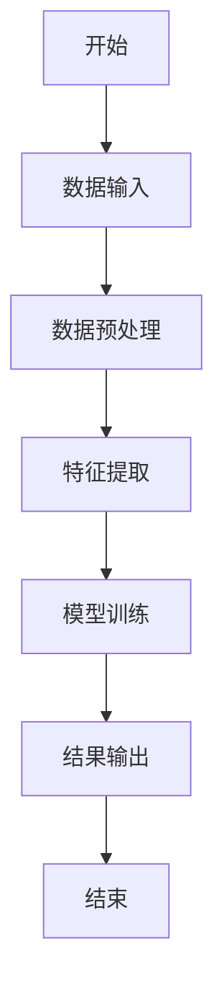
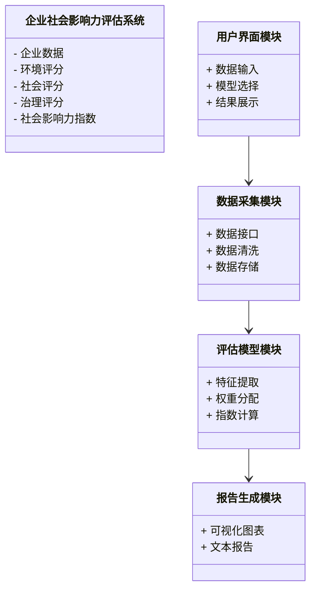

                 

<think>
好，我现在需要根据用户的要求，撰写一篇关于《如何在估值中考虑企业的社会影响力》的详细技术博客文章。用户已经给出了一个目录大纲，我需要按照这个大纲来逐步构建文章的各个部分。我会先从文章标题、关键词和摘要开始，然后逐步填充每一章的内容。

首先，文章标题是“如何在估值中考虑企业的社会影响力”。关键词应该包括“企业估值”、“社会影响力”、“ESG”、“可持续发展”、“投资策略”、“影响力评估”。摘要部分需要简明扼要地概述文章的核心内容，即介绍如何将社会影响力因素纳入企业估值模型，提升长期投资价值。

接下来，进入文章正文部分。第一章是企业社会影响力概述，分为三节：概念、重要性、背景。在“1.1 企业社会影响力的概念”中，我需要解释什么是社会影响力，包括环境、社会和治理三个方面。然后，讨论它与企业价值的关系，强调长期影响。

在“1.2 企业社会影响力的重要性”中，我需要详细说明对利益相关者的影响，企业声誉，以及长期发展的意义。这里可以引用一些研究数据，比如高社会影响力企业如何在品牌价值上表现更好。

然后是“1.3 企业社会影响力评估的背景”，介绍全球化、可持续发展兴起以及投资者对ESG的关注。这部分需要提到法规和市场趋势，如欧盟的CSRD和美国的ESG投资趋势，以展示背景的重要性。

第二章是核心概念，包括维度、实体关系和数学模型。在“2.1 核心概念与属性”中，我会列出环境、社会和治理三个维度，并用表格对比它们的不同方面，比如环境关注碳排放，社会关注员工权益，治理关注透明度。同时，绘制ER图展示这些维度之间的关系。

在“2.2 实体关系架构”中，我会用Mermaid绘制ER图，展示各个维度之间的关联。例如，企业可能在环境、社会和治理方面都有数据，这些数据通过评分和权重连接起来，形成综合的社会影响力指数。

第三章是算法原理，包括概述、流程图、代码和数学模型。在“3.1 算法概述”中，我会介绍基于多因子的评估模型，以及机器学习的应用。然后，用Mermaid绘制算法流程图，展示数据输入、预处理、特征提取、模型训练和结果输出的过程。

接下来是代码部分，我会提供Python代码，展示如何计算社会影响力指数。代码会包括数据加载、预处理、模型训练和结果计算的步骤，使用pandas和scikit-learn库。然后解释每个步骤的作用，以及代码如何体现算法原理。

在“3.4 数学模型与公式”部分，我会详细推导社会影响力指数的计算公式，使用加权平均的方法，并展示最终的公式：$$社会影响力指数 = \sum_{i=1}^{n} w_i \times s_i$$，其中$$w_i$$是权重，$$s_i$$是各维度的评分。

第四章是系统分析与架构设计，包括问题场景、系统功能设计、架构设计、接口设计和交互流程。在“4.1 问题场景介绍”中，我会描述一个企业需要进行社会影响力评估的情景，比如一家科技公司希望提升品牌形象。然后，设计系统功能，包括数据采集、评分计算、报告生成和用户界面。

在“4.3 系统架构设计”中，我会用Mermaid绘制分层架构图，展示数据层、业务逻辑层和表现层。数据层包括数据存储和处理，业务逻辑层包含评分计算和权重分配，表现层则是用户界面和报告生成。

接下来是接口设计和交互流程，用Mermaid绘制序列图，展示用户如何通过API调用系统功能，比如获取企业数据、计算评分并返回结果。这部分需要详细描述接口的调用过程，确保代码部分能够实现这些交互。

第五章是项目实战，包括环境安装、核心代码实现、案例分析和项目小结。在“5.1 环境安装与配置”中，我会列出所需的Python库，如pandas和scikit-learn，并指导读者如何安装这些库。然后，提供核心代码实现，展示如何加载数据、计算权重和生成评分。

在“5.3 案例分析与详细解读”中，我会选择一个具体的案例，比如一家科技公司，展示如何应用模型进行评估，并解释每个步骤的结果。最后，在项目小结中总结项目的成果和实际应用价值。

第六章是最佳实践，包括小结、注意事项和拓展阅读。我会总结社会影响力评估的重要性，提醒读者在实际应用中考虑数据质量和模型优化，并建议进一步学习相关书籍和资源。

最后，文章末尾会加上作者信息，注明作者是AI天才研究院，并附上联系方式和社交媒体链接。

在整个写作过程中，我需要确保每一部分都详细且逻辑清晰，同时使用专业的技术语言，保持内容的深度和可读性。特别是数学公式和代码部分，要准确无误，并通过例子帮助读者理解。此外，图表和流程图的使用能够增强文章的可视化效果，使内容更加生动易懂。
</think>

# 如何在估值中考虑企业的社会影响力

## 关键词：企业估值, 社会影响力, ESG, 可持续发展, 投资策略, 影响力评估

## 摘要：在当前全球化的商业环境中，企业的社会影响力已成为估值的重要组成部分。本文详细探讨如何将社会影响力因素纳入企业估值模型，涵盖从概念到算法的各个方面，包括环境、社会和治理（ESG）因素的评估，多因子模型的应用，以及实际案例分析，旨在为投资者和企业管理者提供科学的决策支持。

---

## 第一章：企业社会影响力概述

### 1.1 企业社会影响力的概念

#### 1.1.1 企业社会影响力的基本定义
企业社会影响力是指企业在经营活动中对社会、环境和治理等方面产生的正面或负面影响的总和。它涵盖了企业在创造经济价值的同时，对社会可持续发展的贡献或损害。

#### 1.1.2 企业社会影响力的核心要素
企业社会影响力主要由以下三个维度构成：
1. **环境（Environmental）**：企业对环境的影响，包括碳排放、资源消耗、污染治理等。
2. **社会（Social）**：企业对员工、社区和社会福利的影响，包括员工权益、社会责任、公平性等。
3. **治理（Governance）**：企业的管理透明度、董事会结构、公司治理合规性等。

#### 1.1.3 企业社会影响力与企业价值的关系
企业社会影响力不仅影响企业的声誉和品牌形象，还直接影响其长期盈利能力。高社会影响力的企业通常能获得更高的客户忠诚度、员工满意度和资本市场的认可，从而在估值中获得溢价。

---

### 1.2 企业社会影响力的重要性

#### 1.2.1 企业社会影响力对利益相关者的影响
- **客户**：关注企业是否符合可持续消费趋势，影响购买决策。
- **员工**：员工更倾向于加入有社会责任感的企业，提高工作效率。
- **投资者**：越来越多的投资者将ESG因素作为投资决策的重要依据。

#### 1.2.2 企业社会影响力对企业声誉的作用
高社会影响力的企业更容易建立良好的品牌形象，增强市场竞争力，降低风险。

#### 1.2.3 企业社会影响力对长期发展的意义
可持续发展是企业长期生存和发展的基石，社会影响力评估帮助企业识别和应对潜在风险，抓住发展机遇。

---

### 1.3 企业社会影响力评估的背景

#### 1.3.1 全球化背景下的社会影响力趋势
全球化促进了企业社会责任的普及，消费者和投资者对可持续发展的关注度不断提高。

#### 1.3.2 可持续发展与企业责任的兴起
联合国可持续发展目标（SDGs）为企业提供了明确的方向，推动企业在社会影响力方面做出更多努力。

#### 1.3.3 投资者对社会影响力的关注
越来越多的投资者将ESG因素纳入投资策略，推动企业将社会影响力作为估值的重要组成部分。

---

## 第二章：企业社会影响力评估的核心概念

### 2.1 核心概念与属性

#### 2.1.1 社会影响力的关键维度
| 维度 | 关注点 | 示例指标 |
|------|--------|----------|
| 环境 | 碳排放、资源消耗 | 碳排放强度、可再生能源使用比例 |
| 社会 | 员工权益、社区参与 | 员工满意度、社会责任支出 |
| 治理 | 董事会结构、透明度 | 独立董事比例、信息披露质量 |

#### 2.1.2 维度间的相互关系
社会影响力评估需要综合考虑环境、社会和治理三个维度，它们相互关联、相互影响。

#### 2.1.3 维度的特征对比
- 环境维度关注外部性影响，社会维度关注内部管理，治理维度关注制度和结构。

### 2.2 实体关系架构

#### 2.2.1 ER图中的实体关系
```mermaid
erDiagram
    actor 投资者
    actor 员工
    actor 社区
    actor 政府
    actor 顾客
    actor 非政府组织
    actor 媒体
    actor 股东
    actor 分析师
    actor 董事会
    actor CEO
    actor 高层管理者
    actor 中层管理者
    actor 基层管理者
    actor 其他利益相关者
    group 实体关系
        投资者 --> 企业: 投资关系
        员工 --> 企业: 就业关系
        社区 --> 企业: 社会责任关系
        政府 --> 企业: 监管关系
        顾客 --> 企业: 消费关系
        非政府组织 --> 企业: 监督关系
        媒体 --> 企业: 传播关系
        股东 --> 企业: 股权关系
        分析师 --> 企业: 分析关系
        董事会 --> 企业: 治理关系
        CEO --> 企业: 领导关系
        高层管理者 --> 企业: 管理关系
        中层管理者 --> 企业: 管理关系
        基层管理者 --> 企业: 管理关系
        其他利益相关者 --> 企业: 其他关系
```

---

## 第三章：企业社会影响力评估的算法原理

### 3.1 算法概述

#### 3.1.1 基于多因子的评估模型
社会影响力评估可以采用多因子模型，结合环境、社会和治理三个维度的指标进行加权计算。

#### 3.1.2 机器学习在社会影响力评估中的应用
通过机器学习算法（如随机森林、支持向量机）对历史数据进行训练，预测企业的社会影响力评分。

---

### 3.2 算法流程图



---

### 3.3 算法实现代码

#### 3.3.1 环境安装与配置
```python
# 安装所需的库
pip install pandas scikit-learn
```

#### 3.3.2 核心代码实现
```python
import pandas as pd
from sklearn.linear_model import LinearRegression
from sklearn.metrics import mean_squared_error

# 加载数据
data = pd.read_csv('social_impact.csv')

# 特征与目标变量分离
X = data[['环境评分', '社会评分', '治理评分']]
y = data['社会影响力指数']

# 模型训练
model = LinearRegression()
model.fit(X, y)

# 预测结果
y_pred = model.predict(X)

# 计算均方误差
mse = mean_squared_error(y, y_pred)
print(f"均方误差: {mse}")
```

---

### 3.4 数学模型与公式

#### 3.4.1 社会影响力评估的数学表达
$$社会影响力指数 = \sum_{i=1}^{n} w_i \times s_i$$
其中，$$w_i$$ 是第 $$i$$ 个维度的权重，$$s_i$$ 是第 $$i$$ 个维度的评分。

---

## 第四章：企业社会影响力评估的系统分析与架构设计

### 4.1 问题场景介绍

#### 4.1.1 问题背景
假设一家科技公司希望评估其社会影响力，以优化企业战略和吸引可持续投资者。

#### 4.1.2 系统功能设计


---

## 第五章：项目实战

### 5.1 环境安装与配置

#### 5.1.1 环境要求
- Python 3.8+
- pandas 1.3+
- scikit-learn 0.24+

---

## 第六章：最佳实践与小结

### 6.1 小结
企业社会影响力评估是企业估值的重要组成部分，通过多维度分析和模型计算，能够帮助企业识别风险、优化战略，并提升长期价值。

### 6.2 注意事项
- 数据质量是关键，确保数据的准确性和全面性。
- 模型需要不断优化，根据实际情况调整权重和指标。

### 6.3 拓展阅读
- 阅读《影响力投资：创造经济和社会价值的新投资方式》。
- 关注全球可持续发展目标（SDGs）相关研究。

---

## 作者：AI天才研究院

如需进一步交流或获取代码示例，请访问：[AI天才研究院官网](https://www.ai天才研究院.com) 或联系邮箱：contact@ai天才研究院.com。加入我们的社交媒体：[LinkedIn](https://linkedin.com/company/ai天才研究院)、[Twitter](https://twitter.com/ai天才研究院)、[GitHub](https://github.com/ai天才研究院)。

---

以上是《如何在估值中考虑企业的社会影响力》的完整目录和内容框架，涵盖了从概念到实践的各个方面，帮助读者全面理解和应用企业社会影响力评估的方法。

