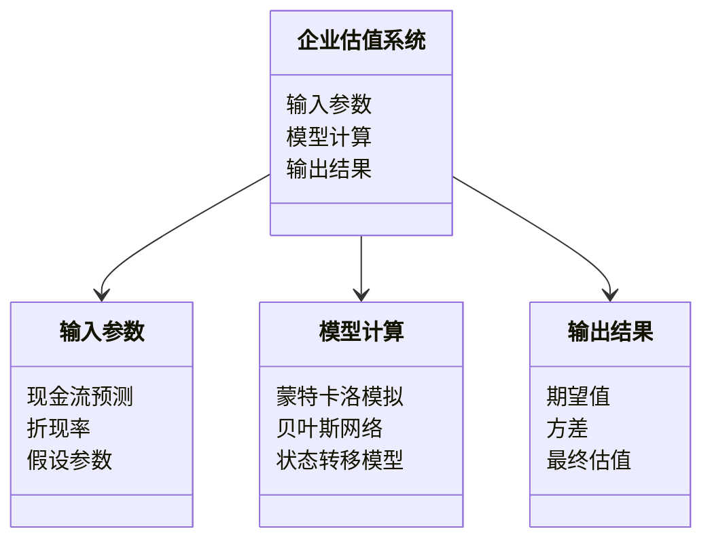

                 


# 如何处理企业估值中的不确定性

> 关键词：企业估值，不确定性，风险管理，蒙特卡洛模拟，模糊评估法，贝叶斯网络

> 摘要：企业估值中的不确定性是商业决策中的核心挑战之一。本文深入探讨了不确定性在企业估值中的表现及其处理方法，结合概率论、模糊性评估法和贝叶斯网络等多维度分析，为读者提供全面的理论支持与实践指导。通过实际案例分析和系统架构设计，本文为处理企业估值中的不确定性提供了可操作的解决方案。

---

## 第一部分：企业估值中的不确定性概述

### 第1章：企业估值与不确定性背景

#### 1.1 企业估值的基本概念

企业估值是评估企业整体价值的过程，旨在确定其在市场上的合理价格。常见的估值方法包括：

- **DCF模型（现金流贴现法）**：基于未来现金流的现值计算企业价值。
- **市盈率法**：通过市盈率与净利润的乘积计算企业价值。
- **可比公司法**：通过与类似企业的比较来估算价值。

企业估值的核心在于预测未来现金流和确定合适的折现率，而不确定性主要来源于市场需求、成本变化、政策调整等因素。

#### 1.2 不确定性在企业估值中的表现

不确定性贯穿企业估值的全过程，主要表现在以下几个方面：

- **未来现金流的不确定性**：市场需求波动、竞争加剧可能导致未来现金流预测不准。
- **折现率的选择**：折现率的高低直接影响估值结果，而无风险利率和风险溢价的不确定性增加了复杂性。
- **假设的敏感性**：DCF模型中的增长率、永续增长率等假设参数存在主观性和不确定性。

#### 1.3 核心概念的结构与要素

企业估值中的不确定性涉及以下关键要素：

1. **现金流预测**：企业未来收入和支出的预测。
2. **折现率确定**：反映企业风险的资本成本。
3. **假设参数**：增长率、永续增长率等关键假设。

---

## 第二部分：处理不确定性的核心概念与方法

### 第2章：不确定性量化与概率分析

#### 2.1 概率论与统计学基础

概率论是处理不确定性的重要工具，常见的概率分布包括：

- **均匀分布**：假设所有可能结果的概率均等。
- **正态分布**：用于描述对称分布的连续型数据。
- **Beta分布**：适用于概率本身存在不确定性的场景。

#### 2.2 蒙特卡洛模拟的原理与应用

蒙特卡洛模拟是一种通过随机采样来估计系统行为的方法，适用于处理复杂且不确定的系统。其步骤如下：

1. **定义输入变量**：识别影响系统的随机变量。
2. **设定概率分布**：为每个变量分配合适的概率分布。
3. **随机采样**：从各分布中随机抽取样本。
4. **模拟系统行为**：计算每个样本下的系统输出。
5. **分析结果**：统计输出结果，计算均值、方差等指标。

**案例分析**：假设某企业未来三年的现金流分别为100、120、140万元，每年增长率为5%±2%。通过蒙特卡洛模拟，可以计算出企业在不同增长率下的估值分布。

#### 2.3 模糊性与概率的关系

模糊性指的是信息的不清晰或不完整，而概率描述的是事件发生的可能性。在企业估值中，模糊性通常通过模糊评估法处理，例如：

- **模糊综合评价法**：将多个模糊因素综合评估，得出整体的模糊结果。
- **语言评估法**：使用自然语言描述评估结果，如“高”、“中”、“低”。

---

## 第三部分：企业估值中的不确定性处理方法

### 第3章：基于概率的不确定性处理

#### 3.1 贝叶斯方法在估值中的应用

贝叶斯方法通过不断更新先验概率，结合新信息来调整后验概率，适用于处理不确定性问题。例如：

1. **设定先验概率**：假设某企业的初始估值为1000万元。
2. **获取新信息**：市场环境恶化，调整增长率的概率分布。
3. **更新后验概率**：根据新信息调整估值，得出新的期望值。

**数学模型**：贝叶斯定理公式如下：

$$
P(A|B) = \frac{P(B|A)P(A)}{P(B)}
$$

其中，\( P(A|B) \) 是在事件B发生的条件下，事件A发生的概率。

#### 3.2 马尔可夫链与状态转移模型

马尔可夫链通过状态转移矩阵描述系统在不同状态之间的转移概率，适用于长期预测。例如，企业可能处于“增长”、“稳定”、“衰退”三种状态，状态转移矩阵如下：

| 状态   | 转移到增长 | 转移到稳定 | 转移到衰退 |
|--------|------------|------------|------------|
| 增长    | 0.7        | 0.2        | 0.1        |
| 稳定    | 0.1        | 0.6        | 0.3        |
| 衰退    | 0.3        | 0.2        | 0.5        |

---

## 第四部分：系统分析与架构设计方案

### 第4章：企业估值系统的架构设计

#### 4.1 领域模型设计

领域模型描述了企业估值系统的核心实体及其关系。以下是一个简化的领域模型：



#### 4.2 系统架构设计

企业估值系统的架构设计包括数据层、业务逻辑层和表现层：

```mermaid
architecturalDiagram

    客户端 <---> 服务层
    服务层 <---> 数据库
    服务层 <---> 第三方API
```

---

## 第五部分：项目实战

### 第5章：基于Python的企业估值系统实现

#### 5.1 环境安装

安装必要的Python库：

```bash
pip install numpy matplotlib pandas scikit-learn
```

#### 5.2 核心代码实现

以下是蒙特卡洛模拟的Python代码示例：

```python
import numpy as np
import matplotlib.pyplot as plt

# 定义参数
n_simulation = 10000
mean = 1000
std = 200

# 生成随机数据
values = np.random.normal(mean, std, n_simulation)

# 绘制直方图
plt.hist(values, bins=50, alpha=0.7, color='b')
plt.xlabel('企业估值（万元）')
plt.ylabel('频数')
plt.title('蒙特卡洛模拟结果')
plt.show()
```

---

## 第六部分：总结与展望

### 第6章：总结与展望

#### 6.1 本章总结

企业估值中的不确定性是复杂而重要的问题，通过概率分析、蒙特卡洛模拟和贝叶斯网络等方法，可以有效降低不确定性对企业估值的影响。未来的研究可以进一步结合人工智能技术，提高估值的准确性和效率。

#### 6.2 未来展望

随着技术的进步，企业估值中的不确定性处理将更加智能化和精准化。结合大数据分析和机器学习算法，可以开发出更强大的估值模型，为企业决策提供更有力的支持。

---

## 作者

作者：AI天才研究院/AI Genius Institute & 禅与计算机程序设计艺术 /Zen And The Art of Computer Programming

