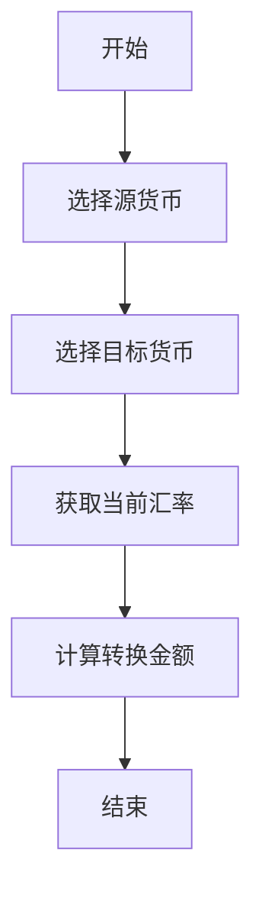
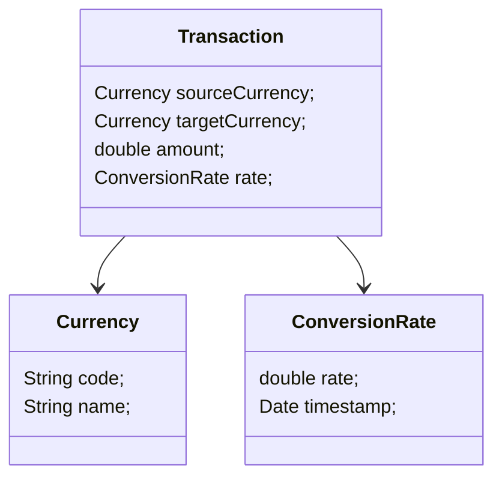

                 


# 如何处理企业估值中的货币转换问题

> 关键词：企业估值，货币转换，汇率，财务分析，国际业务

> 摘要：在跨国企业或涉及多币种的业务场景中，货币转换问题对企业的财务健康状况和估值结果有直接影响。本文将从理论到实践，系统性地分析如何处理企业估值中的货币转换问题。通过结合数学模型、算法原理和实际案例，本文将深入探讨货币转换的核心概念、影响因素、系统实现以及最佳实践，帮助读者全面掌握如何在企业估值中有效处理货币转换问题。

---

## 第一部分: 企业估值中的货币转换基础

### 第1章: 货币转换的基本概念

#### 1.1 货币转换的定义与类型

##### 1.1.1 货币转换的定义  
货币转换是指将一种货币的金额转换为另一种货币的金额，通常基于特定的汇率。在企业估值中，货币转换主要用于跨国业务、财务报表合并以及跨境投资分析等场景。

##### 1.1.2 常见的货币转换类型  
- **即期汇率转换**：基于当前汇率进行的实时转换。  
- **历史汇率转换**：基于过去某一时间点的汇率进行的转换。  
- **远期汇率转换**：基于未来某一时间点的预期汇率进行的转换。  

##### 1.1.3 货币转换的背景与重要性  
随着全球化的发展，跨国企业的业务范围不断扩大，货币转换已成为企业财务管理的核心环节。准确的货币转换能够确保财务报表的准确性，避免因汇率波动导致的财务损失。

#### 1.2 货币转换的影响因素

##### 1.2.1 汇率波动  
汇率的波动是影响货币转换结果的最直接因素。不同的汇率会导致相同的金额在不同时间点产生不同的转换结果。

##### 1.2.2 经济政策  
政府的货币政策、利率调整和外汇管制等都会影响汇率的变化，进而影响货币转换的结果。

##### 1.2.3 市场供需关系  
市场对不同货币的需求变化也会导致汇率波动，从而影响货币转换的准确性。

#### 1.3 货币转换在企业估值中的作用

##### 1.3.1 跨国企业中的货币转换需求  
跨国企业在进行跨国并购、投资或业务扩展时，需要将目标国家的货币转换为母公司的货币，以进行统一的财务评估。

##### 1.3.2 货币转换对财务报表的影响  
货币转换会影响企业的资产负债表、利润表和现金流量表，尤其是在多币种业务场景下，准确的货币转换能够确保财务报表的真实性和一致性。

##### 1.3.3 货币转换与企业价值评估的关系  
货币转换是企业价值评估的重要基础。在跨国并购中，目标企业的估值通常基于目标货币进行，而母公司的估值则需要将目标货币转换为母公司的货币，因此货币转换的准确性直接影响整个估值结果。

---

### 第2章: 货币转换的核心概念与联系

#### 2.1 货币转换的核心原理

##### 2.1.1 货币转换的基本原理  
货币转换的核心是通过汇率将一种货币的价值转换为另一种货币的价值。在企业估值中，通常需要考虑货币转换的时点、汇率类型以及转换方式。

##### 2.1.2 货币转换的关键属性  
- **汇率类型**：即期、历史或远期汇率。  
- **转换时点**：实时转换或历史转换。  
- **转换方式**：直接转换或间接转换。  

##### 2.1.3 货币转换的数学模型  
货币转换的数学模型可以表示为：  
$$ \text{目标货币金额} = \text{源货币金额} \times \text{汇率} $$  

#### 2.2 货币转换的ER实体关系图

```mermaid
erDiagram
    currency <--- conversion_rate : has
    conversion_rate <--- transaction : uses
    transaction <--- user : initiated_by
```

#### 2.3 货币转换的流程图



---

## 第二部分: 货币转换的算法原理

### 第3章: 货币转换的算法原理

#### 3.1 汇率计算算法

##### 3.1.1 基本汇率计算公式  
$$ \text{汇率} = \frac{\text{目标货币金额}}{\text{源货币金额}} $$  

##### 3.1.2 复合汇率计算  
在涉及多步转换（例如从货币A到货币B，再到货币C）时，需要使用复合汇率进行计算：  
$$ \text{复合汇率} = \text{汇率1} \times \text{汇率2} $$  

#### 3.2 货币转换因子

##### 3.2.1 货币转换因子的定义  
货币转换因子是一种用于调整货币转换的系数，通常用于考虑交易费用、税率或其他附加成本。

##### 3.2.2 货币转换因子的计算  
$$ \text{转换因子} = \text{汇率} \times \text{费率} $$  

#### 3.3 动态汇率调整算法

##### 3.3.1 动态汇率调整的原理  
动态汇率调整算法用于实时根据市场汇率波动调整货币转换结果。其核心思想是通过高频数据更新汇率，以确保转换结果的准确性。

##### 3.3.2 动态调整的实现步骤  
1. 获取实时汇率数据。  
2. 计算转换金额。  
3. 根据汇率波动调整转换结果。  

---

### 第4章: 系统分析与架构设计

#### 4.1 问题场景介绍  
在跨国企业中，货币转换问题主要体现在跨国并购、跨境投资和多币种业务场景下的财务报表合并。企业需要一个高效的货币转换系统来支持这些业务。

#### 4.2 系统功能设计

##### 4.2.1 领域模型（Mermaid 类图）  


#### 4.3 系统架构设计（Mermaid 架构图）  


---

## 第三部分: 项目实战

### 第5章: 项目实战

#### 5.1 环境安装  
为了实现货币转换系统，首先需要安装以下工具和库：  
- Python 3.8+  
- pip  
- NumPy  
- Pandas  

#### 5.2 系统核心实现（Python 代码示例）

##### 5.2.1 货币转换器实现  
```python
import datetime

class CurrencyConverter:
    def __init__(self):
        self.currencies = ['USD', 'EUR', 'GBP', 'JPY']
        self.rates = {
            'USD': {'EUR': 0.85, 'GBP': 0.72, 'JPY': 128.28},
            'EUR': {'USD': 1.176, 'GBP': 0.85, 'JPY': 147.5},
            'GBP': {'USD': 1.388, 'EUR': 1.176, 'JPY': 172.4},
            'JPY': {'USD': 0.0078, 'EUR': 0.0068, 'GBP': 0.0058}
        }
    
    def get_rate(self, source, target):
        return self.rates[source][target]
    
    def convert(self, source, target, amount):
        rate = self.get_rate(source, target)
        return amount * rate

# 示例使用
converter = CurrencyConverter()
print(converter.convert('USD', 'EUR', 100))  # 输出：85.0
```

##### 5.2.2 动态汇率调整实现  
```python
import requests

def get_realtime_rate(source, target):
    response = requests.get(f"https://api.exchangerate-api.com/v2/latest?base={source}")
    if response.status_code == 200:
        data = response.json()
        return data['rates'][target]
    return None

# 示例使用
print(get_realtime_rate('USD', 'EUR'))  # 输出：0.85（假设当前汇率为0.85）
```

#### 5.3 实际案例分析  
假设一家跨国企业需要将100万美元转换为欧元，当前即期汇率为0.85。根据上述代码，转换结果为85万欧元。

---

## 第四部分: 总结与最佳实践

### 第6章: 总结与最佳实践

#### 6.1 关键点回顾  
- 货币转换是企业估值中的关键环节。  
- 动态汇率调整能够提高转换结果的准确性。  
- 系统化的方法可以提高货币转换的效率和可靠性。  

#### 6.2 最佳实践  
1. **选择可靠的汇率数据源**：确保汇率数据的准确性和实时性。  
2. **结合企业需求选择合适的转换模型**：根据业务场景选择即期、历史或远期汇率。  
3. **定期更新汇率数据**：避免因汇率波动导致的财务损失。  
4. **使用专业的货币转换系统**：减少人为错误，提高转换效率。  

#### 6.3 小结  
货币转换是企业估值中不可或缺的一部分。通过系统化的分析和实践，企业可以有效处理货币转换问题，提升财务管理和估值的准确性。

---

## 作者：AI天才研究院/AI Genius Institute & 禅与计算机程序设计艺术 /Zen And The Art of Computer Programming

