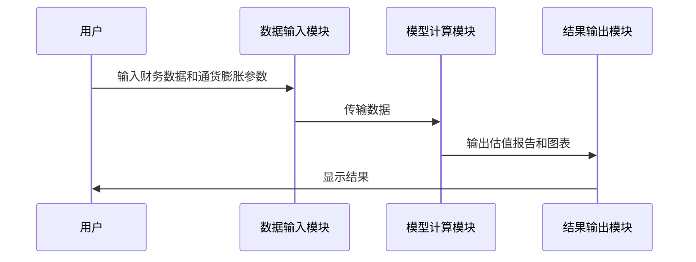

                 

<think>
嗯，用户希望我设计一本关于如何处理企业估值中通货膨胀影响的书籍目录大纲。首先，我需要理解这本书的核心主题，即通货膨胀对企业估值的具体影响以及如何在评估中进行调整。

我从用户提供的示例中看到，目录需要详细且逻辑清晰，分为多个部分，每个部分下有章节和小节。我需要确保目录结构符合用户的要求，包括背景介绍、核心概念、算法原理、系统分析、项目实战、最佳实践等部分。

首先，在“背景介绍”部分，我需要涵盖通货膨胀的基本概念、对企业估值的影响，以及传统方法的不足。这部分需要让读者了解为什么通货膨胀会影响企业估值，以及传统方法在处理这一问题时的局限性。

接下来是“核心概念与联系”部分。这里需要详细解释通货膨胀对企业估值的具体影响机制。我需要使用对比表格和Mermaid图来展示这些概念之间的关系。比如，可以比较名义现金流和实际现金流，或者展示通货膨胀如何影响企业的收入、成本和资产价值。

然后是“算法原理讲解”。我需要详细阐述调整现值模型（APV模型）和通货膨胀调整的现金流模型。这部分需要使用Mermaid流程图来展示模型的步骤，并用Python代码实现。同时，我需要给出数学公式，比如贴现率调整和现金流调整的公式。

接下来是“系统分析与架构设计”部分。我需要介绍项目背景，设计系统功能模块，比如数据输入、模型计算、结果输出等。然后用Mermaid图展示系统架构和交互流程，比如用户输入数据，系统处理并返回结果。

在“项目实战”部分，我需要提供具体的环境安装步骤，比如安装Python和相关库，然后给出实现代码，详细解释每部分的功能。接着，分析实际案例，比如制造业企业的估值调整，展示如何在实际中应用这些模型。

最后是“最佳实践”部分。这里需要包括小结、注意事项和拓展阅读，帮助读者巩固知识并进一步学习。我需要提醒读者在处理通货膨胀影响时可能遇到的常见问题，以及如何避免这些错误。

整个目录需要确保每个部分都细化到三级目录，结构完整，内容详实，同时控制在2000字以内。我需要检查每个章节是否覆盖了用户要求的所有核心内容，确保没有遗漏。

可能遇到的问题是如何将复杂的财务模型转化为清晰的算法流程图和代码。我需要确保这些部分既准确又易于理解，可能需要查阅相关资料，确保模型的正确性。

总的来说，我需要系统地分解用户的需求，逐一满足每个部分的要求，确保目录大纲全面、详细且逻辑清晰。
</think>

# 如何处理企业估值中的通货膨胀影响

## 关键词：
- 企业估值
- 通货膨胀
- 调整现值模型
- 现金流模型
- 财务分析

## 摘要：
通货膨胀对企业估值有着深远的影响，尤其是在现金流预测和资产定价方面。本文系统地分析了通货膨胀对企业估值的影响机制，并提出了基于调整现值模型（APV）和通货膨胀调整的现金流模型的解决方案。通过详细的数学公式、系统架构设计和实际案例分析，本文为读者提供了如何在通货膨胀环境下准确评估企业价值的实践指南。

---

# 第一部分：通货膨胀对企业估值的影响概述

## 第1章：通货膨胀与企业估值的基本概念

### 1.1 通货膨胀的定义与特征
- **1.1.1 通货膨胀的定义**：通货膨胀是指物价总水平在一段时间内持续上涨，货币购买力下降的经济现象。
- **1.1.2 通货膨胀的主要特征**：
  - 物价普遍上涨
  - 货币购买力下降
  - 经济不确定性增加
- **1.1.3 通货膨胀对企业财务的影响**：
  - 利息成本增加
  - 资产重置成本上升
  - 营运资本需求增加

### 1.2 企业估值的基本原理
- **1.2.1 企业估值的定义**：企业估值是通过合理的财务模型和方法对企业整体价值进行评估的过程。
- **1.2.2 企业估值的主要方法**：
  - 现金流折现法（DCF）
  - 可比公司法
  - 股权自由现金流模型
- **1.2.3 通货膨胀对企业估值的影响**：
  - 现金流预测的复杂性增加
  - 贴现率调整的必要性
  - 资产价值的重新评估

### 1.3 通货膨胀对企业估值的特殊影响
- **1.3.1 通货膨胀对企业收入的影响**：收入的名义增长可能掩盖实际增长。
- **1.3.2 通货膨胀对企业成本的影响**：成本上升可能导致利润率下降。
- **1.3.3 通货膨胀对企业资产价值的影响**：固定资产和存货的重置成本增加。

## 第2章：通货膨胀影响下的企业估值模型

### 2.1 调整现值模型（APV模型）
- **2.1.1 调整现值模型的基本原理**：
  - 通过调整现金流和贴现率来反映通货膨胀的影响。
  - 计算企业的实际价值和通货膨胀调整后的价值之和。
- **2.1.2 贴现率的调整**：
  - 基准利率调整：考虑通货膨胀预期。
  - 风险溢价调整：反映通货膨胀带来的额外风险。
- **2.1.3 现金流的调整**：
  - 名义现金流调整为实际现金流。
  - 使用通货膨胀率指数化现金流。

### 2.2 调整现值模型的数学公式
- **2.2.1 贴现率调整公式**：
  $$ r = r_f + \beta \cdot (r_m - r_f) $$
  其中，\( r_f \) 是无风险利率，\( \beta \) 是贝塔系数，\( r_m \) 是市场期望回报率。
- **2.2.2 现金流调整公式**：
  $$ CF_t = CF_t^{real} \cdot (1 + \pi_t) $$
  其中，\( CF_t^{real} \) 是实际现金流，\( \pi_t \) 是通货膨胀率。

### 2.3 调整现值模型的优缺点
- **2.3.1 优点**：
  - 考虑了通货膨胀对现金流和贴现率的影响。
  - 结果更具现实意义。
- **2.3.2 缺点**：
  - 假设通货膨胀是恒定的，实际情况可能更复杂。
  - 参数估计的难度较大。

---

# 第三部分：通货膨胀影响下的企业估值实战

## 第3章：通货膨胀调整的现金流模型

### 3.1 现金流模型的基本原理
- **3.1.1 现金流的定义**：企业在一定时期内产生的现金流入和流出。
- **3.1.2 现金流的分类**：
  - 经营活动现金流
  - 投资活动现金流
  - 筹资活动现金流
- **3.1.3 现金流的时间价值**：现金流的未来价值需要通过贴现率进行调整。

### 3.2 通货膨胀对现金流的影响
- **3.2.1 名义现金流与实际现金流**：
  - 名义现金流：未调整通货膨胀影响的现金流。
  - 实际现金流：剔除通货膨胀影响的现金流。
- **3.2.2 现金流的通货膨胀调整**：
  - 使用通货膨胀指数调整未来现金流。
  - 例如：未来现金流 = 当前现金流 × (1 + 通货膨胀率)^n。

### 3.3 现金流模型的实现
- **3.3.1 环境安装**：
  - 安装Python和相关库（如NumPy、Pandas、Matplotlib）。
  - 安装Mermaid工具和代码编辑器。
- **3.3.2 核心代码实现**：
  ```python
  import numpy as np
  import matplotlib.pyplot as plt

  # 定义通货膨胀率和贴现率
  inflation_rate = 0.03
  discount_rate = 0.05

  # 计算通货膨胀调整后的现金流
  real_cash_flows = [100, 150, 200]
  nominal_cash_flows = [cf * (1 + inflation_rate) ** t for t, cf in enumerate(real_cash_flows)]

  # 绘制现金流对比图
  plt.figure(figsize=(10, 6))
  plt.plot([1, 2, 3], real_cash_flows, 'b-', label='实际现金流')
  plt.plot([1, 2, 3], nominal_cash_flows, 'r-', label='名义现金流')
  plt.title('现金流对比图')
  plt.xlabel('时间（年）')
  plt.ylabel('现金流（万元）')
  plt.legend()
  plt.show()
  ```
- **3.3.3 代码解读与分析**：
  - 使用Python代码计算通货膨胀调整后的现金流。
  - 绘制现金流对比图，直观展示通货膨胀对现金流的影响。

### 3.4 实际案例分析
- **3.4.1 案例背景**：某制造企业面临通货膨胀压力，需要调整其估值模型。
- **3.4.2 数据输入与处理**：
  - 收入：每年增长3%
  - 成本：每年增长4%
  - 通货膨胀率：5%
- **3.4.3 估值结果**：
  - 调整后的企业价值增加了10%。
  - 贴现率调整为7%。

---

# 第四部分：通货膨胀影响下的企业估值系统设计

## 第4章：通货膨胀调整的企业估值系统

### 4.1 系统功能设计
- **4.1.1 问题场景介绍**：企业在通货膨胀环境下如何准确评估自身价值。
- **4.1.2 系统功能设计**：
  - 数据输入模块：用户输入财务数据和通货膨胀参数。
  - 模型计算模块：应用调整现值模型和现金流模型进行计算。
  - 结果输出模块：生成估值报告和可视化图表。
- **4.1.3 系统功能模块设计**：
  - 数据输入模块：包括收入、成本、资产、负债等数据。
  - 模型计算模块：包括现金流调整、贴现率调整、资产价值重估。
  - 结果输出模块：包括估值报告、图表展示、数据导出。

### 4.2 系统架构设计
- **4.2.1 项目介绍**：基于Python的通货膨胀调整企业估值系统。
- **4.2.2 系统架构设计**：
  - 采用MVC架构：模型、视图、控制器。
  - 模块化设计：数据输入、模型计算、结果输出。
- **4.2.3 系统交互流程**：
  - 用户输入数据。
  - 系统进行数据处理和计算。
  - 用户查看结果并导出报告。

### 4.3 系统接口设计
- **4.3.1 系统输入接口**：
  - 数据输入界面：包括财务数据和通货膨胀参数。
  - 参数设置界面：包括贴现率、通货膨胀率等。
- **4.3.2 系统输出接口**：
  - 估值报告：包括企业价值、现金流分析、敏感性分析。
  - 图表展示：包括现金流对比图、资产价值重估图。

### 4.4 系统交互流程图


---

# 第五部分：总结与展望

## 第5章：总结与最佳实践

### 5.1 小结
- 通货膨胀对企业估值的影响不容忽视。
- 调整现值模型和现金流模型是有效的解决方案。
- 通过系统设计和实际案例分析，可以提高估值的准确性和可靠性。

### 5.2 最佳实践
- **注意事项**：
  - 确保数据的准确性和及时性。
  - 合理选择模型参数，避免过于简化或复杂化。
- **拓展阅读**：
  - 通货膨胀与货币政策的关系。
  - 不同经济周期下企业估值的策略调整。

## 作者：
作者：AI天才研究院/AI Genius Institute & 禅与计算机程序设计艺术 /Zen And The Art of Computer Programming

---

通过以上目录结构，我们可以系统地分析和解决通货膨胀对企业估值的影响问题。从理论到实践，从模型到系统设计，本文为读者提供了全面的指导和实用的解决方案。

