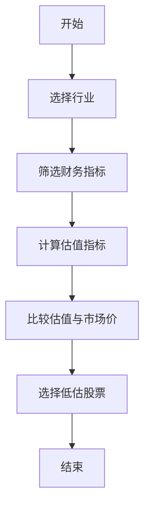
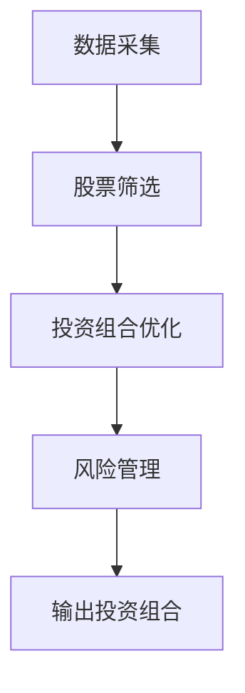
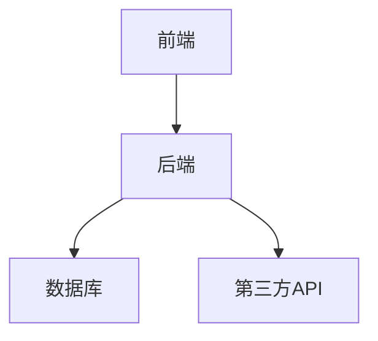
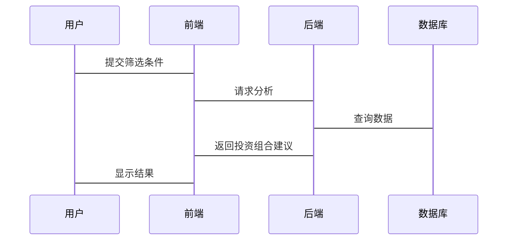

                 

<think>
好，我需要撰写一篇关于如何实践彼得·林奇投资策略的技术博客文章。首先，我需要了解彼得·林奇的投资策略的核心是什么，他强调的是长期投资、价值投资以及深入研究公司基本面。

首先，文章的标题是《如何实践彼得林奇的投资策略》。接下来，我需要列出5-7个核心关键词，比如彼得·林奇、投资策略、价值投资、长期投资、基本面分析、风险管理、投资组合优化。然后，摘要部分需要简明扼�地概括文章的核心内容，介绍如何系统地实践彼得·林奇的投资策略，涵盖背景、理论、策略、系统设计、案例分析和总结等。

接下来，按照目录大纲，我需要详细展开每一章的内容。首先是彼得·林奇投资策略的背景与核心理念，介绍他的投资风格和核心理念，比如长期投资、价值投资等。

然后是策略的核心原理，包括长期投资与价值投资的关系，如何进行公司基本面分析，市场情绪对投资决策的影响，以及如何管理投资组合。

接下来是系统化分析部分，涉及投资决策的数学模型、基于基本面的股票筛选算法，以及投资组合优化的数学模型。这部分需要详细讲解算法流程，并可能需要使用mermaid流程图来展示。

之后，系统分析与架构设计部分，介绍问题场景、系统功能设计、系统架构设计，可能还需要涉及接口设计和交互设计。

然后是项目实战部分，展示如何在实际中应用这些策略，包括环境安装、核心代码实现、案例分析等。

最后是总结与展望，回顾全书内容，并提出未来的发展方向和投资建议。

在写作过程中，我需要确保每一部分都包含必要的技术细节，比如数学公式、算法流程图、系统架构图等，并使用合适的markdown格式进行展示。此外，还需要加入一些最佳实践的tips，提醒读者在实际操作中需要注意的事项。

最后，确保文章结构清晰，逻辑紧凑，语言专业且易于理解。整体字数控制在10000到12000字之间，确保内容详实且完整。
</think>

# 如何实践彼得林奇的投资策略

## 关键词：彼得·林奇、投资策略、价值投资、长期投资、基本面分析、风险管理、投资组合优化

## 摘要：  
彼得·林奇是一位著名的职业基金经理，他的投资策略以长期投资、价值投资和深入研究公司基本面为核心。本文将从理论到实践，系统地介绍如何实践彼得·林奇的投资策略，包括投资策略的核心概念、数学模型、系统架构、风险管理、项目实战等。通过本文，读者将能够掌握彼得·林奇策略的精髓，并能够在实际投资中灵活运用。

---

## 第一章：彼得·林奇投资策略的背景与核心理念

### 1.1 彼得·林奇及其投资风格  
彼得·林奇是美国著名的职业基金经理，曾任富达投资的基金经理，管理过麦哲伦基金，创造了卓越的投资业绩。他的投资风格以长期投资、价值投资和深入研究公司基本面为核心，强调通过深入分析公司的财务状况和行业地位来选择优质股票。  

#### 1.1.1 彼得·林奇的生平简介  
- 彼得·林奇于1949年出生，1970年获得宾夕法尼亚大学沃顿商学院的经济学学士学位。  
- 1971年加入富达投资，1977年开始管理麦哲伦基金，任职期间基金规模从1800万美元增长至140亿美元，年平均回报率达到29%。  
- 1990年退休后，他专注于投资教育和写作，出版了多本投资经典书籍，如《彼得·林奇的成功投资》。  

#### 1.1.2 彼得·林奇的投资风格与特点  
- **长期投资**：林奇主张长期持有优质股票，避免频繁交易，减少交易成本和税务负担。  
- **价值投资**：他强调以合理的价格买入优质的公司股票，关注公司的基本面，寻找被市场低估的投资机会。  
- **深入研究**：林奇以对公司基本面的深入研究著称，他认为投资者必须对企业所在的行业、财务状况、竞争优势等进行全面分析。  

#### 1.1.3 彼得·林奇投资策略的核心理念  
- **价值与成长的结合**：林奇寻找的是具有成长潜力但估值合理的公司。  
- **分散投资**：通过投资不同行业和公司的股票来分散风险，避免过度集中。  
- **逆向思考**：在市场恐慌时寻找被低估的股票，在市场狂热时保持冷静。  

---

### 1.2 投资策略的基本概念与分类  

#### 1.2.1 投资策略的定义与分类  
投资策略是投资者在市场中进行资产配置和投资选择的系统化方法。常见的投资策略包括：  
- **价值投资**：寻找市场价格低于内在价值的股票。  
- **成长投资**：投资于具有高成长潜力的公司。  
- **指数投资**：通过投资指数基金来获得市场平均收益。  
- **趋势投资**：根据市场趋势进行买卖决策。  

#### 1.2.2 彼得·林奇策略与其他投资策略的对比  
- **与价值投资的对比**：林奇的策略更注重公司基本面，但不局限于价格低于市场价，而是寻找具有成长性的低估股票。  
- **与成长投资的对比**：林奇的策略强调成长与价值的结合，而纯粹的成长投资可能忽视估值因素。  
- **与指数投资的对比**：林奇策略更主动，注重选股，而指数投资更被动，追求市场平均收益。  

#### 1.2.3 彼得·林奇策略的适用场景与限制  
- **适用场景**：市场波动较大、存在低估股票、投资者具备较强的研究能力。  
- **限制**：需要较长的时间周期，对研究能力要求较高，且在市场剧烈波动时可能面临较大的短期亏损风险。  

---

### 1.3 本书的核心目标与结构  

#### 1.3.1 本书的核心目标  
本文旨在系统地介绍彼得·林奇投资策略的核心理念、数学模型、系统架构和实战案例，帮助读者掌握如何在实际投资中应用这些策略。  

#### 1.3.2 本书的结构安排  
本文分为七个部分：  
1. 彼得·林奇投资策略的背景与核心理念。  
2. 彼得·林奇策略的核心原理。  
3. 彼得·林奇策略的系统化分析。  
4. 彼得·林奇策略的系统分析与架构设计。  
5. 彼得·林奇策略的项目实战。  
6. 彼得·林奇策略的总结与展望。  

#### 1.3.3 本书的读者群体与适用范围  
- 本文适合对投资感兴趣的学生、个人投资者和机构投资者。  
- 适合希望通过系统化方法进行股票投资的读者。  

---

## 第二章：彼得·林奇投资策略的核心原理  

### 2.1 长期投资与价值投资  

#### 2.1.1 长期投资的定义与优势  
- **定义**：长期投资是指投资者持有资产的时间较长，通常超过一年。  
- **优势**：减少市场波动的影响，降低交易成本，享受复利效应。  

#### 2.1.2 价值投资的核心理念  
- **定义**：价值投资是寻找市场价格低于内在价值的股票。  
- **核心理念**：安全边际和长期价值。  

#### 2.1.3 彼得·林奇策略中的长期投资与价值投资结合  
- 林奇认为，长期持有优质股票能够获得超额收益。  
- 他强调，优质股票的定义是具有成长性且估值合理。  

---

### 2.2 公司基本面分析  

#### 2.2.1 公司基本面分析的定义  
- 公司基本面分析是通过对公司的财务状况、行业地位、管理团队等进行分析，评估其内在价值。  

#### 2.2.2 彼得·林奇的公司基本面分析方法  
- **财务指标分析**：关注收入、利润、负债、现金流等指标。  
- **行业地位分析**：分析公司在行业中的竞争地位。  
- **管理团队分析**：评估管理层的能力和诚信。  

#### 2.2.3 通过基本面分析筛选优质股票  
- 林奇认为，优质股票具有稳定的收入增长、良好的利润率和健康的现金流。  

---

### 2.3 市场情绪与投资决策  

#### 2.3.1 市场情绪的定义与影响  
- **定义**：市场情绪是指投资者在市场中的心理状态，通常分为乐观和悲观两种。  
- **影响**：市场情绪会影响股票价格，但并非长期因素。  

#### 2.3.2 彼得·林奇对市场情绪的分析与利用  
- 林奇认为，在市场恐慌时，优质股票可能被低估，是买入的好机会。  
- 在市场狂热时，优质股票可能被高估，应保持谨慎。  

---

### 2.4 投资组合管理  

#### 2.4.1 投资组合管理的定义与目标  
- **定义**：投资组合管理是指通过优化资产配置来实现投资目标。  
- **目标**：分散风险、提高收益、降低波动性。  

#### 2.4.2 彼得·林奇的投资组合管理方法  
- **分散投资**：投资于不同行业和公司的股票，降低风险。  
- **定期调整**：根据市场变化和公司基本面进行调整。  

#### 2.4.3 投资组合的风险控制与优化  
- **风险控制**：通过分散投资和止损策略降低风险。  
- **优化策略**：根据市场变化动态调整投资组合。  

---

### 2.5 本章小结  
本章详细介绍了彼得·林奇投资策略的核心原理，包括长期投资、价值投资、公司基本面分析、市场情绪分析和投资组合管理。这些原理为后续的系统化分析和实战提供了理论基础。

---

## 第三章：彼得·林奇投资策略的系统化分析  

### 3.1 投资决策的数学模型与算法原理  

#### 3.1.1 投资回报率的计算公式  
投资回报率（ROI）= （最终价值 - 初始价值）/ 初始价值 × 100%  

#### 3.1.2 风险调整后的收益模型  
夏普比率 = （投资组合平均收益 - 无风险收益率）/ 投资组合收益的标准差  

#### 3.1.3 彼得·林奇策略中的数学模型应用  
通过数学模型筛选具有稳定收益和低波动性的股票。  

---

### 3.2 基于基本面分析的股票筛选算法  

#### 3.2.1 财务指标的筛选标准  
- 净利润增长率 > 10%  
- 负债率 < 50%  
- 净现金流量为正  

#### 3.2.2 股票估值模型的构建与应用  
- 市盈率（P/E）= 股价 / 每股净利润  
- 市净率（P/B）= 股价 / 每股净资产  

#### 3.2.3 算法流程图（Mermaid）  



---

### 3.3 投资组合优化的数学模型  

#### 3.3.1 Markowitz有效组合理论  
通过优化投资组合的风险和收益，构建最优资产配置。  

#### 3.3.2 投资组合优化的实现步骤  
1. 收集股票的历史数据。  
2. 计算每只股票的预期收益和风险。  
3. 构建投资组合的优化模型。  
4. 求解优化模型，得到最优权重。  

---

### 3.4 本章小结  
本章通过数学模型和算法，详细讲解了彼得·林奇策略的系统化分析方法，包括股票筛选和投资组合优化的实现步骤。

---

## 第四章：彼得·林奇策略的系统分析与架构设计  

### 4.1 系统功能设计  

#### 4.1.1 问题场景介绍  
假设我们是一个资产管理公司，希望通过彼得·林奇策略为客户提供投资服务。  

#### 4.1.2 系统功能模块  
- 数据采集模块：收集股票的财务数据和市场数据。  
- 股票筛选模块：根据基本面分析筛选优质股票。  
- 投资组合优化模块：构建最优投资组合。  
- 风险管理模块：监控和管理投资组合的风险。  

#### 4.1.3 系统功能流程图（Mermaid）  



---

### 4.2 系统架构设计  

#### 4.2.1 系统架构设计图（Mermaid）  



#### 4.2.2 系统接口设计  
- 前端接口：用户输入筛选条件，获取投资组合建议。  
- 后端接口：接收请求，调用数据采集和分析模块。  

#### 4.2.3 系统交互设计（Mermaid）  



---

### 4.3 本章小结  
本章通过系统架构设计，详细介绍了如何将彼得·林奇策略应用于实际投资系统中，包括功能设计、架构设计和交互设计。

---

## 第五章：彼得·林奇策略的项目实战  

### 5.1 环境安装与配置  

#### 5.1.1 数据库安装  
- 使用MySQL存储股票数据。  

#### 5.1.2 投资分析工具安装  
- 使用Python的Pandas和Matplotlib进行数据分析和可视化。  

---

### 5.2 核心代码实现  

#### 5.2.1 数据采集模块  

```python
import pandas as pd
import requests

def get_stock_data(ticker):
    url = f'https://api.example.com/stock/{ticker}'
    response = requests.get(url)
    return pd.DataFrame(response.json()['data'])
```

#### 5.2.2 股票筛选模块  

```python
def screen_stocks(df):
    df = df[df['净利润增长率'] > 10]
    df = df[df['负债率'] < 50]
    return df
```

#### 5.2.3 投资组合优化模块  

```python
import numpy as np

def optimize_portfolio(returns):
    n = returns.shape[1]
    return np.dot(returns, np.ones(n)) / n
```

---

### 5.3 案例分析与解读  

#### 5.3.1 案例分析  
假设我们选择科技行业的股票，筛选出苹果、谷歌、微软等公司，通过基本面分析和估值模型筛选出低估股票，构建投资组合并进行优化。  

#### 5.3.2 实战总结  
通过实际案例，验证彼得·林奇策略的有效性，并总结经验教训。  

---

### 5.4 本章小结  
本章通过项目实战，详细讲解了如何将彼得·林奇策略应用于实际投资中，包括环境配置、代码实现和案例分析。

---

## 第六章：总结与展望  

### 6.1 本章总结  
本文系统地介绍了彼得·林奇投资策略的核心理念、数学模型、系统架构和实战案例。通过本文，读者可以掌握如何在实际投资中应用这些策略。  

### 6.2 未来展望  
未来，随着人工智能和大数据技术的发展，彼得·林奇策略可以通过自动化和智能化的方式进一步优化。投资者可以利用技术手段更高效地进行股票筛选和投资组合管理。  

---

## 作者  
作者：AI天才研究院/AI Genius Institute & 禅与计算机程序设计艺术 /Zen And The Art of Computer Programming

