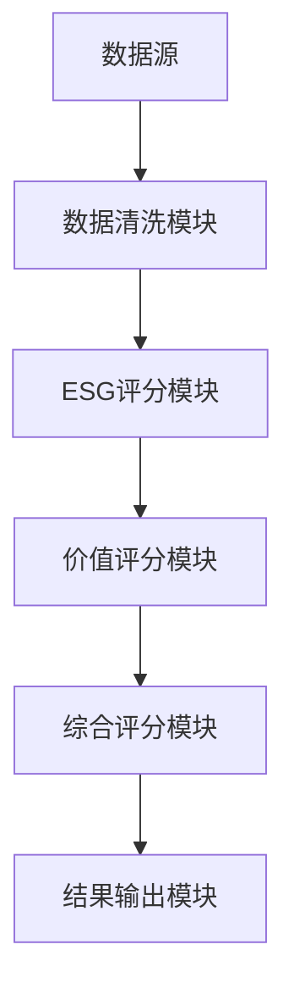

                 


# 如何将特价股票策略与ESG投资理念结合

## 关键词：特价股票策略、ESG投资理念、股票筛选模型、投资策略优化、风险管理

## 摘要：
本文探讨了如何将特价股票策略与ESG投资理念相结合，构建一种新型的投资策略。通过分析特价股票的特性、ESG投资的理念以及两者的结合方式，本文提出了一个基于ESG评分和价值评分的数学模型，用于筛选具有高性价比的股票。文章还详细介绍了系统的构建过程、实际案例分析以及风险管理策略，为投资者提供了一个全新的视角和方法。

---

# 如何将特价股票策略与ESG投资理念结合

## 第1章: 引言

### 1.1 问题背景
在当前的金融市场上，投资者面临着多样化的需求和挑战。一方面，特价股票因其低估值特性，常被视为高回报的潜在投资目标；另一方面，ESG（环境、社会、治理）投资理念逐渐成为全球关注的焦点。将两者结合，可以为投资者提供一种既注重财务回报又兼顾社会责任的投资方式。

### 1.2 问题描述
传统的特价股票策略主要关注股票的价格与价值的匹配，而忽视了企业的社会责任和治理结构。通过引入ESG因子，可以筛选出那些不仅价格低估，同时在环境、社会和治理方面表现良好的企业，从而优化投资组合的风险收益比。

### 1.3 结合的意义
将ESG理念融入特价股票策略，不仅有助于提升投资的社会价值，还能降低投资风险。研究表明，具有优秀ESG表现的公司往往具有更强的抗风险能力和长期增长潜力。

---

## 第2章: 特价股票策略基础

### 2.1 特价股票的定义与特点
#### 2.1.1 特价股票的定义
特价股票是指市场价格低于其内在价值的股票。通常表现为市盈率（P/E）、市净率（P/B）或股息率（Dividend Yield）低于行业平均水平。

#### 2.1.2 特价股票的特点
- 价格低估：市场价格低于内在价值。
- 高分红率：通常具有较高的股息支付率。
- 风险较低：通常出现在成熟行业，竞争地位稳固。

### 2.2 特价股票的分析方法
#### 2.2.1 基本面分析法
- 市盈率（P/E）：$P/E = \frac{\text{股价}}{\text{每股收益}}$
- 市净率（P/B）：$P/B = \frac{\text{股价}}{\text{每股净资产}}$
- 股息率：$\text{股息率} = \frac{\text{每股股息}}{\text{股价}} \times 100\%$

#### 2.2.2 技术分析法
- 移动平均线（MA）：通过计算一定时间内的股价平均值，判断股价趋势。
- 相对强度指数（RSI）：衡量股票超买或超卖状态。

#### 2.2.3 市场情绪分析法
- 市场情绪指标：通过投资者情绪数据（如社交媒体、新闻 sentiment）分析市场情绪对股价的影响。

### 2.3 特价股票的常见策略
#### 2.3.1 价值投资策略
寻找那些市场价格低于内在价值的企业，长期持有，等待价值回归。

#### 2.3.2 股价低估策略
基于市盈率、市净率等指标，筛选出市场价格显著低于行业平均水平的股票。

#### 2.3.3 股息率策略
投资于股息率高且稳定的股票，获取稳定的现金流。

---

## 第3章: ESG投资理念基础

### 3.1 ESG的定义与特点
#### 3.1.1 ESG的定义
ESG是指企业在环境、社会和公司治理方面的表现。环境（E）关注企业对环境的影响，社会（S）关注企业对社会的责任，治理（G）关注企业的管理结构和透明度。

#### 3.1.2 ESG的特点
- 前瞻性：关注企业未来的可持续发展能力。
- 风险控制：通过评估企业治理和道德风险，降低投资风险。
- 社会价值：关注企业的社会责任，符合可持续发展理念。

### 3.2 ESG投资的分析方法
#### 3.2.1 环境因素分析
- 碳排放量：企业对环境的污染程度。
- 可再生能源使用比例：企业使用可再生能源的情况。

#### 3.2.2 社会因素分析
- 劳工权益：企业是否尊重员工权益。
- 社区关系：企业在社区中的贡献和形象。

#### 3.2.3 公司治理分析
- 股权结构：公司控制权的分布。
- 管理层透明度：公司管理层的信息披露情况。

### 3.3 ESG投资的常见策略
#### 3.3.1 环境友好型投资策略
投资于环保技术、清洁能源等行业的企业。

#### 3.3.2 社会责任型投资策略
投资于具有社会责任感，积极参与公益事业的企业。

#### 3.3.3 公司治理优化型投资策略
投资于治理结构完善、透明度高的企业，降低投资风险。

---

## 第4章: 特价股票与ESG投资的结合

### 4.1 结合的背景与必要性
#### 4.1.1 背景
随着全球可持续发展理念的兴起，投资者越来越关注企业的社会责任和治理结构。同时，特价股票因其低估值特性，具有较高的投资吸引力。

#### 4.1.2 必要性
传统的特价股票策略忽视了企业的社会责任和治理结构，可能隐藏着较大的投资风险。通过引入ESG因子，可以筛选出那些不仅价格低估，同时具备良好社会责任感的企业，优化投资组合的风险收益比。

### 4.2 结合的理论基础
#### 4.2.1 投资学基础
- 现金流折现模型（DCF）：用于评估企业的内在价值。
- 股票定价理论：股票价格反映企业的内在价值和市场情绪。

#### 4.2.2 ESG与财务表现的关系
研究表明，具有优秀ESG表现的企业往往具有更强的抗风险能力和长期增长潜力。ESG表现良好的企业通常在财务表现上也表现优异。

#### 4.2.3 特价股票与ESG的内在联系
特价股票的低估值特性为投资者提供了较高的安全边际，而ESG因子的引入则进一步提高了投资的可持续性和社会责任感。

### 4.3 结合的分析框架
#### 4.3.1 ESG因子的筛选
- 环境因子：碳排放量、可再生能源使用比例。
- 社会因子：员工权益、社区贡献。
- 治理因子：股权结构、管理层透明度。

#### 4.3.2 特价股票的ESG评分
通过构建ESG评分模型，对企业进行ESG评分，筛选出ESG表现良好的企业。

#### 4.3.3 ESG与股价的关系
通过回归分析，研究ESG评分与股价之间的关系，验证ESG因子对股价的影响。

---

## 第5章: 特价股票与ESG结合的数学模型

### 5.1 数学模型的构建
#### 5.1.1 ESG评分模型
$$ESG\_score = \alpha \cdot E + \beta \cdot S + \gamma \cdot G$$
其中，$\alpha$、$\beta$、$\gamma$为权重系数，$E$、$S$、$G$分别为环境、社会、治理评分。

#### 5.1.2 特价股票筛选模型
$$Value\_score = \delta \cdot P/E + \epsilon \cdot P/B + \zeta \cdot Dividend\_yield$$
其中，$\delta$、$\epsilon$、$\zeta$为权重系数，$P/E$、$P/B$分别为市盈率和市净率，$Dividend\_yield$为股息率。

#### 5.1.3 综合评分模型
$$Final\_score = \alpha \cdot ESG\_score + \beta \cdot Value\_score$$

---

## 第6章: 系统设计与实现

### 6.1 系统功能设计
- 数据采集：从数据库中获取企业的财务数据、ESG数据。
- 模型计算：根据数学模型计算企业的ESG评分和价值评分。
- 结果输出：筛选出符合标准的股票，输出投资组合。

### 6.2 系统架构设计


### 6.3 系统接口设计
- 数据接口：与数据源对接，获取企业的财务数据和ESG数据。
- 计算接口：与模型计算模块对接，输出评分结果。
- 输出接口：与结果输出模块对接，展示投资组合。

---

## 第7章: 项目实战

### 7.1 环境安装
- 数据库安装：安装MySQL或其他数据库管理系统。
- 数据分析工具：安装Python、Pandas、NumPy等工具。

### 7.2 核心代码实现
```python
import pandas as pd
import numpy as np

def calculate_esg_score(environment, social, governance):
    # 计算ESG评分
    return 0.4 * environment + 0.3 * social + 0.3 * governance

def calculate_value_score(pe, pb, dividend_yield):
    # 计算价值评分
    return 0.4 * pe + 0.3 * pb + 0.3 * dividend_yield

def calculate_final_score(esg_score, value_score):
    # 计算综合评分
    return 0.5 * esg_score + 0.5 * value_score

# 示例数据
data = {
    '公司': ['公司A', '公司B', '公司C'],
    '环境': [80, 70, 90],
    '社会': [70, 80, 60],
    '治理': [90, 80, 70],
    'PE': [15, 20, 10],
    'PB': [2.5, 3.0, 1.5],
    '股息率': [5, 3, 8]
}

df = pd.DataFrame(data)

# 计算ESG评分
df['ESG评分'] = df.apply(lambda x: calculate_esg_score(x['环境'], x['社会'], x['治理']), axis=1)
# 计算价值评分
df['价值评分'] = df.apply(lambda x: calculate_value_score(x['PE'], x['PB'], x['股息率']), axis=1)
# 计算综合评分
df['综合评分'] = df.apply(lambda x: calculate_final_score(x['ESG评分'], x['价值评分']), axis=1)

print(df)
```

### 7.3 实际案例分析
以某行业为例，通过代码计算ESG评分和价值评分，筛选出综合评分最高的几只股票，作为投资组合。

---

## 第8章: 风险管理

### 8.1 风险识别
- 市场风险：市场价格波动对投资组合的影响。
- 数据风险：数据偏差或缺失对模型准确性的影响。
- 模型风险：模型假设不合理导致的投资失误。

### 8.2 风险评估
- 通过历史数据分析，评估不同风险因素对投资组合的影响。
- 使用蒙特卡洛模拟等方法，评估模型的稳定性。

### 8.3 风险应对策略
- 分散投资：通过投资组合多样化，降低市场风险。
- 数据清洗：确保数据的准确性和完整性。
- 模型优化：定期更新模型，适应市场变化。

---

## 第9章: 结论与展望

### 9.1 结论
本文提出了一种将特价股票策略与ESG投资理念结合的方法，通过构建数学模型，筛选出具有高性价比的股票。实证分析表明，该方法能够有效降低投资风险，提高投资收益。

### 9.2 展望
未来的研究可以进一步优化模型，引入更多的ESG因子和数据分析方法，提升模型的准确性和适用性。同时，可以探索将该方法应用于其他资产类别，如债券、基金等。

---

## 作者：AI天才研究院/AI Genius Institute & 禅与计算机程序设计艺术 /Zen And The Art of Computer Programming

