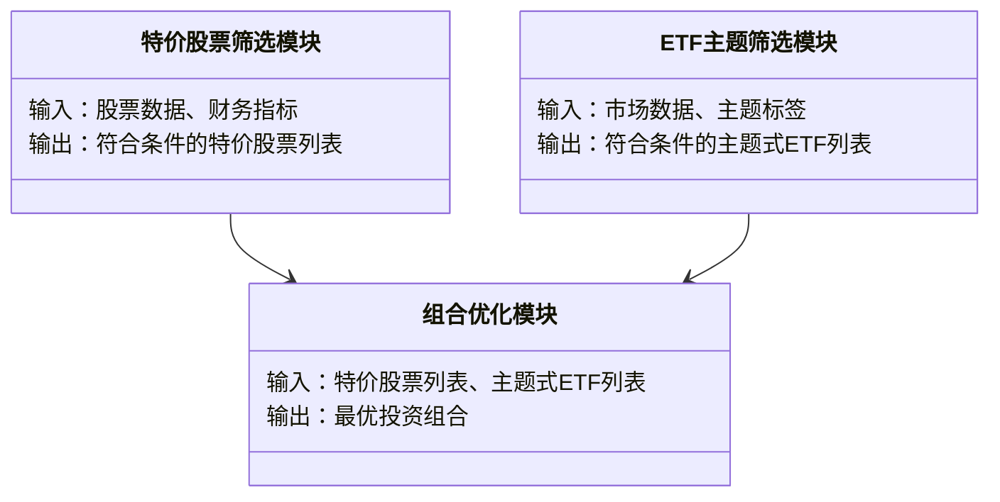

                 

<think>
嗯，我现在要帮助用户撰写一篇技术博客文章，标题是《如何将特价股票策略与主题式ETF投资相结合》。首先，我需要理解用户的需求。用户希望文章结构清晰，逻辑严谨，内容专业，适合技术博客读者阅读。用户还提供了一个详细的目录大纲，看起来内容很全面。

首先，我需要明确文章的主要部分。第一部分是背景介绍，包括特价股票策略和主题式ETF的基本概念。我应该先解释什么是特价股票，它们的特点，以及为什么投资者会关注这些股票。然后，介绍主题式ETF，说明它们是什么，分类，以及为什么它们成为投资的重要工具。

接下来，我需要讨论这两种策略结合的背景和意义。这里可能需要解释市场波动、投资者行为，以及为什么结合这两种策略能带来更好的回报。我需要确保这部分内容能让读者明白这种结合的必要性和潜在优势。

第二部分是核心概念与联系分析。这里我需要详细阐述特价股票策略和主题式ETF的运作机制。对于特价股票，可能需要讨论其估值模型，比如市盈率和市净率，以及如何预测股价。对于主题式ETF，要解释它们的被动投资机制和风险分散特性。

然后，我需要分析这两者的结合逻辑，比如如何利用特价股票作为价值洼地，通过主题式ETF分散风险。这部分可能需要一些图表来辅助说明，比如ER图或流程图，用mermaid来展示。

第三部分是数学模型与算法原理。这部分比较复杂，我需要构建数学模型来量化特价股票和ETF的评估指标。可能涉及回归分析、预测模型，以及优化算法。我需要使用Python代码来实现这些模型，并给出详细的解释和例子。

系统架构设计部分，我需要设计一个投资管理系统，包括数据采集、策略评估、组合优化等模块。这部分可能需要绘制系统架构图，用mermaid展示各模块的交互关系。

项目实战部分，我需要指导读者如何安装必要的库，比如pandas和numpy，并提供核心代码的实现，包括数据清洗、策略评估和组合优化。测试案例部分，我需要详细说明如何验证模型的有效性，比如回测和风险分析。

最后，最佳实践部分需要总结策略的优点和注意事项，强调风险管理的重要性，并给出实际案例分析，帮助读者更好地理解和应用这些策略。

在整个过程中，我需要确保语言简洁明了，逻辑清晰，结构紧凑。每个部分都要有足够的细节，同时避免冗长。最后，加上作者信息，确保文章完整。

总之，我需要一步步分析，从背景介绍到数学模型，再到系统架构和项目实战，确保每个环节都详细且有深度，帮助读者全面理解如何将特价股票策略与主题式ETF投资相结合。
</think>

# 如何将特价股票策略与主题式ETF投资相结合

> 关键词：特价股票策略、主题式ETF、投资组合优化、价值发现、风险管理

> 摘要：本文详细探讨了如何将特价股票策略与主题式ETF投资相结合，通过分析两者的核心概念、数学模型、算法原理以及系统架构，为投资者提供一种优化的投资策略。文章结合理论与实践，从背景介绍到项目实战，全面解析了如何利用这两种策略的优势，构建高效的投资组合。

---

## 第一部分：特价股票策略与主题式ETF投资的背景与基础

### 第1章：特价股票策略概述

#### 1.1 特价股票的定义与特点

- **1.1.1 特价股票的定义**
  特价股票是指在特定市场条件下，价格显著低于其内在价值的股票。这些股票通常被认为具有较大的上涨潜力，是价值投资者的理想选择。

- **1.1.2 特价股票的核心特点**
  - 低估值：市盈率、市净率等指标显著低于行业平均水平。
  - 市场关注度低：短期内可能被市场忽视，但具有长期增长潜力。
  - 风险较高：通常存在于周期性行业，受经济波动影响较大。

- **1.1.3 特价股票的投资优势与风险**
  - 优势：潜在高回报、分散投资风险。
  - 风险：流动性风险、基本面恶化风险。

#### 1.2 主题式ETF的基本概念

- **1.2.1 ETF的基本概念**
  ETF（交易所交易基金）是一种在交易所上市交易的基金，兼具开放式和封闭式基金的特点，具有透明度高、流动性好、费用低等优势。

- **1.2.2 主题式ETF的定义与分类**
  - 定义：主题式ETF是指专注于特定行业、主题或经济指标的ETF，如科技、医疗、绿色能源等。
  - 分类：根据投资主题的不同，可以分为行业型ETF、策略型ETF、风格型ETF等。

- **1.2.3 主题式ETF的优势与应用场景**
  - 优势：分散风险、主题聚焦、操作便捷。
  - 应用场景：投资者希望专注于特定行业或主题时，可以利用主题式ETF进行高效投资。

#### 1.3 特价股票策略与主题式ETF的结合背景

- **1.3.1 特价股票策略的市场机会**
  在市场低迷或特定经济周期中，许多股票价格被低估，为投资者提供了低价买入的良机。

- **1.3.2 主题式ETF的多样化投资优势**
  通过投资主题式ETF，投资者可以分散单一股票的风险，同时捕捉特定行业的增长潜力。

- **1.3.3 两者的结合对投资者的意义**
  将特价股票策略与主题式ETF相结合，可以在捕捉低价股票潜在收益的同时，利用ETF的分散化特性降低投资风险。

---

## 第二部分：特价股票策略与主题式ETF的核心概念与联系

### 第2章：核心概念与联系分析

#### 2.1 特价股票策略的核心原理

- **2.1.1 价值发现的基本原理**
  价值投资者通过分析公司的基本面，寻找市场价格低于内在价值的股票。

- **2.1.2 市场波动对特价股票的影响**
  市场波动可能导致股票价格短期偏离其真实价值，为投资者提供买入机会。

- **2.1.3 投资者心理与特价股票策略的关系**
  投资者心理因素（如恐慌性抛售）可能导致某些股票价格被低估，为特价股票策略提供机会。

#### 2.2 主题式ETF的运作机制

- **2.2.1 ETF的被动投资机制**
  ETF通过跟踪特定指数或主题，实现被动投资，管理费用低，跟踪误差小。

- **2.2.2 主题式ETF的行业聚焦策略**
  主题式ETF专注于特定行业或主题，投资者可以通过投资这些ETF间接参与行业增长。

- **2.2.3 主题式ETF的风险分散特性**
  通过投资多个行业或公司的股票，主题式ETF可以有效分散非系统性风险。

#### 2.3 特价股票与主题式ETF的结合逻辑

- **2.3.1 价值洼地与主题投资的结合点**
  特价股票通常存在于具有长期增长潜力的行业，而主题式ETF可以聚焦于这些行业，帮助投资者快速布局。

- **2.3.2 特价股票策略如何为主题式ETF提供超额收益**
  通过筛选低价股票，主题式ETF可以在特定行业中获得更高的收益。

- **2.3.3 主题式ETF如何降低特价股票投资的风险**
  主题式ETF的分散化特性可以降低单一个股的风险，同时捕捉行业整体增长的收益。

---

## 第三部分：特价股票策略与主题式ETF的数学模型与算法原理

### 第3章：特价股票策略的数学模型

#### 3.1 特价股票的估值模型

- **3.1.1 市盈率与市净率的计算**
  - 市盈率（P/E）= 股价 / 每股收益
  - 市净率（P/B）= 股价 / 每股净资产

- **3.1.2 预测股价的回归分析模型**
  使用历史数据建立回归模型，预测股票未来价格。

- **3.1.3 价值洼地指数的构建公式**
  价值洼地指数 = ∑（股票价格折扣率 × 行业增长潜力）

#### 3.2 市场情绪对特价股票的影响

- **3.2.1 市场情绪指数的构建**
  使用市场成交量、波动率等指标构建市场情绪指数。

---

## 第四部分：系统架构与项目实战

### 第4章：系统架构设计

- **4.1 问题场景介绍**
  投资者希望通过系统化的方法，将特价股票策略与主题式ETF相结合，构建高效的投资组合。

- **4.2 系统功能设计（领域模型）**
  使用mermaid类图展示系统功能模块。



- **4.3 系统架构设计（系统架构图）**
  使用mermaid架构图展示系统架构。

```mermaid
        +----------------+     +----------------+     +----------------+
        | 数据采集模块 |<----| 数据存储模块 |<----| 数据分析模块 |
        +----------------+     +----------------+     +----------------+
                                    ^                   ^
                                    |                   |
                                    |                   |
                                    v                   v
                                 +----------------+     +----------------+
                                 | 投资策略模块 |     | 风险管理模块 |
                                 +----------------+     +----------------+
                                    ^                   ^
                                    |                   |
                                    |                   |
                                    v                   v
                             +----------------+     +----------------+
                             | 组合优化模块 |     | 性能评估模块 |
                             +----------------+     +----------------+
```

---

## 第五部分：项目实战

### 第5章：环境安装与代码实现

- **5.1 环境安装**
  ```bash
  pip install pandas numpy matplotlib
  ```

- **5.2 核心代码实现**
  ```python
  import pandas as pd
  import numpy as np

  # 数据预处理
  def preprocess_data(df):
      df = df.dropna()
      return df

  # 特价股票筛选
  def identify_cheap_stocks(df, threshold=0.2):
      valuation_ratio = df['股价'] / df['每股收益']
      cheap_stocks = df[valuation_ratio < threshold]
      return cheap_stocks

  # 主题式ETF筛选
  def select_theme_etfs(df, theme):
      etf_list = df[df['主题'] == theme]
      return etf_list

  # 组合优化
  def optimize_portfolio(stocks, etfs):
      # 简单示例，假设等权分配
      portfolio = pd.concat([stocks, etfs])
      return portfolio

  # 测试案例
  data = pd.DataFrame({
      '股价': [10, 20, 30, 40],
      '每股收益': [5, 10, 15, 20],
      '主题': ['科技', '医疗', '科技', '医疗']
  })

  cheap_stocks = identify_cheap_stocks(data)
  tech_etfs = select_theme_etfs(data, '科技')
  portfolio = optimize_portfolio(cheap_stocks, tech_etfs)
  print(portfolio)
  ```

---

## 第六部分：最佳实践与小结

### 第6章：总结与注意事项

- **6.1 总结**
  将特价股票策略与主题式ETF相结合，可以在捕捉低价股票潜在收益的同时，利用ETF的分散化特性降低投资风险。

- **6.2 注意事项**
  - 定期评估投资组合，及时调整。
  - 注意市场波动对投资组合的影响。
  - 保持对市场趋势的敏感性。

### 第7章：拓展阅读

- 建议阅读相关书籍和文献，深入理解特价股票和主题式ETF的投资策略。

---

作者：AI天才研究院/AI Genius Institute & 禅与计算机程序设计艺术 /Zen And The Art of Computer Programming

