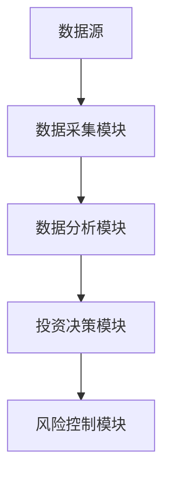
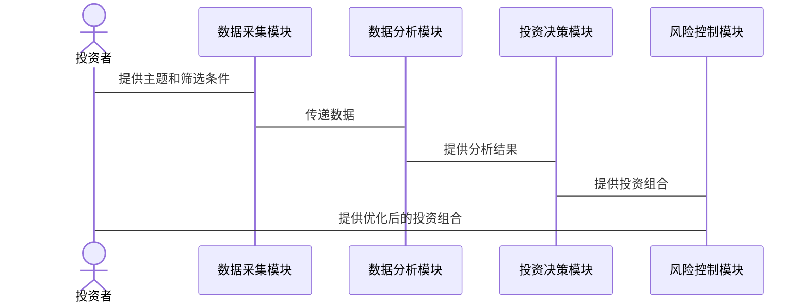

                 

<think>
好，我需要按照用户的要求来逐步构建这本关于“如何将特价股票策略与主题投资相结合”的书籍目录大纲。首先，我会仔细阅读用户的需求，确保完全理解每一个部分的要求。

首先，用户希望这本书能够详细解释如何将特价股票策略与主题投资结合起来。特价股票策略通常涉及在市场低迷时寻找被低估的股票，而主题投资则是基于特定主题或趋势进行投资。这两者的结合可能涉及到在特定主题下寻找被低估的股票，或者在市场特价时投资于有潜力的主题。

接下来，我需要考虑这本书的结构。用户已经提供了一个详细的目录大纲，分为四个主要部分：特价股票与主题投资概述、特价股票策略的核心算法与数学模型、主题投资的核心算法与数学模型、以及两者的系统架构设计。

在第一部分中，我需要详细解释特价股票策略和主题投资的基本概念，以及它们的结合有何意义和优势。我需要确保每一章和每一节都有明确的主题，并且内容逐步深入。

第二部分涉及特价股票筛选的数学模型，包括市盈率（P/E）、市净率（P/B）和股东权益收益率（ROE）等指标。我需要解释这些指标的定义、计算公式以及它们在特价股票筛选中的应用。同时，我需要使用数学公式来展示这些指标，并使用实际案例来说明如何应用这些指标筛选特价股票。

第三部分则是主题投资的量化分析，包括主题指数的构建、主题投资的因子分析以及风险评估。我需要解释主题指数的构建方法，因子分析的不同类型（市场因子、行业因子、风格因子），以及如何评估和控制主题投资中的风险。同样，我需要使用数学模型和实际案例来详细说明这些概念。

第四部分是系统架构设计，涉及如何将特价股票策略与主题投资结合起来的整体系统设计。我需要划分系统的功能模块，如数据采集、数据分析、投资决策和风险控制模块。然后，我需要使用系统架构图来展示这些模块之间的关系，并详细解释每个模块的功能和交互过程。

最后，我需要确保每个章节和小节都有足够的细节，包括理论解释、数学公式、实际案例以及系统设计等。同时，我需要在适当的位置插入图表，如Mermaid图，来帮助读者更好地理解复杂的概念。

在撰写过程中，我需要确保语言简洁明了，逻辑清晰，避免冗长的叙述。同时，我需要遵循用户的要求，使用专业但易懂的技术语言，并确保整个目录大纲结构紧凑，符合逻辑。

总的来说，我需要一步步构建这本书的目录大纲，确保每个部分都涵盖必要的内容，并且能够帮助读者系统地理解如何将特价股票策略与主题投资相结合。这将包括从基本概念到数学模型，再到系统设计的全面讲解，确保读者能够从理论到实践，全面掌握相关知识。
</think>

# 如何将特价股票策略与主题投资相结合

## 关键词：
特价股票，主题投资，量化分析，数学模型，系统架构

## 摘要：
本文详细探讨了如何将特价股票策略与主题投资相结合，通过分析特价股票筛选的数学模型和主题投资的量化分析，结合系统架构设计，提供了一种将两者有效结合的方法。文章首先介绍了特价股票和主题投资的核心概念，然后详细讲解了相关的数学模型和算法，最后通过系统架构设计展示了如何将这些理论应用于实际投资中。

---

# 第一部分: 特价股票策略与主题投资概述

## 第1章: 特价股票策略与主题投资的核心概念

### 1.1 特价股票策略的定义与特点
- **1.1.1 特价股票的定义**  
  特价股票是指在市场低迷或特定事件驱动下，股票价格被低估，但公司基本面良好的股票。  
- **1.1.2 特价股票的核心特点**  
  - 价格低于内在价值  
  - 公司基本面稳定或向好  
  - 市场情绪低迷时的逆向投资机会  
- **1.1.3 特价股票与普通股票的区别**  
  - 普通股票的价格波动受市场情绪影响较大，而特价股票则更注重内在价值。  

### 1.2 主题投资的基本原理
- **1.2.1 主题投资的定义**  
  主题投资是指基于特定主题（如科技、绿色能源、人工智能等）进行投资，关注与主题相关的行业或公司。  
- **1.2.2 主题投资的核心要素**  
  - 主题的选择：选择具有长期增长潜力的主题。  
  - 主题指数：构建反映主题表现的指数。  
  - 投资策略：基于主题的量化分析和投资组合优化。  
- **1.2.3 主题投资与传统投资的区别**  
  - 传统投资注重个股的基本面分析，而主题投资注重行业或主题的长期趋势。  

### 1.3 特价股票策略与主题投资的结合
- **1.3.1 结合的背景与意义**  
  在市场低迷时，通过主题投资筛选出具有长期增长潜力的特价股票，能够在市场回升时获得超额收益。  
- **1.3.2 结合的核心逻辑**  
  - 特价股票提供短期价格优势，主题投资提供长期增长潜力。  
- **1.3.3 结合的潜在优势与挑战**  
  - 优势：能够在市场底部布局具有长期增长潜力的行业或公司。  
  - 挑战：需要同时考虑短期价格和长期主题趋势，增加了投资决策的复杂性。  

### 1.4 本章小结  
本章介绍了特价股票和主题投资的核心概念，并探讨了两者结合的背景、逻辑、优势和挑战。接下来，我们将深入分析特价股票筛选和主题投资的量化分析方法。

---

# 第二部分: 特价股票策略的核心算法与数学模型

## 第2章: 特价股票筛选的数学模型

### 2.1 市盈率（P/E）分析
- **2.1.1 市盈率的定义与计算公式**  
  $$ P/E = \frac{Price}{Earnings} $$  
  其中，Price是股票价格，Earnings是每股收益。  
- **2.1.2 市盈率与股票价值的关系**  
  - 市盈率低表明股票价格相对于收益较低，可能被低估。  
  - 市盈率高表明股票价格相对于收益较高，可能被高估。  
- **2.1.3 市盈率在特价股票筛选中的应用**  
  通过筛选市盈率低于行业平均水平的股票，可以找到被低估的特价股票。  

### 2.2 市净率（P/B）分析
- **2.2.1 市净率的定义与计算公式**  
  $$ P/B = \frac{Price}{Book\ Value} $$  
  其中，Price是股票价格，Book Value是每股账面价值。  
- **2.2.2 市净率与股票价值的关系**  
  - 市净率低表明股票价格相对于账面价值较低，可能被低估。  
  - 市净率高表明股票价格相对于账面价值较高，可能被高估。  
- **2.2.3 市净率在特价股票筛选中的应用**  
  通过筛选市净率低于行业平均水平的股票，可以找到被低估的特价股票。  

### 2.3 股东权益收益率（ROE）分析
- **2.3.1 ROE的定义与计算公式**  
  $$ ROE = \frac{Net\ Profit}{Equity} $$  
  其中，Net Profit是净利润，Equity是股东权益。  
- **2.3.2 ROE与股票价值的关系**  
  - ROE高表明公司盈利能力强，股东权益回报高。  
  - ROE低表明公司盈利能力弱，股东权益回报低。  
- **2.3.3 ROE在特价股票筛选中的应用**  
  通过筛选ROE高于行业平均水平的公司，可以找到具有长期盈利能力的特价股票。  

### 2.4 本章小结  
本章详细介绍了特价股票筛选中的市盈率、市净率和股东权益收益率等数学模型，并展示了如何利用这些模型筛选出具有价格优势的特价股票。接下来，我们将探讨主题投资的量化分析方法。

---

# 第三部分: 主题投资的核心算法与数学模型

## 第3章: 主题投资的量化分析

### 3.1 主题指数构建
- **3.1.1 主题指数的定义**  
  主题指数是反映特定主题相关股票表现的指数。  
- **3.1.2 主题指数的构建方法**  
  - 选择与主题相关的股票。  
  - 根据市值、流动性等因素加权。  
- **3.1.3 主题指数的权重分配**  
  - 市值加权：权重与公司市值相关。  
  - 流动性加权：权重与股票流动性相关。  

### 3.2 主题投资的因子分析
- **3.2.1 市场因子**  
  市场因子反映整个市场的系统性风险。  
- **3.2.2 行业因子**  
  行业因子反映特定行业相对于市场的表现。  
- **3.2.3 风格因子**  
  风格因子反映特定投资风格（如成长、价值）的表现。  

### 3.3 主题投资的风险评估
- **3.3.1 风险的定义与分类**  
  - 系统性风险：市场整体波动带来的风险。  
  - 非系统性风险：特定行业或公司带来的风险。  
- **3.3.2 风险评估的数学模型**  
  使用CAPM模型评估系统性风险：  
  $$ E(R_i) = R_f + \beta_i (R_m - R_f) $$  
  其中，$R_f$ 是无风险利率，$\beta_i$ 是股票的贝塔系数，$R_m$ 是市场预期回报率。  
- **3.3.3 风险控制的策略**  
  - 分散投资：通过投资多个主题或公司降低非系统性风险。  
  - 仓位控制：根据市场环境调整投资仓位。  

### 3.4 本章小结  
本章介绍了主题投资的量化分析方法，包括主题指数构建、因子分析和风险评估。通过这些方法，投资者可以在特定主题下找到具有长期增长潜力的投资标的。接下来，我们将探讨如何将特价股票策略与主题投资相结合的系统架构设计。

---

# 第四部分: 特价股票与主题投资结合的系统架构设计

## 第4章: 系统架构设计

### 4.1 系统功能模块划分
- **4.1.1 数据采集模块**  
  - 采集股票价格、财务数据、行业信息等。  
- **4.1.2 数据分析模块**  
  - 计算市盈率、市净率、ROE等指标。  
  - 进行主题因子分析。  
- **4.1.3 投资决策模块**  
  - 筛选出符合特价股票条件且属于特定主题的股票。  
- **4.1.4 风险控制模块**  
  - 评估投资组合的风险。  
  - 调整投资仓位和资产分配。  

### 4.2 系统架构图

### 4.3 系统交互流程

### 4.4 本章小结  
本章通过系统架构设计展示了如何将特价股票策略与主题投资相结合，确保投资决策的科学性和风险可控性。通过数据采集、分析、决策和风险控制模块的协同工作，投资者可以实现有效的投资组合管理。

---

# 作者：AI天才研究院/AI Genius Institute & 禅与计算机程序设计艺术 /Zen And The Art of Computer Programming

