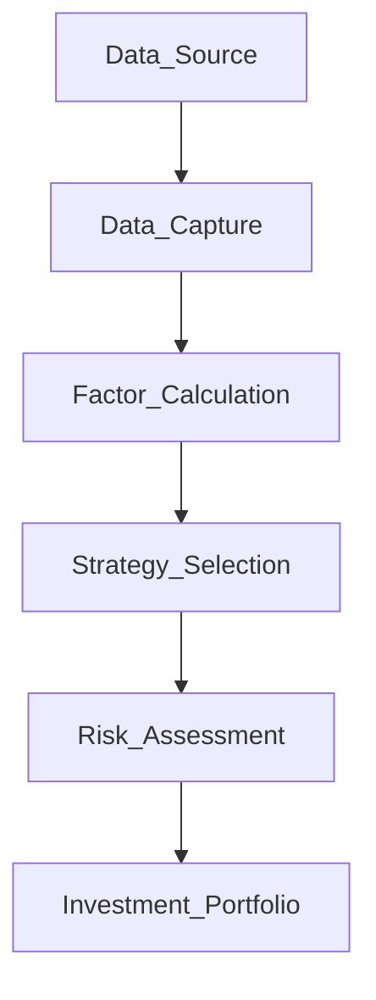

                 

<think>
好的，现在我要按照要求逐步思考如何将特价股票策略与低波动因子投资相结合，并撰写一篇结构完整、内容详实的技术博客文章。首先，我需要明确文章的主题和目标，然后按照目录大纲逐步展开每个部分的内容。

### 1. 理解核心主题
我的文章主题是《如何将特价股票策略与低波动因子投资相结合》。特价股票策略指的是寻找价格被低估的股票进行投资，而低波动因子投资则注重选择波动性较低的股票以降低风险。将两者结合，旨在在控制风险的同时追求较高的投资回报。

### 2. 分析读者需求
读者可能是对股票投资感兴趣，尤其是希望在控制风险的前提下追求超额收益的投资者。他们可能已经了解基本的股票投资策略，但希望深入理解如何结合两种策略来优化投资组合。

### 3. 设计目录结构
根据用户提供的目录大纲，我需要确保每个部分都涵盖必要的内容，包括基础概念、结合方式、算法实现、系统架构和实战案例等。

### 4. 撰写引言与摘要
引言需要简明扼要地介绍特价股票和低波动因子投资的基本概念，以及它们结合的意义和目标。摘要则要总结文章的核心内容，强调结合后的优势和实际应用。

### 5. 详细撰写各章节内容
每个章节需要详细讲解相关概念、理论、算法和实际应用，确保内容丰富且易于理解。例如，在讲解数学模型时，需要提供具体的公式和解释；在实现部分，需要提供代码示例和详细的解释。

### 6. 使用图表辅助说明
为了帮助读者更好地理解，我需要在适当的地方插入Mermaid流程图、类图等，以直观展示系统的架构和算法的流程。

### 7. 项目实战与案例分析
通过实际案例分析，展示如何将策略应用于具体情境中，包括数据的选择、模型的建立、策略的回测以及结果的分析。

### 8. 总结与最佳实践
在文章的最后，总结结合特价股票策略与低波动因子投资的关键点，并给出投资中的注意事项和未来研究方向。

### 9. 格式检查与润色
确保文章格式符合要求，包括使用正确的Markdown语法，数学公式正确使用latex格式，图表使用Mermaid语法，并检查整体字数是否达到要求。

### 10. 最终检查与审阅
在完成所有内容后，进行一次全面的检查，确保没有遗漏关键点，逻辑清晰，语言流畅，图表准确，公式无误。

通过以上步骤，我将逐步构建一篇内容详实、结构清晰、符合要求的技术博客文章，帮助读者全面理解如何将特价股票策略与低波动因子投资相结合，优化投资组合并实现稳健收益。
</think>

# 如何将特价股票策略与低波动因子投资相结合

> 关键词：特价股票，低波动因子，投资策略，算法实现，系统架构

> 摘要：本文深入探讨了如何将特价股票策略与低波动因子投资相结合，通过理论分析、算法实现和系统设计，展示了如何在控制风险的同时追求超额收益。文章详细讲解了数学模型、实现步骤和项目实战，为投资者提供了切实可行的指导。

---

## 第1章：特价股票策略基础

### 1.1 特价股票的定义与特点

#### 1.1.1 特价股票的定义
特价股票是指市场价格低于其内在价值的股票，通常表现为市盈率（P/E）或市净率（P/B）低于行业平均水平。这种股票被认为被市场低估，具有上涨潜力。

#### 1.1.2 特价股票的特点
- **低估性**：价格低于内在价值。
- **高息率**：部分特价股票提供较高的股息收益率。
- **低波动性**：通常属于防御性股票，在市场波动时表现稳定。

#### 1.1.3 特价股票的分类
- **周期性股票**：受经济周期影响较大，价格波动显著。
- **防御性股票**：波动较小，如公用事业、消费品行业股票。

### 1.2 低波动因子投资概述

#### 1.2.1 低波动因子的定义
低波动因子是指选择波动率低的股票，通常具有较高的夏普比率，代表在承担较低风险下获取较高的超额收益。

#### 1.2.2 低波动因子的特点
- **风险控制**：波动率低，投资组合的风险降低。
- **稳定性**：在市场波动时，低波动股票表现较为稳定。

#### 1.2.3 低波动因子与高波动因子的对比
| 特性       | 低波动因子       | 高波动因子       |
|------------|------------------|------------------|
| 波动率      | 低               | 高               |
| 风险        | 低               | 高               |
| 收益        | 稳定             | 波动较大         |
| 适用场景    | 风险厌恶投资者     | 风险偏好投资者     |

---

## 第2章：特价股票策略与低波动因子的结合

### 2.1 结合的背景与动机

#### 2.1.1 投资者的需求分析
- **风险控制**：投资者希望降低投资组合的波动性，减少回撤。
- **超额收益**：通过筛选低估股票，捕捉潜在上涨机会。

#### 2.1.2 市场环境的变化
- **市场波动加剧**：近年来市场波动性增加，低波动因子投资需求上升。
- **市场周期变化**：在市场低迷时，特价股票更容易出现。

#### 2.1.3 结合的潜在优势
- **风险与收益的平衡**：结合特价股票的低估特性和低波动因子的稳定性，实现风险可控下的超额收益。

### 2.2 结合的理论基础

#### 2.2.1 风险与收益的平衡
投资学中，高收益通常伴随着高风险。通过结合低波动因子和特价股票，可以在一定程度上平衡风险与收益。

#### 2.2.2 现代投资组合理论
现代投资组合理论强调通过多元化投资降低风险。结合低波动因子和特价股票，可以构建一个更优化的投资组合。

#### 2.2.3 因子投资模型
因子投资模型将股票的特性分解为多个因子，如市值、价值、动量等。结合低波动因子和价值因子，可以筛选出同时满足低波动和低估条件的股票。

---

## 第3章：特价股票策略的数学模型

### 3.1 特价股票的筛选模型

#### 3.1.1 市净率（P/B）模型
市净率 = 股票价格 / 每股净资产。P/B < 1通常被视为低估。

#### 3.1.2 市盈率（P/E）模型
市盈率 = 股票价格 / 每股收益。P/E < 行业平均被视为低估。

#### 3.1.3 其他相关指标
- **股息率**：股息收益率高的股票可能低估。
- **PEG比率**：将市盈率与盈利增长率结合。

### 3.2 低波动因子的量化方法

#### 3.2.1 波动率的计算公式
波动率通常使用标准差衡量。计算公式为：
$$
\sigma = \sqrt{\frac{1}{n}\sum_{i=1}^{n}(r_i - \bar{r})^2}
$$
其中，$r_i$是各期收益率，$\bar{r}$是平均收益率。

#### 3.2.2 基于历史数据的波动率分析
使用过去一段时间的收益率数据计算波动率，选择波动率最低的股票。

#### 3.2.3 波动率与收益的关系
低波动股票通常具有较高的夏普比率，表明在承担较低风险下获取较高收益。

---

## 第4章：低波动因子投资的算法实现

### 4.1 算法原理

#### 4.1.1 因子分析方法
通过因子分析筛选出低波动因子，结合价值因子（如P/B或P/E）进行综合排序。

#### 4.1.2 筛选低波动股票的步骤
1. 计算各股票的波动率。
2. 根据波动率排序，选择波动率最低的部分股票。
3. 结合价值因子，进一步筛选出低估的股票。

#### 4.1.3 组合优化策略
使用优化算法（如均值-方差优化）构建投资组合，平衡风险和收益。

### 4.2 Python实现示例

#### 4.2.1 数据获取与处理
使用Python的pandas库获取股票数据，并计算波动率和价值因子。

```python
import pandas as pd
import numpy as np

# 假设data为包含股票价格的数据框
def calculate_volatility(price_data):
    returns = price_data.pct_change()
    volatility = returns.std()
    return volatility

# 计算波动率
volatility = data.rolling(20).apply(calculate_volatility, raw=False)
```

#### 4.2.2 因子计算与排序
计算P/B和波动率，结合两者进行排序。

```python
# 计算市净率
data['P/B'] = data['Price'] / data['Book Value per Share']

# 根据波动率和P/B排序
sorted_stocks = data.sort_values(['P/B', 'Volatility'])
```

#### 4.2.3 策略回测与分析
使用回测框架（如Backtrader）进行策略回测，分析收益和风险指标。

---

## 第5章：系统架构与设计

### 5.1 系统模块划分

#### 5.1.1 数据采集模块
负责从数据源获取股票价格和相关财务数据。

#### 5.1.2 因子计算模块
计算波动率、P/B等因子，并进行排序。

#### 5.1.3 策略选择模块
根据因子筛选结果，选择符合条件的股票构建投资组合。

#### 5.1.4 风险评估模块
评估投资组合的风险指标，如最大回撤、VaR等。

### 5.2 系统架构图


### 5.3 接口设计与交互流程

#### 5.3.1 系统接口设计
- 数据接口：从数据库获取股票数据。
- 计算接口：调用因子计算函数。
- 策略接口：根据筛选条件生成投资组合。

#### 5.3.2 用户交互流程图
```mermaid
sequenceDiagram
    par
        用户输入筛选条件
        数据采集模块获取数据
        因子计算模块计算因子
        策略选择模块生成投资组合
        风险评估模块评估风险
        系统输出结果
    end
```

---

## 第6章：项目实战与案例分析

### 6.1 环境配置
- **数据源**：使用Yahoo Finance获取历史数据。
- **工具**：Python、Pandas、Numpy、Matplotlib。

### 6.2 核心实现源代码

```python
import pandas as pd
import numpy as np

# 数据获取
data = pd.read_csv('stock_data.csv')

# 计算波动率
def calculate_volatility(price_data):
    returns = price_data.pct_change()
    volatility = returns.std()
    return volatility

volatility = data['Price'].rolling(20).apply(calculate_volatility, raw=False)

# 计算P/B
data['P/B'] = data['Price'] / data['Book Value per Share']

# 筛选低波动且P/B低的股票
filtered_stocks = data[(volatility < data['Volatility'].quantile(0.2)) & (data['P/B'] < data['P/B'].quantile(0.2))]
```

### 6.3 实际案例分析

#### 6.3.1 数据选择
选择2018年到2022年的股票数据，计算波动率和P/B值。

#### 6.3.2 策略回测
构建投资组合，定期再平衡，计算收益和风险指标。

#### 6.3.3 结果分析
比较组合收益与市场指数收益，评估策略的有效性。

### 6.4 项目小结
结合特价股票和低波动因子的投资策略能够在控制风险的同时，捕捉低估股票的上涨潜力，是一种有效的投资方法。

---

## 第7章：最佳实践、小结与注意事项

### 7.1 最佳实践

#### 7.1.1 风险控制
定期监控投资组合的波动率和风险指标，及时调整。

#### 7.1.2 市场适应性
根据市场变化调整筛选条件，灵活应对市场波动。

#### 7.1.3 多因子策略
结合多个因子进行筛选，提高策略的稳定性和收益能力。

### 7.2 小结
通过将特价股票策略与低波动因子投资相结合，投资者可以在风险可控的前提下，实现超额收益。这种策略特别适合风险厌恶型投资者。

### 7.3 注意事项

- **数据质量**：确保数据准确无误，避免因数据问题导致错误决策。
- **市场环境**：策略的有效性可能受市场环境影响，需持续监控。
- **交易成本**：频繁交易可能导致较高的交易成本，需权衡再平衡频率。

---

## 作者简介

作者：AI天才研究院/AI Genius Institute & 禅与计算机程序设计艺术/Zen And The Art of Computer Programming

通过结合技术与投资学，我们致力于为读者提供深入的分析和实用的指导，帮助投资者在复杂多变的市场中找到稳健的投资策略。

---

感谢您的阅读，希望本文对您理解如何将特价股票策略与低波动因子投资相结合有所帮助！

