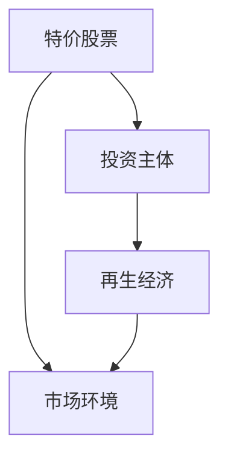
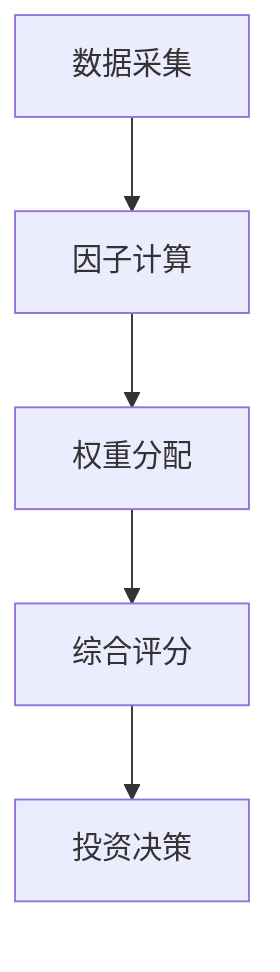
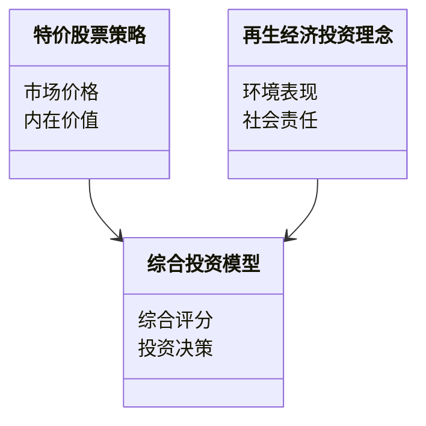

                 


# 如何将特价股票策略与再生经济投资理念结合

> 关键词：特价股票策略，再生经济，投资理念，多因子模型，可持续发展，循环经济

> 摘要：本文探讨如何将特价股票策略与再生经济投资理念结合，通过分析核心概念、算法原理、系统架构及项目实战，提供一种新型的投资策略，既追求财务回报，又兼顾可持续发展。

---

## 第一章: 特价股票策略与再生经济投资理念的背景介绍

### 1.1 特价股票策略的背景
#### 1.1.1 什么是特价股票策略
特价股票策略是一种投资策略，旨在通过识别市场价格低于其内在价值的股票，利用市场短期波动带来的价格差异，实现超额收益。其核心在于发现市场中的估值偏差，抓住短期投资机会。

#### 1.1.2 特价股票策略的核心要素
- **估值偏差**：市场价格与内在价值之间的差异是策略的基础。
- **短期波动**：利用市场的短期波动，捕捉价格反弹的机会。
- **风险控制**：通过严格的风险管理，限制投资组合的波动性。

#### 1.1.3 特价股票策略的边界与外延
- **边界**：仅适用于对市场价格波动的短期预测，不考虑长期趋势。
- **外延**：可结合技术分析、行业分析等其他投资策略。

### 1.2 再生经济投资理念的背景
#### 1.2.1 什么是再生经济
再生经济是一种以资源高效利用和循环利用为核心的发展模式，强调通过减少资源消耗和环境污染，实现经济的可持续发展。

#### 1.2.2 再生经济投资理念的核心要素
- **可持续性**：关注企业的环保表现和社会责任。
- **循环经济**：投资于能够有效利用资源、减少浪费的企业。
- **长期价值**：通过支持可持续发展，创造长期的投资价值。

#### 1.2.3 再生经济投资理念的边界与外延
- **边界**：仅适用于对企业的长期价值评估，不考虑短期市场波动。
- **外延**：可结合企业社会责任（CSR）报告、环境影响评估等。

### 1.3 特价股票策略与再生经济投资理念的结合
#### 1.3.1 结合的必要性与可行性
- **必要性**：传统投资策略忽视了企业的可持续发展，可能导致长期风险。
- **可行性**：通过技术手段，可以将短期价格波动与长期可持续发展目标结合。

#### 1.3.2 结合的核心概念与结构
- **核心概念**：将企业的内在价值与可持续发展表现相结合。
- **结构**：通过多因子模型，将财务指标和环境社会治理（ESG）指标相结合。

#### 1.3.3 结合的潜在价值与风险
- **潜在价值**：兼顾短期收益和长期可持续发展，创造双重价值。
- **风险**：短期波动与长期目标的冲突可能导致策略失效。

---

## 第二章: 特价股票策略与再生经济投资理念的核心概念与联系

### 2.1 核心概念原理
#### 2.1.1 特价股票策略的原理
- 通过技术分析识别市场价格波动，捕捉低估股票的投资机会。

#### 2.1.2 再生经济投资理念的原理
- 通过基本面分析，识别具有可持续发展潜力的企业。

#### 2.1.3 两者的结合原理
- 通过多因子模型，将短期价格波动与长期可持续发展目标相结合。

### 2.2 核心概念属性特征对比
| 属性 | 特价股票策略 | 再生经济投资理念 |
|------|--------------|-----------------|
| 核心目标 | 短期超额收益 | 长期可持续发展 |
| 关注点 | 价格波动、估值偏差 | 环境表现、社会责任 |
| 风险控制 | 严格的风险管理 | 长期价值导向 |

### 2.3 ER实体关系图架构


---

## 第三章: 特价股票策略与再生经济投资理念的算法原理

### 3.1 算法原理概述
#### 3.1.1 多因子模型
- 通过多个因子（如市盈率、市净率、ESG评分）综合评估股票的内在价值。

#### 3.1.2 熵值法
- 通过熵值法计算各个因子的权重，实现多因子的综合评分。

#### 3.1.3 综合评分模型
- 结合多因子模型和熵值法，构建综合评分模型，评估股票的投资价值。

### 3.2 算法流程图


### 3.3 算法实现代码
```python
import pandas as pd
import numpy as np

# 示例数据
data = pd.DataFrame({
    'stock_price': [10, 20, 30, 40],
    'factor1': [0.5, 0.6, 0.7, 0.8],
    'factor2': [0.3, 0.4, 0.5, 0.6]
})

# 计算综合评分
weights = np.array([0.5, 0.5])
score = np.dot(data[['factor1', 'factor2']], weights)
data['综合评分'] = score
print(data)
```

---

## 第四章: 特价股票策略与再生经济投资理念的系统分析与架构设计

### 4.1 问题场景介绍
- 通过系统化的方法，将特价股票策略与再生经济投资理念结合，构建一个综合投资模型。

### 4.2 系统功能设计
#### 4.2.1 领域模型


#### 4.2.2 系统架构设计


---

## 第五章: 特价股票策略与再生经济投资理念的项目实战

### 5.1 环境安装
- 安装必要的Python库：pandas、numpy、matplotlib。

### 5.2 系统核心实现源代码
```python
import pandas as pd
import numpy as np

# 示例数据
data = pd.DataFrame({
    'stock_price': [10, 20, 30, 40],
    'factor1': [0.5, 0.6, 0.7, 0.8],
    'factor2': [0.3, 0.4, 0.5, 0.6]
})

# 计算综合评分
weights = np.array([0.5, 0.5])
score = np.dot(data[['factor1', 'factor2']], weights)
data['综合评分'] = score
print(data)
```

### 5.3 代码应用解读与分析
- 通过代码实现多因子模型，计算股票的综合评分，评估其投资价值。

### 5.4 实际案例分析
- 分析某公司的股票价格和ESG评分，计算综合评分，评估其投资价值。

### 5.5 项目小结
- 总结项目的实现过程，分析可能遇到的问题，并提出改进建议。

---

## 第六章: 最佳实践与总结

### 6.1 小结
- 总结本文的核心内容，强调将特价股票策略与再生经济投资理念结合的重要性。

### 6.2 注意事项
- 提醒读者在实际操作中注意数据质量和模型的可解释性。

### 6.3 拓展阅读
- 建议读者进一步阅读相关领域的文献，深入了解多因子模型和ESG投资。

---

## 作者

作者：AI天才研究院/AI Genius Institute & 禅与计算机程序设计艺术 /Zen And The Art of Computer Programming

