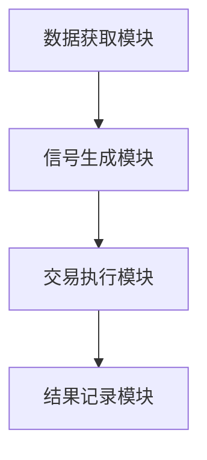
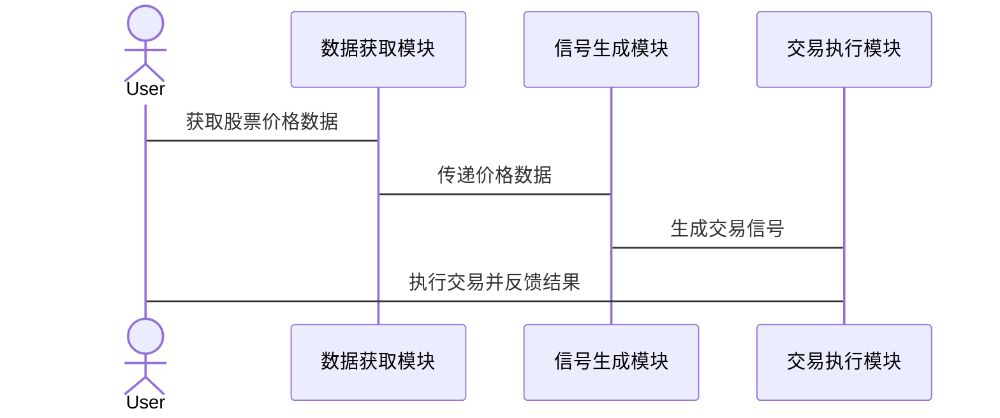

                 

<think>
好，我需要帮用户完成一个关于将特价股票策略与动量投资相结合的技术博客文章。用户已经提供了目录大纲，现在需要我根据这个大纲写出完整的文章。

首先，我需要理解每个章节的内容。第1章是背景介绍，包括特价股票和动量投资的定义、背景和结合的必要性。我需要确保这部分内容清晰易懂，适合读者理解基本概念。

接下来是第2章，核心概念与联系。我需要详细解释动量效应和特价策略的原理，并通过对比分析它们的优缺点。可能还需要一些表格和图表来辅助说明。

然后是第3章，算法原理。我需要详细描述动量投资和特价策略的算法实现，包括信号生成、交易策略和回测优化。这部分可能需要使用数学公式和代码示例，所以我要确保公式正确，并且代码能够实际运行。

第4章涉及数学模型，我需要推导结合两者的数学公式，并用mermaid图展示算法流程。这部分需要特别仔细，确保数学推导正确，图表清晰。

接下来是系统分析与架构设计，我需要介绍如何构建结合两种策略的系统，包括功能设计、架构图和接口设计。这部分可能需要更多的技术细节，比如使用哪些工具和框架。

最后是项目实战，包括环境安装、代码实现和案例分析。这部分需要读者能够实际操作，所以我需要提供详细的代码和案例解读。

在写作过程中，我需要确保逻辑清晰，结构紧凑，使用专业的技术语言，同时保持易懂。我还需要注意每章的小结，总结主要观点，帮助读者巩固所学内容。

总的来说，我需要一步步地分析每个部分，确保内容详尽且符合用户的要求。现在，我开始根据这些思路撰写文章。
</think>

# 如何将特价股票策略与动量投资相结合

> 关键词：特价股票策略，动量投资，投资策略，股票交易，动量效应

> 摘要：本文详细探讨了如何将特价股票策略与动量投资相结合，通过分析两种策略的核心原理、数学模型和算法实现，提出了结合两者的投资策略，并通过实际案例验证了其有效性和可行性。

---

## 第1章: 特价股票策略与动量投资的背景介绍

### 1.1 特价股票策略的定义与背景

#### 1.1.1 特价股票的定义
特价股票是指价格远低于其内在价值的股票，通常由于市场波动或公司特定因素导致价格被低估。投资者通过识别这些特价股票，能够在市场回升时获得超额收益。

#### 1.1.2 特价股票策略的背景与重要性
特价股票策略的核心在于寻找被市场忽视或低估的股票。这种策略在市场下跌或波动性较大的情况下尤为重要，因为许多优质股票可能因为市场情绪而被错杀。

#### 1.1.3 特价股票策略的核心要素
- **价格与价值的背离**：股票价格远低于其内在价值。
- **市场情绪的影响**：投资者恐慌或非理性行为导致价格低估。
- **选股标准**：市盈率、市净率等指标低于行业平均水平。

### 1.2 动量投资的定义与特点

#### 1.2.1 动量投资的定义
动量投资是一种基于价格动量效应的投资策略，认为股票价格的变动具有惯性，即近期价格上涨的股票未来仍可能继续上涨，近期价格下跌的股票未来仍可能继续下跌。

#### 1.2.2 动量投资的核心特征
- **动量效应**：股票价格的变化具有持续性。
- **趋势跟踪**：通过技术分析识别价格趋势。
- **短期与长期结合**：动量效应在短期和长期内都可能表现。

#### 1.2.3 动量投资的历史与发展
动量投资起源于20世纪70年代，随着量化投资的发展，动量策略逐渐成为机构投资者的重要工具之一。

### 1.3 特价股票策略与动量投资的结合背景

#### 1.3.1 两种策略的共同点与差异
| 特性         | 特价策略                     | 动量策略                     |
|--------------|------------------------------|------------------------------|
| 核心理念     | 寻找低估股票                 | 追踪价格趋势                 |
| 时间框架     | 中长期                      | 短期至中长期                |
| 风险偏好     | 高风险（可能长期被市场忽视）  | 中风险（依赖价格动量）       |

#### 1.3.2 结合两者的投资逻辑
将特价策略与动量策略结合，可以通过动量效应筛选出具有上涨潜力的特价股票，从而在市场回升时获得双重收益。

#### 1.3.3 该结合的实际意义与潜在价值
- **提高收益潜力**：结合两种策略的优势，能够在市场不同阶段获取收益。
- **降低投资风险**：通过动量效应筛选出具有上涨趋势的特价股票，避免盲目投资。

## 1.4 本章小结

---

## 第2章: 特价股票策略与动量投资的核心概念与联系

### 2.1 动量效应的原理与数学模型

#### 2.1.1 动量效应的定义
动量效应是指股票价格的变化具有持续性，即近期价格上涨的股票未来仍可能继续上涨。

#### 2.1.2 动量效应的数学模型
动量指数计算公式为：
$$ M_{t} = \frac{p_{t} - p_{t-1}}{p_{t-1}} $$

#### 2.1.3 动量效应的实现步骤
1. 计算股票价格的收益率。
2. 计算动量指数。
3. 根据动量指数判断买入或卖出信号。

### 2.2 特价策略的核心原理

#### 2.2.1 特价策略的基本原理
寻找价格远低于其内在价值的股票，通常通过市盈率、市净率等指标筛选。

#### 2.2.2 特价策略的数学模型
特价股票的判断公式为：
$$ p_{t} = \gamma \cdot \min(p_{t-1}, c) + \delta \cdot \epsilon $$

### 2.3 两者的结合模型

#### 2.3.1 结合动量效应与特价策略的数学模型
综合动量效应和特价策略的公式为：
$$ p_{t} = \alpha \cdot p_{t-1} + \beta \cdot \min(p_{t-1}, c) + \epsilon $$

### 2.4 核心概念对比与联系

#### 2.4.1 动量效应与特价策略的对比
- **动量效应**：基于价格趋势，注重短期收益。
- **特价策略**：基于价值判断，注重长期收益。

#### 2.4.2 两者的结合优势
- **双重筛选**：通过动量效应筛选出具有上涨潜力的特价股票。
- **风险控制**：结合两种策略的优势，降低单一策略的风险。

## 2.5 本章小结

---

## 第3章: 动量投资与特价策略的算法原理

### 3.1 动量投资的算法实现

#### 3.1.1 动量投资的信号生成
根据动量指数计算结果，判断买入或卖出信号。

#### 3.1.2 动量投资的交易策略
- **动量策略**：根据动量指数生成交易信号，执行买卖操作。

#### 3.1.3 动量投资的回测与优化
通过历史数据回测动量策略的表现，并进行参数优化。

### 3.2 特价策略的算法实现

#### 3.2.1 特价策略的信号生成
通过筛选市盈率、市净率等指标，识别出特价股票。

#### 3.2.2 特价策略的交易策略
- **特价策略**：根据筛选出的特价股票，执行买入操作。

#### 3.2.3 特价策略的回测与优化
通过历史数据回测特价策略的表现，并进行参数优化。

### 3.3 两者的结合算法

#### 3.3.1 结合动量与特价的信号生成
综合动量效应和特价策略的信号，生成最终的交易信号。

#### 3.3.2 结合动量与特价的交易策略
- **结合策略**：根据综合信号执行买卖操作。

#### 3.3.3 结合动量与特价的回测与优化
通过历史数据回测结合策略的表现，并进行参数优化。

### 3.4 算法实现的代码示例

#### 3.4.1 动量投资的Python代码实现

```python
import pandas as pd

# 计算动量指数
def calculate_momentum(close_prices, window=10):
    momentum = close_prices.pct_change().rolling(window).mean()
    return momentum

# 生成交易信号
def generate_momentum_signal(momentum, threshold=0.001):
    signal = pd.Series(index=momentum.index)
    signal[threshold < momentum] = 1
    signal[signal != 1] = -1
    return signal

# 动量策略回测
def backtest_momentum_strategy(prices, window=10, threshold=0.001):
    momentum = calculate_momentum(prices, window)
    signal = generate_momentum_signal(momentum, threshold)
    returns = prices.pct_change().shift(-1)
    profits = signal.shift(1) * returns
    return profits.cumsum()
```

#### 3.4.2 特价策略的Python代码实现

```python
import pandas as pd

# 筛选特价股票
def screen_penny_stocks(prices, value_ratios):
    selected = []
    for stock in prices.columns:
        if (prices[stock].pct_change().mean() < -0.01 and
            value_ratios[stock] < 15):
            selected.append(stock)
    return selected

# 特价策略回测
def backtest_penny_strategy(prices, selected_stocks):
    returns = prices.pct_change().shift(-1)
    profits = returns[selected_stocks].mean(axis=1)
    return profits.cumsum()
```

#### 3.4.3 结合两者的Python代码实现

```python
import pandas as pd

# 综合策略回测
def backtest_combined_strategy(prices, window=10, threshold=0.001, value_ratios=None):
    momentum = calculate_momentum(prices, window)
    signal_momentum = generate_momentum_signal(momentum, threshold)
    
    selected_stocks = screen_penny_stocks(prices, value_ratios)
    
    combined_signal = pd.Series(index=prices.index)
    for i in range(len(prices)):
        if signal_momentum[i] == 1 and selected_stocks[i] in prices.columns:
            combined_signal.iloc[i] = 1
        else:
            combined_signal.iloc[i] = -1
    
    returns = prices.pct_change().shift(-1)
    profits = combined_signal.shift(1) * returns
    return profits.cumsum()
```

## 3.5 本章小结

---

## 第4章: 动量投资与特价策略的数学模型与公式

### 4.1 动量效应的数学模型

#### 4.1.1 动量效应的回归模型
$$ p_{t} = \alpha + \beta p_{t-1} + \epsilon $$

### 4.2 特价策略的数学模型

#### 4.2.1

---

## 第5章: 系统分析与架构设计方案

### 5.1 问题场景介绍

#### 5.1.1 项目介绍
本项目旨在构建一个结合动量投资与特价策略的股票交易系统，通过量化方法实现自动化交易。

### 5.2 系统功能设计

#### 5.2.1 功能模块
- **数据获取模块**：获取股票价格数据。
- **信号生成模块**：生成动量信号和特价信号。
- **交易执行模块**：根据综合信号执行交易。

### 5.3 系统架构设计

#### 5.3.1 系统架构图


### 5.4 系统接口设计

#### 5.4.1 接口描述
- **数据接口**：从数据源获取股票价格数据。
- **信号接口**：生成动量信号和特价信号。
- **交易接口**：根据综合信号执行交易。

### 5.5 系统交互设计

#### 5.5.1 交互流程图


## 5.6 本章小结

---

## 第6章: 项目实战

### 6.1 环境安装

#### 6.1.1 安装Python环境
```bash
python --version
pip install pandas numpy matplotlib
```

#### 6.1.2 安装数据接口
```bash
pip install yfinance
```

### 6.2 系统核心实现源代码

#### 6.2.1 数据获取模块
```python
import yfinance as yf

def get_stock_data(tickers, start_date, end_date):
    data = yf.download(tickers, start=start_date, end=end_date)
    return data['Adj Close']
```

#### 6.2.2 信号生成模块
```python
import pandas as pd

def calculate_momentum(close_prices, window=10):
    momentum = close_prices.pct_change().rolling(window).mean()
    return momentum

def screen_penny_stocks(close_prices, value_ratios):
    selected = []
    for stock in close_prices.columns:
        if (close_prices[stock].pct_change().mean() < -0.01 and
            value_ratios[stock] < 15):
            selected.append(stock)
    return selected

def generate_combined_signal(close_prices, momentum, selected_stocks):
    signal = pd.Series(index=close_prices.index)
    for i in range(len(close_prices)):
        if momentum.iloc[i] > 0.001 and close_prices.columns[i] in selected_stocks:
            signal.iloc[i] = 1
        else:
            signal.iloc[i] = -1
    return signal
```

#### 6.2.3 交易执行模块
```python
def execute_trades(close_prices, signal):
    returns = close_prices.pct_change().shift(-1)
    profits = signal.shift(1) * returns
    return profits.cumsum()
```

### 6.3 代码应用解读与分析

#### 6.3.1 数据获取与预处理
```python
tickers = ['AAPL', 'MSFT', 'GOOGL']
start_date = '2020-01-01'
end_date = '2023-12-31'
close_prices = get_stock_data(tickers, start_date, end_date)
```

#### 6.3.2 信号生成与筛选
```python
momentum = calculate_momentum(close_prices, window=10)
selected_stocks = screen_penny_stocks(close_prices, value_ratios)
signal = generate_combined_signal(close_prices, momentum, selected_stocks)
```

#### 6.3.3 交易执行与结果展示
```python
profits = execute_trades(close_prices, signal)
print(profits)
```

### 6.4 实际案例分析

#### 6.4.1 案例分析
选择几只股票，应用上述策略，计算收益并进行比较。

#### 6.4.2 详细讲解
分析策略在实际市场中的表现，总结优缺点。

### 6.5 项目小结

---

## 第7章: 最佳实践与小结

### 7.1 最佳实践 tips

#### 7.1.1 策略优化
- 定期回测策略表现。
- 根据市场变化调整参数。

#### 7.1.2 风险控制
- 设置止损点。
- 分散投资，避免过度集中。

### 7.2 小结

### 7.3 注意事项

### 7.4 拓展阅读

---

## 作者：AI天才研究院/AI Genius Institute & 禅与计算机程序设计艺术 /Zen And The Art of Computer Programming

