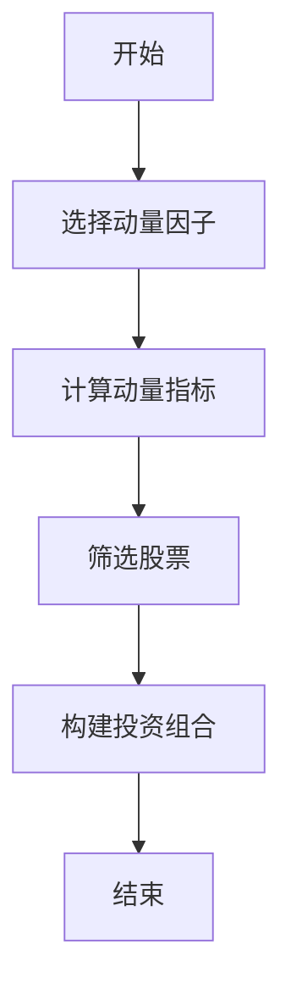
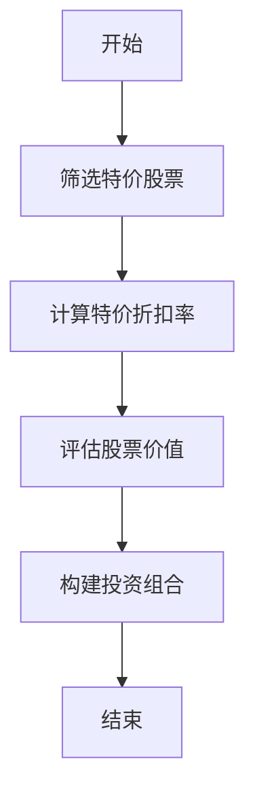
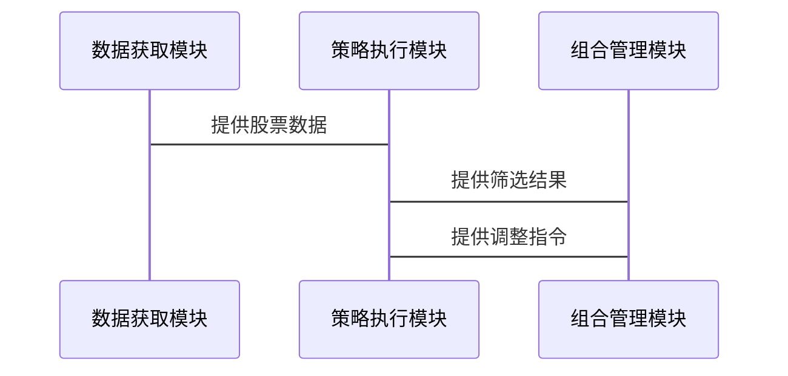

                 


# 如何将特价股票策略与动量投资结合

> 关键词：动量投资、特价股票、投资策略、风险管理、量化投资

> 摘要：本文将详细介绍如何将特价股票策略与动量投资相结合，通过分析两者的数学模型、算法原理和系统架构，探讨如何在实际投资中优化收益并降低风险。我们将从背景介绍、核心概念、算法实现、系统设计到项目实战，全面解析这一结合的理论与实践。

---

## 第一部分: 背景介绍

### 第1章: 特价股票策略与动量投资的背景与概念

#### 1.1 特价股票策略的定义与特点

##### 1.1.1 特价股票的定义
特价股票是指市场中价格低于其内在价值或历史平均价格的股票。这种股票通常被认为被市场低估，具有较大的上涨潜力。

##### 1.1.2 特价股票的核心特点
- **低估值**：市盈率、市净率等估值指标低于行业平均水平。
- **周期性**：通常出现在市场低迷或公司暂时遇到困难时。
- **风险较高**：虽然价格低，但可能隐藏着更大的风险。

##### 1.1.3 特价股票与传统投资的区别
- 传统投资注重长期基本面分析，而特价股票策略更注重短期价格折扣。
- 特价股票策略适合短期或中期投资，而传统投资更注重长期持有。

#### 1.2 动量投资的定义与特点

##### 1.2.1 动量投资的定义
动量投资是一种基于价格动量效应的投资策略，认为价格的变化具有惯性，近期价格上涨的股票未来可能继续上涨，近期价格下跌的股票可能继续下跌。

##### 1.2.2 动量投资的核心特点
- **趋势跟踪**：关注价格的短期趋势，而不是基本面。
- **动量效应**：价格的变化具有持续性，动量投资利用这一特性进行交易。
- **风险较高**：由于依赖价格趋势，动量投资在市场反转时可能遭受较大损失。

##### 1.2.3 动量投资与传统投资的区别
- 传统投资注重长期基本面分析，而动量投资注重短期价格趋势。
- 动量投资适合短期交易，而传统投资更注重长期持有。

#### 1.3 特价股票策略与动量投资的结合

##### 1.3.1 结合的背景与意义
- 特价股票策略和动量投资各有优缺点，将两者结合可以互补优势，降低单一策略的风险。
- 通过结合动量投资的趋势跟踪能力，可以在特价股票中找到更具上涨潜力的标的。

##### 1.3.2 结合的优势与挑战
- 优势：结合低估值和趋势跟踪，可以在市场低估时捕捉到上涨潜力大的股票。
- 挑战：需要同时考虑估值和趋势，增加了策略的复杂性。

##### 1.3.3 结合的适用场景与边界
- 适用场景：市场低迷或个股暂时被低估，但具有上涨趋势时。
- 边界：避免在市场过度波动或趋势不明时使用。

---

## 第二部分: 核心概念与联系

### 第2章: 动量投资与特价股票策略的核心概念

#### 2.1 动量投资的数学模型与公式

##### 2.1.1 动量效应的数学表达
动量效应可以通过动量指标（Momentum Indicator）来衡量，常用的方法包括相对强弱指数（RSI）和动量线（Momentum Line）。

- **RSI公式**：
  $$ RSI = \frac{100}{1 + \frac{N - \text{上涨天数}}{\text{下跌天数}}} $$
  其中，N为天数窗口，上涨天数为N天内收盘价上涨的天数，下跌天数为N天内收盘价下跌的天数。

- **动量线公式**：
  $$ \text{Momentum} = \frac{\text{当前价格}}{\text{N天前的价格}} $$

##### 2.1.2 动量投资的收益计算公式
动量投资的收益可以通过以下公式计算：
$$ \text{收益} = \sum_{i=1}^{N} (\text{卖出价}_i - \text{买入价}_i) $$

##### 2.1.3 动量投资的风险评估模型
动量投资的风险可以通过波动率和最大回撤来衡量：
$$ \text{波动率} = \sqrt{\frac{1}{N} \sum_{i=1}^{N} (\text{收益率}_i - \text{平均收益率})^2} $$

#### 2.2 特价股票策略的数学模型与公式

##### 2.2.1 特价折扣率的计算公式
特价股票的折扣率可以通过以下公式计算：
$$ \text{折扣率} = 1 - \frac{\text{当前价格}}{\text{内在价值}} $$

##### 2.2.2 特价股票的收益预测模型
$$ \text{预期收益} = \text{内在价值} \times (1 - \text{折扣率}) $$

##### 2.2.3 特价股票的风险评估公式
$$ \text{风险} = \sqrt{\frac{1}{N} \sum_{i=1}^{N} (\text{实际收益率}_i - \text{预期收益率})^2} $$

#### 2.3 动量投资与特价股票策略的对比分析

##### 2.3.1 概念对比表格
| 指标         | 动量投资               | 特价股票策略             |
|--------------|------------------------|--------------------------|
| 核心理念     | 趋势跟踪               | 低估值                   |
| 时间框架     | 短期                   | 中短期                   |
| 风险         | 高（趋势反转）         | 高（低估可能有风险）       |
| 适用场景     | 趋势明显的市场           | 市场低估或个股低估         |

##### 2.3.2 ER实体关系图架构
```mermaid
erd
entity 动量投资 {
  id
  动量指标
  收益率
}
entity 特价股票 {
  id
  折扣率
  内在价值
}
```

---

## 第三部分: 算法原理

### 第3章: 动量投资与特价股票策略的算法原理

#### 3.1 动量投资算法的流程图



#### 3.2 特价股票策略算法的流程图



#### 3.3 动量投资与特价股票策略的Python实现

##### 3.3.1 动量投资算法的Python代码

```python
import pandas as pd

def calculate_momentum(prices, window=10):
    # 计算动量指标
    momentum = prices / prices.shift(window)
    momentum = momentum.dropna()
    return momentum

# 示例数据
prices = pd.DataFrame({
    'price': [100, 105, 110, 115, 120, 125, 130, 135, 140, 145]
})
window = 5
momentum = calculate_momentum(prices['price'], window)
print(momentum)
```

##### 3.3.2 特价股票策略算法的Python代码

```python
import pandas as pd

def calculate_discount(stock_prices, intrinsic_value):
    # 计算折扣率
    discount = 1 - (stock_prices / intrinsic_value)
    return discount

# 示例数据
stock_prices = pd.DataFrame({
    'price': [80, 90, 100],
    'intrinsic_value': [100, 100, 100]
})
discount = calculate_discount(stock_prices['price'], stock_prices['intrinsic_value'])
print(discount)
```

---

## 第四部分: 系统分析与架构设计

### 第4章: 动量投资与特价股票策略的系统架构

#### 4.1 问题场景介绍
我们希望通过构建一个系统，将动量投资和特价股票策略结合起来，实现自动化的投资决策。

#### 4.2 系统功能设计

##### 4.2.1 系统架构图


##### 4.2.2 系统功能模块
- 数据获取模块：获取股票价格、动量指标和内在价值数据。
- 策略执行模块：计算动量指标和特价折扣率，筛选符合条件的股票。
- 组合管理模块：构建投资组合，实时监控和调整。

#### 4.3 系统接口设计
- 数据接口：与数据源对接，获取实时数据。
- 策略接口：与策略模块对接，输出筛选结果。
- 组合管理接口：与投资组合管理模块对接，输出投资建议。

#### 4.4 系统交互流程



---

## 第五部分: 项目实战

### 第5章: 动量投资与特价股票策略的项目实战

#### 5.1 环境安装
- 安装Python和相关库（Pandas、NumPy等）。

#### 5.2 核心实现

##### 5.2.1 动量投资策略实现

```python
import pandas as pd

def momentum_strategy(prices, window=10):
    # 计算动量指标
    momentum = prices / prices.shift(window)
    momentum = momentum.dropna()
    return momentum

# 示例数据
prices = pd.read_csv('stock_prices.csv')
momentum = momentum_strategy(prices['close'], window=10)
print(momentum.head())
```

##### 5.2.2 特价股票策略实现

```python
import pandas as pd

def value_strategy(prices, intrinsic_values):
    # 计算折扣率
    discount = 1 - (prices / intrinsic_values)
    return discount

# 示例数据
prices = pd.read_csv('stock_prices.csv')
intrinsic_values = pd.read_csv('intrinsic_values.csv')
discount = value_strategy(prices['close'], intrinsic_values['value'])
print(discount.head())
```

##### 5.2.3 组合管理实现

```python
import pandas as pd

def portfolio_management(momentum, discount, weights):
    # 构建投资组合
    portfolio = momentum * discount * weights
    return portfolio

# 示例数据
momentum = pd.Series([1.2, 1.1, 1.05])
discount = pd.Series([0.9, 0.85, 0.8])
weights = pd.Series([0.3, 0.3, 0.4])
portfolio = portfolio_management(momentum, discount, weights)
print(portfolio)
```

#### 5.3 项目小结
通过实战项目，我们成功地将动量投资和特价股票策略结合起来，实现了自动化的投资决策系统。

---

## 第六部分: 总结与展望

### 第6章: 总结与展望

#### 6.1 总结
本文详细介绍了如何将特价股票策略与动量投资相结合，从理论分析到实际实现，探讨了如何优化投资组合并降低风险。

#### 6.2 展望
未来的研究可以进一步结合更多的市场因子，如波动率、成交量等，优化策略的性能。同时，可以尝试引入机器学习模型，进一步提升策略的预测能力。

---

## 第七部分: 最佳实践与小结

### 第7章: 最佳实践

#### 7.1 投资建议
- 在实际操作中，应根据市场环境灵活调整策略。
- 风险管理是投资成功的关键，应设置止损点和止盈点。

#### 7.2 注意事项
- 特价股票可能存在较高的风险，需谨慎选择。
- 动量投资在市场反转时可能遭受较大损失，需提前制定应对策略。

#### 7.3 拓展阅读
- 推荐阅读《动量投资策略》和《特价股票分析》等相关书籍。

---

## 作者

作者：AI天才研究院/AI Genius Institute & 禅与计算机程序设计艺术 /Zen And The Art of Computer Programming

