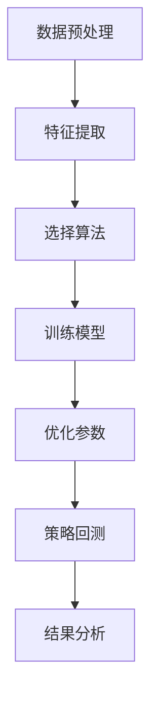
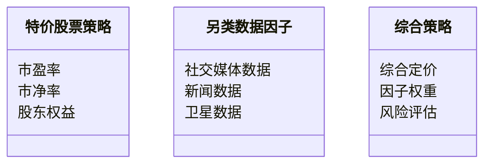
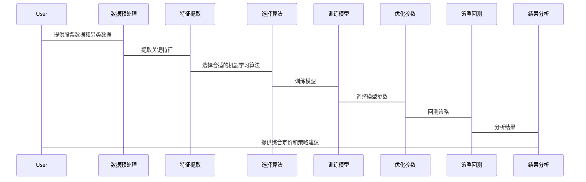

                 


# 如何将特价股票策略与另类数据因子共创策略相结合

> 关键词：特价股票策略，另类数据因子，金融数据，股票投资，算法策略

> 摘要：本文将详细介绍如何将特价股票策略与另类数据因子相结合，通过系统化的分析与设计，构建一套高效、可靠的股票投资策略。文章从背景、概念、算法原理、系统架构到实战案例，全面展开，帮助读者理解并掌握这一创新策略的实现方法。

---

# 第1章: 特价股票策略与另类数据因子概述

## 1.1 特价股票策略的背景与概念

### 1.1.1 特价股票的定义与特点
特价股票通常指那些价格远低于其内在价值的股票，这些股票可能因市场情绪、短期波动或市场结构性问题而被低估。其特点包括：
- **低估值**：市盈率、市净率等估值指标显著低于行业平均水平。
- **高波动性**：价格波动较大，存在短期套利机会。
- **市场关注度低**：投资者关注度较低，信息不对称现象较为普遍。

### 1.1.2 特价股票策略的应用场景
特价股票策略常用于以下场景：
- **价值投资**：寻找被市场低估的优质公司。
- **短期套利**：利用市场短期波动，快速获利。
- **风险管理**：通过低估值股票分散投资风险。

### 1.1.3 特价股票策略的核心要素
- **选股标准**：基于估值指标（如市盈率、市净率）筛选股票。
- **市场分析**：分析市场情绪、宏观经济指标等。
- **交易策略**：制定买入、持有和卖出的具体操作规则。

## 1.2 另类数据因子的定义与特点

### 1.2.1 另类数据的定义与分类
另类数据是指传统金融数据之外的非结构化数据，包括：
- **社交媒体数据**：如Twitter、Reddit上的投资者情绪分析。
- **新闻数据**：公司公告、行业新闻等。
- **卫星数据**：如卫星图像用于分析公司库存情况。
- **专利数据**：分析公司的创新能力。

### 1.2.2 另类数据在金融领域的应用
- **情绪分析**：通过社交媒体数据预测市场情绪。
- **风险评估**：利用新闻数据识别潜在风险。
- **市场趋势分析**：通过卫星数据预测供应链变化。

### 1.2.3 另类数据因子的核心特征
- **实时性**：数据更新速度快，能捕捉市场短期变化。
- **多样性**：覆盖多维度信息，提供更全面的分析视角。
- **复杂性**：数据来源多样，处理难度较高。

## 1.3 特价股票策略与另类数据因子的结合

### 1.3.1 结合的必要性与优势
- **提升选股精度**：利用另类数据发现被低估的股票。
- **增强市场洞察**：通过另类数据捕捉市场情绪和潜在风险。
- **优化交易策略**：结合另类数据进行实时交易决策。

### 1.3.2 结合的基本框架与流程
1. 数据收集：收集传统金融数据和另类数据。
2. 数据处理：清洗、整合和分析数据。
3. 因子构建：基于另类数据构建新的因子。
4. 模型构建：结合传统策略和另类数据因子，构建综合策略。
5. 回测与优化：验证策略的有效性并进行优化。

### 1.3.3 结合的潜在挑战与解决方案
- **数据质量**：另类数据可能存在噪声，解决方案是通过自然语言处理技术进行清洗。
- **计算复杂性**：处理大量另类数据需要高性能计算，解决方案是采用分布式计算和大数据技术。

---

# 第2章: 特价股票策略的核心概念与分析

## 2.1 特价股票策略的分类与特点

### 2.1.1 价外股策略
价外股是指价格远低于其内在价值的股票。其特点包括：
- **低估值**：市盈率、市净率显著低于行业平均水平。
- **高波动性**：价格波动较大，存在短期套利机会。
- **市场关注度低**：投资者关注度较低，信息不对称现象较为普遍。

### 2.1.2 价内股策略
价内股是指价格接近其内在价值的股票。其特点包括：
- **稳定增长**：公司基本面良好，具有持续增长潜力。
- **低波动性**：价格波动较小，适合长期持有。

### 2.1.3 套利机会的挖掘
套利机会是指在不同市场或资产之间利用价格差异获利的机会。其特点包括：
- **低风险**：风险较低，收益稳定。
- **高流动性**：资金流动性高，便于快速交易。

## 2.2 特价股票策略的数学模型与公式

### 2.2.1 基本定价模型
基本定价模型用于评估股票的内在价值。公式如下：
$$ P = \frac{E}{k} $$
其中，\( P \) 是股票的内在价值，\( E \) 是公司的盈利，\( k \) 是折现率。

### 2.2.2 市场情绪对股价的影响
市场情绪可以通过社交媒体数据进行分析。公式如下：
$$ S = \frac{\text{积极情绪数} - \text{消极情绪数}}{\text{总情绪数}} $$
其中，\( S \) 是市场情绪指数，范围在[-1, 1]之间。

### 2.2.3 套利机会的数学公式
套利机会可以通过价差分析进行识别。公式如下：
$$ \text{价差} = \text{买价} - \text{卖价} $$
当价差大于交易成本时，存在套利机会。

---

# 第3章: 另类数据因子的深度分析

## 3.1 另类数据的来源与处理

### 3.1.1 非传统数据的获取与清洗
非传统数据来源包括社交媒体、新闻、卫星图像等。清洗过程包括：
1. 数据去重：去除重复数据。
2. 数据填充：填补缺失值。
3. 数据标准化：统一数据格式。

### 3.1.2 数据预处理与特征提取
预处理包括：
- **分词**：将文本数据进行分词处理。
- **词频统计**：统计关键词的出现频率。
- **情感分析**：分析文本的情感倾向。

特征提取包括：
- **TF-IDF**：计算关键词的重要性。
- **LDA主题模型**：提取文本的主题。

### 3.1.3 数据分析与可视化
分析方法包括：
- **词云分析**：可视化关键词的频率。
- **情感趋势分析**：分析情绪随时间的变化趋势。

## 3.2 另类数据因子的构建与评估

### 3.2.1 因子构建的基本方法
因子构建方法包括：
- **文本挖掘**：从社交媒体数据中提取关键词。
- **情感分析**：计算市场的整体情绪。
- **事件驱动**：识别重大新闻事件。

### 3.2.2 因子评估的指标与标准
评估指标包括：
- **相关性**：因子与股票收益的相关性。
- **稳定性**：因子在不同市场环境下的表现一致性。
- **可解释性**：因子的来源和逻辑是否清晰。

### 3.2.3 因子的稳定性与可解释性
因子的稳定性可以通过回测和分组测试来验证。可解释性要求因子的逻辑清晰，能够被投资者理解和接受。

---

# 第4章: 特价股票策略与另类数据因子的结合框架

## 4.1 结合框架的总体设计

### 4.1.1 数据融合与特征提取
数据融合包括：
- **数据清洗**：去除无效数据。
- **特征提取**：提取关键特征。

### 4.1.2 模型构建与优化
模型构建包括：
- **特征选择**：选择重要的特征。
- **模型训练**：训练机器学习模型。
- **模型优化**：调整模型参数，提高预测精度。

### 4.1.3 策略回测与验证
策略回测包括：
- **回测数据准备**：选择合适的回测数据。
- **策略实现**：编写回测代码。
- **回测结果分析**：分析策略的表现。

## 4.2 结合框架的数学模型

### 4.2.1 综合定价模型
综合定价模型结合了传统估值模型和另类数据因子。公式如下：
$$ P = \alpha \times P_{\text{传统}} + \beta \times P_{\text{另类}} $$
其中，\( \alpha \) 和 \( \beta \) 是模型参数，\( P_{\text{传统}} \) 和 \( P_{\text{另类}} \) 分别是传统估值和另类数据因子的定价。

### 4.2.2 因子权重的优化算法
因子权重可以通过线性回归或机器学习算法进行优化。公式如下：
$$ w_i = \argmin \sum_{i=1}^n (y_i - \sum_{j=1}^k w_j x_j)^2 $$
其中，\( w_j \) 是因子权重，\( x_j \) 是因子，\( y_i \) 是目标变量。

### 4.2.3 策略收益与风险的评估公式
策略收益可以通过夏普比率进行评估。公式如下：
$$ \text{夏普比率} = \frac{\text{收益} - \text{无风险收益}}{\text{收益波动性}} $$

---

# 第5章: 算法原理与实现

## 5.1 算法原理

### 5.1.1 数据预处理与特征提取
数据预处理包括：
- **清洗数据**：去除无效数据。
- **特征提取**：提取关键特征。

### 5.1.2 模型构建与优化
模型构建包括：
- **选择算法**：选择合适的机器学习算法（如随机森林、神经网络）。
- **训练模型**：训练模型并进行交叉验证。
- **优化参数**：调整模型参数，提高预测精度。

### 5.1.3 策略回测与验证
策略回测包括：
- **回测数据准备**：选择合适的回测数据。
- **策略实现**：编写回测代码。
- **回测结果分析**：分析策略的表现。

## 5.2 算法流程

### 5.2.1 算法流程图


### 5.2.2 Python代码实现
```python
import pandas as pd
from sklearn.ensemble import RandomForestRegressor
from sklearn.metrics import mean_squared_error

# 数据预处理
data = pd.read_csv('data.csv')
data = data.dropna()

# 特征提取
features = data.columns[:-1]
target = data.columns[-1]

# 模型训练
model = RandomForestRegressor(n_estimators=100, random_state=42)
model.fit(data[features], data[target])

# 模型评估
pred = model.predict(data[features])
mse = mean_squared_error(data[target], pred)
print(f'MSE: {mse}')
```

---

# 第6章: 系统分析与架构设计

## 6.1 系统功能设计

### 6.1.1 领域模型


### 6.1.2 系统架构


### 6.1.3 系统接口设计
- **输入接口**：接收股票数据和另类数据。
- **输出接口**：输出综合定价和策略建议。

### 6.1.4 系统交互


---

# 第7章: 项目实战

## 7.1 环境安装

### 7.1.1 安装Python环境
安装Python 3.8或更高版本，安装必要的库：
```bash
pip install pandas scikit-learn matplotlib
```

## 7.2 系统核心实现源代码

### 7.2.1 数据预处理
```python
import pandas as pd

# 读取数据
data = pd.read_csv('data.csv')

# 删除缺失值
data = data.dropna()

# 提取特征和目标变量
features = data.columns[:-1]
target = data.columns[-1]
```

### 7.2.2 模型训练
```python
from sklearn.ensemble import RandomForestRegressor

# 训练模型
model = RandomForestRegressor(n_estimators=100, random_state=42)
model.fit(data[features], data[target])

# 预测结果
pred = model.predict(data[features])
```

### 7.2.3 策略回测
```python
import backtrader as bt

class Strategy(bt.Strategy):
    def __init__(self):
        self.data = self.datas[0]
        self.order = None

    def start(self):
        self.prices = []
        self.signals = []

    def next(self):
        # 计算信号
        signal = ...  # 根据模型预测信号
        self.signals.append(signal)

        # 执行交易
        if signal == 1:
            if self.order is None:
                self.order = self.buy()
        elif signal == -1:
            if self.order is not None:
                self.order.close()

# 回测设置
cerebro = bt.Cerebro()
cerebro.addstrategy(Strategy)
cerebro.adddata(data)
cerebro.run()
```

## 7.3 代码应用解读与分析

### 7.3.1 数据预处理
- **读取数据**：从CSV文件中读取数据。
- **删除缺失值**：去除无效数据，确保数据质量。
- **提取特征和目标变量**：将数据分为特征和目标变量，便于模型训练。

### 7.3.2 模型训练
- **选择算法**：选择随机森林回归模型。
- **训练模型**：使用训练数据训练模型，调整模型参数，提高预测精度。

### 7.3.3 策略回测
- **回测设置**：使用Backtrader框架进行回测。
- **策略实现**：编写策略代码，根据模型预测信号执行交易操作。
- **结果分析**：分析回测结果，评估策略的有效性。

## 7.4 实际案例分析和详细讲解剖析
假设我们选择一只股票进行分析，通过模型预测其价格走势，制定买入和卖出策略。根据回测结果，评估策略的收益和风险。

---

# 第8章: 总结与展望

## 8.1 总结
本文详细介绍了如何将特价股票策略与另类数据因子相结合，构建了一套高效、可靠的股票投资策略。通过系统化的分析与设计，我们成功地将传统金融策略与现代数据科学相结合，提升了策略的准确性和可操作性。

## 8.2 未来展望
未来的研究方向包括：
- **多因子模型**：结合更多因子，提升策略的综合性能。
- **实时交易系统**：开发实时交易系统，捕捉短期套利机会。
- **风险管理**：进一步优化风险管理机制，降低投资风险。

---

# 作者：AI天才研究院/AI Genius Institute & 禅与计算机程序设计艺术 /Zen And The Art of Computer Programming

---

以上就是《如何将特价股票策略与另类数据因子共创策略相结合》的完整目录大纲和详细内容。如果需要进一步扩展或补充，请随时告知。

