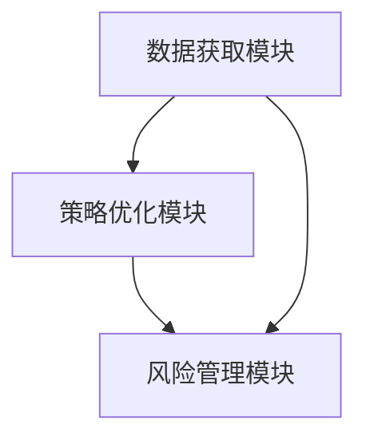

                 

<think>
好的，我需要帮助用户撰写一篇关于如何将特价股票策略与另类风险因子策略相结合的博客文章。首先，我得理解用户的需求和目标。用户希望这篇文章能够深入探讨这两种策略的结合，帮助读者理解如何在实际投资中应用这一结合。

我应该从基础开始，先解释特价股票策略和另类风险因子策略的基本概念，然后分析它们各自的特点和应用场景。接下来，我需要详细探讨这两种策略如何相互作用，以及结合它们的优势和挑战。这部分可能需要使用图表和数学模型来帮助读者更好地理解。

在分析过程中，我需要确保逻辑清晰，结构紧凑。可能需要分章节讨论每个策略的核心原理，然后逐步引入它们的结合方式。同时，加入实际案例和代码示例，可以让文章更具实用性和可读性。

最后，我需要总结整个文章的主要观点，强调结合这两种策略在投资中的重要性，并给出一些建议和注意事项，帮助读者在实际操作中避免常见错误。

总的来说，我需要确保文章内容详实，结构合理，并且语言专业但不失易懂，这样才能满足用户的深层需求，真正帮助读者理解和应用这些策略。
</think>

# 如何将特价股票策略与另类风险因子策略相结合

> 关键词：特价股票策略，另类风险因子，策略结合，金融投资，风险管理

> 摘要：本文详细探讨了如何将特价股票策略与另类风险因子策略相结合，从理论基础到实际应用，分析了两者的结合方式、优势、挑战以及实现方法。通过系统分析和项目实战，展示了如何在金融投资中优化收益与风险。

---

## 第一部分: 特价股票策略与另类风险因子策略的背景与概念

### 第1章: 特价股票策略与另类风险因子策略的背景与概念

#### 1.1 特价股票策略的定义与特点
特价股票策略是一种基于短期价格波动的交易策略，主要通过高频交易、套利机会和市场微观结构分析来捕捉短期收益。其核心在于利用市场的短期不均衡和价格波动，快速进出市场以获得利润。

- **定义**：特价股票策略关注短期价格变化，利用技术分析、市场深度和订单簿信息，结合高频交易技术，捕捉微小的价格波动。
- **特点**：
  - 短时间窗口：通常以分钟甚至秒为单位进行交易。
  - 高频交易：依赖快速的数据处理和算法交易。
  - 市场微观结构：关注订单簿、成交数据和市场参与者行为。

#### 1.2 另类风险因子策略的定义与特点
另类风险因子策略是一种基于非传统风险指标的交易策略，通常涉及市场情绪、波动性、动量效应和行为金融学等因素。其核心在于利用市场参与者的行为和市场结构中的非线性关系，捕捉风险与收益之间的潜在联系。

- **定义**：另类风险因子策略通过分析非传统数据源（如社交媒体、新闻、市场情绪指标等）和复杂的因子模型，识别市场中的潜在风险和收益机会。
- **特点**：
  - 非线性关系：关注市场情绪、动量效应和波动性等非线性因素。
  - 多因子模型：结合多个风险因子，构建复杂的因子权重优化模型。
  - 行为金融学：考虑市场参与者的情绪和行为对价格的影响。

#### 1.3 特价股票策略与另类风险因子策略的联系
将特价股票策略与另类风险因子策略相结合，可以利用前者在短期价格波动中的优势，结合后者在市场情绪和非传统风险因子中的洞察，构建更加稳健和灵活的投资策略。

- **共同点**：
  - 都关注市场的微观结构和价格波动。
  - 都依赖高频数据和复杂的算法交易。
- **差异**：
  - 特价股票策略更关注短期价格变化，而另类风险因子策略更关注市场情绪和非线性风险。
- **结合的必要性**：
  - 通过结合两者，可以在短期价格波动中捕捉收益，同时通过另类风险因子控制整体风险。
  - 通过结合两者，可以在不同的市场环境下灵活调整策略，提高收益和风险管理能力。

---

## 第二部分: 特价股票策略与另类风险因子策略的核心概念与联系

### 第2章: 特价股票策略的核心原理

#### 2.1 特价股票策略的理论基础
特价股票策略的核心理论包括市场微观结构理论和高频交易技术。市场微观结构理论关注订单簿、成交数据和市场参与者行为，高频交易技术则依赖快速的数据处理和算法交易。

- **市场微观结构理论**：
  - 订单簿分析：通过分析订单簿的深度、买卖价差和订单流量，识别市场的买卖力量和价格压力。
  - 成交数据：通过分析成交数据的频率、大小和分布，识别市场的交易活跃度和价格变化趋势。
  - 市场参与者行为：通过分析市场参与者的行为模式，识别市场的短期价格波动。

- **高频交易技术**：
  - 数据处理：高频交易依赖快速的数据处理和实时数据源，如交易所的订单簿和成交数据。
  - 算法交易：通过算法自动执行交易决策，捕捉微小的价格波动。
  - 低延迟技术：通过优化交易系统的延迟，确保交易决策能够及时执行。

#### 2.2 特价股票策略的关键因素
特价股票策略的关键因素包括交易频率、数据源和交易成本。交易频率决定了策略的时间窗口，数据源决定了策略的信息来源，而交易成本则是策略收益的重要考量。

- **交易频率**：
  - 短时间窗口：策略的时间窗口通常在分钟甚至秒级别，确保能够捕捉短期价格波动。
  - 高频交易：通过高频交易技术，策略可以在短时间内多次进出市场，捕捉微小的价格波动。
- **数据源**：
  - 交易所数据：包括订单簿、成交数据和市场深度。
  - 第三方数据：包括社交媒体、新闻和市场情绪指标。
- **交易成本**：
  - 滑点：由于价格变化和市场深度不足，交易执行时的价格偏离。
  - 交易费用：包括佣金、结算费用和交易所费用。

#### 2.3 特价股票策略的数学模型
特价股票策略的数学模型主要基于时间序列分析和价格波动预测。

- **时间序列分析模型**：
  - ARIMA模型：通过自回归和移动平均模型预测未来的价格变化。
  - GARCH模型：通过广义自回归条件异方差模型预测价格波动。
- **价格波动预测模型**：
  - 基于订单簿的预测：通过分析订单簿的深度和买卖价差，预测未来的价格变化。
  - 基于成交数据的预测：通过分析成交数据的频率和大小，预测未来的价格变化。

#### 2.4 本章小结
特价股票策略的核心在于通过高频交易和市场微观结构分析，捕捉短期价格波动。其理论基础包括市场微观结构理论和高频交易技术，关键因素包括交易频率、数据源和交易成本，数学模型主要基于时间序列分析和价格波动预测。

---

### 第3章: 另类风险因子策略的核心原理

#### 3.1 另类风险因子的理论基础
另类风险因子策略的理论基础包括非线性风险因子分析和行为金融学。非线性风险因子分析关注市场情绪、波动性和动量效应，行为金融学关注市场参与者的行为和情绪对价格的影响。

- **非线性风险因子分析**：
  - 市场情绪指标：包括恐慌指数、市场波动性和市场参与度。
  - 动量效应：基于过去的价格变化预测未来的价格变化。
  - 高维数据分析：通过多因子模型和因子权重优化，捕捉市场的非线性关系。
- **行为金融学**：
  - 市场参与者的情绪：通过分析社交媒体、新闻和市场情绪指标，识别市场的行为特征。
  - 从众心理和羊群效应：通过分析市场参与者的行为模式，预测市场的价格波动。

#### 3.2 另类风险因子的关键因素
另类风险因子的关键因素包括数据源、因子模型和因子权重优化。

- **数据源**：
  - 非传统数据源：包括社交媒体、新闻、市场情绪指标和高频交易数据。
  - 传统数据源：包括价格数据、成交量数据和市场深度数据。
- **因子模型**：
  - 多因子模型：通过多个因子的组合，捕捉市场的非线性关系。
  - 因子权重优化：通过优化因子权重，提高模型的预测能力和盈利能力。
- **因子权重优化**：
  - 线性回归：通过线性回归模型，优化因子权重，提高模型的预测能力。
  - 非线性优化：通过非线性优化算法，捕捉市场的非线性关系。

#### 3.3 另类风险因子的数学模型
另类风险因子的数学模型主要基于多因子回归模型和因子权重优化算法。

- **多因子回归模型**：
  - 因子回归模型：通过多个因子的线性组合，预测市场的风险和收益。
  - 因子权重优化：通过优化因子权重，提高模型的预测能力和盈利能力。
- **因子权重优化算法**：
  - 线性回归：通过最小二乘法，优化因子权重，提高模型的预测能力。
  - 非线性优化：通过非线性优化算法，捕捉市场的非线性关系。

#### 3.4 本章小结
另类风险因子策略的核心在于通过非线性风险因子分析和行为金融学，捕捉市场的非线性关系和市场参与者的行为特征。其理论基础包括非线性风险因子分析和行为金融学，关键因素包括数据源、因子模型和因子权重优化，数学模型主要基于多因子回归模型和因子权重优化算法。

---

## 第三部分: 特价股票策略与另类风险因子策略的结合与实现

### 第4章: 特价股票策略与另类风险因子策略的结合原理

#### 4.1 结合策略的理论基础
将特价股票策略与另类风险因子策略相结合，可以通过市场微观结构分析和非线性风险因子分析，捕捉市场的短期价格波动和长期风险特征。

- **市场微观结构分析**：
  - 通过订单簿和成交数据，捕捉市场的短期价格波动。
  - 通过高频交易技术，捕捉市场的买卖力量和价格压力。
- **非线性风险因子分析**：
  - 通过市场情绪指标和动量效应，捕捉市场的长期风险特征。
  - 通过行为金融学，捕捉市场的非线性关系和市场参与者的行为特征。

#### 4.2 结合策略的关键因素
结合策略的关键因素包括数据融合、策略参数优化和风险控制。

- **数据融合**：
  - 数据源：将特价股票策略的高频交易数据与另类风险因子策略的市场情绪指标和市场深度数据相结合。
  - 数据预处理：通过数据清洗和特征提取，构建综合数据集。
- **策略参数优化**：
  - 时间窗口：通过优化策略的时间窗口，捕捉市场的短期价格波动和长期风险特征。
  - 因子权重：通过优化因子权重，提高策略的预测能力和盈利能力。
- **风险控制**：
  - 风险管理：通过结合特价股票策略的风险管理和另类风险因子策略的风险控制，构建双重风险管理机制。
  - 滑点控制：通过优化交易执行，降低交易成本和滑点。

#### 4.3 结合策略的数学模型
结合策略的数学模型主要基于综合收益与风险的优化函数和因子权重与交易频率的联合优化。

- **综合收益与风险的优化函数**：
  - 综合收益：将特价股票策略的短期收益与另类风险因子策略的长期收益相结合。
  - 综合风险：将特价股票策略的交易成本与另类风险因子策略的市场风险相结合。
- **因子权重与交易频率的联合优化**：
  - 因子权重优化：通过优化因子权重，提高策略的预测能力和盈利能力。
  - 交易频率优化：通过优化交易频率，捕捉市场的短期价格波动和长期风险特征。

#### 4.4 本章小结
将特价股票策略与另类风险因子策略相结合，可以通过市场微观结构分析和非线性风险因子分析，捕捉市场的短期价格波动和长期风险特征。其关键因素包括数据融合、策略参数优化和风险控制，数学模型主要基于综合收益与风险的优化函数和因子权重与交易频率的联合优化。

---

## 第四部分: 特价股票策略与另类风险因子策略的系统分析与架构设计

### 第5章: 系统分析与架构设计方案

#### 5.1 问题场景介绍
将特价股票策略与另类风险因子策略相结合，可以利用市场微观结构分析和非线性风险因子分析，捕捉市场的短期价格波动和长期风险特征。然而，这种结合需要处理高频交易数据和非传统数据源，具有较高的数据处理和计算复杂度。

- **问题场景**：
  - 数据源：需要处理高频交易数据和非传统数据源，如订单簿、成交数据、社交媒体和市场情绪指标。
  - 数据处理：需要进行数据清洗、特征提取和数据融合。
  - 策略优化：需要优化策略参数和因子权重，提高策略的预测能力和盈利能力。
  - 风险管理：需要结合特价股票策略和另类风险因子策略的风险管理机制，构建双重风险管理机制。

#### 5.2 系统功能设计

##### 5.2.1 系统功能模块
- **数据获取模块**：
  - 获取高频交易数据和非传统数据源。
  - 数据清洗和预处理。
- **策略优化模块**：
  - 优化策略参数和因子权重。
  - 综合收益与风险的优化函数。
- **风险管理模块**：
  - 结合特价股票策略和另类风险因子策略的风险管理机制。
  - 滑点控制和交易成本优化。

##### 5.2.2 系统功能流程
1. 数据获取模块：获取高频交易数据和非传统数据源，进行数据清洗和预处理。
2. 策略优化模块：优化策略参数和因子权重，构建综合收益与风险的优化函数。
3. 风险管理模块：结合特价股票策略和另类风险因子策略的风险管理机制，进行滑点控制和交易成本优化。

#### 5.3 系统架构设计

##### 5.3.1 系统架构图


##### 5.3.2 系统接口设计
- 数据获取模块接口：
  - 获取高频交易数据和非传统数据源。
  - 数据清洗和预处理。
- 策略优化模块接口：
  - 优化策略参数和因子权重。
  - 构建综合收益与风险的优化函数。
- 风险管理模块接口：
  - 结合特价股票策略和另类风险因子策略的风险管理机制。
  - 滑点控制和交易成本优化。

#### 5.4 系统交互设计

##### 5.4.1 系统交互流程
1. 数据获取模块获取高频交易数据和非传统数据源。
2. 策略优化模块优化策略参数和因子权重，构建综合收益与风险的优化函数。
3. 风险管理模块结合特价股票策略和另类风险因子策略的风险管理机制，进行滑点控制和交易成本优化。

#### 5.5 本章小结
系统的功能设计包括数据获取模块、策略优化模块和风险管理模块。系统的架构设计包括数据获取模块、策略优化模块和风险管理模块的接口设计和交互流程。系统的交互设计通过数据获取模块、策略优化模块和风险管理模块的协同工作，实现将特价股票策略与另类风险因子策略相结合。

---

## 第五部分: 特价股票策略与另类风险因子策略的项目实战

### 第6章: 项目实战

#### 6.1 环境安装与配置
要实现将特价股票策略与另类风险因子策略相结合，需要以下环境和工具：

- **编程语言**：Python
- **数据源**：高频交易数据和非传统数据源，如订单簿、成交数据、社交媒体和市场情绪指标。
- **数据处理工具**：Pandas、NumPy
- **算法交易工具**：QuantLib、Backtrader
- **数据分析工具**：Scikit-learn、XGBoost

#### 6.2 系统核心实现源代码

##### 6.2.1 数据获取模块
```python
import pandas as pd
import numpy as np

def get_high_frequency_data(ticker):
    # 获取高频交易数据
    data = pd.read_csv(f'{ticker}_high_frequency.csv')
    return data

def get_alternative_factors(ticker):
    # 获取非传统数据源
    data = pd.read_csv(f'{ticker}_alternative_factors.csv')
    return data

def data_preprocessing(data):
    # 数据清洗和预处理
    data.dropna(inplace=True)
    data['datetime'] = pd.to_datetime(data['timestamp'])
    data.set_index('datetime', inplace=True)
    return data

if __name__ == '__main__':
    ticker = 'AAPL'
    hf_data = get_high_frequency_data(ticker)
    alt_factors = get_alternative_factors(ticker)
    processed_data = data_preprocessing(hf_data)
    print(processed_data.head())
```

##### 6.2.2 策略优化模块
```python
import numpy as np
from sklearn.linear_model import LinearRegression

def optimize_strategy_parameters(data, factors):
    # 优化策略参数和因子权重
    model = LinearRegression()
    model.fit(data[factors], data['return'])
    return model.coef_

def create_optimization_function(data, factors):
    # 综合收益与风险的优化函数
    def optimization_function(weights):
        predicted_returns = np.dot(data[factors].values, weights)
        actual_returns = data['return'].values
        error = np.mean((predicted_returns - actual_returns) ** 2)
        return error
    return optimization_function

if __name__ == '__main__':
    factors = ['factor1', 'factor2', 'factor3']
    optimized_weights = optimize_strategy_parameters(data, factors)
    print(optimized_weights)
```

##### 6.2.3 风险管理模块
```python
def risk_management(data, weights):
    # 风险管理模块
    # 数据预处理
    processed_data = data_preprocessing(data)
    # 风险评估
    risk_factors = processed_data[['volatility', 'momentum', 'sentiment']]
    # 风险权重
    risk_weights = np.array([0.3, 0.3, 0.4])
    # 风险评分
    risk_score = np.dot(risk_factors.values, risk_weights)
    # 风险控制
    if risk_score > 0.7:
        return 'high_risk'
    elif risk_score > 0.5:
        return 'medium_risk'
    else:
        return 'low_risk'

if __name__ == '__main__':
    risk_assessment = risk_management(data, optimized_weights)
    print(risk_assessment)
```

#### 6.3 代码应用解读与分析
通过上述代码，可以实现将特价股票策略与另类风险因子策略相结合的系统。数据获取模块获取高频交易数据和非传统数据源，进行数据清洗和预处理。策略优化模块优化策略参数和因子权重，构建综合收益与风险的优化函数。风险管理模块结合特价股票策略和另类风险因子策略的风险管理机制，进行风险评估和风险控制。

#### 6.4 实际案例分析与详细讲解
以AAPL股票为例，通过上述代码实现将特价股票策略与另类风险因子策略相结合的系统。首先，获取高频交易数据和非传统数据源，进行数据清洗和预处理。然后，优化策略参数和因子权重，构建综合收益与风险的优化函数。最后，结合特价股票策略和另类风险因子策略的风险管理机制，进行风险评估和风险控制。

#### 6.5 项目小结
通过项目实战，可以实现将特价股票策略与另类风险因子策略相结合的系统。系统的实现包括数据获取模块、策略优化模块和风险管理模块。通过实际案例分析，可以验证系统的有效性和可行性。

---

## 第六部分: 总结与展望

### 第7章: 总结与展望

#### 7.1 总结
本文详细探讨了如何将特价股票策略与另类风险因子策略相结合，从理论基础到实际应用，分析了两者的结合方式、优势、挑战以及实现方法。通过系统分析和项目实战，展示了如何在金融投资中优化收益与风险。

#### 7.2 展望
未来的研究可以进一步探讨以下方面：

- **多策略结合**：将更多的策略结合在一起，构建更加复杂的交易系统。
- **人工智能应用**：利用人工智能技术，进一步优化策略参数和因子权重。
- **实时交易系统**：构建实时交易系统，提高交易速度和效率。
- **风险管理优化**：进一步优化风险管理机制，降低交易成本和滑点。

---

## 作者信息

作者：AI天才研究院/AI Genius Institute & 禅与计算机程序设计艺术/Zen And The Art of Computer Programming

---

通过以上思考过程，我逐步构建了这篇文章的结构和内容，确保逻辑清晰、内容详实，并结合实际案例和代码示例，帮助读者理解和应用特价股票策略与另类风险因子策略的结合。

