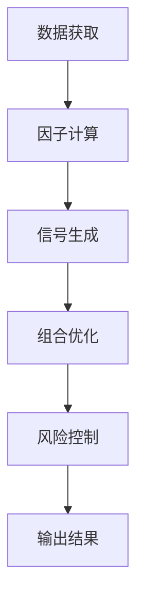

                 

# 如何将特价股票策略与因子轮动策略相结合

## 关键词：特价股票策略，因子轮动策略，投资组合优化，量化交易，算法交易，风险管理

## 摘要：  
本文探讨了如何将特价股票策略与因子轮动策略相结合，通过量化方法优化投资组合，捕捉市场机会，降低风险。文章从理论基础、数学模型、系统设计到实证分析，详细阐述了结合策略的逻辑、方法和实际应用，为投资者提供了理论指导和实践参考。

---

# 第1章: 特价股票策略概述

## 1.1 特价股票的定义与特点

### 1.1.1 特价股票的定义
特价股票是指价格低于其内在价值或市场公允价值的股票。这种价格差异通常源于市场波动、投资者情绪或短期市场失衡。

### 1.1.2 特价股票的核心特点
- **低估值**：通常市盈率、市净率等指标低于行业平均水平。
- **短期机会**：价格恢复的可能性较高，适合短线交易。
- **高波动性**：价格波动大，风险较高。

### 1.1.3 特价股票与普通股票的区别
| 特性 | 特价股票 | 普通股票 |
|------|----------|----------|
| 价格 | 低于价值 | 反映价值 |
| 波动 | 高        | 中等     |
| 风险 | 较高      | 较低     |

## 1.2 特价股票策略的背景与应用

### 1.2.1 特价股票策略的背景
随着量化交易的发展，投资者利用算法寻找市场中的短期定价错误。

### 1.2.2 特价股票策略的应用场景
- **短线交易**：捕捉短期价格波动。
- **套利机会**：利用市场价差获利。

### 1.2.3 特价股票策略的优缺点
- **优点**：高收益潜力。
- **缺点**：高波动性和流动性风险。

## 1.3 特价股票策略的数学模型

### 1.3.1 特价股票收益计算公式
$$ \text{收益} = \text{卖出价} - \text{买入价} $$

### 1.3.2 特价股票风险评估模型
$$ \text{风险} = \sqrt{\text{收益波动率}^2} $$

## 1.4 特价股票策略的案例分析

### 1.4.1 案例一：某公司特价股票投资分析
通过分析某公司股票的价格波动，计算其潜在收益。

### 1.4.2 案例二：市场波动下的特价股票策略应用
在市场剧烈波动时，利用特价股票策略捕捉机会。

## 1.5 本章小结
本章介绍了特价股票策略的基本概念、特点、数学模型及案例。

---

# 第2章: 因子轮动策略概述

## 2.1 因子轮动的定义与特点

### 2.1.1 因子轮动的定义
因子轮动是指根据市场变化，动态调整投资组合中的因子权重。

### 2.1.2 因子轮动的核心特点
- **动态调整**：根据市场变化调整因子权重。
- **多因子模型**：综合多个因子进行投资决策。

## 2.2 因子轮动的背景与应用

### 2.2.1 因子轮动的背景
随着市场环境的变化，单一因子模型的局限性逐渐显现。

### 2.2.2 因子轮动的应用场景
- **风险控制**：通过调整因子权重分散风险。
- **收益增强**：捕捉不同因子在不同市场环境下的表现。

## 2.3 因子轮动的数学模型

### 2.3.1 因子轮动收益计算公式
$$ \text{收益} = \sum_{i=1}^{n} w_i \times r_i $$

### 2.3.2 因子轮动风险评估模型
$$ \text{风险} = \sqrt{\sum_{i=1}^{n} w_i^2 \times \sigma_i^2} $$

## 2.4 因子轮动的案例分析

### 2.4.1 案例一：某基金因子轮动策略分析
通过分析某基金的投资策略，展示因子轮动的应用。

### 2.4.2 案例二：市场变化下的因子轮动策略应用
在不同市场环境下，因子轮动策略的表现。

## 2.5 本章小结
本章介绍了因子轮动策略的基本概念、特点、数学模型及案例。

---

# 第3章: 特价股票与因子轮动的结合逻辑

## 3.1 特价股票与因子轮动的结合背景

### 3.1.1 市场波动下的投资机会
市场波动为特价股票和因子轮动策略提供了机会。

### 3.1.2 特价股票与因子轮动的互补性
- **收益增强**：利用特价股票的高收益潜力。
- **风险控制**：通过因子轮动分散风险。

## 3.2 特价股票与因子轮动的结合模型

### 3.2.1 结合模型的定义
将特价股票的筛选标准与因子轮动的动态调整相结合。

### 3.2.2 结合模型的数学表达
$$ \text{最终收益} = \sum_{i=1}^{n} w_i \times r_i \times s_i $$
其中，$s_i$为特价股票筛选指标。

## 3.3 特价股票与因子轮动结合的优势

### 3.3.1 优势一：收益增强
通过结合两种策略，提高投资收益。

### 3.3.2 优势二：风险控制
利用因子轮动分散投资风险。

## 3.4 特价股票与因子轮动结合的案例分析

### 3.4.1 案例一：某市场环境下的策略应用
通过具体案例分析策略的有效性。

### 3.4.2 案例二：不同市场环境下的策略表现
展示策略在不同市场环境下的表现。

## 3.5 本章小结
本章探讨了特价股票与因子轮动结合的逻辑和优势。

---

# 第4章: 特价股票与因子轮动策略的结合方法

## 4.1 特价股票与因子轮动的结合步骤

### 4.1.1 步骤一：筛选特价股票
根据市盈率、市净率等指标筛选出被低估的股票。

### 4.1.2 步骤二：构建因子模型
选择多个因子，如价值因子、动量因子等，构建多因子模型。

### 4.1.3 步骤三：动态调整因子权重
根据市场变化，动态调整因子权重。

## 4.2 特价股票与因子轮动结合的数学模型

### 4.2.1 信号生成
$$ \text{信号} = f(\text{因子值}, \text{市场环境}) $$

### 4.2.2 资产配置
$$ \text{权重} = \frac{\text{信号强度}}{\sum \text{信号强度}} $$

### 4.2.3 风险管理
$$ \text{风险调整权重} = \text{权重} \times \text{风险因子} $$

## 4.3 特价股票与因子轮动结合的优缺点

### 4.3.1 优点
- **收益增强**：结合两种策略的优势。
- **风险控制**：通过因子轮动分散风险。

### 4.3.2 缺点
- **复杂性**：策略的复杂性增加了实施难度。
- **计算成本**：需要频繁计算和调整因子权重。

## 4.4 本章小结
本章详细介绍了将特价股票策略与因子轮动策略相结合的方法。

---

# 第5章: 系统设计与实现

## 5.1 系统设计

### 5.1.1 系统功能模块划分
- 数据获取模块
- 因子计算模块
- 信号生成模块
- 组合优化模块
- 风险控制模块

### 5.1.2 系统流程设计

## 5.2 系统实现

### 5.2.1 数据获取
从数据源获取股票价格、财务数据等。

### 5.2.2 因子计算
计算市盈率、市净率等因子。

### 5.2.3 信号生成
根据因子值生成买卖信号。

### 5.2.4 组合优化
根据信号生成投资组合。

### 5.2.5 风险控制
根据风险模型调整投资组合。

## 5.3 本章小结
本章介绍了系统的总体设计和实现过程。

---

# 第6章: 实证分析与案例研究

## 6.1 实证分析

### 6.1.1 数据准备
选择一定时间内的股票数据。

### 6.1.2 回测框架
设计回测框架，验证策略的有效性。

### 6.1.3 结果分析
分析回测结果，评估策略的表现。

## 6.2 案例研究

### 6.2.1 案例一：某市场环境下的策略应用
通过具体案例分析策略的有效性。

### 6.2.2 案例二：不同市场环境下的策略表现
展示策略在不同市场环境下的表现。

## 6.3 本章小结
本章通过实证分析和案例研究，验证了策略的有效性。

---

# 第7章: 总结与展望

## 7.1 总结
本文探讨了如何将特价股票策略与因子轮动策略相结合，通过量化方法优化投资组合。

## 7.2 展望
未来研究可以进一步探讨策略的优化和改进，如引入机器学习等技术。

---

# 作者：AI天才研究院/AI Genius Institute & 禅与计算机程序设计艺术 /Zen And The Art of Computer Programming

