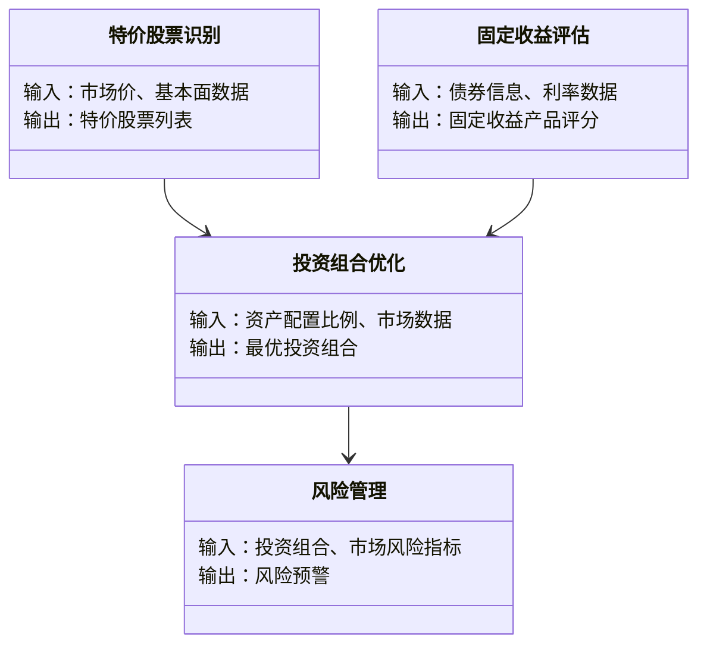
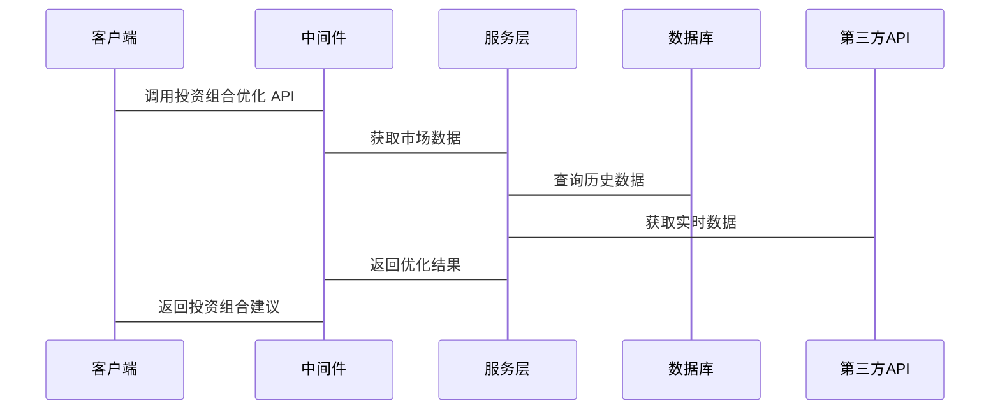

                 


# 如何将特价股票策略与固定收益投资结合

> 关键词：特价股票策略，固定收益投资，资产配置，风险管理，投资组合优化

> 摘要：本文详细探讨了如何将特价股票策略与固定收益投资相结合，以实现风险可控下的收益最大化。文章首先介绍了特价股票策略和固定收益投资的核心概念，然后深入分析了两者的数学模型与算法，最后提出了具体的结合策略，包括资产配置、组合优化和风险管理等方面。

---

# 第一部分: 特价股票策略与固定收益投资概述

## 第1章: 特价股票策略与固定收益投资的核心概念

### 1.1 特价股票策略的定义与特点

#### 1.1.1 特价股票的定义
特价股票是指市场价低于其内在价值的股票。内在价值通常通过基本面分析（如DCF模型）计算得出，而市场价则受市场情绪和短期因素影响。

#### 1.1.2 特价股票的核心特点
- **低估性**：市场价格低于内在价值。
- **安全边际**：买入价格与内在价值的折扣提供了安全边际，降低了风险。
- **长期价值**：关注企业的长期盈利能力，而非短期市场波动。

#### 1.1.3 特价股票与普通股票的区别
| 特性         | 特价股票                          | 普通股票                          |
|--------------|-----------------------------------|------------------------------------|
| 买入标准     | 市场价 < 内在价值                 | 市场价 = 内在价值或溢价             |
| 投资策略     | 等待价值回归                     | 追求短期收益或成长                 |
| 风险承受     | 较低                             | 较高                               |

### 1.2 固定收益投资的定义与特点

#### 1.2.1 固定收益投资的定义
固定收益投资是指投资于那些能够提供固定或可预测收益的金融工具，如债券、银行存款、货币市场基金等。

#### 1.2.2 固定收益投资的核心特点
- **收益固定**：通常有固定的票息或利息收入。
- **风险较低**：相比股票，波动性较小，本金较为安全。
- **流动性**：部分固定收益产品流动性较差，如长期债券。

#### 1.2.3 固定收益投资与股票投资的区别
| 特性         | 特价股票                          | 固定收益投资                     |
|--------------|-----------------------------------|------------------------------------|
| 收益类型     | 股息和资本增值                   | 固定利息和本金偿还               |
| 风险         | 较高（市场波动）                 | 较低（信用风险和利率风险）       |
| 投资期限     | 中长期                           | 短期至中长期                     |

### 1.3 特价股票与固定收益投资的结合

#### 1.3.1 结合的背景与意义
随着市场的波动加剧，投资者 increasingly seek a balance between high returns and low risk. By combining cheap stocks with fixed-income investments, investors can achieve a diversified portfolio that cushions against market volatility while maintaining steady returns.

#### 1.3.2 结合的可行性分析
- **风险分散**：股票和固定收益资产的相关性较低，可以有效分散投资风险。
- **收益互补**：股票在市场上涨时表现优异，而固定收益资产在市场下跌时提供稳定收益。
- **资产配置**：通过合理配置两种资产，可以在不同市场环境下优化收益和风险。

#### 1.3.3 结合的潜在风险与收益
- **收益**：在市场上涨时，股票收益可能超过固定收益资产；在市场下跌时，固定收益资产可以提供保护。
- **风险**：股票市场的波动可能影响整体组合的稳定性，需要通过严格的风险管理来控制。

### 1.4 本章小结
本章介绍了特价股票和固定收益投资的核心概念，并分析了它们结合的背景、意义和可行性。通过结合这两种投资方式，投资者可以在不同市场环境下实现收益与风险的平衡。

---

# 第二部分: 特价股票策略与固定收益投资的核心原理

## 第2章: 特价股票策略的数学模型与算法

### 2.1 特价股票识别的数学模型

#### 2.1.1 市场价与内在价值的计算公式
内在价值可以通过现金流折现模型（DCF）计算：
$$
\text{内在价值} = \frac{\text{自由现金流}}{\text{折现率}}
$$
市场价与内在价值的比较决定了是否为特价股票：
$$
\text{特价股票条件} = \text{市场价} < \text{内在价值}
$$

#### 2.1.2 市场价折扣率的计算方法
折扣率可以通过以下公式计算：
$$
\text{折扣率} = \frac{\text{内在价值} - \text{市场价}}{\text{内在价值}} \times 100\%
$$
折扣率越高，股票的吸引力越大。

#### 2.1.3 特价股票识别的条件判断
- 如果市场价 < 内在价值，则为特价股票。
- 如果折扣率 > 20%，则为高性价比的特价股票。

### 2.2 特价股票策略的优化算法

#### 2.2.1 基于均值-方差优化的策略选择
均值-方差优化的目标是最小化风险（方差）的同时最大化收益（均值）。公式如下：
$$
\min_{w} \sigma^2(w) \quad \text{subject to} \quad \mu^T w = \text{目标收益}
$$
其中，$w$ 是投资权重，$\mu$ 是收益向量，$\sigma^2$ 是方差矩阵。

#### 2.2.2 基于动态规划的策略优化
动态规划通过分阶段决策优化整体策略。例如，每阶段选择是否买入特价股票，以最大化未来收益。

#### 2.2.3 基于遗传算法的策略优化
遗传算法模拟自然选择，通过迭代优化投资组合：
1. 初始化种群。
2. 计算适应度（收益与风险的比值）。
3. 选择高适应度的个体进行交叉和变异。
4. 重复迭代，直到达到最优解。

### 2.3 本章小结
本章通过数学模型和优化算法，解释了如何识别特价股票并优化投资策略。这些方法为后续的资产配置和组合优化奠定了基础。

---

## 第3章: 固定收益投资的数学模型与算法

### 3.1 固定收益产品定价的数学模型

#### 3.1.1 债券定价的现值公式
债券的现值（PV）计算公式为：
$$
\text{PV} = \sum_{t=1}^{n} \frac{C}{(1 + r)^t} + \frac{F}{(1 + r)^n}
$$
其中，$C$ 是每年的利息，$F$ 是面值，$r$ 是收益率，$n$ 是期限。

#### 3.1.2 利率风险的计算公式
久期（Duration）衡量利率变动对债券价格的影响：
$$
\text{久期} = -\frac{\partial P}{\partial r} \times \frac{1}{P}
$$

#### 3.1.3 利息支付的时间价值计算
时间价值通过贴现率计算：
$$
\text{现值} = \frac{\text{未来价值}}{(1 + r)^t}
$$

### 3.2 固定收益投资组合优化的算法

#### 3.2.1 基于马科维茨均值-方差模型的投资组合优化
马科维茨模型的目标是最小化方差，同时满足收益目标：
$$
\min_{w} \sigma^2(w) \quad \text{subject to} \quad \mu^T w = \text{目标收益}
$$

#### 3.2.2 基于拉格朗日乘数法的投资组合优化
通过拉格朗日乘数法求解约束优化问题：
$$
\mathcal{L} = \sigma^2(w) + \lambda (\mu^T w - \text{目标收益})
$$

#### 3.2.3 基于蒙特卡洛模拟的投资组合优化
蒙特卡洛模拟通过随机抽样生成大量可能的市场情景，计算每种情景下的收益和风险，选择最优投资组合。

### 3.3 本章小结
本章通过数学模型和优化算法，解释了固定收益投资的定价和组合优化方法。这些方法为后续的资产配置和组合优化提供了理论支持。

---

# 第三部分: 特价股票策略与固定收益投资的结合策略

## 第4章: 特价股票与固定收益投资的结合策略

### 4.1 特价股票与固定收益投资的资产配置策略

#### 4.1.1 资产配置的基本原理
资产配置通过分配投资于股票和固定收益资产的比例，实现风险与收益的平衡。例如：
- 保守型投资者：60% 固定收益，40% 股票。
- 积极型投资者：30% 固定收益，70% 股票。

#### 4.1.2 资产配置的比例分配
根据投资者的风险承受能力和收益目标，确定资产配置比例。

#### 4.1.3 资产配置的动态调整
定期（如每季度）根据市场变化和投资者目标调整资产配置。

### 4.2 特价股票与固定收益投资的组合优化策略

#### 4.2.1 组合优化的目标函数
目标函数通常为最大化收益或最小化风险。例如：
$$
\max_{w} \mu^T w \quad \text{subject to} \quad \sigma^2(w) \leq \text{目标风险}
$$

#### 4.2.2 组合优化的约束条件
- 总投资比例：$\sum w_i = 1$
- 风险限制：$\sigma^2(w) \leq \text{目标风险}$
- 最低收益：$\mu^T w \geq \text{目标收益}$

#### 4.2.3 组合优化的实现方法
使用优化算法（如均值-方差优化）求解最优投资组合。

### 4.3 特价股票与固定收益投资的风险管理策略

#### 4.3.1 风险分散的基本原理
通过投资不同资产类别（股票和固定收益）分散风险。

#### 4.3.2 风险对冲的实现方法
利用衍生品（如期权和期货）对冲市场风险和信用风险。

#### 4.3.3 风险预警机制的建立
设定风险指标（如VaR和CVaR），当风险超过阈值时触发预警。

### 4.4 本章小结
本章提出了将特价股票与固定收益投资结合的具体策略，包括资产配置、组合优化和风险管理。这些策略帮助投资者在不同市场环境下实现收益与风险的平衡。

---

# 第5章: 系统设计与实现

## 5.1 系统需求分析

### 5.1.1 问题场景介绍
投资者需要一个系统来自动识别特价股票，评估固定收益产品，并优化投资组合。

### 5.1.2 系统功能需求
- 特价股票识别模块
- 固定收益产品评估模块
- 投资组合优化模块
- 风险管理模块

## 5.2 系统功能设计

### 5.2.1 领域模型（领域模型 mermaid 类图）


### 5.2.2 系统架构设计（系统架构 mermaid 架构图）


### 5.2.3 系统接口设计
- API接口：
  - `/api/cheapstocks`：获取特价股票列表
  - `/api/fixedincome`：评估固定收益产品
  - `/api/portfolio`：优化投资组合
  - `/api/risk`：获取风险预警

### 5.2.4 系统交互（系统交互 mermaid 序列图）


## 5.3 系统实现

### 5.3.1 环境安装
- 语言：Python 3.8+
- 框架：Django 或 Flask
- 库：Pandas、NumPy、Scipy、Plotly

### 5.3.2 核心代码实现

#### 特价股票识别模块
```python
def is_cheap_stock(fair_value, market_price):
    return market_price < fair_value
```

#### 固定收益评估模块
```python
def calculate_bond_value(face_value, coupon_rate, years, discount_rate):
    return (face_value * coupon_rate * (1 - (1 / (1 + discount_rate) ** years))) / discount_rate + face_value / (1 + discount_rate) ** years
```

#### 投资组合优化模块
```python
from scipy.optimize import minimize

def optimize_portfolio(returns, cov_matrix, target_return):
    n = len(returns)
    init_guess = [0.1] * n
    constraints = [{'type': 'eq', 'fun': lambda x: np.sum(x) - 1},
                   {'type': 'eq', 'fun': lambda x: np.dot(returns, x) - target_return}]
    result = minimize(lambda x: np.dot(x.T, cov_matrix @ x), init_guess, constraints)
    return result.x
```

#### 风险管理模块
```python
def calculate VaR(returns, confidence_level):
    return np.percentile(returns, confidence_level)
```

### 5.3.3 代码应用解读
- **特价股票识别**：通过比较市场价和内在价值，筛选出低估股票。
- **固定收益评估**：计算债券的现值，评估其吸引力。
- **投资组合优化**：使用优化算法，找到收益和风险的平衡点。
- **风险管理**：监控风险指标，及时预警潜在风险。

### 5.4 实际案例分析
假设投资者有100万元资金，目标是获取5%的年收益，风险承受能力为中等。

#### 资产配置
- 股票：60%
- 固定收益：40%

#### 投资组合优化
使用均值-方差模型优化股票和债券的比例，最终股票占比50%，债券占比50%。

#### 风险管理
设定VaR为5%，当市场波动导致VaR超过5%时，触发预警并调整投资组合。

### 5.5 项目小结
通过系统设计与实现，投资者可以自动化地识别特价股票，评估固定收益产品，并优化投资组合。系统提供了有效的风险管理机制，确保在不同市场环境下实现收益与风险的平衡。

---

# 第6章: 总结与展望

## 6.1 总结
本文详细探讨了如何将特价股票策略与固定收益投资结合，提出了资产配置、组合优化和风险管理的具体策略。通过数学模型和系统设计，为投资者提供了实现稳健投资的理论和实践指导。

## 6.2 最佳实践 tips
- 定期评估市场环境，动态调整资产配置。
- 使用优化算法和风险管理工具，提高投资效率。
- 结合市场动态和个体目标，制定个性化的投资策略。

## 6.3 注意事项
- 投资者需具备一定的金融知识和编程能力。
- 系统依赖市场数据和模型的准确性，需定期更新和维护。
- 投资有风险，需谨慎决策。

## 6.4 拓展阅读
- 马科维茨的均值-方差理论。
- 股票估值方法（DCF模型、PEG指标）。
- 固定收益产品的深度分析（利率风险、信用风险）。

---

# 作者：AI天才研究院 & 禅与计算机程序设计艺术

通过本文的系统化分析和详细讲解，读者可以深入了解如何将特价股票策略与固定收益投资结合，并在实际投资中应用这些策略。希望本文能为投资者提供有价值的指导和启示。

