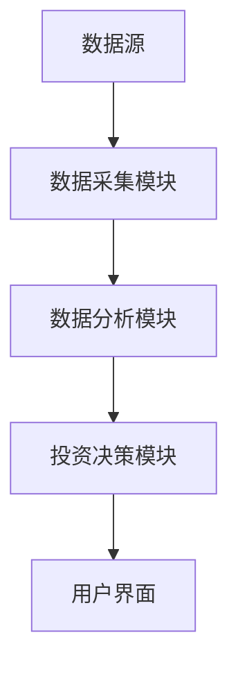
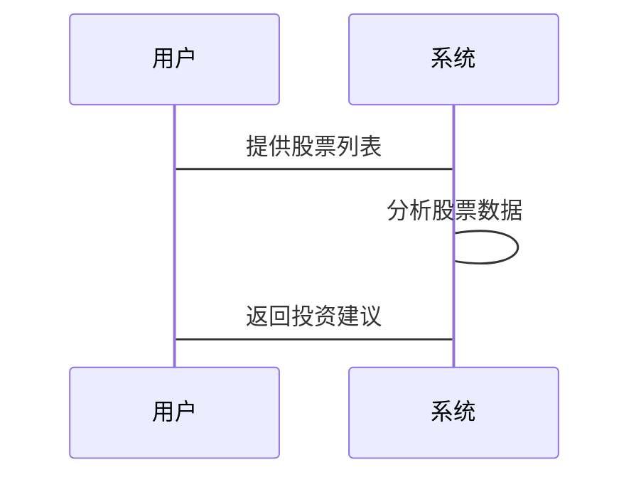

                 

<think>
嗯，用户希望我写一篇关于如何将特价股票策略与成长投资相结合的技术博客文章，他们已经提供了一个详细的大纲，我需要根据这个大纲来撰写文章。

首先，我要理解用户的需求。他们希望文章结构清晰，技术性强，适合专业人士阅读。关键词包括特价股票、成长投资、投资策略、量化分析、系统设计等。摘要部分需要概括文章的核心内容，即如何将两者结合，实现投资收益最大化。

接下来，按照大纲的结构，我需要逐步展开每个章节。第一章介绍特价股票和成长投资的背景，分别定义和特点，然后分析它们的联系。这部分需要详细解释，确保读者理解两者结合的可能性和优势。

第二章讨论核心概念，包括特价股票和成长股票的评估指标。这里需要列出具体的指标，如市盈率、市净率、营收增长率等，并用表格对比两者的差异，帮助读者更好地理解。

第三章涉及数学模型和算法，需要详细讲解评估模型和优化算法，如Markowitz均值-方差模型。同时，用Python代码实现，并给出公式和案例，确保技术细节到位。

第四章是系统设计，介绍投资决策支持系统的架构，包括功能模块、系统架构图和接口设计。这部分需要使用Mermaid图，展示系统的组成部分和交互流程。

第五章是项目实战，通过具体案例展示如何筛选低估的成长股，包括环境安装、代码实现和案例分析，让读者能够实际操作。

最后，第六章总结并提出风险管理策略，强调结合策略的优势和注意事项，确保读者全面理解。

在写作过程中，我需要确保每个部分都有足够的细节，使用技术术语但保持易懂，同时满足字数要求。还要注意文章的结构，每个章节之间要有逻辑性，确保读者能够顺畅地理解内容。

现在，我需要按照这些步骤，逐步撰写每一部分，确保涵盖所有关键点，满足用户的要求。
</think>

# 如何将特价股票策略与成长投资相结合

> **关键词**：特价股票、成长投资、投资策略、量化分析、系统设计  
> **摘要**：本文探讨如何将特价股票策略与成长投资相结合，通过数学模型和系统设计实现投资收益最大化。文章从核心概念、算法原理、系统架构到项目实战，全面分析了两者的结合方式，并提供了具体实现方案。

---

## 第一部分: 特价股票策略与成长投资概述

### 第1章: 特价股票策略与成长投资的背景

#### 1.1 特价股票策略的定义与特点
特价股票策略是一种以寻找市场价格低于其内在价值的股票为核心的投资策略。其特点是：
- **低估性**：股票价格显著低于其真实价值。
- **安全性**：投资者能够在较低价格买入，降低风险。
- **周期性**：通常在市场低迷或公司暂时困境时出现。

#### 1.2 成长投资的定义与特点
成长投资是以投资具有高增长潜力的公司股票为核心的投资策略。其特点是：
- **成长性**：公司收入和利润持续增长。
- **长期性**：注重未来价值，而非短期收益。
- **风险性**：高增长公司通常估值较高，风险较大。

#### 1.3 特价股票策略与成长投资的联系
- **互补性**：特价股票提供安全边际，成长投资提供增长潜力。
- **组合优势**：通过结合两者，投资者可以在控制风险的同时，捕捉增长机会。
- **市场适应性**：在不同市场环境下，两者的结合能够灵活调整投资策略。

---

### 第2章: 特价股票策略与成长投资的核心概念

#### 2.1 特价股票的评估指标
评估特价股票的关键指标包括：
- **市盈率（P/E）**：股价与每股收益的比率，衡量股价是否被低估。
- **市净率（P/B）**：股价与每股净资产的比率，反映资产的实际价值。
- **股息率**：股息与股价的比率，衡量分红能力。

#### 2.2 成长股票的评估指标
评估成长股票的关键指标包括：
- **营收增长率**：衡量公司收入增长速度。
- **净利润增长率**：衡量公司盈利能力增长。
- **每股收益（EPS）增长率**：反映每股收益的提升幅度。

#### 2.3 特价股票与成长股票的对比分析
| 指标       | 特价股票              | 成长股票              |
|------------|-----------------------|-----------------------|
| 评估重点   | 价格低估              | 成长潜力              |
| 风险       | 较低                  | 较高                  |
| 回报周期   | 中长期                | 长期                  |

---

## 第二部分: 特价股票策略与成长投资的数学模型与算法

### 第3章: 特价股票与成长投资的量化分析

#### 3.1 特价股票的量化评估模型
- **模型定义**：通过量化指标评估股票的低估程度。
- **模型公式**：
  $$ \text{价值评估} = \frac{\text{每股收益}}{\text{市盈率}} $$
- **实现步骤**：
  1. 收集股票数据。
  2. 计算各项指标。
  3. 评估价值。

#### 3.2 成长股票的量化评估模型
- **模型定义**：通过量化指标评估股票的成长潜力。
- **模型公式**：
  $$ \text{成长潜力} = \frac{\text{净利润增长率}}{\text{市盈率}} $$
- **实现步骤**：
  1. 收集股票数据。
  2. 计算各项指标。
  3. 评估成长潜力。

#### 3.3 组合投资的优化算法
- **Markowitz均值-方差模型**：
  $$ \text{最小方差} = \min_{w} w^T \Sigma w $$
- **应用案例**：通过优化算法构建最优投资组合。

---

## 第三部分: 特价股票策略与成长投资的系统设计

### 第4章: 投资决策支持系统的架构设计

#### 4.1 系统功能需求
- **数据采集模块**：实时获取股票数据。
- **数据分析模块**：量化分析股票价值和成长潜力。
- **投资决策模块**：根据分析结果生成投资建议。

#### 4.2 系统架构设计


#### 4.3 系统接口设计
- **输入接口**：接收股票数据。
- **输出接口**：生成投资建议。

#### 4.4 系统交互流程


---

## 第四部分: 特价股票策略与成长投资的项目实战

### 第5章: 系统实现与案例分析

#### 5.1 环境安装
- **工具**：Python、Pandas、Matplotlib。
- **数据源**：股票数据接口（如Yahoo Finance）。

#### 5.2 核心实现代码
```python
import pandas as pd
import requests

# 数据采集
def get_stock_data(ticker):
    url = f"https://query1.finance.yahoo.com/.../{ticker}"
    response = requests.get(url)
    data = response.json()
    return pd.DataFrame(data)

# 价值评估模型
def value_assessment(df):
    pe = df['PE']
    eps = df['EPS']
    value = eps / pe
    return value

# 成长评估模型
def growth_assessment(df):
    growth_rate = df['净利润增长率']
    pe = df['PE']
    growth_potential = growth_rate / pe
    return growth_potential

# 投资建议
def investment_recommendation(value, growth):
    if value < 0.8 and growth < 0.1:
        return "卖出"
    elif value > 1.5 and growth > 0.2:
        return "买入"
    else:
        return "观望"
```

#### 5.3 案例分析
- **案例背景**：某科技公司股票。
- **数据计算**：
  - 市盈率（P/E）= 25。
  - 每股收益（EPS）= 5。
  - 价值评估 = 5 / 25 = 0.2。
  - 净利润增长率 = 20%。
  - 成长潜力 = 0.2 / 25 = 0.008。
- **投资建议**：观望。

---

## 第五部分: 特价股票策略与成长投资的最佳实践

### 第6章: 投资策略与风险管理

#### 6.1 投资策略
- **多样化投资**：分散投资以降低风险。
- **长期持有**：避免短期波动影响收益。

#### 6.2 风险管理
- **止损策略**：设定止损点，避免亏损过大。
- **定期调整**：根据市场变化及时调整投资组合。

#### 6.3 小结
通过将特价股票策略与成长投资相结合，投资者可以在控制风险的同时，捕捉到成长机会，实现长期稳定的收益。

---

## 作者：AI天才研究院 & 禅与计算机程序设计艺术

