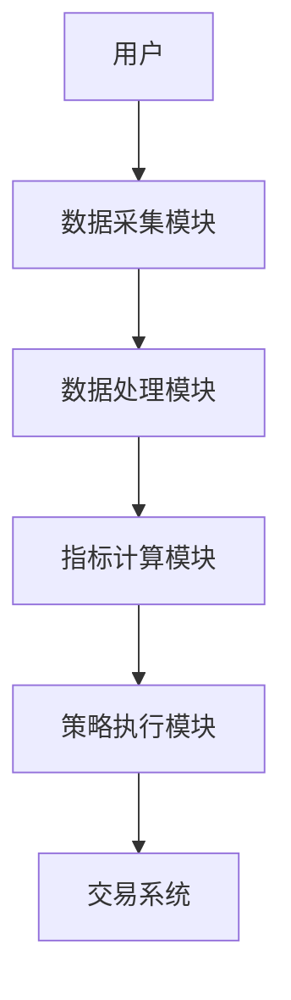
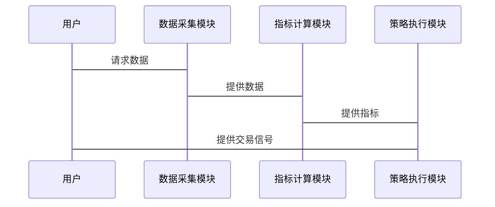

                 


# 如何将特价股票策略与技术分析相结合

> **关键词**: 特价股票策略, 技术分析, 股票投资, 系统设计, 算法实现

> **摘要**:  
> 本文详细探讨了如何将特价股票策略与技术分析相结合，通过系统化的方法和数学建模，帮助投资者制定更科学的投资策略。文章从技术分析的核心工具、特价股票策略的关键要素入手，结合实际案例，分析了两者结合的具体实施步骤，并通过系统架构设计和项目实战，为读者提供了一套完整的解决方案。

---

## 第1章 特价股票策略与技术分析的结合概述

### 1.1 特价股票策略的基本概念

#### 1.1.1 特价股票的定义
特价股票通常指那些市场价格低于其内在价值的股票，常见于市场低迷或公司短期遇到困境的情况。这类股票的投资机会在于其价格的潜在回升空间。

#### 1.1.2 特价股票策略的核心目标
- 发掘被市场低估的股票。
- 利用价格波动获取超额收益。
- 通过长期持有或短期交易获利。

#### 1.1.3 特价股票策略的市场定位
特价股票策略适用于各种市场环境，尤其在熊市或震荡市中表现更为突出。

### 1.2 技术分析的基本原理

#### 1.2.1 技术分析的定义
技术分析是通过分析历史价格和成交量数据，预测未来价格走势的一种方法。

#### 1.2.2 技术分析的核心假设
- 市场行为反映所有信息。
- 价格趋势具有延续性。
- 历史模式会重复出现。

#### 1.2.3 技术分析与基本面分析的区别
- **技术分析**：基于价格和成交量数据。
- **基本面分析**：基于公司财务状况和行业前景。

### 1.3 特价股票策略与技术分析的结合意义

#### 1.3.1 结合的必要性
- 技术分析可以帮助识别市场趋势，避免盲目投资。
- 特价股票策略提供潜在投资机会，技术分析则提供买卖时机。

#### 1.3.2 结合的优势
- 提高投资决策的科学性。
- 减少市场随机波动的影响。
- 提升投资效率和收益。

#### 1.3.3 结合的适用场景
- 市场低迷时寻找低估股票。
- 市场震荡时利用技术指标进行操作。

## 第2章 技术分析的核心工具与方法

### 2.1 技术分析的主要工具

#### 2.1.1 K线图的解读
K线图是技术分析的基础工具，通过开盘价、收盘价、最高价和最低价绘制而成。

#### 2.1.2 移动平均线（MA）
- **MA的定义**：一段时期内价格的平均值。
- **MA的作用**：平滑价格波动，识别趋势方向。

#### 2.1.3 相对强弱指数（RSI）
- **RSI的定义**：衡量价格短期超买或超卖状态的指标。
- **RSI的计算公式**：  
  $$ RSI = \frac{100}{1 + \frac{\text{平均上涨幅度}}{\text{平均下跌幅度}}} $$

#### 2.1.4 麦迪指数（MACD）
- **MACD的定义**：由短期和长期移动平均线的差值组成。
- **MACD的计算公式**：  
  $$ MACD = \text{短期EMA} - \text{长期EMA} $$

### 2.2 技术分析的主要方法

#### 2.2.1 趋势分析法
- **趋势的定义**：价格在一段时间内沿着一定方向运动。
- **趋势的类型**：上升趋势、下降趋势、震荡趋势。

#### 2.2.2 形态分析法
- **形态的定义**：价格在图表上形成的特定形状，如头肩顶、双底等。
- **形态的分类**：反转形态、持续形态。

#### 2.2.3 切线分析法
- **切线的定义**：用于预测价格支撑位和阻力位的直线或曲线。
- **切线的类型**：趋势线、支撑线、阻力线。

#### 2.2.4 波浪理论
- **波浪理论的定义**：将价格波动视为周期性循环的一部分。
- **波浪的阶段**：上升五浪、下降三浪。

### 2.3 技术分析的优缺点

#### 2.3.1 技术分析的优点
- 客观性：基于历史数据，减少主观判断。
- 及时性：能够快速捕捉市场信号。

#### 2.3.2 技术分析的缺点
- 局限性：仅考虑价格和成交量，忽略其他因素。
- 不确定性：技术分析无法保证100%准确。

## 第3章 特价股票策略的核心要素

### 3.1 特价股票的市场特征

#### 3.1.1 特价股票的市场周期
- **周期的定义**：市场中特价股票的出现和消失的过程。
- **周期的阶段**：低估阶段、价值回归阶段。

#### 3.1.2 特价股票的价格波动
- **波动的特征**：短期大幅波动，长期趋于稳定。

#### 3.1.3 特价股票的交易量分析
- **交易量的定义**：一定时间内股票的成交量。
- **交易量的指标**：成交量趋势与价格趋势的关系。

### 3.2 特价股票策略的关键指标

#### 3.2.1 市盈率（P/E）
- **P/E的定义**：股价除以每股收益的比率。
- **P/E的计算公式**：  
  $$ P/E = \frac{\text{股价}}{\text{每股收益}} $$

#### 3.2.2 市净率（P/B）
- **P/B的定义**：股价除以每股净资产的比率。
- **P/B的计算公式**：  
  $$ P/B = \frac{\text{股价}}{\text{每股净资产}} $$

#### 3.2.3 股息率
- **股息率的定义**：每股股息与股价的比率。
- **股息率的计算公式**：  
  $$ 股息率 = \frac{\text{每股股息}}{\text{股价}} $$

#### 3.2.4 市场资本化率
- **市场资本化率的定义**：公司市值与行业平均市值的对比。

### 3.3 特价股票策略的风险管理

#### 3.3.1 风险的定义与分类
- **市场风险**：市场波动导致的损失。
- **流动性风险**：股票难以迅速变现的风险。

#### 3.3.2 风险管理的基本原则
- 分散投资：避免过度集中在某一只股票。
- 设置止损：控制最大损失幅度。

#### 3.3.3 风险管理的工具与方法
- **止损订单**：当价格达到设定点时自动卖出。
- **投资组合保险**：通过动态调整持仓来控制风险。

## 第4章 技术分析与特价股票策略的结合策略

### 4.1 结合策略的理论基础

#### 4.1.1 技术分析与基本面分析的结合
- **结合的必要性**：技术分析提供时机，基本面分析提供方向。

#### 4.1.2 技术分析与市场情绪的结合
- **市场情绪的定义**：投资者的心理状态对市场的影响。

#### 4.1.3 技术分析与市场周期的结合
- **周期的分析**：利用技术指标判断市场的周期性变化。

### 4.2 结合策略的具体实施步骤

#### 4.2.1 确定目标股票
- **筛选标准**：市盈率低、市净率低、股息率高。

#### 4.2.2 技术分析指标的选择
- **关键指标**：RSI、MACD、移动平均线。

#### 4.2.3 策略的制定与执行
- **策略类型**：短线交易、长线投资。

#### 4.2.4 策略的调整与优化
- **调整依据**：市场环境变化、技术指标信号。

### 4.3 结合策略的优缺点

#### 4.3.1 优点
- 提高投资决策的科学性。
- 减少主观判断的误差。

#### 4.3.2 缺点
- 技术分析的局限性。
- 市场环境的不确定性。

## 第5章 特价股票策略与技术分析的系统设计

### 5.1 系统设计的背景介绍

#### 5.1.1 系统的目标
- 提供技术分析与特价股票策略的结合工具。

#### 5.1.2 系统的功能需求
- 数据采集：获取股票价格、成交量等数据。
- 指标计算：计算RSI、MACD等技术指标。
- 策略执行：根据指标信号自动执行买卖操作。

### 5.2 系统架构设计

#### 5.2.1 系统架构图


#### 5.2.2 系统模块说明
- **数据采集模块**：从数据源获取股票信息。
- **数据处理模块**：清洗和转换数据。
- **指标计算模块**：计算技术指标。
- **策略执行模块**：根据指标生成交易信号。

### 5.3 系统接口设计

#### 5.3.1 接口描述
- **输入接口**：用户输入股票代码和时间范围。
- **输出接口**：显示技术分析结果和交易信号。

#### 5.3.2 接口实现
```python
def get_data(stock_code, start_date, end_date):
    # 获取数据
    pass

def calculate_rsi(data, period=14):
    # 计算RSI
    pass

def generate_signal(data, rsi_threshold=30):
    # 生成交易信号
    pass
```

### 5.4 系统交互设计

#### 5.4.1 交互流程图


## 第6章 项目实战

### 6.1 环境安装

#### 6.1.1 安装Python
```bash
pip install python
```

#### 6.1.2 安装数据接口
```bash
pip install pandas yfinance
```

### 6.2 系统核心实现源代码

#### 6.2.1 数据采集代码
```python
import yfinance as yf

def get_data(stock_code, start_date, end_date):
    data = yf.download(stock_code, start=start_date, end=end_date)
    return data
```

#### 6.2.2 指标计算代码
```python
import pandas as pd
import numpy as np

def calculate_rsi(data, period=14):
    delta = data['Close'] - data['Close'].shift(1)
    up = delta.where(delta > 0, 0)
    down = delta.where(delta < 0, 0)
    rs = up.rolling(period).mean() / down.rolling(period).mean()
    rsi = 100 - (100 - rs.rolling(period).mean())
    return rsi
```

#### 6.2.3 策略执行代码
```python
def generate_signal(data, rsi_threshold=30):
    signals = pd.DataFrame(index=data.index)
    signals['Signal'] = 0
    for i in range(len(data)):
        if i == 0:
            signals.iloc[i, 0] = 1
        else:
            if data['Close'].iloc[i] > data['Close'].iloc[i-1]:
                signals.iloc[i, 0] = 1
            else:
                signals.iloc[i, 0] = -1
    return signals
```

### 6.3 项目实战分析

#### 6.3.1 数据分析
- 通过数据采集模块获取股票数据。
- 使用指标计算模块计算RSI和MACD。

#### 6.3.2 策略实现
- 根据技术指标生成交易信号。
- 执行买卖操作。

#### 6.3.3 实战案例
- 选择某只股票，进行数据采集和指标计算。
- 根据指标生成交易信号并执行交易。

## 第7章 总结与展望

### 7.1 总结
- 本文详细探讨了如何将特价股票策略与技术分析相结合。
- 提供了系统的解决方案和实战案例。

### 7.2 展望
- 进一步优化系统架构。
- 探索更多技术分析指标与策略结合的可能性。

---

## 作者：AI天才研究院 & 禅与计算机程序设计艺术

