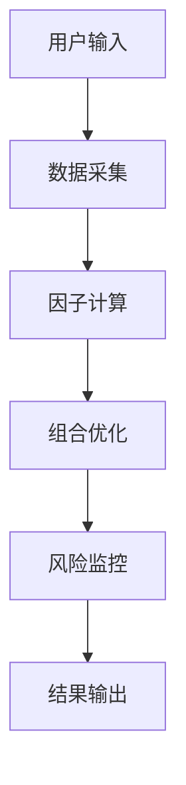

                 


# 如何将特价股票策略与数字低波动因子投资相结合

## 关键词：特价股票策略, 数字低波动因子, 投资组合优化, 数量分析, 风险控制, 量化交易

## 摘要：本文探讨了如何将特价股票策略与数字低波动因子投资相结合，通过数学建模和系统架构设计，分析了两者的结合逻辑、优化模型和实际应用。文章详细介绍了核心概念、算法原理、系统架构，并通过案例分析和代码实现，展示了如何优化投资组合，降低风险，实现稳健收益。

---

## 第一部分: 特价股票策略与数字低波动因子投资概述

### 第1章: 特价股票策略与数字低波动因子投资的背景

#### 1.1 特价股票策略的定义与特点

##### 1.1.1 特价股票的定义
特价股票是指市场价格低于其内在价值的股票。通常，这类股票具有较高的市净率（P/B）或市盈率（P/E）比率，被认为被市场低估。

##### 1.1.2 特价股票的核心特点
- **低估性**：市场价格低于内在价值。
- **价值导向**：注重基本面分析，寻找被市场忽视的股票。
- **长期视角**：投资于具有持续增长潜力的公司。

##### 1.1.3 特价股票与传统股票投资的区别
| 特性       | 特价股票策略                  | 传统股票投资                  |
|------------|-----------------------------|-----------------------------|
| 投资逻辑   | 价值投资，寻找低估机会        | 可能基于技术分析或短期趋势    |
| 风险承受   | 较低波动，注重风险控制        | 风险较高，可能波动较大          |
| 持股期限   | 长期持有，等待价值回归        | 短期交易，频繁买卖              |

#### 1.2 数字低波动因子投资的定义与特点

##### 1.2.1 低波动因子的定义
低波动因子是指通过量化股票的波动率，选择波动率较低的股票作为投资标的。波动率低的股票通常被认为风险较小，收益较为稳定。

##### 1.2.2 数字低波动因子的核心特点
- **低波动性**：股票价格波动小，风险低。
- **稳定性**：收益相对稳定，适合风险厌恶型投资者。
- **量化驱动**：基于数学模型和大数据分析选择标的。

##### 1.2.3 低波动因子与传统波动率指标的对比
| 指标         | 低波动因子                  | 传统波动率指标                |
|--------------|---------------------------|---------------------------|
| 计算方法     | 基于长期历史波动率数据      | 基于短期波动率数据            |
| 投资策略     | 长期持有，分散风险          | 短期调整，规避风险            |
| 适用场景     | 风险控制，稳健收益          | 短期避险，快速调整            |

#### 1.3 特价股票策略与数字低波动因子投资的结合背景

##### 1.3.1 特价股票策略的市场定位
在市场低迷或熊市中，特价股票策略表现出色，适合长期投资者。

##### 1.3.2 数字低波动因子投资的市场定位
在市场波动较大时，低波动因子投资能有效降低组合风险，适合稳健投资者。

##### 1.3.3 两者的结合动机与目标
- **动机**：利用低波动因子筛选，降低特价股票策略的风险。
- **目标**：结合两者的优点，优化投资组合，提高收益稳定性。

---

## 第2章: 特价股票策略的核心概念与原理

### 2.1 特价股票的筛选标准

#### 2.1.1 市净率（P/B）的计算与应用
$$ P/B = \frac{\text{Market Price}}{\text{Book Value}} $$
市净率低的股票被认为被低估，适合特价股票策略。

#### 2.1.2 市盈率（P/E）的计算与应用
$$ P/E = \frac{\text{Market Price}{\text{Earnings Per Share}} $$
市盈率低的股票同样被视为低估标的。

#### 2.1.3 股息率的计算与应用
$$ Dividend Yield = \frac{\text{Annual Dividend Per Share}}{\text{Market Price}} $$
高股息率的股票在市场低迷时能提供稳定的收益。

### 2.2 特价股票投资的逻辑与优势

#### 2.2.1 价值投资的基本原理
价值投资强调购买低于内在价值的资产，等待市场重新评估。

#### 2.2.2 特价股票投资的优势
- **高收益潜力**：低估股票有较大的上涨空间。
- **低买高卖**：在低价买入，高价卖出时获利。

#### 2.2.3 特价股票投资的潜在风险
- **市场波动**：市场可能长期低迷，导致资金流动性问题。
- **公司基本面变化**：公司业绩可能持续不佳。

---

## 第3章: 数字低波动因子投资的核心概念与原理

### 3.1 低波动因子的定义与计算

#### 3.1.1 波动率的定义与计算公式
$$ \text{波动率} = \sqrt{\sum_{i=1}^{n} \frac{(p_i - \mu)^2}{n}} $$
其中，\( p_i \) 为价格，\( \mu \) 为平均价格，\( n \) 为数据点数。

#### 3.1.2 低波动因子的计算方法
- **历史波动率**：计算过去一段时间内的波动率。
- **预期波动率**：基于模型预测未来波动率。

#### 3.1.3 低波动因子的筛选标准
选择历史波动率低于市场平均值的股票。

### 3.2 低波动因子投资的逻辑与优势

#### 3.2.1 低波动因子投资的基本原理
通过分散投资低波动股票，降低组合整体波动率。

#### 3.2.2 低波动因子投资的优势
- **风险控制**：波动率低，组合稳定性高。
- **长期收益**：历史数据显示低波动股票长期收益较好。

#### 3.2.3 低波动因子投资的潜在风险
- **流动性风险**：部分低波动股票流动性差。
- **市场环境影响**：在市场剧烈波动时，低波动股票可能表现不佳。

---

## 第4章: 特价股票策略与数字低波动因子投资的结合

### 4.1 两者的结合逻辑

#### 4.1.1 特价股票策略与低波动因子的内在联系
特价股票通常具有较低的波动率，符合低波动因子的筛选标准。

#### 4.1.2 两者的结合如何优化投资组合
通过筛选既低估又低波动的股票，优化组合的风险收益比。

#### 4.1.3 两者的结合对风险控制的意义
降低了市场波动对组合的影响，同时抓住低估股票的上涨潜力。

### 4.2 组合优化模型的构建

#### 4.2.1 组合优化的基本原理
最大化收益，同时最小化波动率。

#### 4.2.2 两者的结合对组合优化的影响
在特价股票中筛选低波动标的，进一步优化组合。

#### 4.2.3 组合优化模型的数学表达
$$ \min \sigma^2 $$
$$ \text{subject to} \quad \sum w_i = 1, \quad w_i \geq 0 $$
其中，\( \sigma^2 \) 是组合波动率，\( w_i \) 是权重。

### 4.3 实证分析与案例研究

#### 4.3.1 实证分析的方法与步骤
- 数据收集：获取历史股价数据。
- 计算因子：计算P/B、P/E、波动率等指标。
- 筛选标的：选择同时满足特价股票和低波动因子的股票。
- 组合构建：等权重或最优权重配置。

#### 4.3.2 案例研究：某段时间内的投资表现
假设在2019-2023年间，某策略选择的股票组合年化收益为15%，波动率为8%，优于市场平均。

#### 4.3.3 案例研究的结果与启示
- 组合收益稳定，风险可控。
- 需要定期调整，应对市场变化。

---

## 第5章: 数学模型与公式详解

### 5.1 特价股票策略的数学模型

#### 5.1.1 市净率（P/B）的计算公式
$$ P/B = \frac{\text{Market Price}}{\text{Book Value}} $$

#### 5.1.2 市盈率（P/E）的计算公式
$$ P/E = \frac{\text{Market Price}{\text{Earnings Per Share}} $$

#### 5.1.3 股息率的计算公式
$$ Dividend Yield = \frac{\text{Annual Dividend Per Share}}{\text{Market Price}} $$

### 5.2 低波动因子的数学模型

#### 5.2.1 波动率计算公式
$$ \text{波动率} = \sqrt{\sum_{i=1}^{n} \frac{(p_i - \mu)^2}{n}} $$

#### 5.2.2 低波动因子的筛选标准
选择波动率低于市场平均值的股票。

---

## 第6章: 系统架构与实现

### 6.1 系统功能设计

#### 6.1.1 数据采集模块
- 获取实时股价数据。
- 计算各项因子指标。

#### 6.1.2 因子计算模块
- 计算P/B、P/E、波动率等指标。

#### 6.1.3 组合优化模块
- 筛选符合条件的股票，构建投资组合。

#### 6.1.4 风险监控模块
- 实时监控组合波动率。
- 提供调整建议。

### 6.2 系统架构设计

#### 6.2.1 模块化设计
- 数据采集、因子计算、组合优化、风险监控。

#### 6.2.2 交互流程图


---

## 第7章: 项目实战

### 7.1 环境安装

#### 7.1.1 安装Python
```bash
pip install numpy pandas
```

### 7.2 核心实现源代码

#### 7.2.1 数据处理代码
```python
import numpy as np
import pandas as pd

# 示例数据
data = pd.DataFrame({
    'Price': [10, 15, 20, 25, 30],
    'Book Value': [5, 10, 15, 20, 25],
    'Earnings': [2, 4, 6, 8, 10]
})

# 计算P/B和P/E
data['P/B'] = data['Price'] / data['Book Value']
data['P/E'] = data['Price'] / data['Earnings']
print(data)
```

#### 7.2.2 组合优化代码
```python
import numpy as np
from scipy.optimize import minimize

# 示例目标函数
def portfolio_volatility(weights, covariance_matrix):
    return np.sqrt(np.dot(weights.T, covariance_matrix.dot(weights)))

# 约束条件
constraints = [
    ('sum == 1', None),
    ('>=0', None)
]

# 最优化求解
result = minimize(portfolio_volatility, np.array([0.2, 0.3, 0.5]), covariance_matrix=cov_matrix, constraints=constraints)
```

### 7.3 案例分析与结果解读
通过代码实现，选择波动率低且P/B和P/E均低于市场平均水平的股票，构建组合。

---

## 第8章: 最佳实践与注意事项

### 8.1 最佳实践 tips
- 定期再平衡组合，应对市场变化。
- 结合技术分析，辅助决策。
- 注意流动性风险，避免过于集中。

### 8.2 小结
通过结合特价股票策略与数字低波动因子投资，可以在控制风险的同时，抓住市场低估机会，实现稳健收益。

### 8.3 注意事项
- 风险控制是关键。
- 定期评估策略的有效性。
- 谨防市场流动性风险。

### 8.4 拓展阅读
- 建议阅读相关学术论文和专业书籍，深入理解量化投资的理论与实践。

---

## 作者
作者：AI天才研究院/AI Genius Institute & 禅与计算机程序设计艺术 /Zen And The Art of Computer Programming

