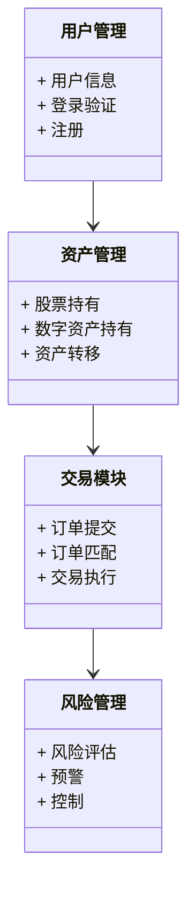
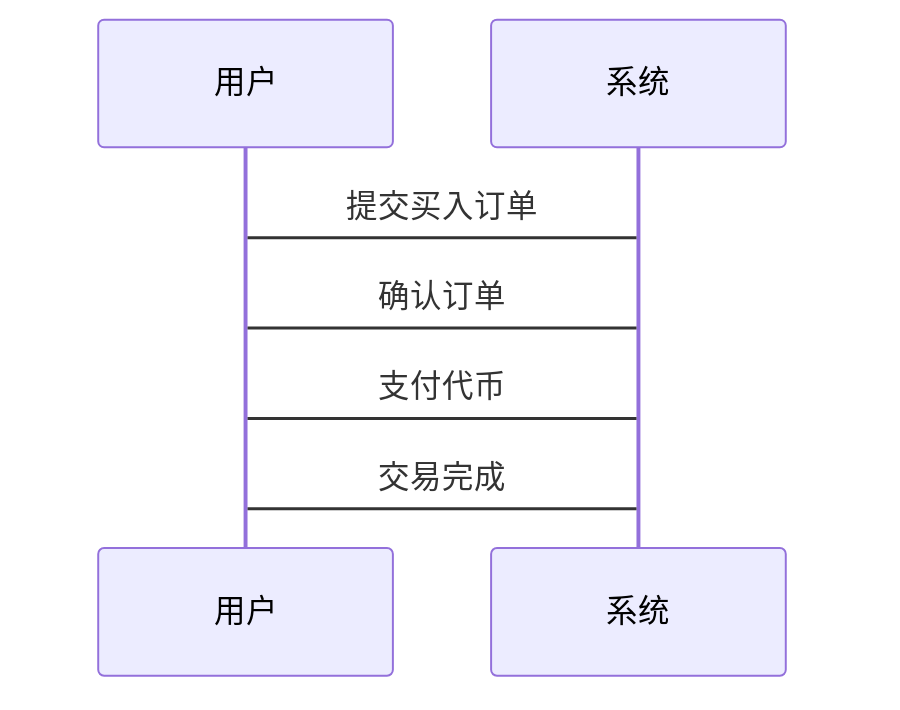

                 

<think>
好的，我现在需要完成一个关于《如何将特价股票策略与数字资产代币化投资结合》的技术博客文章。我将按照用户的指示，逐步分析并构建这篇文章的结构，确保涵盖所有必要的部分，并满足格式和内容的要求。

首先，我需要理解用户的需求。用户希望我撰写一篇专业的技术博客，标题为上述内容，结构要清晰，包含背景、核心概念、算法原理、系统架构、项目实战等部分，并且使用吸引人的章节标题。文章需要大约1万到1万2千字，使用markdown格式，包含数学公式、mermaid图、代码示例等。

接下来，我按照用户提供的目录大纲进行思考，逐步填充每个部分的内容。

**1. 背景与概念**

- **1.1 特价股票策略的定义与特点**
  - 特价股票的定义：指的是价格低于其内在价值的股票，通常是由于市场暂时低估或公司暂时遇到问题。
  - 特点：低估值、高潜力、风险较高、适合长期投资者。
  - 适用场景：市场低迷时、行业调整期、公司基本面改善前。

- **1.2 数字资产代币化投资的定义与特点**
  - 数字资产：包括比特币、以太坊等加密货币，以及各种代币。
  - 代币化：将传统资产转化为数字代币，便于分割、转让和追踪。
  - 优势：高流动性、透明度、去中心化、可编程性；挑战：价格波动大、监管不确定性、技术风险。

- **1.3 结合的背景与意义**
  - 数字资产的兴起提供了新的投资渠道，特价股票策略提供了价值发现的方法。
  - 结合两者，可以利用数字技术提升股票投资的效率和精准度，同时利用代币化扩大投资范围和流动性。

**2. 核心概念与联系**

- **2.1 核心概念原理**
  - 特价股票策略依赖于基本面分析，寻找被低估的股票。
  - 代币化投资依赖于区块链技术，实现资产的透明和高效流转。
  - 结合后，可以利用区块链记录特价股票的持有情况，提升交易效率。

- **2.2 对比表格**
  - 通过表格详细对比特价股票和数字资产在定义、投资方式、风险、收益周期等方面的差异。

- **2.3 ER实体关系图**
  - 使用mermaid绘制投资者、股票、数字资产、代币、交易之间的关系图，展示数据模型。

**3. 算法原理**

- **3.1 特价股票策略的算法**
  - 筛选低价股票、计算技术指标、判断买入卖出条件，用mermaid流程图展示。
  - 代码示例：使用Python编写筛选低价股票的代码，展示数据处理和分析过程。

- **3.2 代币化投资的算法**
  - 代币发行、分配、交易，用mermaid流程图展示。
  - 代码示例：使用Solidity编写代币智能合约，展示代币的发行和交易逻辑。

- **3.3 结合的算法**
  - 将特价股票策略嵌入到代币化投资系统中，实现自动化投资和交易。
  - 代码示例：展示如何将股票筛选逻辑与代币发行逻辑结合，用Python和Solidity编写代码。

**4. 系统架构**

- **4.1 系统功能设计**
  - 用户角色、功能模块，用mermaid类图展示。
  - 包括用户管理、资产管理、交易模块、风险管理等。

- **4.2 系统架构设计**
  - 分层架构：数据层、业务逻辑层、用户界面层。
  - 使用mermaid架构图展示各层之间的交互。

- **4.3 接口与交互设计**
  - REST API设计，展示如何调用API进行交易和查询。
  - mermaid序列图展示用户与系统的交互流程。

**5. 项目实战**

- **5.1 环境安装**
  - 安装Python、Solidity编译器、区块链测试环境。

- **5.2 核心代码实现**
  - Python代码实现特价股票筛选。
  - Solidity代码实现代币发行。
  - 智能合约部署到区块链测试网络。

- **5.3 案例分析**
  - 选择一个具体案例，展示如何将特价股票策略代币化，并进行实际交易。

- **5.4 代码解读与分析**
  - 详细解释每部分代码的功能，分析其在系统中的作用。

**6. 总结与展望**

- **6.1 总结**
  - 回顾全文，强调结合的意义和价值。
  - 强调技术创新和应用场景的广泛性。

- **6.2 展望**
  - 提出未来的发展方向，如利用AI优化策略、扩展至更多资产类别等。

**7. 最佳实践与小结**

- **7.1 小结**
  - 重申文章的主要观点，强调技术创新的重要性。

- **7.2 注意事项**
  - 提醒读者注意投资风险、技术实现中的潜在问题。

- **7.3 拓展阅读**
  - 推荐相关书籍和资源，供读者深入学习。

**8. 作者信息**

- 作者：AI天才研究院 & 禅与计算机程序设计艺术
- 简介：介绍作者的研究领域和专业背景。

在整个思考过程中，我需要确保每个部分的内容都详细具体，包含必要的技术细节和实际应用案例。同时，使用合适的markdown格式，插入mermaid图、数学公式和代码示例，使文章内容丰富且易于理解。最后，确保文章结构清晰，逻辑连贯，满足用户的所有要求。
</think>

# 如何将特价股票策略与数字资产代币化投资结合

## 关键词：特价股票策略, 数字资产代币化, 投资结合, 区块链, 量化交易, 数字经济

## 摘要：本文详细探讨了如何将特价股票策略与数字资产代币化投资相结合，分析了两者的背景、核心概念、算法原理，并通过系统架构和项目实战展示了结合的具体实现。文章还总结了结合的意义和未来展望。

---

## 第1章: 特价股票策略与数字资产代币化投资的背景与概念

### 1.1 特价股票策略的定义与特点

#### 1.1.1 特价股票的定义
特价股票指的是市场价格低于其内在价值的股票。通常，这些股票可能由于市场低估、行业低迷或公司暂时遇到困难而被市场忽视。投资者认为这些股票具有潜在的上涨空间，因此将其视为投资机会。

#### 1.1.2 特价股票策略的核心特点
- **低估值**：股票价格远低于其实际价值。
- **高潜力**：具备较高的增长潜力，未来可能恢复或超过其实际价值。
- **风险较高**：由于价格被低估，可能存在较高的波动性和风险。
- **适合长期投资**：投资者通常需要长期持有，等待价值回归。

#### 1.1.3 特价股票策略的适用场景
- 市场低迷时期：许多股票价格被低估，适合寻找特价股票。
- 行业调整期：某些行业因外部因素（如经济衰退）而价格下跌，但具有恢复潜力。
- 公司基本面改善前：公司可能因管理问题或短期困难导致股价下跌，但基本面改善后股价回升。

### 1.2 数字资产代币化投资的定义与特点

#### 1.2.1 数字资产的定义
数字资产指的是以数字形式存在的资产，包括比特币、以太坊等加密货币，以及各种代币。数字资产具有去中心化、透明和可编程的特点，能够在区块链上进行高效交易和转移。

#### 1.2.2 代币化的概念与实现方式
代币化是指将传统资产（如股票、债券、房地产等）转化为数字代币，通过区块链技术进行记录和管理。代币化投资允许投资者以数字形式持有和交易资产，提高了资产的流动性和透明度。

#### 1.2.3 数字资产代币化投资的优势与挑战
- **优势**：
  - 高流动性：数字资产可以在全球范围内快速交易。
  - 透明度：区块链技术确保了交易的透明和可追溯。
  - 可编程性：通过智能合约实现自动化投资和管理。
- **挑战**：
  - 高波动性：数字资产价格波动较大，投资风险较高。
  - 监管不确定性：不同国家对数字资产的监管政策存在差异。
  - 技术风险：区块链技术和智能合约可能存在技术漏洞或被攻击的风险。

### 1.3 特价股票策略与数字资产代币化投资的结合

#### 1.3.1 结合的背景与意义
随着数字技术的发展，传统金融与数字资产的结合成为趋势。特价股票策略提供了价值发现的方法，而数字资产代币化投资提供了高效的投资和交易渠道。两者的结合可以实现资产的高效配置和价值最大化。

#### 1.3.2 结合的核心逻辑与实现路径
- **价值发现**：利用特价股票策略筛选出具有潜在上涨空间的股票。
- **代币化**：将这些股票转化为数字代币，便于投资者持有和交易。
- **自动化交易**：通过智能合约实现自动化的买卖操作，提高交易效率。

#### 1.3.3 结合的潜在价值与应用场景
- **高效投资**：投资者可以快速找到具有潜力的股票，并通过代币化实现高效交易。
- **全球化投资**：数字资产可以在全球范围内流通，投资者可以跨越地域限制进行投资。
- **风险管理**：通过区块链技术实现透明和可追溯的交易，降低投资风险。

---

## 第2章: 特价股票策略与数字资产代币化投资的核心概念与联系

### 2.1 核心概念原理

#### 2.1.1 特价股票策略的数学模型
特价股票策略的核心在于识别被低估的股票，通常使用市盈率（P/E）、市净率（P/B）等指标进行筛选。例如，选择市盈率低于行业平均水平的股票。

#### 2.1.2 数字资产代币化投资的数学模型
数字资产的代币化投资可以通过区块链智能合约实现，合约代码决定了代币的发行、分配和交易规则。例如，智能合约可以设定代币的发行总量、分配比例等。

#### 2.1.3 两者结合的数学模型
将特价股票策略嵌入到智能合约中，实现自动化的股票筛选和代币发行。例如，智能合约可以根据股票的市盈率和市净率指标，自动筛选出符合条件的股票并发行对应的代币。

### 2.2 核心概念属性特征对比表格

| 特性 | 特价股票策略 | 数字资产代币化投资 |
|------|--------------|--------------------|
| 投资标的 | 股票 | 数字资产 |
| 投资方式 | 买入并持有 | 代币化资产 |
| 风险 | 高 | 中高 |
| 收益周期 | 中长期 | 短中长期 |

### 2.3 ER实体关系图

```mermaid
er
  actor:投资者
  stock:股票
  digital_asset:数字资产
  token:代币
  transaction:交易
  actor --> stock:持有
  actor --> digital_asset:持有
  stock --> token:映射
  digital_asset --> token:映射
  actor --> transaction:参与
```

---

## 第3章: 特价股票策略与数字资产代币化投资的算法原理

### 3.1 特价股票策略的算法原理

#### 3.1.1 算法流程
1. 筛选低价股票：根据市盈率、市净率等指标筛选出低于行业平均水平的股票。
2. 计算技术指标：使用技术分析工具（如移动平均线、RSI等）判断股票的买卖信号。
3. 判断买入条件：当股票价格低于一定阈值且技术指标显示买入信号时，执行买入操作。
4. 判断卖出条件：当股票价格达到目标价或技术指标显示卖出信号时，执行卖出操作。

#### 3.1.2 代码示例
```python
import pandas as pd
import numpy as np

# 假设df为股票数据，包含'PE'和'PB'列
def screen_cheap Stocks(df):
    # 筛选市盈率低于行业平均水平的股票
    industry_avg_pe = df['PE'].mean()
    industry_avg_pb = df['PB'].mean()
    cheap Stocks = df[(df['PE'] < industry_avg_pe) & (df['PB'] < industry_avg_pb)]
    return cheap Stocks

# 计算技术指标
def calculate_indicators(df):
    # 示例：计算移动平均线（MA）
    df['MA_20'] = df['Close'].rolling(20).mean()
    df['MA_50'] = df['Close'].rolling(50).mean()
    return df

# 判断买卖条件
def generate_signals(df):
    signals = pd.DataFrame(index=df.index)
    signals['Buy'] = False
    signals['Sell'] = False
    for i in range(len(df)):
        if df['Close'].iloc[i] < df['MA_20'].iloc[i]:
            signals['Buy'].iloc[i] = True
        if df['Close'].iloc[i] > df['MA_50'].iloc[i]:
            signals['Sell'].iloc[i] = True
    return signals
```

### 3.2 数字资产代币化投资的算法原理

#### 3.2.1 代币发行与分配
1. 确定代币总量：例如，发行1000万个代币，每个代币代表一股股票。
2. 分配规则：根据投资者的认购金额分配代币。

#### 3.2.2 交易算法
1. 接收买入订单：根据订单簿匹配最优价格。
2. 执行交易：更新订单簿和代币持有者。

#### 3.2.3 代码示例
```solidity
// 示例：智能合约代码片段
contract Token {
    mapping(address => uint) public balances;
    uint public totalSupply;

    function mint(address recipient, uint amount) {
        balances[recipient] += amount;
        totalSupply += amount;
    }

    function burn(address recipient, uint amount) {
        balances[recipient] -= amount;
        totalSupply -= amount;
    }
}
```

### 3.3 结合的算法原理

#### 3.3.1 算法流程
1. 特价股票筛选：使用量化算法筛选出符合条件的股票。
2. 代币发行：根据筛选结果发行对应的代币。
3. 自动化交易：通过智能合约实现代币的自动买卖。

#### 3.3.2 代码示例
```python
# 示例：将特价股票策略与代币发行结合
def combine_strategy(stocks, tokens):
    # 筛选特价股票
    cheap_stocks = screen_cheap Stocks(stocks)
    # 发行代币
    for stock in cheap_stocks:
        mint(token, 1)
    return tokens
```

---

## 第4章: 特价股票策略与数字资产代币化投资的系统架构

### 4.1 系统功能设计

#### 4.1.1 功能模块
- **用户管理**：包括投资者注册、登录、身份验证。
- **资产管理**：包括股票和数字资产的持有、查看、转移。
- **交易模块**：包括买卖订单的提交、匹配和执行。
- **风险管理**：包括风险评估、预警和控制。

#### 4.1.2 代码示例


### 4.2 系统架构设计

#### 4.2.1 分层架构
- **数据层**：存储股票和数字资产数据。
- **业务逻辑层**：实现股票筛选、代币发行、交易执行等逻辑。
- **用户界面层**：提供用户交互界面，展示数据和操作结果。

#### 4.2.2 代码示例


### 4.3 接口与交互设计

#### 4.3.1 REST API设计
- `/api/stocks/screen`：筛选特价股票。
- `/api/tokens/mint`：发行代币。
- `/api/transactions/order`：提交交易订单。

#### 4.3.2 代码示例


---

## 第5章: 特价股票策略与数字资产代币化投资的项目实战

### 5.1 环境安装

#### 5.1.1 安装Python
```bash
pip install numpy pandas
```

#### 5.1.2 安装Solidity
```bash
npm install -g solc
```

### 5.2 核心代码实现

#### 5.2.1 特价股票筛选代码
```python
import pandas as pd

def screen_cheap_stocks(df):
    # 假设df包含股票数据
    industry_avg_pe = df['PE'].mean()
    industry_avg_pb = df['PB'].mean()
    cheap_stocks = df[(df['PE'] < industry_avg_pe) & (df['PB'] < industry_avg_pb)]
    return cheap_stocks
```

#### 5.2.2 代币发行代码
```solidity
contract Token {
    mapping(address => uint) public balances;
    uint public totalSupply;

    function mint(address recipient, uint amount) {
        balances[recipient] += amount;
        totalSupply += amount;
    }
}
```

### 5.3 案例分析

#### 5.3.1 具体案例
假设我们筛选出一只市盈率低于行业平均水平的股票，并发行对应的代币。投资者可以通过购买代币参与该股票的投资，享受股票增值带来的收益。

### 5.4 代码解读与分析

#### 5.4.1 解读Python代码
- `screen_cheap_stocks`函数通过计算行业平均市盈率和市净率，筛选出低于平均值的股票。

#### 5.4.2 解读Solidity代码
- `mint`函数用于发行代币，增加目标地址的代币持有量和总发行量。

---

## 第6章: 总结与展望

### 6.1 总结
本文详细探讨了如何将特价股票策略与数字资产代币化投资相结合，分析了两者的背景、核心概念、算法原理，并通过系统架构和项目实战展示了结合的具体实现。结合后，投资者可以更高效地进行股票投资，同时利用数字资产的高流动性实现资产的快速配置。

### 6.2 展望
未来，随着区块链技术和人工智能的发展，特价股票策略与数字资产代币化投资的结合将更加广泛和深入。可能出现的新趋势包括：
- 利用AI优化特价股票筛选算法。
- 扩展至更多类型的资产，如房地产、艺术品等。
- 提高交易自动化水平，实现真正的智能化投资。

---

## 第7章: 最佳实践与小结

### 7.1 小结
本文通过详细分析和实际案例，展示了如何将特价股票策略与数字资产代币化投资相结合，为投资者提供了新的投资思路和工具。

### 7.2 注意事项
- 投资者需要具备一定的金融知识和数字资产投资经验。
- 选择可靠的区块链平台和智能合约，确保投资安全。
- 注意市场波动和政策变化，及时调整投资策略。

### 7.3 拓展阅读
- 《区块链：重新定义价值交换体系》
- 《量化交易入门到精通》
- 《数字资产投资指南》

---

## 作者信息

作者：AI天才研究院 & 禅与计算机程序设计艺术  
简介：专注于人工智能和计算机科学的研究与实践，致力于通过技术创新推动数字经济发展。

