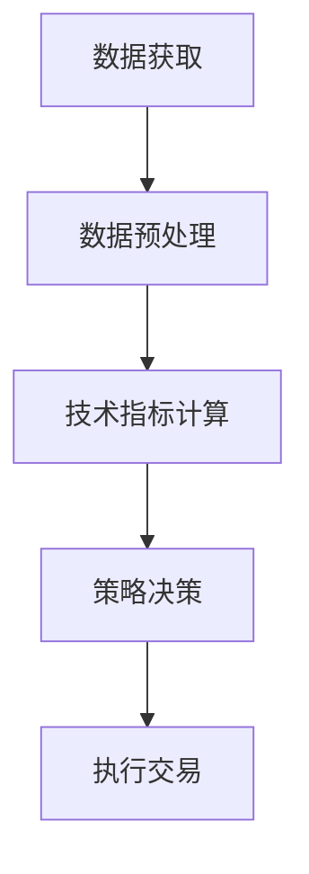
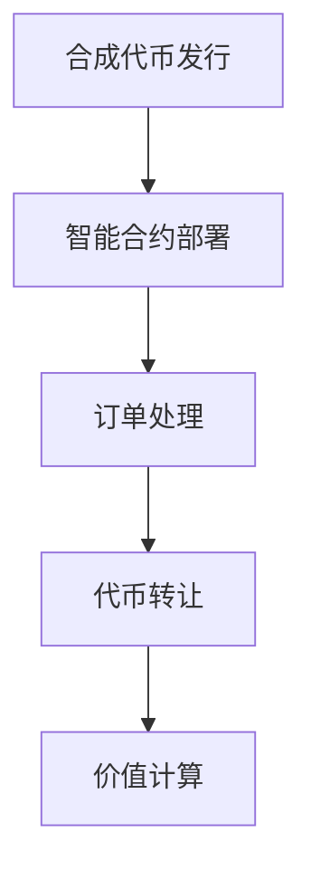
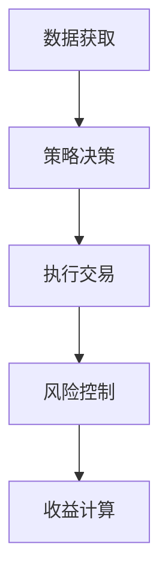
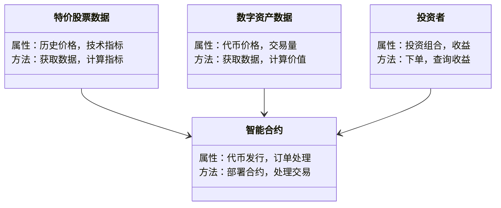
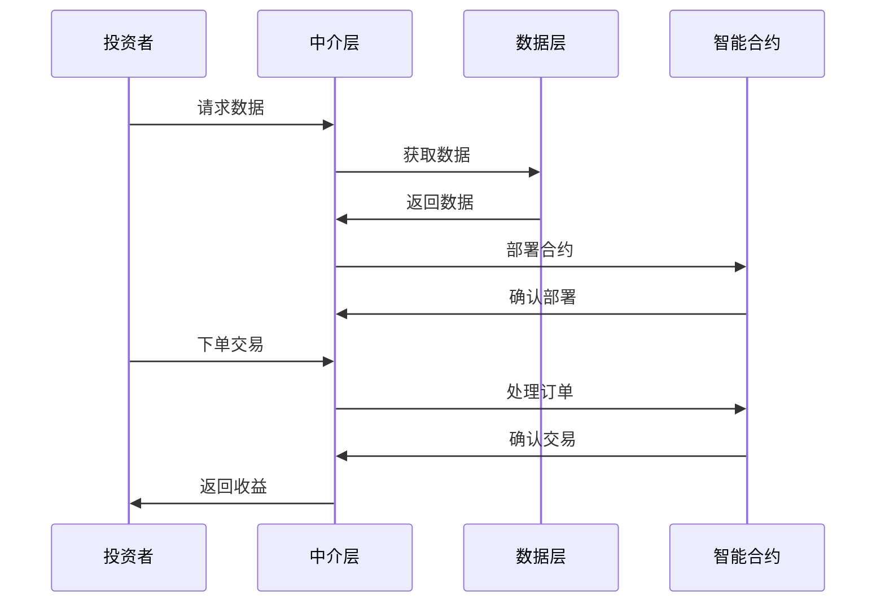

                 

<think>
好的，我现在需要帮用户撰写一篇关于如何将特价股票策略与数字资产合成代币投资结合的技术博客文章。首先，我需要明确文章的结构和内容，确保符合用户的要求。用户希望文章有一个吸引人的标题，关键词和摘要，然后是详细的目录结构，每个部分都要有详细的分析和讲解。

我首先确定文章的标题和关键词。标题已经给出，关键词需要涵盖特价股票、数字资产、合成代币、投资策略、量化交易、风险管理这几个方面。摘要部分需要简明扼要地总结文章的核心内容，说明如何将特价股票策略与数字资产合成代币投资结合，实现风险控制和收益增强。

接下来，我需要按照目录大纲来撰写每个部分。首先是背景介绍，解释特价股票和数字资产合成代币的基本概念，分析它们的现状和问题，以及结合的必要性。这部分需要让读者理解为什么需要将两者结合起来。

然后是核心概念，详细解释特价股票策略和数字资产合成代币的原理，比较它们的优缺点，以及两者之间的关系。这部分需要使用表格和ER图来帮助读者理解。

接下来是算法原理，介绍如何将特价股票策略应用到数字资产合成代币中。这部分需要详细讲解算法流程，使用mermaid流程图和数学公式来展示。

系统分析与架构设计部分，需要构建一个结合这两种投资策略的系统，包括架构设计图、接口设计和交互流程图。这部分需要图表来展示系统结构。

项目实战部分，提供具体的实现步骤，包括环境安装、核心代码实现、案例分析等，帮助读者实际操作。

最后，总结最佳实践、注意事项和拓展阅读等内容，为读者提供更多的实用建议。

在写作过程中，我需要确保每个部分都符合用户的要求，使用正确的markdown格式，保持结构清晰，逻辑连贯。同时，要注意语言的专业性和易懂性，避免过于复杂或模糊的描述。

现在，我需要按照这个思路逐步撰写每个部分，确保每个小节都有足够的细节和解释，帮助读者全面理解如何将特价股票策略与数字资产合成代币投资结合。
</think>

# 如何将特价股票策略与数字资产合成代币投资结合

## 关键词：特价股票，数字资产，合成代币，投资策略，量化交易，风险管理

## 摘要：  
本文详细探讨了如何将特价股票策略与数字资产合成代币投资相结合，通过量化分析和系统设计，提出了创新的投资策略。文章从背景介绍、核心概念、算法原理、系统架构到项目实战，全面解析了两者的结合方式，并通过实际案例展示了其在投资中的应用。本文旨在为投资者提供一种高效的风险控制和收益增强的解决方案。

---

# 第一部分: 特价股票策略与数字资产合成代币投资的背景与概念

## 第1章: 特价股票策略与数字资产合成代币投资的背景介绍

### 1.1 特价股票策略的核心概念  
特价股票策略是一种基于价格波动的投资策略，通过识别低价股票的潜在上涨机会，利用市场波动实现收益。其核心在于捕捉市场低估的机会，通常适用于价值投资或短期套利。

#### 1.1.1 特价股票的定义与特点  
- **定义**：特价股票是指市场价格低于其内在价值的股票，通常被认为是被市场低估的股票。  
- **特点**：  
  1. 价格波动性较高，但潜在上涨空间大。  
  2. 需要长期关注市场数据，识别低估机会。  
  3. 风险较高，但回报潜力大。  

#### 1.1.2 特价股票策略的基本原理  
- **原理**：通过分析公司基本面、行业趋势和市场情绪，识别被低估的股票，进行买入并持有或短线交易。  
- **优势**：  
  1. 适合长期投资者，尤其是价值投资者。  
  2. 可通过技术分析和基本面分析结合使用。  

#### 1.1.3 特价股票策略在投资中的应用  
- **应用场景**：  
  1. 长期价值投资：买入被低估的股票，等待价值回归。  
  2. 短线交易：捕捉市场波动中的套利机会。  
  3. 组合投资：将特价股票与其他资产结合，分散风险。  

---

### 1.2 数字资产合成代币的基本概念  
数字资产合成代币是通过区块链技术合成的数字资产，其价值来源于多种底层资产的组合，如股票、加密货币、 commodities 等。合成代币允许投资者通过持有代币，间接投资于多种资产，从而实现资产的多元化配置。

#### 1.2.1 数字资产的基本定义  
- **定义**：数字资产是指以数字形式存在的资产，包括比特币、以太坊等加密货币，以及去中心化金融（DeFi）中的各种代币。  
- **特点**：  
  1. 去中心化：交易无需依赖传统金融机构。  
  2. 高流动性：大多数数字资产可以在交易所快速买卖。  
  3. 高风险：价格波动剧烈，但回报潜力大。  

#### 1.2.2 合成代币的定义与特点  
- **定义**：合成代币是一种基于智能合约发行的数字资产，其价值来源于多种底层资产的组合。  
- **特点**：  
  1. 多资产配置：投资者可以通过持有合成代币间接投资于多种资产。  
  2. 高杠杆：合成代币可以通过杠杆机制放大收益或风险。  
  3. 透明性：基于区块链的智能合约确保了交易的透明和不可篡改性。  

#### 1.2.3 数字资产合成代币的优势与劣势  
- **优势**：  
  1. 多元化投资：投资者可以轻松配置多种资产，降低风险。  
  2. 高杠杆：通过杠杆机制，投资者可以用较少的资金控制更大的头寸。  
  3. 透明性：区块链技术确保了交易的透明和可追溯性。  
- **劣势**：  
  1. 高风险：价格波动剧烈，容易受到市场情绪影响。  
  2. 技术复杂性：合成代币的发行和管理需要较高的技术门槛。  
  3. 监管不确定性：数字资产的监管政策尚不明确，存在合规风险。  

---

### 1.3 特价股票策略与数字资产合成代币的结合背景  
随着金融市场的发展，投资者越来越倾向于寻找多样化的投资策略，以应对市场的不确定性和风险。特价股票策略和数字资产合成代币分别在传统金融和新兴数字资产领域展现了其独特的优势，但它们的结合尚未得到充分探索。  

#### 1.3.1 传统股票投资的局限性  
- **局限性**：  
  1. 需要大量时间和精力进行市场分析和交易操作。  
  2. 需要支付佣金和费用，增加了投资成本。  
  3. 市场波动较大，投资者容易受到情绪影响。  

#### 1.3.2 数字资产投资的兴起  
- **兴起原因**：  
  1. 技术进步：区块链技术的发展推动了数字资产的普及。  
  2. 市场需求：投资者寻求更高收益和更多样化的投资方式。  
  3. 全球化：数字资产市场的全球化特性为投资者提供了更多机会。  

#### 1.3.3 结合两者的投资机会  
- **结合优势**：  
  1. 利用数字资产的高流动性，快速调整投资组合。  
  2. 通过合成代币实现多资产配置，降低风险。  
  3. 利用特价股票的低估特性，捕捉市场低估机会。  

---

## 1.4 本章小结  
本章介绍了特价股票策略和数字资产合成代币的基本概念和特点，并分析了它们在投资中的优势与劣势。同时，探讨了将两者结合的背景和投资机会，为后续的策略分析奠定了基础。

---

## 第2章: 特价股票策略与数字资产合成代币的核心概念与联系

### 2.1 特价股票策略的数学模型  
特价股票策略可以通过数学模型来量化分析，从而实现自动化交易和风险控制。  

#### 2.1.1 特价股票价格波动的数学表达式  
- **模型**：  
  $$ P(t) = a \cdot \sin(b \cdot t + c) + d $$  
  其中，\( P(t) \) 表示股票价格在时间 \( t \) 的值，\( a \) 是振幅，\( b \) 是频率，\( c \) 是相位，\( d \) 是平均值。  

#### 2.1.2 特价股票收益的计算公式  
- **收益计算**：  
  $$ R = \frac{P(t_2) - P(t_1)}{P(t_1)} \times 100\% $$  
  其中，\( R \) 是收益率，\( P(t_1) \) 和 \( P(t_2) \) 分别是买入和卖出时的价格。  

#### 2.1.3 特价股票风险的评估模型  
- **风险评估**：  
  使用标准差衡量价格波动性，公式为：  
  $$ \sigma = \sqrt{\frac{\sum (P_i - \mu)^2}{N}} $$  
  其中，\( \mu \) 是平均价格，\( N \) 是数据点的数量。  

---

### 2.2 数字资产合成代币的数学模型  
合成代币的价值来源于多种底层资产的组合，可以通过数学模型进行建模和分析。  

#### 2.2.1 合成代币的价值计算公式  
- **价值计算**：  
  $$ V = w_1 \cdot A_1 + w_2 \cdot A_2 + \ldots + w_n \cdot A_n $$  
  其中，\( V \) 是合成代币的价值，\( w_i \) 是第 \( i \) 种资产的权重，\( A_i \) 是第 \( i \) 种资产的价值。  

#### 2.2.2 合成代币的流动性分析模型  
- **流动性计算**：  
  使用交易量和订单深度来衡量流动性，公式为：  
  $$ L = \frac{V_{\text{交易量}}}{V_{\text{订单深度}}} $$  
  其中，\( L \) 是流动性指标，\( V_{\text{交易量}} \) 是交易量，\( V_{\text{订单深度}} \) 是订单深度。  

---

### 2.3 特价股票策略与数字资产合成代币的关联性分析  
通过关联性分析，可以更好地理解两者之间的相互作用和潜在机会。  

#### 2.3.1 关联性分析的数学模型  
- **相关性计算**：  
  使用相关系数衡量两者之间的相关性，公式为：  
  $$ r = \frac{\sum (x_i - \bar{x})(y_i - \bar{y})}{\sqrt{\sum (x_i - \bar{x})^2} \cdot \sqrt{\sum (y_i - \bar{y})^2}} $$  
  其中，\( r \) 是相关系数，\( x_i \) 和 \( y_i \) 分别是特价股票和数字资产的收益数据，\( \bar{x} \) 和 \( \bar{y} \) 分别是它们的平均收益。  

#### 2.3.2 关联性分析的可视化图表  
使用 **mermaid** 绘制相关性分析图：  


---

### 2.4 本章小结  
本章通过数学模型分析了特价股票策略和数字资产合成代币的核心概念，并探讨了它们之间的关联性。通过相关性分析，我们可以更好地理解两者之间的相互作用，为后续的策略设计奠定基础。

---

## 第3章: 特价股票策略与数字资产合成代币的算法原理

### 3.1 特价股票策略的算法实现  
特价股票策略可以通过算法交易实现，利用技术指标和市场数据进行自动化的买卖决策。  

#### 3.1.1 特价股票数据的获取与预处理  
- **数据获取**：通过API获取历史股价数据，包括开盘价、收盘价、最高价、最低价和成交量。  
- **数据预处理**：清洗数据，处理缺失值和异常值，转换为易于分析的格式。  

#### 3.1.2 特价股票策略的算法流程  
使用 **mermaid** 绘制算法流程图：  



---

### 3.2 数字资产合成代币的算法实现  
数字资产合成代币可以通过智能合约实现，利用区块链技术进行自动化管理。  

#### 3.2.1 合成代币的智能合约设计  
- **智能合约功能**：  
  1. 计算合成代币的价值。  
  2. 处理交易订单。  
  3. 管理代币发行和转让。  

#### 3.2.2 合成代币的算法流程  
使用 **mermaid** 绘制算法流程图：  



---

### 3.3 特价股票策略与数字资产合成代币的结合算法  
通过结合两者的特点，设计一种综合投资策略，实现风险控制和收益增强。  

#### 3.3.1 综合策略的数学模型  
- **综合收益计算**：  
  $$ R_{\text{综合}} = w_1 \cdot R_{\text{股票}} + w_2 \cdot R_{\text{数字资产}} $$  
  其中，\( w_1 \) 和 \( w_2 \) 分别是特价股票和数字资产的权重。  

#### 3.3.2 综合策略的算法流程  
使用 **mermaid** 绘制算法流程图：  



---

### 3.4 本章小结  
本章详细介绍了特价股票策略和数字资产合成代币的算法实现，并探讨了它们的结合方式。通过数学模型和算法流程图，我们可以更好地理解如何将两者结合起来，实现投资收益的最大化和风险的最小化。

---

## 第4章: 特价股票策略与数字资产合成代币的系统分析与架构设计

### 4.1 系统分析  
本系统旨在通过结合特价股票策略和数字资产合成代币，为投资者提供一种高效的投资工具。  

#### 4.1.1 问题场景介绍  
- **问题场景**：投资者希望利用特价股票和数字资产的特性，实现多元化投资，降低风险，同时提高收益。  

#### 4.1.2 项目介绍  
- **项目目标**：设计一种结合特价股票策略和数字资产合成代币的投资系统，实现自动化交易和风险控制。  

---

### 4.2 系统功能设计  
通过领域模型 **mermaid** 类图展示系统功能：  



---

### 4.3 系统架构设计  
通过 **mermaid** 架构图展示系统架构：  


---

### 4.4 系统接口设计  
- **接口描述**：  
  1. 数据接口：获取特价股票和数字资产的数据。  
  2. 交易接口：执行买卖订单。  
  3. 查询接口：查询投资收益和风险指标。  

---

### 4.5 系统交互设计  
通过 **mermaid** 序列图展示系统交互流程：  



---

### 4.6 本章小结  
本章通过系统分析和架构设计，展示了如何将特价股票策略和数字资产合成代币结合起来，构建一个高效的投资系统。通过接口设计和交互流程图，我们可以更好地理解系统的实现方式和运行机制。

---

## 第5章: 特价股票策略与数字资产合成代币的项目实战

### 5.1 环境安装与配置  
- **环境要求**：  
  1. 安装Python和必要的库（如 pandas、numpy、web3.py）。  
  2. 安装区块链开发环境，如 Ganache。  
  3. 安装量化交易工具，如 TradingView 或 Interactive Brokers。  

---

### 5.2 系统核心实现源代码  

#### 5.2.1 特价股票数据获取与预处理  
```python
import pandas as pd
import numpy as np

# 获取数据
def get_stock_data(ticker):
    # 模拟API获取数据
    return pd.DataFrame({
        'date': ['2023-01-01', '2023-01-02', '2023-01-03'],
        'price': [100, 105, 98]
    })

# 数据预处理
def preprocess_data(df):
    df['price_diff'] = df['price'].diff()
    return df

data = get_stock_data('AAPL')
data = preprocess_data(data)
print(data)
```

#### 5.2.2 数字资产合成代币的价值计算  
```python
def calculate_synthetic_value(weights, prices):
    return np.dot(weights, prices)

weights = [0.5, 0.5]
prices = [100, 150]
synthetic_value = calculate_synthetic_value(weights, prices)
print(synthetic_value)
```

---

### 5.3 实际案例分析与详细解读  
通过实际案例分析，展示如何将特价股票策略与数字资产合成代币结合，实现投资收益的最大化。  

#### 5.3.1 案例分析  
假设我们选择一只特价股票和一种数字资产进行合成投资，具体步骤如下：  
1. 获取特价股票和数字资产的历史数据。  
2. 计算两者的相关性，确定权重。  
3. 部署智能合约，实现自动化交易。  
4. 监控市场变化，调整投资组合。  

---

### 5.4 本章小结  
本章通过项目实战，展示了如何将特价股票策略和数字资产合成代币结合，实现自动化投资。通过具体的代码实现和案例分析，读者可以更好地理解如何在实际操作中应用这些策略。

---

## 第6章: 总结、最佳实践与注意事项

### 6.1 本章总结  
本文详细探讨了如何将特价股票策略与数字资产合成代币投资结合，通过量化分析和系统设计，提出了创新的投资策略。通过数学模型、算法流程图和实际案例分析，展示了如何实现投资收益的最大化和风险的最小化。

---

### 6.2 最佳实践 tips  
- **分散投资**：将资金分配到多个资产中，降低风险。  
- **风险管理**：设置止损和止盈点，避免重大损失。  
- **持续学习**：关注市场动态和技术进步，及时调整投资策略。  

---

### 6.3 注意事项  
- **合规性**：确保投资行为符合相关法律法规。  
- **技术风险**：数字资产和智能合约存在技术风险，需谨慎操作。  
- **市场风险**：市场波动较大，需做好心理准备。  

---

### 6.4 拓展阅读  
- **推荐书籍**：《投资学基础》、《区块链技术与应用》  
- **推荐网站**：CoinMarketCap、TradingView、GitHub  

---

## 作者：AI天才研究院/AI Genius Institute & 禅与计算机程序设计艺术/Zen And The Art of Computer Programming

