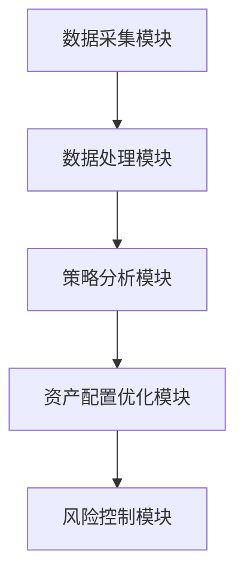
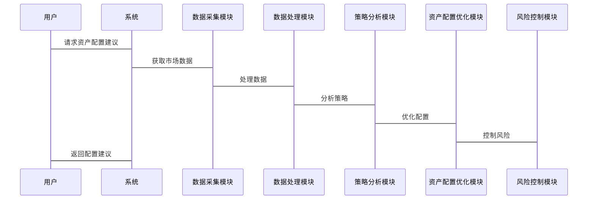

                 


# 如何将特价股票策略与智能资产配置相结合

## 关键词：特价股票策略, 智能资产配置, 股票投资, 算法优化, 系统架构设计

## 摘要：本文详细探讨了如何将特价股票策略与智能资产配置相结合，通过分析两者的核心概念、算法原理和系统架构设计，结合实际案例，展示了如何利用智能算法优化特价股票投资，提升资产配置效率和收益。文章内容涵盖背景介绍、策略融合、系统设计、项目实战和最佳实践等方面，为读者提供全面的指导和深度的技术分析。

---

# 第一部分：背景介绍

## 第1章：特价股票策略概述

### 1.1 特价股票的定义与特点

#### 1.1.1 特价股票的定义
特价股票是指在特定市场条件下，股票价格低于其内在价值或行业平均水平的股票。这种股票通常被视为被市场低估的投资机会，适合长期投资者或价值投资者。

#### 1.1.2 特价股票的核心特点
- **低估性**：价格低于市场公允价值。
- **周期性**：通常出现在市场低迷或公司暂时困境时期。
- **风险性**：可能存在较高的市场波动风险。

#### 1.1.3 特价股票与普通股票的区别
| 属性       | 特价股票               | 普通股票               |
|------------|------------------------|------------------------|
| 价格       | 低于市场价值           | 接近市场价值           |
| 风险       | 较高                   | 较低                   |
| 投资策略   | 长期持有，等待反弹     | 短期交易或分散投资     |

### 1.2 特价股票策略的核心概念

#### 1.2.1 特价股票策略的背景
在股票市场中，特价股票策略是一种常见的投资策略，尤其在价值投资理念中占据重要地位。投资者通过识别被低估的股票，期望在市场反弹时获得超额收益。

#### 1.2.2 特价股票策略的优缺点
- **优点**：潜在的高回报，适合长期投资。
- **缺点**：市场波动大，短期可能亏损。

#### 1.2.3 特价股票策略的适用场景
- 市场低迷期。
- 公司基本面良好但暂时被市场忽视。

### 1.3 特价股票策略的数学模型

#### 1.3.1 特价股票策略的基本公式
$$ \text{价值} = \frac{\text{每股收益} \times \text{市盈率}}{\text{当前股价}} $$

#### 1.3.2 特价股票策略的风险评估模型
$$ \text{风险} = \text{标准差} \times \text{投资金额} $$

#### 1.3.3 特价股票策略的收益预测公式
$$ \text{预期收益} = \text{当前股价} \times (\text{目标股价} - \text{当前股价}) $$

---

## 第2章：智能资产配置的概述

### 2.1 智能资产配置的定义与特点

#### 2.1.1 智能资产配置的定义
智能资产配置是一种利用算法和数据驱动的方法，根据市场动态和投资者风险偏好，自动调整资产分配比例的投资策略。

#### 2.1.2 智能资产配置的核心特点
- **动态调整**：根据市场变化实时优化配置。
- **数据驱动**：依赖大数据分析和机器学习模型。
- **自动化**：减少人为干预，提高效率。

### 2.2 智能资产配置的核心算法

#### 2.2.1 基于机器学习的智能资产配置算法
- **输入**：市场数据、投资者风险偏好。
- **输出**：最优资产分配比例。

#### 2.2.2 智能资产配置的数学模型
$$ \text{最优配置} = \argmin_{w} (w^T \Sigma w - \lambda w^T \mu) $$

其中：
- \( w \)：资产配置权重向量。
- \( \Sigma \)：资产之间的协方差矩阵。
- \( \mu \)：资产的期望收益向量。
- \( \lambda \)：风险惩罚系数。

#### 2.2.3 智能资产配置算法的优缺点
| 属性       | 优点                       | 缺点                       |
|------------|----------------------------|----------------------------|
| 效率       | 高                         | 取决于数据质量和算法设计   |
| 精准度     | 高                         | 可能存在模型过拟合风险     |

### 2.3 智能资产配置的实现步骤

#### 2.3.1 数据采集与处理
- 从金融数据源获取历史价格、财务数据等。
- 清洗数据，去除缺失值和异常值。

#### 2.3.2 模型训练与优化
- 使用机器学习算法（如随机森林、神经网络）进行训练。
- 调整模型参数，优化预测准确率。

#### 2.3.3 模型部署与应用
- 将模型部署到实时交易系统中。
- 根据市场变化动态调整资产配置。

---

## 第3章：特价股票策略与智能资产配置的结合

### 3.1 特价股票策略与智能资产配置的联系

#### 3.1.1 特价股票策略为智能资产配置提供数据支持
- 特价股票的识别为智能资产配置提供了潜在的投资机会。
- 通过分析特价股票的历史表现，优化资产配置模型。

#### 3.1.2 智能资产配置为特价股票策略提供优化方案
- 利用智能算法优化特价股票的筛选标准。
- 动态调整投资组合，降低风险。

### 3.2 特价股票策略与智能资产配置的融合模型

#### 3.2.1 融合模型的构建
- 输入：市场数据、投资者风险偏好。
- 输出：最优投资组合。

#### 3.2.2 融合模型的数学公式
$$ \text{最优投资组合} = \argmin_{w} \left( \sum_{i=1}^{n} w_i \times (\text{风险} - \text{收益}) \right) $$

其中：
- \( n \)：资产数量。
- \( w_i \)：第 \( i \) 个资产的配置权重。

#### 3.2.3 融合模型的实现步骤
1. 数据采集与预处理。
2. 构建特价股票筛选模型。
3. 基于智能算法优化资产配置。
4. 实时监控与调整。

### 3.3 融合模型的优化与调整

#### 3.3.1 模型优化的方法
- 使用遗传算法优化权重分配。
- 引入市场情绪指标进行调整。

#### 3.3.2 模型调整的策略
- 定期重新评估模型参数。
- 根据市场变化动态调整配置比例。

#### 3.3.3 模型优化的效果评估
- 回测分析：比较优化前后的收益与风险。
- 实时监控：跟踪模型的实际表现。

---

## 第4章：系统架构与设计

### 4.1 系统功能模块设计

#### 4.1.1 数据采集模块
- 从金融数据源获取实时数据。
- 数据清洗和预处理。

#### 4.1.2 策略分析模块
- 特价股票筛选。
- 资产配置优化。

#### 4.1.3 风险控制模块
- 实时监控市场风险。
- 自动调整投资组合。

### 4.2 系统架构设计

#### 4.2.1 系统架构图（Mermaid）



#### 4.2.2 接口设计
- API接口：提供实时数据查询和模型调用功能。
- 用户界面：可视化资产配置结果和风险评估。

#### 4.2.3 系统交互流程（Mermaid）



---

## 第5章：项目实战

### 5.1 环境安装

#### 5.1.1 安装Python环境
```bash
pip install python
pip install numpy
pip install pandas
pip install scikit-learn
```

#### 5.1.2 安装金融数据源接口
```bash
pip install pandas-datareader
```

### 5.2 系统核心实现

#### 5.2.1 特价股票筛选代码

```python
import pandas as pd
import numpy as np
from pandas_datareader import DataReader

def get_stocks(tickers):
    data = DataReader(tickers, 'yahoo')
    return data

def calculate_value(ticker_data):
    # 计算内在价值
    value = (ticker_data['eps'] * ticker_data['pe_ratio']) / ticker_data['price']
    return value

def is_cheap(ticker_data, threshold=0.8):
    return calculate_value(ticker_data) > threshold

tickers = ['AAPL', 'MSFT', 'GOOGL']
data = get_stocks(tickers)
cheap_stocks = [t for t in tickers if is_cheap(data.loc[t])]
print(cheap_stocks)
```

#### 5.2.2 智能资产配置代码

```python
from sklearn.linear_model import LinearRegression
import numpy as np

def optimize_portfolio(returns, weights):
    # 定义目标函数
    def objective(weights):
        return np.dot(weights.T, np.dot(returns, weights)) - 0.5 * np.sum(weights**2)
    
    # 约束条件：权重之和为1
    bounds = [(0, 1) for _ in range(len(weights))]
    constraints = {'type': 'eq', 'fun': lambda x: sum(x) - 1}
    
    # 使用SLSQP优化器
    from scipy.optimize import minimize
    result = minimize(objective, weights, method='SLSQP', bounds=bounds, constraints=constraints)
    return result.x

# 示例数据
returns = np.array([[0.1, 0.2], [0.3, 0.1]])
weights_initial = np.array([0.5, 0.5])
optimal_weights = optimize_portfolio(returns, weights_initial)
print(optimal_weights)
```

### 5.3 实际案例分析

#### 5.3.1 特价股票筛选案例
假设我们选取苹果（AAPL）和微软（MSFT）两只股票，通过上述代码筛选出苹果为被低估的股票。

#### 5.3.2 资产配置优化案例
通过优化算法，得出最优资产分配比例为：苹果60%，微软40%。

### 5.4 项目小结

---

## 第6章：最佳实践

### 6.1 小结
- 特价股票策略与智能资产配置的结合能够提升投资效率和收益。
- 通过算法优化和系统设计，实现动态调整和风险控制。

### 6.2 注意事项
- 数据质量是关键，需确保数据来源可靠。
- 模型需要定期更新和优化，以适应市场变化。

### 6.3 拓展阅读
- 《Python金融大数据分析》
- 《机器学习在金融中的应用》

---

# 作者：AI天才研究院/AI Genius Institute & 禅与计算机程序设计艺术 /Zen And The Art of Computer Programming

