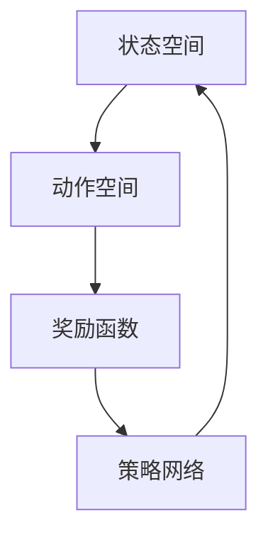
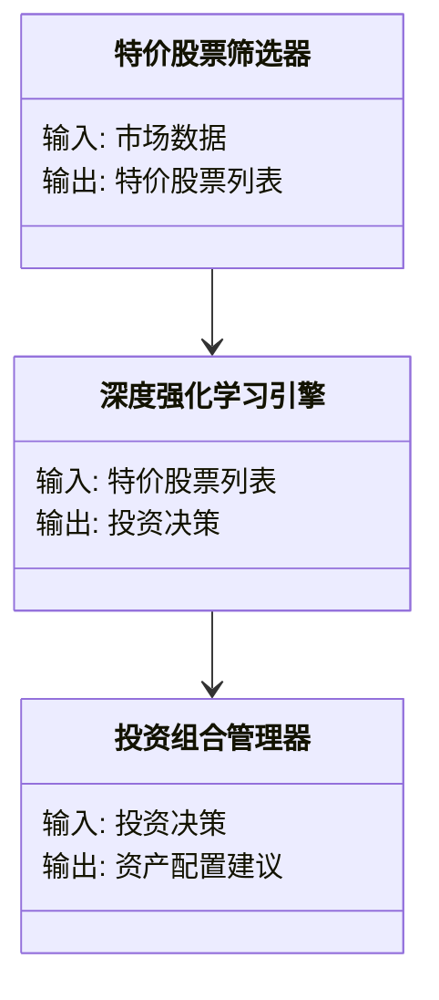
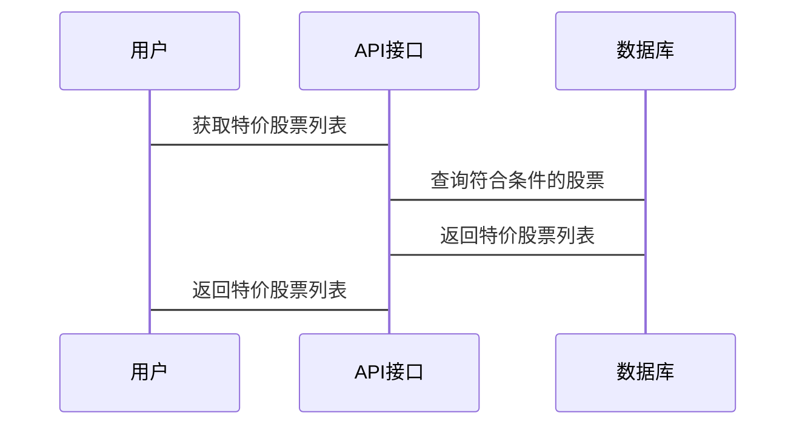

                 

<think>
好，我需要为《如何将特价股票策略与深度强化学习资产配置相结合》这本书撰写目录大纲。首先，我要理解这本书的核心主题。特价股票策略指的是在特定条件下购买股票以获得折扣，而深度强化学习则是一种机器学习方法，用于决策过程。将两者结合，可以利用深度强化学习优化特价股票的投资策略。

接下来，我需要考虑这本书的结构。通常，技术书籍会分为几个部分，比如基础、原理、算法、系统设计、实战和总结等。根据用户提供的示例，目录需要有背景介绍、核心概念、算法原理、系统分析、项目实战和小结等部分。

第一章将介绍特价股票策略和深度强化学习的基本概念。首先，我需要定义特价股票和深度强化学习，解释它们各自的特点和应用场景。然后，我需要说明两者结合的意义，比如如何利用深度强化学习提高特价股票的投资效率。

第二章将详细讲解核心概念，包括特价股票策略和深度强化学习的核心要素。我需要对比分析两者的决策过程，讨论它们的优缺点，并说明它们如何相互作用。例如，特价股票策略可能需要实时数据和市场分析，而深度强化学习可以提供实时决策支持。

第三章将聚焦深度强化学习的算法原理。我需要选择几种常用的算法，如DQN和PPO，并用mermaid流程图展示它们的工作流程。同时，数学模型和公式也是不可或缺的，比如Q-learning的更新公式。这部分需要详细解释每个算法的步骤，并用实例说明其应用。

第四章将进行系统分析与架构设计。我需要描述如何构建一个结合特价股票策略的系统，包括功能设计和架构图。可能使用领域模型的mermaid类图和系统架构的mermaid架构图，展示系统各部分的交互和关系。

第五章是项目实战。我需要提供一个具体的案例，从环境安装到代码实现，详细解读每一步的实现细节。例如，如何训练一个DQN模型来选择特价股票。同时，还需要分析案例结果，并讨论其对投资策略的影响。

最后，第六章将总结全书内容，提出小结和最佳实践。我需要总结前面各章的主要观点，强调两者的结合优势，并给出实际应用中的注意事项。同时，可以展望未来的研究方向，如更复杂的市场模型或多目标优化策略。

在撰写过程中，我需要确保每个部分都细化到三级目录，使用清晰的标题和简明的解释。同时，要包含必要的图表和公式，如mermaid流程图和latex数学公式。这不仅能帮助读者理解，还能提升文章的可读性和专业性。

总的来说，这本书的目录需要全面覆盖特价股票策略和深度强化学习的各个方面，从理论到实践，从基础到高级，帮助读者系统地掌握如何将两者结合应用于资产配置。确保每个章节之间逻辑连贯，内容详实，满足读者的需求。
</think>

# 如何将特价股票策略与深度强化学习资产配置相结合

> 关键词：特价股票，深度强化学习，资产配置，股票策略，强化学习

> 摘要：本文将详细介绍如何将特价股票策略与深度强化学习资产配置相结合，从理论基础到实际应用，分析其优势与挑战，探讨其对投资决策的影响。

---

# 第一部分: 特价股票策略与深度强化学习的背景介绍

## 第1章: 特价股票策略与深度强化学习的背景

### 1.1 特价股票策略的基本概念

#### 1.1.1 特价股票的定义与类型
特价股票是指在特定市场条件下，价格低于其内在价值的股票。主要类型包括周期性股票、价值型股票和困境反转股票。

#### 1.1.2 特价股票的市场特点
市场波动性大、周期性明显、风险与收益并存。

#### 1.1.3 特价股票策略的核心目标
通过低价买入高价卖出，实现超额收益。

### 1.2 深度强化学习的基本概念

#### 1.2.1 强化学习的定义与特点
强化学习是一种通过试错和奖励机制来优化决策过程的学习方法。

#### 1.2.2 深度强化学习的原理
结合深度学习和强化学习，利用神经网络处理复杂状态并优化策略。

#### 1.2.3 深度强化学习在金融领域的应用
广泛应用于股票交易、投资组合管理和风险管理。

### 1.3 特价股票策略与深度强化学习的结合意义

#### 1.3.1 传统股票策略的局限性
依赖经验、主观判断强、适应性差。

#### 1.3.2 深度强化学习在股票策略中的优势
自动化决策、适应性强、处理复杂状态能力突出。

#### 1.3.3 两者的结合对企业投资的价值
提升决策效率、优化投资组合、降低投资风险。

### 1.4 本章小结
总结特价股票策略与深度强化学习的基本概念及其结合的意义。

---

# 第二部分: 特价股票策略与深度强化学习的核心概念

## 第2章: 特价股票策略与深度强化学习的核心要素

### 2.1 特价股票策略的核心要素

#### 2.1.1 特价股票的筛选标准
市盈率、市净率、股息率等财务指标。

#### 2.1.2 特价股票的市场周期分析
经济周期、行业周期、公司周期的影响。

#### 2.1.3 特价股票的风险评估
市场风险、流动性风险、公司基本面风险。

### 2.2 深度强化学习的核心原理

#### 2.2.1 强化学习的基本框架
环境、状态、动作、奖励、策略。

#### 2.2.2 深度神经网络在强化学习中的作用
处理高维状态空间，近似值函数或策略函数。

#### 2.2.3 策略网络与价值网络的对比
策略网络直接输出动作，价值网络评估状态价值。

### 2.3 两者的结合：概念对比与联系

#### 2.3.1 特价股票策略的决策树模型
树状结构分析可能的决策路径。

#### 2.3.2 深度强化学习的决策过程
基于状态和动作的连续优化过程。

#### 2.3.3 两者的结合对企业投资决策的影响
通过强化学习优化特价股票策略的执行效率。

### 2.4 核心概念对比分析

#### 2.4.1 特价股票策略与传统股票策略的对比
基于价值 vs 基于趋势，主动管理 vs 被动管理。

#### 2.4.2 深度强化学习与传统机器学习的对比
在线学习 vs 离线学习，策略优化 vs 模型预测。

#### 2.4.3 两者的结合对企业投资决策的优化作用
提高决策效率，增强策略适应性，降低投资风险。

### 2.5 本章小结
总结特价股票策略与深度强化学习的核心概念及其联系。

---

# 第三部分: 深度强化学习算法原理与数学模型

## 第3章: 深度强化学习算法原理与数学模型

### 3.1 深度强化学习的核心算法

#### 3.1.1 Q-learning算法
通过Q表记录状态-动作对的期望奖励，更新公式为：
$$ Q(s, a) = Q(s, a) + \alpha (r + \gamma \max Q(s', a') - Q(s, a)) $$

#### 3.1.2 Deep Q-Networks (DQN)
利用深度神经网络近似Q函数，解决高维状态空间问题。

#### 3.1.3 Policy Gradients (PG)
通过优化策略直接更新动作概率分布，公式为：
$$ \nabla \theta = \frac{1}{n} \sum_{i=1}^{n} \nabla \log \pi_\theta(a|s) Q(s,a) $$

### 3.2 算法原理的mermaid流程图


### 3.3 数学模型的详细解释

#### 3.3.1 Q-learning的数学模型
状态-动作价值函数的更新公式：
$$ Q(s, a) = (1-\alpha) Q(s, a) + \alpha (r + \gamma Q(s', a')) $$

#### 3.3.2 DQN的网络结构
输入层 → 隐藏层 → 输出层，输出为Q值。

#### 3.3.3 PG的优化目标
最大化策略的期望奖励：
$$ \mathcal{L} = -\mathbb{E}[\log \pi(a|s) Q(s,a)] $$

### 3.4 本章小结
总结深度强化学习的核心算法及其数学模型。

---

# 第四部分: 系统分析与架构设计方案

## 第4章: 系统分析与架构设计

### 4.1 问题场景介绍

#### 4.1.1 项目背景
构建一个基于深度强化学习的特价股票投资系统。

#### 4.1.2 项目目标
实现自动化的特价股票筛选与投资决策。

### 4.2 系统功能设计

#### 4.2.1 领域模型的mermaid类图


#### 4.2.2 系统架构的mermaid架构图


### 4.3 系统接口设计

#### 4.3.1 API接口设计
RESTful API，如GET /stocks?price<10。

#### 4.3.2 数据接口设计
数据源：数据库、API接口、文件。

### 4.4 系统交互的mermaid序列图


### 4.5 本章小结
总结系统设计的核心架构和接口设计。

---

# 第五部分: 项目实战

## 第5章: 项目实战

### 5.1 环境安装

#### 5.1.1 安装Python环境
使用Anaconda或virtualenv管理环境。

#### 5.1.2 安装深度学习框架
TensorFlow或PyTorch。

#### 5.1.3 安装其他依赖库
numpy、pandas、scikit-learn。

### 5.2 系统核心实现源代码

#### 5.2.1 特价股票筛选器的实现
```python
import pandas as pd
import numpy as np

def filter_cheap_stocks(data, threshold=10):
    return data[data['price'] < threshold]
```

#### 5.2.2 深度强化学习引擎的实现
```python
import tensorflow as tf
from tensorflow.keras import layers

model = tf.keras.Sequential([
    layers.Dense(64, activation='relu'),
    layers.Dense(1, activation='linear')
])
```

### 5.3 代码应用解读与分析

#### 5.3.1 特价股票筛选器的解读
根据设定的价格阈值，筛选出符合条件的股票。

#### 5.3.2 深度强化学习引擎的解读
使用神经网络模型预测股票的价值。

### 5.4 实际案例分析

#### 5.4.1 数据准备
加载历史股票数据，进行数据清洗和特征工程。

#### 5.4.2 模型训练
使用训练数据训练深度强化学习模型。

#### 5.4.3 模型评估
通过回测分析模型的收益和风险。

### 5.5 本章小结
总结项目实战的核心步骤和实现细节。

---

# 第六部分: 小结与最佳实践

## 第6章: 小结与最佳实践

### 6.1 本章小结

#### 6.1.1 核心内容回顾
如何将特价股票策略与深度强化学习结合，提升投资决策效率。

#### 6.1.2 实践中的注意事项
数据质量、模型调参、风险控制。

### 6.2 最佳实践 tips

#### 6.2.1 数据处理
确保数据的完整性和准确性。

#### 6.2.2 模型优化
使用交叉验证和超参数调优。

#### 6.2.3 风险管理
设置止损和止盈机制，分散投资风险。

### 6.3 未来研究方向

#### 6.3.1 更复杂的市场模型
引入更多市场因子和非线性关系。

#### 6.3.2 多目标优化
考虑风险、收益、流动性等多目标优化。

### 6.4 本章小结
总结全文，强调深度强化学习在资产配置中的潜力和挑战。

---

作者：AI天才研究院/AI Genius Institute & 禅与计算机程序设计艺术 /Zen And The Art of Computer Programming

---

# 结语

通过将特价股票策略与深度强化学习相结合，企业可以更高效地优化资产配置，提升投资收益。然而，这一过程仍面临诸多挑战，需要持续的研究和实践。希望本文能为读者提供有价值的参考和启发。

