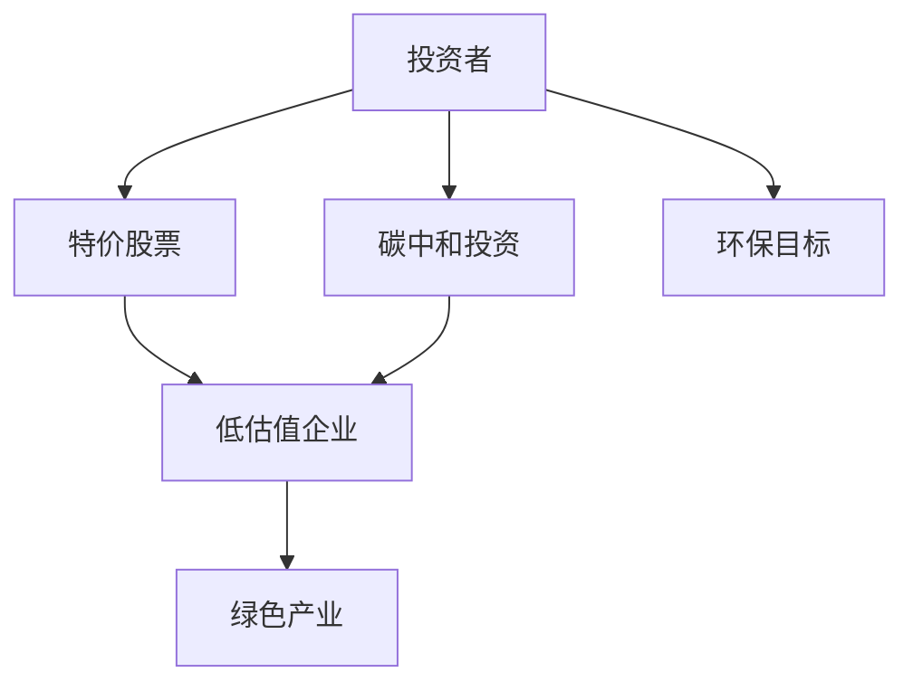
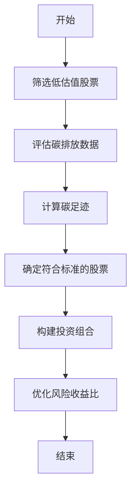
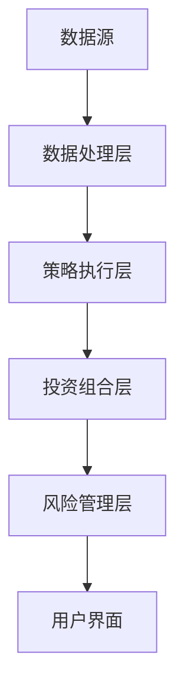

                 

<think>
好的，我需要帮助用户撰写一篇关于如何将特价股票策略与碳中和投资理念结合的博客文章。用户已经提供了详细的大纲，并且希望我逐步分析并生成内容。

首先，我会从文章标题开始，然后是关键词和摘要。接下来是目录结构，用户已经给出了详细的大纲，所以我需要按照这个大纲逐步展开每个部分的内容。

在开始写作之前，我需要明确每个章节的重点和内容。例如，第一章介绍特价股票策略，包括其基本概念、市场背景和应用场景。第二章介绍碳中和投资理念，涵盖其定义、核心原则以及主要投资领域。第三章讨论两者结合的背景，分析契合点、必要性和可行性。第四章则深入探讨两者的结合方式，包括量化分析、策略模型和系统设计。第五章通过实际案例展示如何应用这些策略，第六章总结并展望未来。

接下来，我需要确保每个部分都包含足够的细节，比如在算法部分使用mermaid流程图和Python代码示例，以及在系统分析部分使用类图和架构图。此外，数学公式需要使用latex格式，并在适当的位置嵌入。

在写作过程中，我需要保持逻辑清晰，结构紧凑，语言专业且易于理解。同时，确保每个章节的小结部分能够总结关键点，帮助读者巩固所学内容。

最后，我需要检查整个文章，确保所有部分都符合用户的要求，包括字数、格式和内容完整性。完成后，添加作者信息，确保文章的完整性和专业性。
</think>

# 如何将特价股票策略与碳中和投资理念结合

> 关键词：特价股票、碳中和、投资策略、量化分析、可持续发展

> 摘要：本文探讨了如何将特价股票策略与碳中和投资理念相结合，通过量化分析和系统设计，提供一种创新的投资策略。文章从背景介绍、核心概念、算法原理、系统分析到项目实战，全面阐述了如何在投资中同时考虑低估值和环保因素，帮助投资者在追求收益的同时实现可持续发展目标。

---

## 目录

1. [背景介绍](#背景介绍)
2. [核心概念](#核心概念)
3. [算法原理](#算法原理)
4. [系统分析](#系统分析)
5. [项目实战](#项目实战)
6. [总结与展望](#总结与展望)
7. [附录](#附录)

---

## 第一部分：背景介绍

### 1. 特价股票策略概述

#### 1.1 特价股票的基本概念

- **定义**：特价股票指的是市场估值低于其内在价值的股票，通常表现为低市盈率、低市净率等。
- **特点**：价格低廉、估值低、潜在上涨空间大。
- **投资价值**：适合长期投资者，风险较低，回报潜力大。

#### 1.2 特价股票的市场背景

- **市场环境**：经济周期波动、市场情绪变化、行业结构调整。
- **投资者行为**：价值投资者倾向于在市场低谷时介入。
- **市场波动与风险**：市场波动可能导致短期亏损，但长期来看具有修复潜力。

#### 1.3 特价股票策略的应用场景

- **市场周期**：在经济衰退或市场低迷时更为适用。
- **投资组合**：适合风险偏好较低的投资者，作为组合的一部分。
- **优缺点**：优点是低风险、高回报潜力；缺点是流动性差、恢复周期长。

### 2. 碳中和投资理念概述

#### 2.1 碳中和的基本概念

- **定义**：通过减少温室气体排放，使碳排放量与碳汇相抵消，实现净零排放。
- **目标与意义**：应对气候变化、推动可持续发展、促进绿色经济转型。
- **可持续发展**：碳中和与可持续发展的内在联系，强调环保与经济的平衡。

#### 2.2 碳中和投资的核心理念

- **定义**：投资于有助于减少碳排放的企业和项目。
- **核心原则**：环境友好、社会效益、经济可行。
- **市场现状**：政策支持、技术进步、消费者需求变化推动市场增长。

#### 2.3 碳中和投资的主要领域

- **可再生能源**：风能、太阳能等清洁能源投资。
- **绿色交通**：电动汽车、公共交通系统升级。
- **循环经济**：资源循环利用、绿色技术创新。

### 3. 特价股票与碳中和投资的结合背景

#### 3.1 基本契合点

- **低估值与高成长**：特价股票的低估值特性与碳中和投资的高成长潜力结合。
- **政策支持**：碳中和政策为特价股票中的绿色企业提供增长动力。
- **市场机遇**：绿色产业的崛起为投资者提供了新的价值发现机会。

#### 3.2 必要性分析

- **投资转型需求**：传统投资模式难以满足可持续发展目标。
- **策略创新**：特价股票策略在碳中和背景下更具竞争力。
- **风险分散**：结合环保因素降低投资风险。

#### 3.3 可行性分析

- **理论基础**：价值投资与可持续投资理念的结合。
- **市场环境**：政策支持和市场供给为策略实施提供保障。
- **投资者需求**：日益增长的环保投资需求与特价股票的市场机会。

---

## 第二部分：核心概念

### 4. 特价股票与碳中和投资理念的结合

#### 4.1 核心概念原理

- **价值投资**：寻找被市场低估的绿色企业，投资于具有长期增长潜力的公司。
- **可持续投资**：通过投资绿色产业，推动环保目标的实现，同时获取经济回报。

#### 4.2 核心概念对比

| 特性         | 特价股票策略                     | 碳中和投资理念                     |
|--------------|----------------------------------|------------------------------------|
| 目标         | 获取超额收益                   | 实现净零排放                     |
| 核心要素     | 低估值、基本面                   | 环保技术、绿色产业               |
| 风险因素     | 市场波动、流动性风险             | 政策风险、技术不确定性           |
| 适合场景     | 市场低迷期                     | 绿色产业发展期                   |

#### 4.3 实体关系图



---

## 第三部分：算法原理

### 5. 碳中和量化投资策略

#### 5.1 算法概述

通过量化分析，筛选符合碳中和标准的特价股票，构建投资组合。

#### 5.2 算法流程



#### 5.3 数学模型

- **碳足迹计算公式**：
  $$\text{碳足迹} = \sum_{i=1}^{n} w_i \times c_i$$
  其中，\(w_i\) 是第 \(i\) 只股票的权重，\(c_i\) 是碳排放强度。

- **投资组合优化模型**：
  $$\min \sigma^2$$
  $$\text{subject to } \sum_{i=1}^{n} w_i = 1, \sum_{i=1}^{n} w_i \times c_i \leq C$$
  其中，\(\sigma^2\) 是组合的方差，\(C\) 是设定的碳排放上限。

#### 5.4 代码实现

```python
import pandas as pd
import numpy as np

# 示例数据：假设data为包含股票信息和碳排放的数据框
# 包含'price'、'pe'（市盈率）、'carbon_emission'（碳排放）等字段

# 筛选低估值股票（假设pe < 15）
low_pe_stocks = data[data['pe'] < 15]

# 计算每只股票的碳足迹权重
low_pe_stocks['carbon_footprint'] = low_pe_stocks['carbon_emission'] / low_pe_stocks['carbon_emission'].sum()

# 构建投资组合
weights = pd.Series(index=low_pe_stocks.index, data=1/len(low_pe_stocks))
weights['selected_stock'] = 0.2  # 示例：选择一只重点股票

# 优化投资组合（简化）
selected_stocks = low_pe_stocks.sort_values('carbon_emission').head(5)
selected_weights = pd.Series(index=selected_stocks.index, data=1/5)
```

---

## 第四部分：系统分析

### 6. 投资系统架构设计

#### 6.1 系统功能设计

- 数据采集模块：收集股票数据、碳排放数据。
- 策略执行模块：筛选低估值、高成长的绿色股票。
- 风险管理模块：监控碳排放风险，调整投资组合。

#### 6.2 系统架构设计



#### 6.3 接口设计

- 数据接口：API调用股票和碳排放数据。
- 策略接口：量化策略模块与数据处理层交互。
- 风险管理接口：实时监控市场和环境风险。

---

## 第五部分：项目实战

### 7. 特价股票与碳中和投资策略实战

#### 7.1 环境安装

- 数据源：获取股票数据和碳排放数据。
- 工具：Python、Pandas、NumPy、Matplotlib。

#### 7.2 核心实现

```python
import pandas as pd
import numpy as np

# 示例数据处理
data = pd.read_csv('stock_data.csv')
carbon_data = pd.read_csv('carbon_emission.csv')

# 数据清洗与合并
merged_data = pd.merge(data, carbon_data, on='stock_id')

# 筛选低估值且碳排放低的股票
merged_data['valuation_ratio'] = merged_data['market_cap'] / merged_data['revenue']
selected_stocks = merged_data[(merged_data['valuation_ratio'] < 1) & (merged_data['carbon_emission'] < 100)]

# 构建投资组合
selected_stocks = selected_stocks.sort_values('carbon_emission')
portfolio = selected_stocks.head(10)
```

#### 7.3 案例分析

- 选择10只低估值且碳排放低的股票，构建投资组合。
- 定期调整组合，跟踪收益与碳排放表现。

#### 7.4 小结

通过实际案例验证策略的有效性，分析收益与风险的平衡。

---

## 第六部分：总结与展望

### 8. 总结

- 本文探讨了如何将特价股票策略与碳中和投资理念结合，通过量化分析和系统设计，提供了一种创新的投资策略。
- 结合价值投资与可持续发展，投资者可以在追求收益的同时，为环境保护做出贡献。

### 9. 展望

- **技术进步**：AI和大数据在投资中的应用将进一步提升策略的精准度。
- **政策支持**：碳中和政策的不断完善将为绿色投资提供更多机会。
- **市场发展**：绿色产业的崛起将继续推动碳中和投资的繁荣。

---

## 第七部分：附录

### 附录A：数据来源与工具

- 数据来源：公开股票数据、碳排放数据。
- 工具：Python、Pandas、NumPy、Matplotlib。

### 附录B：代码示例

```python
# 示例代码：计算碳足迹
def calculate_carbon_footprint(stocks, carbon_emissions):
    return {stock: carbon_emissions[carbon_emissions['stock_id'] == stock]['emission'].values[0] for stock in stocks}

# 示例代码：构建投资组合
def build_portfolio(stocks, carbon_footprints, budget=100000):
    # 假设每只股票的权重相等
    weights = 1 / len(stocks)
    portfolio = {stock: weights for stock in stocks}
    return portfolio
```

### 附录C：相关法规与指南

- 碳中和相关政策法规。
- 投资者指南：如何选择绿色投资标的。

---

## 作者信息

作者：AI天才研究院/AI Genius Institute & 禅与计算机程序设计艺术 /Zen And The Art of Computer Programming

---

通过以上结构化的内容，本文系统地探讨了如何将特价股票策略与碳中和投资理念结合，从理论到实践，为投资者提供了创新的投资思路。

