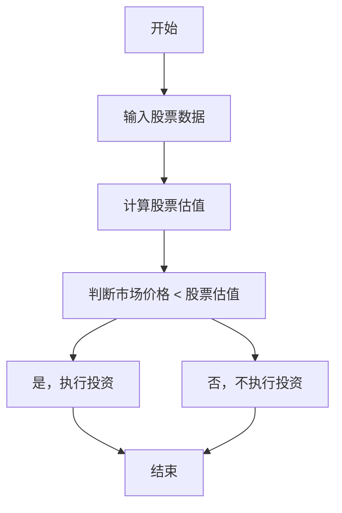
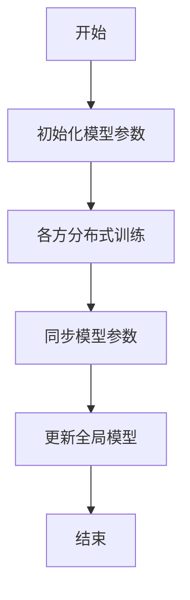
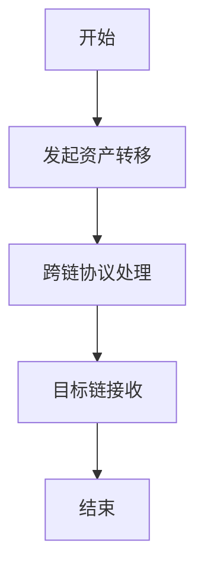
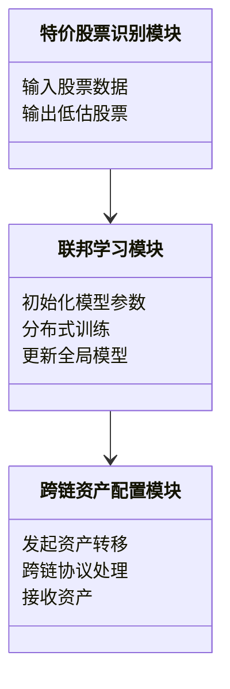
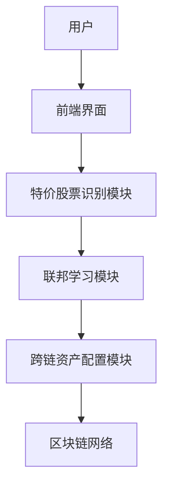

                 


# 如何将特价股票策略与联邦学习跨链资产配置相结合

> 关键词：特价股票策略，联邦学习，跨链资产配置，分布式计算，区块链技术

> 摘要：本文将详细介绍如何将特价股票策略与联邦学习跨链资产配置相结合。首先，我们将从特价股票策略的基本概念和联邦学习跨链技术的核心原理入手，分析两者的核心思想和实现方式。接着，我们将探讨联邦学习跨链技术在资产配置中的应用，以及如何利用这种技术实现跨链资产的优化配置。最后，我们将通过具体的算法实现和系统设计，展示如何将这种结合应用到实际投资中，实现高效、安全、可靠的资产配置。

---

# 第一部分: 特价股票策略与联邦学习跨链资产配置背景

## 第1章: 特价股票策略的基本概念

### 1.1 特价股票的定义与特点

- **特价股票**：是指那些市场价格低于其内在价值的股票。这种股票通常被市场低估，具有较高的投资潜力。
- **特点**：
  - 市场价格 < 内在价值
  - 通常出现在市场低迷或公司暂时遇到困难时
  - 具有较高的安全边际

### 1.2 特价股票策略的核心思想

- **核心思想**：通过识别市场价格低于内在价值的股票，进行长期投资，等待市场价格回归内在价值。
- **实现方法**：
  - 建立股票估值模型
  - 识别市场价格低于估值的股票
  - 进行长期投资

### 1.3 特价股票策略在投资中的应用

- **应用领域**：股票市场投资、价值投资策略、风险管理
- **应用场景**：市场低迷、公司困境、行业周期性低谷

---

## 第2章: 联邦学习与跨链技术的核心概念

### 2.1 联邦学习的基本概念

- **联邦学习**：是一种分布式机器学习技术，允许多个参与方在不共享原始数据的情况下，共同训练一个模型。
- **特点**：
  - 数据不集中
  - 模型参数共享
  - 高效计算

### 2.2 跨链技术的基本概念

- **跨链技术**：是指在不同的区块链之间进行资产转移或信息交互的技术。
- **特点**：
  - 资产流通
  - 区块链互操作性
  - 去中心化

### 2.3 联邦学习与跨链技术的结合

- **结合方式**：
  - 联邦学习用于跨链资产配置的优化
  - 跨链技术用于资产的流通与转移
  - 两者结合实现分布式资产配置

---

## 第3章: 特价股票策略与联邦学习跨链资产配置的核心概念对比

### 3.1 特价股票策略与联邦学习的对比

| **对比维度** | **特价股票策略** | **联邦学习** |
|-------------|------------------|--------------|
| **核心目标** | 找到低估股票      | 分布式模型训练 |
| **数据来源** | 股票市场数据      | 各方数据源    |
| **计算方式** | 单点计算         | 分布式计算    |

### 3.2 联邦学习与跨链技术的对比

| **对比维度** | **联邦学习** | **跨链技术** |
|-------------|--------------|--------------|
| **核心目标** | 模型训练      | 资产流通      |
| **技术特点** | 数据隐私保护  | 区块链互操作性 |
| **应用场景** | 金融建模      | 资产配置      |

### 3.3 特价股票策略与联邦学习跨链技术的综合对比

- **核心概念对比**：
  - 特价股票策略关注的是单点资产的低估识别
  - 联邦学习跨链技术关注的是分布式资产配置
- **实现方式对比**：
  - 特价股票策略通过单点模型进行股票估值
  - 联邦学习跨链技术通过分布式模型优化资产配置
- **应用场景对比**：
  - 特价股票策略适用于单点资产投资
  - 联邦学习跨链技术适用于分布式资产配置

---

## 第4章: 特价股票策略与联邦学习跨链资产配置的算法原理

### 4.1 特价股票策略的算法实现

#### 4.1.1 股票价值评估算法



#### 4.1.2 股票价格预测算法

```python
def stock_value_estimation(stock_data):
    # 简单算术平均法
    avg_price = sum(stock_data) / len(stock_data)
    return avg_price
```

#### 4.1.3 特价股票识别算法

```python
def is_discount_stock(stock_price, stock_value):
    if stock_price < stock_value:
        return True
    else:
        return False
```

### 4.2 联邦学习跨链资产配置的算法实现

#### 4.2.1 联邦学习算法



#### 4.2.2 跨链资产流通算法



#### 4.2.3 资产配置优化算法

```latex
$$ \text{优化目标} = \min_{x} \sum_{i=1}^{n} w_i x_i $$
$$ \text{约束条件} = \sum_{i=1}^{n} x_i = 1 $$
```

---

## 第5章: 特价股票策略与联邦学习跨链资产配置的系统设计

### 5.1 问题场景介绍

- **问题场景**：在股票市场中，如何利用联邦学习跨链技术实现分布式资产配置，找到低估股票进行投资。

### 5.2 系统功能设计

#### 5.2.1 系统功能模块



### 5.3 系统架构设计

#### 5.3.1 系统架构图



#### 5.3.2 系统接口设计

- **接口1**：特价股票识别模块与联邦学习模块的接口
- **接口2**：联邦学习模块与跨链资产配置模块的接口
- **接口3**：跨链资产配置模块与区块链网络的接口

#### 5.3.3 系统交互流程


---

## 第6章: 特价股票策略与联邦学习跨链资产配置的项目实战

### 6.1 环境安装

- **安装Python环境**：建议使用Anaconda
- **安装相关库**：numpy, pandas, mermaid, pytorch

### 6.2 核心代码实现

#### 6.2.1 特价股票识别模块

```python
def identify_discount_stocks(stock_data):
    discounted_stocks = []
    for stock in stock_data:
        if stock['price'] < stock['value']:
            discounted_stocks.append(stock['symbol'])
    return discounted_stocks
```

#### 6.2.2 联邦学习模块

```python
def federated_learning(model, data_loaders):
    for data_loader in data_loaders:
        model.train_step(data_loader)
    return model.state_dict()
```

#### 6.2.3 跨链资产配置模块

```python
def cross_chain_asset_allocation/assets):
    for chain in chains:
        chain.transfer_assets(asset)
    return "资产分配完成"
```

### 6.3 案例分析

- **案例背景**：假设我们有一个包含10只股票的股票池，其中3只是低估股票。
- **案例分析步骤**：
  1. 输入股票数据
  2. 识别低估股票
  3. 初始化联邦学习模型
  4. 分布式训练模型
  5. 更新全局模型
  6. 发起资产转移
  7. 跨链协议处理
  8. 接收资产

### 6.4 代码解读与分析

- **代码功能**：实现特价股票识别、联邦学习模型训练、跨链资产分配
- **代码实现**：通过Python代码实现上述功能

---

## 第7章: 总结与展望

### 7.1 总结

- **核心内容总结**：本文详细介绍了如何将特价股票策略与联邦学习跨链资产配置相结合，从核心概念、算法原理到系统设计和项目实战，全面阐述了实现方法。
- **主要收获**：通过本文的学习，读者可以掌握如何利用分布式计算和区块链技术实现高效的资产配置。

### 7.2 展望

- **未来发展方向**：随着区块链技术和分布式计算的不断发展，联邦学习跨链资产配置将在金融领域发挥更大的作用。
- **潜在应用场景**：除了股票投资，还可以应用于其他类型的资产配置，如房地产、债券等。

---

## 第8章: 注意事项与最佳实践

### 8.1 注意事项

- **数据隐私保护**：在联邦学习中，需要注意数据隐私保护
- **跨链技术的安全性**：在跨链资产配置中，需要注意跨链技术的安全性
- **模型优化**：需要不断优化联邦学习模型，提高资产配置的效率

### 8.2 最佳实践

- **定期更新模型**：建议定期更新联邦学习模型，以适应市场变化
- **监控资产分配**：建议实时监控跨链资产分配过程，确保资产安全
- **风险管理**：建议建立完善的风险管理机制，降低投资风险

---

## 第9章: 拓展阅读

### 9.1 推荐书籍

- 《分布式系统：原理与设计》
- 《区块链：技术与应用》
- 《机器学习实战》

### 9.2 推荐博客

- 禅与计算机程序设计艺术
- AI天才研究院
- 联邦学习与跨链技术博客

---

## 作者：AI天才研究院/AI Genius Institute & 禅与计算机程序设计艺术/Zen And The Art of Computer Programming

