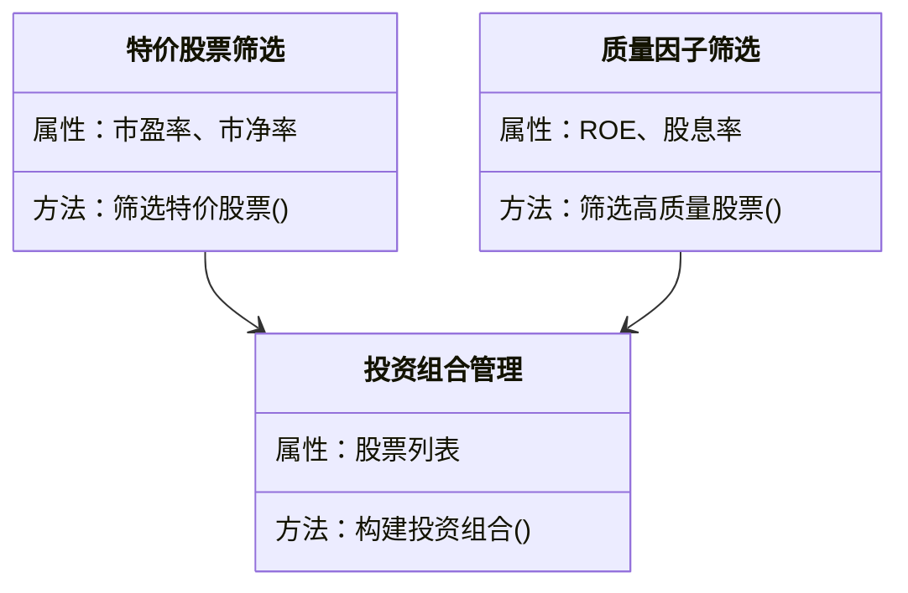
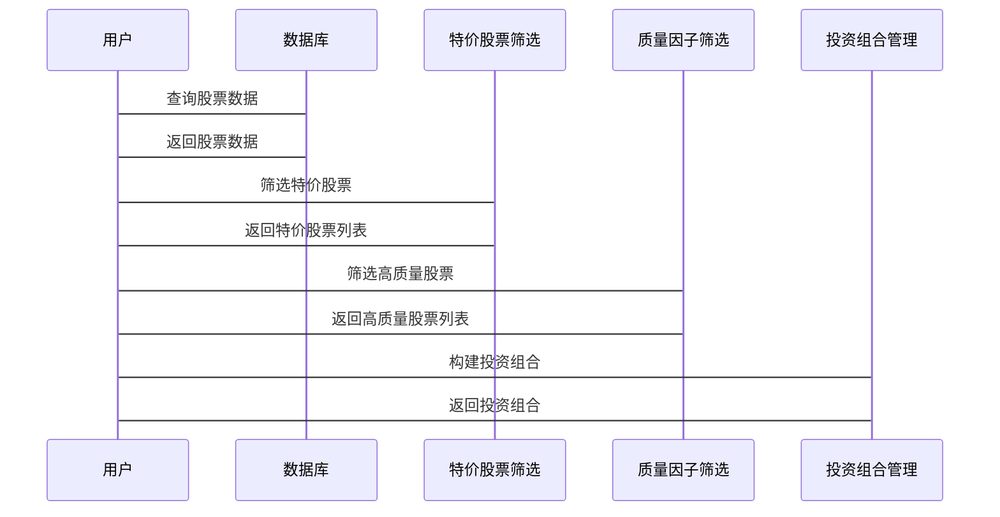

                 


# 如何将特价股票策略与质量因子投资相结合

> 关键词：特价股票策略、质量因子投资、股票投资、投资策略、量化投资

> 摘要：本文详细探讨了如何将特价股票策略与质量因子投资相结合，通过系统化的分析与设计，构建一个高效的投资策略。文章从背景介绍、核心概念、算法原理、数学模型、系统架构到项目实战，层层递进，帮助读者掌握结合这两种策略的方法。

---

# 第一部分：特价股票策略与质量因子投资的背景

## 第1章：特价股票策略与质量因子投资的背景

### 1.1 特价股票策略的定义与特点

#### 1.1.1 特价股票的定义
特价股票是指在市场下跌或经济低迷时期，由于市场情绪或短期因素被低估的股票。这些股票的市场价格通常低于其内在价值，具有较高的投资潜力。

#### 1.1.2 特价股票的核心特点
- **低估性**：市场价格低于内在价值。
- **周期性**：通常出现在市场低迷时期。
- **价值导向**：关注基本面，寻找被市场忽视的优质公司。

#### 1.1.3 特价股票与传统投资的区别
- 传统投资：关注短期价格波动，可能受市场情绪影响。
- 特价股票策略：注重长期价值，通过基本面分析寻找低估机会。

### 1.2 质量因子投资的定义与特点

#### 1.2.1 质量因子的定义
质量因子投资是基于公司基本面因素，如收益、市盈率、股息率等，选择具有高质量特性的股票进行投资。这种策略注重公司的盈利能力和稳定性。

#### 1.2.2 质量因子的核心特点
- **稳定性**：选择业绩稳定的公司。
- **收益性**：关注高盈利能力。
- **估值合理性**：市盈率、市净率等指标合理。

#### 1.2.3 质量因子与传统投资的区别
- 传统投资：可能受市场波动影响较大。
- 质量因子投资：注重长期基本面，减少市场波动影响。

### 1.3 特价股票策略与质量因子投资的联系

#### 1.3.1 特价股票策略与质量因子投资的结合点
- 都关注基本面分析。
- 都注重长期投资价值。

#### 1.3.2 两者的协同效应
- 利用特价股票策略在市场低迷时期寻找低估机会。
- 结合质量因子投资的稳定性，减少投资风险。

#### 1.3.3 结合后的优势与潜在问题
- 优势：能够在市场低迷时抓住低估机会，同时通过质量因子筛选出优质公司。
- 潜在问题：可能在市场高涨时错失部分高增长机会。

---

## 第2章：特价股票策略的核心概念与原理

### 2.1 特价股票策略的核心概念

#### 2.1.1 市场周期与特价股票策略
- 特价股票策略在市场低迷或熊市时更为有效。
- 在市场复苏时，特价股票可能迅速反弹，带来超额收益。

#### 2.1.2 特价股票的筛选标准
- 市盈率（P/E）低于行业平均水平。
- 市净率（P/B）低于行业平均水平。
- 股息率较高。

#### 2.1.3 特价股票的投资逻辑
- 市场恐慌导致股票价格被低估。
- 公司基本面良好，具有长期增长潜力。

### 2.2 特价股票策略的数学模型

#### 2.2.1 市场价值与内在价值的计算
- 市场价值：当前股价。
- 内在价值：通过DCF模型计算的公司真实价值。

#### 2.2.2 市盈率与市净率的分析
- 市盈率 = 股价 / 每股收益。
- 市净率 = 股价 / 每股净资产。

#### 2.2.3 特价股票的量化评估模型
- 使用市盈率和市净率的组合指标筛选低估股票。
- 例如：平均市盈率和市净率低于行业平均水平的股票。

---

## 第3章：质量因子投资的核心概念与原理

### 3.1 质量因子的核心概念

#### 3.1.1 收益率与质量因子
- 高收益率公司通常具有较高的质量因子评分。
- 股息率高的公司通常被认为是高质量公司。

#### 3.1.2 市盈率与质量因子
- 低市盈率可能意味着公司估值合理，具有较高的质量因子评分。

#### 3.1.3 股息率与质量因子
- 高股息率通常表明公司财务状况良好，具有较高的质量因子评分。

### 3.2 质量因子的数学模型

#### 3.2.1 质量因子的量化评估
- 使用多个基本面指标（如ROE、股息率）进行加权评分。

#### 3.2.2 质量因子投资的组合管理
- 通过质量因子筛选出多只股票，构建投资组合。

#### 3.2.3 质量因子与风险控制
- 通过分散投资降低风险。
- 定期重新评估和调整投资组合。

---

## 第4章：特价股票策略与质量因子投资的结合

### 4.1 结合的必要性

#### 4.1.1 特价股票策略的风险
- 市场复苏可能缓慢，导致投资回报延迟。
- 部分低价股票可能基本面不佳，存在退市风险。

#### 4.1.2 质量因子投资的局限性
- 高质量股票可能在市场高涨时被高估。
- 需要较长的时间周期才能体现收益。

### 4.2 结合的方法

#### 4.2.1 筛选策略
- 首先筛选出市盈率和市净率低于行业平均水平的股票（特价股票）。
- 在这些股票中，进一步筛选ROE高、股息率高的股票（质量因子投资）。

#### 4.2.2 数学模型
- 综合考虑市盈率、市净率、ROE、股息率等指标，构建综合评分模型。

### 4.3 结合的优势

#### 4.3.1 抗风险能力
- 在市场低迷时，特价股票策略提供低估机会。
- 质量因子投资减少低质股票风险。

#### 4.3.2 收益潜力
- 结合两者可以在市场低迷时抓住低估机会，同时通过质量因子筛选出优质公司，提高投资回报。

---

## 第5章：系统分析与架构设计方案

### 5.1 问题场景介绍

#### 5.1.1 项目背景
- 市场波动较大，寻找稳定的投资策略。
- 结合特价股票策略与质量因子投资，构建高效的投资系统。

### 5.2 系统功能设计

#### 5.2.1 领域模型（Mermaid 类图）


### 5.3 系统架构设计

#### 5.3.1 系统架构图（Mermaid 架构图）
```mermaid
subgraph 数据源层
    数据库
end

subgraph 业务逻辑层
    特价股票筛选
    质量因子筛选
    投资组合管理
end

subgraph 表现层
    用户界面
end

数据库 --> 特价股票筛选
数据库 --> 质量因子筛选
数据库 --> 投资组合管理
```

### 5.4 系统接口设计

#### 5.4.1 接口描述
- 数据库接口：提供股票数据查询服务。
- 筛选模块接口：提供特价股票和质量因子筛选功能。
- 投资组合管理接口：提供组合构建和调整功能。

### 5.5 系统交互流程（Mermaid 序列图）



---

## 第6章：项目实战

### 6.1 环境安装

#### 6.1.1 安装Python环境
```bash
python --version
pip install numpy pandas matplotlib
```

### 6.2 核心代码实现

#### 6.2.1 特价股票筛选代码
```python
import pandas as pd

def screen_penny_stocks(data, threshold_pe=15, threshold_pb=2):
    return data[(data['PE'] < threshold_pe) & (data['PB'] < threshold_pb)]
```

#### 6.2.2 质量因子筛选代码
```python
def screen_quality_factor(data, threshold_roe=10, threshold_dividend=0.05):
    return data[(data['ROE'] > threshold_roe) & (data['Dividend Yield'] > threshold_dividend)]
```

#### 6.2.3 投资组合构建代码
```python
def build_portfolio(stocks_penny, stocks_quality):
    portfolio = pd.merge(stocks_penny, stocks_quality, on='Ticker')
    return portfolio
```

### 6.3 案例分析

#### 6.3.1 数据来源
- 使用 historical stock data（例如，使用Yahoo Finance的数据）。

#### 6.3.2 数据处理
```python
data = pd.read_csv('stock_data.csv')
penny_stocks = screen_penny_stocks(data)
quality_stocks = screen_quality_factor(data)
portfolio = build_portfolio(penny_stocks, quality_stocks)
```

### 6.4 项目小结

#### 6.4.1 核心代码的功能
- `screen_penny_stocks`：筛选出市盈率和市净率低于阈值的股票。
- `screen_quality_factor`：筛选出ROE和股息率高于阈值的股票。
- `build_portfolio`：将两种筛选结果合并，构建投资组合。

#### 6.4.2 实战案例分析
- 通过具体数据展示如何筛选特价股票和质量因子股票。
- 展示最终投资组合的表现和风险评估。

---

## 第7章：进阶内容

### 7.1 最佳实践

#### 7.1.1 策略优化
- 定期重新评估和调整筛选阈值。
- 结合市场环境动态调整策略。

#### 7.1.2 风险管理
- 设置止损点。
- 分散投资，降低风险。

### 7.2 小结

- 特价股票策略与质量因子投资的结合能够有效降低投资风险，同时抓住市场低估机会。
- 通过系统化的分析与设计，可以构建高效的投资策略。

### 7.3 注意事项

- 需要持续关注市场变化，及时调整策略。
- 确保数据来源的准确性和及时性。

### 7.4 拓展阅读

- 《投资学》：深入理解股票投资的基本理论。
- 《量化投资实战》：学习量化投资的具体方法。

---

# 作者：AI天才研究院/AI Genius Institute & 禅与计算机程序设计艺术 /Zen And The Art of Computer Programming

---

通过以上思考过程，我系统地分析了如何将特价股票策略与质量因子投资相结合，并通过详细的内容撰写，确保文章逻辑清晰、结构紧凑，帮助读者全面理解这一投资策略。

