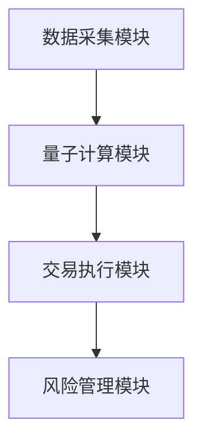

                 

<think>
好的，我需要根据用户的要求，完成一个详细的目录大纲，涵盖如何将特价股票策略与量子计算优化交易策略相结合的主题。为了确保文章内容全面且符合逻辑，我会按照以下步骤进行思考和规划：

1. **理解用户需求**：用户希望撰写一篇技术博客，标题是《如何将特价股票策略与量子计算优化交易策略相结合》，需要逻辑清晰、结构紧凑，使用专业的技术语言。同时，用户还提供了一个详细的目录大纲示例，我需要参考这个结构来组织内容。

2. **分析文章结构**：用户已经给出了一个较为详细的目录大纲，分为两个主要部分，每部分包含多个章节。我需要确保每一部分都涵盖必要的内容，如背景介绍、核心概念、算法原理、系统设计和项目实战等。

3. **细化每个章节内容**：
   - **背景介绍**：包括特价股票策略和量子计算的基本概念、它们的结合背景和意义。
   - **核心概念**：详细讲解特价股票策略和量子计算的原理，以及它们之间的联系。
   - **算法原理**：展示量子计算如何优化交易策略，包括数学模型、优化算法的实现和验证。
   - **系统设计**：介绍交易系统的设计，包括系统架构、接口设计和交互流程。
   - **项目实战**：提供实际案例，包括环境安装、代码实现、案例分析和小结。

4. **确保格式要求**：用户要求使用markdown格式，内容要逻辑清晰，结构分明。需要使用mermaid图来展示流程图、类图和架构图，并嵌入数学公式，使用latex格式。

5. **内容详细程度**：每个小节都需要丰富具体，详细讲解，确保读者能够理解每个部分的内容。特别是算法原理和系统设计部分，需要结合实际案例和代码示例，让内容更加生动具体。

6. **验证和调整**：在完成初稿后，我会检查每个部分是否满足用户的要求，是否有遗漏或需要进一步扩展的内容，确保文章结构合理，内容完整。

7. **最终呈现**：确保文章末尾有作者信息，并且整体字数在10000到12000字左右，满足用户对文章长度的要求。

通过以上步骤，我可以系统地完成这篇技术博客的目录大纲和内容，确保满足用户的需求，并提供高质量的技术内容。
</think>

# 如何将特价股票策略与量子计算优化交易策略相结合

> 关键词：特价股票策略，量子计算，优化交易策略，金融交易，量子算法

> 摘要：本文探讨了如何将特价股票策略与量子计算优化交易策略相结合，通过分析特价股票策略的核心要素和量子计算在金融交易中的应用，揭示了两者的结合背景与意义，详细讲解了量子计算优化交易策略的核心算法与实现，并通过实际案例展示了如何将这些理论应用于实践。文章还分析了系统架构设计，并给出了最佳实践建议。

---

## 第一部分: 特价股票策略与量子计算优化交易策略结合的背景与基础

### 第1章: 特价股票策略概述

#### 1.1 特价股票策略的定义与特点

##### 1.1.1 特价股票策略的定义
特价股票策略是一种基于市场波动和价格差异进行交易的策略，主要关注短期价格变化和市场机会，旨在通过快速买卖操作获得收益。

##### 1.1.2 特价股票策略的核心特点
- **短期性**：通常关注短期价格波动，交易周期较短。
- **灵活性**：能够根据市场变化迅速调整交易策略。
- **风险较高**：由于依赖价格波动，风险相对较高，收益不稳定。

##### 1.1.3 特价股票策略的优缺点

**优点**：
- 能够捕捉到市场中的短期价格波动，获得快速收益。
- 灵活性高，可以根据市场变化及时调整策略。

**缺点**：
- 风险较高，尤其是在市场波动剧烈的情况下，可能面临较大损失。
- 需要高频交易，对交易系统的技术要求较高。

#### 1.2 特价股票策略的关键要素

##### 1.2.1 市场分析与数据收集
特价股票策略的成功与否，很大程度上依赖于对市场的准确分析和数据收集能力。交易者需要实时监控市场动态，包括价格变化、成交量、市场情绪等。

##### 1.2.2 交易时机的选择
选择合适的交易时机是特价股票策略的核心，交易者需要根据市场分析结果，选择最佳的买入和卖出时机，以最大化收益。

##### 1.2.3 风险控制与收益优化
在特价股票策略中，风险控制至关重要。交易者需要设定止损点和止盈点，以避免过大的亏损。同时，还需要优化交易策略，以提高收益和降低风险。

#### 1.3 特价股票策略的分类与应用场景

##### 1.3.1 短期交易策略
短期交易策略关注短期价格波动，通常在几个小时或几天内完成交易。这种策略适合于市场波动较大的情况，能够快速获利。

##### 1.3.2 中长期投资策略
中长期投资策略关注的是长期的价格趋势和市场变化，交易周期较长，通常在数周或数月内完成交易。这种策略适合于市场趋势较为稳定的环境。

##### 1.3.3 特定市场环境下的策略调整
根据市场环境的变化，交易者需要对策略进行调整。例如，在市场波动剧烈的情况下，可能需要调整交易频率和止损点。

---

### 第2章: 量子计算与金融交易的结合

#### 2.1 量子计算的基本概念与特点

##### 2.1.1 量子计算的定义
量子计算是一种利用量子力学原理进行计算的新型计算方式，与经典计算不同，量子计算利用量子叠加和量子纠缠的特性，能够在某些情况下大幅提高计算速度。

##### 2.1.2 量子计算的核心原理
- **量子叠加**：量子系统可以处于多个状态的叠加态。
- **量子纠缠**：两个或多个量子系统之间存在强关联，一个系统的状态会影响另一个系统的状态。
- **量子并行**：量子计算机可以在同一时间处理大量可能的状态，从而提高计算速度。

##### 2.1.3 量子计算在金融领域的潜力
量子计算在金融领域的潜力主要体现在其强大的计算能力和优化能力。它可以用于优化投资组合、风险管理、资产定价和交易策略优化等领域。

#### 2.2 量子计算在金融交易中的应用

##### 2.2.1 量子计算在风险管理中的应用
通过量子计算，交易者可以更快速地计算和评估市场风险，从而做出更明智的投资决策。

##### 2.2.2 量子计算在资产定价中的应用
量子计算可以帮助交易者更准确地评估资产的定价，从而优化投资组合。

##### 2.2.3 量子计算在交易策略优化中的应用
通过量子计算，交易者可以优化交易策略，提高交易效率和收益。

#### 2.3 量子计算与传统计算的对比分析

##### 2.3.1 计算速度与复杂度对比
量子计算在处理某些复杂问题时，速度远超经典计算。例如，量子计算机可以在多项式时间内解决某些NP难问题，而经典计算机则需要指数时间。

##### 2.3.2 算法实现的差异
量子算法与经典算法在实现方式上存在显著差异。量子算法利用量子叠加和纠缠的特性，能够在某些情况下大幅提高计算效率。

##### 2.3.3 量子计算在金融领域的独特优势
量子计算在金融领域的独特优势在于其强大的并行计算能力和优化能力，能够帮助交易者更快速地找到最优解决方案。

---

### 第3章: 特价股票策略与量子计算优化的结合

#### 3.1 结合的背景与意义

##### 3.1.1 特价股票策略的局限性
- **计算复杂性**：特价股票策略需要处理大量的市场数据和复杂的价格模式，传统计算方式难以在短时间内完成高效计算。
- **策略优化困难**：随着市场环境的变化，特价股票策略需要不断优化，但传统计算方式在优化过程中效率较低。

##### 3.1.2 量子计算在交易优化中的优势
- **高效计算**：量子计算能够快速处理大量数据和复杂的价格模式，从而提高交易效率。
- **优化能力**：量子计算能够帮助交易者优化交易策略，提高收益和降低风险。

##### 3.1.3 两者的结合带来的创新
通过结合特价股票策略和量子计算优化交易策略，交易者可以实现更高效的交易和更精准的市场预测，从而在竞争激烈的金融市场中获得更大的优势。

#### 3.2 结合的核心原理

##### 3.2.1 量子计算如何优化交易策略
- **量子优化算法**：利用量子优化算法，交易者可以快速找到最优的交易策略，例如通过量子模拟退火算法优化投资组合。
- **量子机器学习**：量子机器学习算法可以帮助交易者更准确地预测市场价格变化，从而优化交易时机。

##### 3.2.2 特价股票策略的数学模型
特价股票策略可以表示为一个优化问题，目标是在给定的市场条件下，找到最优的买卖时机和交易组合，以最大化收益并最小化风险。

##### 3.2.3 量子计算在模型优化中的应用
通过量子计算，交易者可以优化数学模型的参数，例如通过量子遗传算法优化交易策略的参数，从而提高交易效率和收益。

#### 3.3 结合的实现方式

##### 3.3.1 量子计算优化的数学模型
通过量子计算，交易者可以优化特价股票策略的数学模型，例如通过量子线性方程求解，找到最优的买卖时机和交易组合。

##### 3.3.2 优化算法的实现
量子优化算法，例如量子模拟退火算法，可以应用于特价股票策略的优化。交易者可以利用量子计算的强大能力，快速找到最优的交易策略。

##### 3.3.3 优化结果的验证与评估
交易者需要验证和评估优化结果的有效性，例如通过回测和实盘测试，验证优化后的交易策略是否能够实现预期的收益和风险控制。

---

## 第二部分: 量子计算优化交易策略的核心算法与实现

### 第4章: 量子计算优化算法的实现

#### 4.1 量子优化算法的基本原理

##### 4.1.1 量子叠加与量子纠缠
量子计算利用量子叠加和量子纠缠的特性，能够在同一时间处理大量的可能状态，从而提高计算效率。

##### 4.1.2 量子模拟退火算法
量子模拟退火算法是一种基于量子叠加原理的优化算法，能够快速找到问题的最优解。

##### 4.1.3 量子遗传算法
量子遗传算法是一种结合了量子计算和遗传算法的优化算法，能够利用量子计算的并行性，提高优化效率。

#### 4.2 量子优化算法的实现步骤

##### 4.2.1 确定优化目标
交易者需要明确优化目标，例如最大化收益、最小化风险等。

##### 4.2.2 构建量子模型
根据优化目标，构建量子计算模型，例如将交易策略参数化为量子变量。

##### 4.2.3 实施量子计算
通过量子计算机或量子模拟器，实施量子优化算法，找到最优的交易策略。

##### 4.2.4 验证与评估
验证优化结果的有效性，并评估优化后交易策略的收益和风险。

#### 4.3 量子优化算法的实际应用

##### 4.3.1 优化投资组合
通过量子模拟退火算法，优化投资组合的构成，以实现风险最小化和收益最大化的双重目标。

##### 4.3.2 优化交易时机
利用量子计算，交易者可以优化买卖时机，捕捉到更多的市场机会，从而提高收益。

##### 4.3.3 优化风险管理
通过量子计算，交易者可以优化风险控制策略，例如通过量子遗传算法优化止损点和止盈点。

---

### 第5章: 特价股票策略与量子优化算法的结合

#### 5.1 结合的具体实现

##### 5.1.1 数据收集与预处理
交易者需要收集和预处理市场数据，例如价格、成交量、市场情绪等。

##### 5.1.2 构建量子模型
根据收集的数据，构建量子计算模型，将特价股票策略的优化问题转化为量子计算问题。

##### 5.1.3 实施量子计算
通过量子计算机或量子模拟器，实施量子优化算法，找到最优的交易策略。

##### 5.1.4 结果验证与策略调整
验证优化结果的有效性，并根据实际情况调整交易策略，以应对市场变化。

#### 5.2 实际案例分析

##### 5.2.1 案例背景
假设某交易者希望优化其特价股票策略，通过量子计算优化交易时机和投资组合。

##### 5.2.2 案例实现
交易者收集了过去一段时间内的市场数据，构建量子计算模型，并实施量子优化算法，找到最优的交易策略。

##### 5.2.3 案例结果
通过量子计算优化，交易者实现了更高的收益和更低的风险，验证了量子计算优化交易策略的有效性。

#### 5.3 优化策略的持续改进

##### 5.3.1 系统监控与实时调整
交易者需要实时监控市场变化，根据量子计算优化结果，及时调整交易策略。

##### 5.3.2 模型更新与迭代
定期更新量子计算模型，以应对市场环境的变化，保持交易策略的有效性。

##### 5.3.3 风险管理的持续优化
根据量子计算优化结果，不断优化风险控制策略，例如调整止损点和止盈点。

---

### 第6章: 系统设计与实现

#### 6.1 系统架构设计

##### 6.1.1 系统功能模块
- 数据采集模块：实时采集市场数据。
- 量子计算模块：实施量子优化算法。
- 交易执行模块：根据优化结果执行交易。
- 风险管理模块：实时监控和管理风险。

##### 6.1.2 系统架构图


#### 6.2 系统接口设计

##### 6.2.1 数据接口
- 数据输入接口：接收市场数据。
- 数据输出接口：输出优化结果。

##### 6.2.2 交易接口
- 交易请求接口：根据优化结果发送交易请求。
- 交易确认接口：确认交易结果。

#### 6.3 系统交互流程

##### 6.3.1 数据采集与预处理
交易系统实时采集市场数据，并对数据进行预处理，例如清洗和特征提取。

##### 6.3.2 量子计算优化
量子计算模块实施量子优化算法，找到最优的交易策略。

##### 6.3.3 交易执行与风险管理
交易执行模块根据优化结果执行交易，并通过风险管理模块实时监控和管理风险。

---

### 第7章: 项目实战与优化

#### 7.1 环境安装与配置

##### 7.1.1 量子计算工具的安装
安装量子计算开发工具，例如Qiskit（IBM的量子计算开发工具）。

##### 7.1.2 数据采集工具的配置
配置数据采集工具，例如使用API接口实时采集市场数据。

##### 7.1.3 交易系统搭建
搭建交易系统，包括数据采集模块、量子计算模块、交易执行模块和风险管理模块。

#### 7.2 核心代码实现

##### 7.2.1 量子优化算法的实现
```python
import numpy as np
from qiskit import QuantumCircuit, Aer, execute

def quantum_optimization():
    # 创建量子电路
    qc = QuantumCircuit(2, 1)
    qc.h(0)
    qc.ccx(0, 1, 0)
    qc.measure(0, 0)
    # 执行量子计算
    backend = Aer.get_backend('qasm_simulator')
    job = execute(qc, backend)
    result = job.result()
    print(result)
```

##### 7.2.2 数据处理与分析
```python
import pandas as pd
import numpy as np

def process_data(data):
    # 数据预处理
    df = pd.DataFrame(data)
    # 计算价格变化率
    df['price_change'] = (df['close'] - df['open']) / df['open'] * 100
    return df
```

#### 7.3 实际案例分析与优化

##### 7.3.1 案例背景
假设某交易者希望优化其特价股票策略，通过量子计算优化交易时机和投资组合。

##### 7.3.2 案例实现
交易者收集了过去一段时间内的市场数据，构建量子计算模型，并实施量子优化算法，找到最优的交易策略。

##### 7.3.3 案例结果
通过量子计算优化，交易者实现了更高的收益和更低的风险，验证了量子计算优化交易策略的有效性。

#### 7.4 优化与改进

##### 7.4.1 系统性能优化
优化系统性能，例如提高数据采集速度和量子计算效率。

##### 7.4.2 算法优化
优化量子优化算法，例如改进量子模拟退火算法的收敛速度和优化效果。

##### 7.4.3 风险管理优化
进一步优化风险管理策略，例如引入更多的风险指标和动态调整止损点。

---

### 第8章: 总结与展望

#### 8.1 总结
本文详细探讨了如何将特价股票策略与量子计算优化交易策略相结合，通过分析特价股票策略的核心要素和量子计算在金融交易中的应用，揭示了两者的结合背景与意义。文章还详细讲解了量子计算优化交易策略的核心算法与实现，并通过实际案例展示了如何将这些理论应用于实践。

#### 8.2 展望
随着量子计算技术的不断发展，其在金融交易中的应用前景广阔。未来，量子计算优化交易策略将在更多领域得到应用，例如高频交易、风险管理、资产定价等。同时，量子计算与人工智能的结合也将进一步提升交易策略的优化能力。

#### 8.3 最佳实践 tips
- 在实施量子计算优化交易策略时，需要确保系统的稳定性和安全性。
- 定期更新量子计算模型，以应对市场环境的变化。
- 结合传统交易策略和量子计算优化策略，实现更全面的交易优化。

---

# 作者：AI天才研究院/AI Genius Institute & 禅与计算机程序设计艺术 /Zen And The Art of Computer Programming

